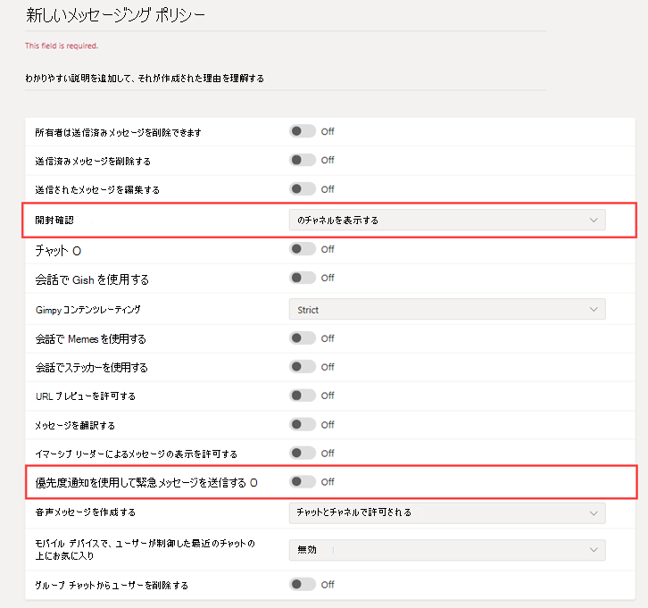

# 医療組織向けのセキュリティで保護されたメッセージングSecure Messaging for healthcare organizations

メッセージング ポリシーは、Microsoft Teams のユーザーが利用できるチャットおよびチャネルのメッセージング機能を制御するために使用され、病院、クリニック、診療所などの医療組織向けのセキュリティで保護されたメッセージングの展開にも含まれます。それらの組織では、重要なメッセージがいつ開封されたのかを知ることと同様に、メッセージをタイムリーにピックアップして処理することが重要となります。Messaging policies are used to control which chat and channel messaging features are available to users in Microsoft Teams, and are part of the overall deployment of Secure Messaging for healthcare organizations like Hospitals, clinics, or doctor's offices, where having a message picked up and acted upon in a timely manner is crucial, as is knowing when crucial messages are read.

組織では、グローバル (組織全体の既定値) ポリシーを使用することも、組織内のユーザーに応じて 1 つ以上のポリシーを作成することもできます。You can use the global (Org-wide default) policy or create one or more custom messaging policies for people in your organization. 組織内のユーザーに対して、カスタム ポリシーを作成して割り当てていない場合は、グローバル ポリシーが自動的に適用されます。Users in your organization will automatically get the global policy unless you create and assign a custom policy. カスタム ポリシーを作成した後、それを組織内のユーザーまたはユーザーのグループに割り当てます。After you create a custom policy, assign it a user or groups of users in your organization. たとえば、特定の職種 (おそらく医師と看護師のみ) にのみこれらの機能を使用することを許可し、他の従業員 (管理人や厨房スタッフなど) にはより限定された機能セットの使用を許可するように設定することができます。For example, you may choose to only allow certain job roles to use these features (perhaps doctors and nurses only) and other workers (like the janitorial or kitchen staff) to get a more limited set of features. 組織のニーズに合わせて決定する必要があります。このガイダンスは提案として参考にしてください。Decide for yourself what needs your organization has, the guidance here is at most a suggestion.

ポリシーは次の方法で簡単に管理できます。管理者の資格情報で [Microsoft Teams 管理センター](https://admin.teams.microsoft.com)にサインインし、左側のナビゲーション ウィンドウで **[メッセージング ポリシー]** を選択します。Policies can be easily managed in the [Microsoft Teams admin center](https://admin.teams.microsoft.com) by logging in with administrator credentials and choosing **Messaging policies** in the left navigation pane.

 ![[メッセージング ポリシー] ページのスクリーンショット](../../media/hc-messaging-policy-admin-center.png)

組織に存在する既定のメッセージング ポリシーを編集するには、**[グローバル (組織全体の既定値)]** をクリックして、変更を行います。To edit the existing default Messaging policy for your organization, click **Global (Org-wide default)**, and then make your changes. 新しいカスタム メッセージング ポリシーを作成するには、**[追加]** をクリックして、設定を選択します。To create a new custom messaging policy, click **Add** and then select your settings. 完了したら、**[保存]** を選択します。Choose **Save** when you are done.

以下の設定は、医療用途において特に重要であり、医療分野で使用されるカスタム ポリシーを設計する際に考慮する必要があります。The following settings are of special interest for Healthcare applications, and should be considered when designing a custom policy used in the Healthcare field:

## 開封確認Read receipts

開封確認を使うと、チャット メッセージの送信者は、1 対 1 および 20 人以下のグループ チャットの受信者によってメッセージがいつ開封されたのかを知ることができます。Read receipts allows the sender of a chat message to know when their message was read by the recipient in 1:1 and group chats 20 people or less. この設定を使用して、開封確認をユーザーが制御できるようにするか、すべてのユーザーに対してオンにするか、すべてのユーザーに対してオフにするかを指定します。Use this setting to specify whether read receipts are user controlled, on for everyone, or off for everyone. メッセージの開封確認は、メッセージが開封されたかどうかについての不確実性を排除できるため、医療組織では重要です。Message read receipts are important in Healthcare organizations because they remove uncertainly about whether a message was read.

医療用途では、**[ユーザーによる制御]** または **[すべてのユーザーに対して有効]** のいずれかを選択します。For Healthcare applications, choose either **User controlled** or **On for everyone**. **[すべてのユーザーに対して有効]** 設定を使用する場合、テナント全体に開封確認を設定する唯一の方法は、テナント全体用に 1 つのメッセージング ポリシー ("グローバル (組織全体の既定値)" という名前の既定ポリシー) を設定するか、テナントのすべてのメッセージング ポリシーで開封確認に関して同じ設定を使用するという方法のいずれかになります。Be aware that when using the **On for everyone** setting, the only way to set receipts for the whole  tenant is either to have only one messaging policy for the whole tenant (the default policy named "Global (Org-wide Default)") or to have all messaging policies in the tenant use the same settings for receipts. **[すべてのユーザーに対して有効]** が有効になっている場合に、開封確認機能が最大の効果を発揮します。The read receipts feature is most effective when the feature is enabled to **On for everyone**.

*開封確認なしの使用例:* Jakob Roth は、リスクの高い患者で、病院に入院しています。*Usage example without read receipts:* Jakob Roth, a high risk patient, is admitted to the hospital.  Sofia Krause は、さまざまな専門家を含む医療従事者チーム (IDT) の一員として働く看護師で、この患者を担当する主要なケア コーディネーターとして割り当てられています。Sofia Krause is a nurse working as part of the inter-disciplinary team (IDT) of medical workers, including different specialists, is assigned as the primary care coordinator in charge of this patient.  Sofia は、さまざまなメッセージング クライアントやアプリを使用する看護師や医師のグループにメールやその他のインスタント メッセージを送信しますが、応答がない、またはチーム メンバーがメッセージを読んだかどうかわからないことがよくあります。Sofia sends emails and other instant messages to a groups of nurses and doctors who use a variety of messaging clients and apps, and often gets no response or indication whether a message was read by team members. コミュニケーション プロセスの混乱により、Jakob の薬が誤用され、入院が長引いています。Due to tangled communication processes, Jakob's medication is misapplied and his hospital stay is extended.

*開封確認ありの使用例:* Jakob Roth は、リスクの高い患者で、病院に入院しています。*Usage example with read receipts:* Jakob Roth, a high risk patient, is admitted to the hospital.  Sofia Krause は、さまざまな専門家を含む医療従事者チーム (IDT) の一員として働く看護師で、この患者を担当する主要なケア コーディネーターとして割り当てられています。Sofia Krause is a nurse working as part of the inter-disciplinary team (IDT) of medical workers, including different specialists, is assigned as the primary care coordinator in charge of this patient.  Sofia は、その患者を担当して治療を調整する医師やその他の看護師とのグループ チャットを開始し、緊急トリアージを開始します。Sofia starts a group chat with a set of doctors and other nurses who will be working with the patient to coordinate care and starts an emergency triage.  看護師と医師は、治療の調整プロセス全体を通じて、患者の治療計画についてコミュニケーションを取り、共同作業を行います。The nurses and doctors communicate and collaborate over the patient's care plan throughout the care coordination process.  重要なメッセージと緊急メッセージは、1 対 1 およびグループ チャットの会話で送信されます。Important and urgent messages are sent through 1:1 and group chat conversations. Sofia は、開封確認機能を使用して、サポートを要求して送信したメッセージが、送信先の医師または看護師に配信され開封されたかどうかを確認します。Sofia uses the read receipts functionality to determine if messages sent requesting support are delivered and read by the targeted physicians or nurses. Jakob の医療チームはスムーズにコミュニケーションを取っているため、Jakob の治療結果はほぼ最適であり、退院も間近です。Jakob's patient outcomes are near-optimal and he goes home sooner because his health team communicates smoothly.

## 優先通知を使用して緊急メッセージを送信するSend urgent messages using priority notifications

ユーザーは、チャット メッセージを他のユーザーに送信するときに、メッセージを *[緊急]* としてマークできます。A user can mark a message as *urgent* when sending chat messages to other users. この機能は、重大なインシデントに注意が必要な場合に病院のスタッフが互いに警告するのに役立ちます。This feature helps hospital staff alert one another when a critical incident requires their attention. 通常の *[重要]* メッセージとは異なり、[優先通知](https://support.microsoft.com/article/mark-a-message-as-important-or-urgent-in-teams-ea99d5b6-1317-4550-8d75-86ff14cd4462)は、最長 20 分間 2 分ごとに、またはメッセージが受信されて開封されるまでユーザーに送信され、メッセージが適切なタイミングで処理される可能性を最大化します。Unlike regular *important* messages, [priority notifications](https://support.microsoft.com/article/mark-a-message-as-important-or-urgent-in-teams-ea99d5b6-1317-4550-8d75-86ff14cd4462) notify users every two minutes for up to 20 minutes or until the message is picked up and read by the recipient, maximizing the likelihood that the message is acted upon in a timely manner.

管理者は、このポリシーを割り当てられたユーザーに対して優先通知を送信する機能を有効または無効にすることができます。An admin can enable or disable the ability for users assigned this policy to send priority notifications. この機能は既定で有効になっています。This feature is on by default. 優先メッセージの受信者は、同じメッセージング ポリシーを持っていない可能性があり、優先メッセージの受信を無効にするオプションはありません。The recipient of the priority message might not have the same messaging policy, and will not have an option to disable receiving priority messages. 医療用途の場合、少なくとも一部のユーザーに対してこの機能を有効にすることをお勧めしますが、対象ユーザーは自分で決定する必要があります。For Healthcare applications, we recommend enabling the feature for at least some users, but you'll need to determine which ones.

*使用例:* Sofia Krause は、リスクの高い患者、Jakob Roth を再入院させています。*Usage example:* Sofia Krause is readmitting a high-risk patient, Jakob Roth. 医師の Manuela Carstens は、この患者のかかりつけ医です。Manuela Carstens, a physician, is the primary care doctor for this patient.  Sofia は優先通知を使用して Manuela にメッセージを送信し、Jakob のトリアージの即時支援を求めます。Sofia sends a message to Manuela using a priority notification asking for immediate help with triage of Jakob.  Manuela の携帯電話はメッセージを受信しましたが、Manuela は電話の振動を感じなかったため、返信しませんでした。Manuela's phone receives the message but Manuela didn't feel the phone vibration and does not reply. Teams によって Manuela に再度通知が送信されます。再通知はメッセージが開封されるまで継続的に行われます。Teams re-notifies Manuela and will continue to persistently re-notify until she reads the message. 開封確認も有効になっている場合、Manuela が対応方法を決定する前に、Sofia はメッセージが Manuela によって開封されたことを確認できます。If read receipts are also enabled, Sofia can be aware that the message was read by Manuela, even before Manuela decides how to respond.

## 関連トピックRelated topics

- [Teams でメッセージング ポリシーを管理するManage messaging policies in Teams](../../messaging-policies-in-teams.md)
- [医療組織向けの Teams の使用を開始するGet started with Teams for Healthcare organizations](teams-in-hc.md)
