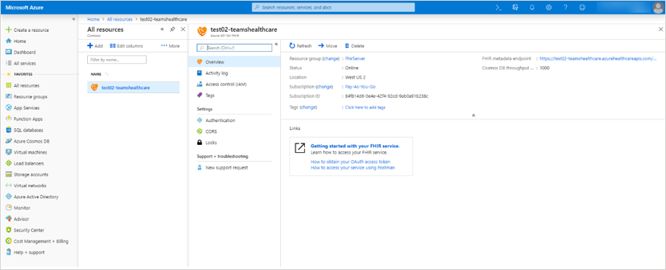

# 患者アプリを FHIR の Azure API に接続する

Microsoft Teams の患者アプリが FHIR インスタンス用の Azure API にアクセスできるようにするには、次の手順を実行します。 この記事では、 [FHIR インスタンス用の AZURE API](https://azure.microsoft.com/services/azure-api-for-fhir/)がテナントに設定され、構成されていることを前提としています。  テナントで FHIR インスタンスの Azure API をまだ作成していない場合は、「[クイックスタート: azure portal を使用して AZURE api FOR FHIR を展開](https://docs.microsoft.com/azure/healthcare-apis/fhir-paas-portal-quickstart)する」を参照してください。

1. [ここ](https://login.microsoftonline.com/common/adminConsent?client_id=4aee3506-b263-43e0-ba31-1468fa7b2806)をクリックして、患者アプリの管理者の同意を付与します。 メッセージが表示されたら、テナント管理者またはグローバル管理者の資格情報を使用してサインインし、[**承諾**] をクリックして、必要なアクセス許可を付与します。

    

    承諾したら、ウィンドウを閉じます。 次のようなページが表示されます。 このページのエラーメッセージは無視してかまいません。 これは無害であり、承諾が許可されていることを示します。 (この URL については、よりわかりやすいページで作業しています。 常にご期待ください)

    
2. 管理者の資格情報で[Azure ポータル](https://portal.azure.com)にサインインします。
3. 左側のナビゲーションで、[ **Azure Active Directory**] を選び、[**エンタープライズアプリケーション**] を選びます。
    "**患者 (dev)**" という名前の行を探し、[**オブジェクト ID** ] 列の値をクリップボードにコピーします。
    ![Azure ポータルの [患者 (dev)] 行のスクリーンショット](../../media/patients-app-azure-portal-object-id.png)
4. 患者アプリ (検索するか、リソースを参照するか) を接続する、FHIR リソースインスタンスの Azure API に移動して、そのインスタンスの設定を開きます。

    

5. [**認証**] をクリックし、手順3でコピーしたオブジェクト id を [**許可されたオブジェクト id** ] ボックスに貼り付けます。 これにより、患者アプリは FHIR サーバーにアクセスできます。 オブジェクト ID を貼り付けると、Azure Active Directory によって検証され、その横に緑のチェックマークが表示されます。

    

6. **[保存]** をクリックします。 これにより、インスタンスが redeploys ます。これには数分かかることがあります。
7. [**概要**] をクリックし、 **fhir メタデータエンドポイント**から URL をコピーします。 FHIR サーバーの URL を取得するには、メタデータタグを削除します。 たとえば、とhttps://test02-teamshealth.azurehealthcareapis.com/します。 

    

8. Teams で、チームに読み込まれている患者のアプリインスタンスに移動して、[**設定**] をクリックし、[**リンク**] ボックスに fhir サーバーエンドポイントの URL を入力します。 次に、[**接続**] をクリックして接続を確立し、検索して患者をリストに追加します。  

    
    
    この手順で Teams に接続したときにエラーが発生した場合は、エラーの詳細なスクリーンショットをメールで送信します。メールの件名[行に "](mailto:teamsforhealthcare@service.microsoft.com)患者のアプリ– emr モードのトラブルシューティング" と表示されます。 [Fiddler](https://www.telerik.com/download/fiddler)

## 関連トピック

- [患者アプリの概要](patients-app-overview.md)
- [電子医療記録を Microsoft Teams に統合する](patients-app.md)
