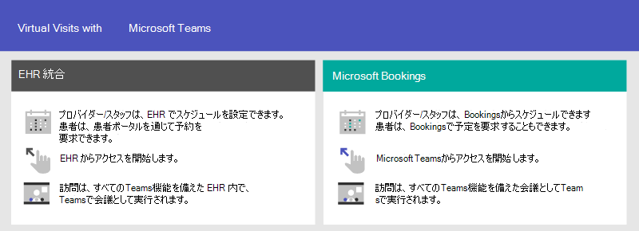

# 医療組織向け Teams の使用を開始する

Microsoft Teams には、病院や他の医療組織に役立つ多くのテレメディシン機能が用意されています。 Teams の機能は、次の方法で病院を支援するために開発中です。

- 仮想訪問と電子医療記録 (EHR) の統合
- Teams ポリシー パッケージ
- セキュリティで保護されたメッセージング
- Teams テンプレート
- お手入れと共同作業

この機能は、医療向け Microsoft Cloud の一部です。 このソリューションの使用に関する詳細については [、Microsoft Cloud for Healthcare](https://docs.microsoft.com/industry/healthcare)で Azure、Dynamics 365、Microsoft 365 の機能を組み合わせて使用します。

Microsoft Teams での医療チームの共同作業を強化するために医療コレクションを使用する方法の詳細については、次のビデオをご覧ください。

> [!VIDEO https://www.microsoft.com/videoplayer/embed/RE4Hqan]

> [!NOTE]
> このセクションの内容は、既に組織内に Teams を展開済みである前提とします。 Teams をまだロールアウトしていない場合は、まず Microsoft Teams を展開する方法 [を参照してください](../../How-to-roll-out-teams.md)。

## 仮想訪問と電子医療記録 (EHR) の統合

Microsoft Teams の完全な会議プラットフォームを使用して、患者との仮想訪問をスケジュール、管理、実施します。

- 組織で電子医療記録 (EHR) を既に使用している場合は、Microsoft Teams を統合してよりシームレスなエクスペリエンスを実現できます。 Microsoft Teams 電子健康記録 (EHR) コネクタを使用すると、診療所は、EHR システムから直接 Teams で仮想患者訪問または別のプロバイダーとの相談を簡単に開始できます。 詳細については、「Teams での仮想アクセス - EHR への統合」 [を参照してください](ehr-admin.md)。
- サポートされている EHR を使用していない場合は、Microsoft Bookings と Bookings アプリを Teams で使用できます。 詳細については、Microsoft Teams での [Bookings アプリと仮想アクセスを参照してください](../../bookings-app-admin.md)。

## Teams ポリシー パッケージ

Teams ポリシー パッケージを適用して、Teams でさまざまな役割が実行できる操作を定義します。 たとえば、次のポリシーを指定します。

- 登録された看護師などの臨床作業員は、看護師、医師、ソーシャル ワーカーを管理し、チャット、通話、シフト管理、会議にフル アクセスできます。
- IT 担当者、スタッフ、財務担当者、コンプライアンス責任者などの医療組織の情報担当者は、チャット、通話、会議にフル アクセスできます。
- 患者室。患者室デバイスの設定を制御します。

詳細については、医療向け [Teams ポリシー パッケージを参照してください](../../policy-packages-healthcare.md)。

## セキュリティで保護されたメッセージング

セキュリティで保護されたメッセージングは、いくつかの新機能を含む、正常性チーム内での共同作業をサポートします。

- メッセージの送信者は、メッセージに特別な優先度を設定して、受信者がメッセージを読むまで繰り返し通知を受け取ります。
- メッセージの送信者は、メッセージの受信者が送信したメッセージが読み取られたときに通知を受け取る、読み取り確認を要求できます。

これらの機能を組み合わせて、緊急のメッセージにすばやく注意を払い、メッセージの受信と読み取りを信頼することができます。 これらの機能を使用する新しい正常性チームは、患者ごとに作成できます。 これらの機能はポリシーベースであり、個人または Teams 全体に割り当てることができます。

詳細については、「医療組織向け Secure Messaging ポリシーの使用を開始 [する」を参照してください](messaging-policies-hc.md)。

また、セキュリティで保護されたメッセージングに関連して、医療組織によってフェデレーションされる他のテナントを持つ機能により、より豊富なテナント間通信が可能になります。 (Microsoft [Teams で外部アクセス (フェデレーション) を管理するを参照してください](../../manage-external-access.md))。

## 医療組織向け Teams テンプレート

Teams を作成するための新しいテンプレートは病院の設定に適用するために開発され、その他のテンプレートも近日公開される予定です。 これにより、医療従事者がさまざまな部門や部署の患者の治療を調整するために使用するチームを簡単に作成できます。 詳細については、「医療組織向け Teams テンプレートの使用を [開始する」を参照してください](healthcare-templates.md)。 Teams は、カーディロジカルなどの内部部門またはケア ワード用に開始できます。また、開発中のテンプレートも多く提供されています。

## お手入れと共同作業

健康チームをまとめ、Microsoft Teams でケアと共同作業を行います。

Microsoft Teams を使用すると、次のような Microsoft Teams の共同作業機能を使用して、医師、診療所、看護師、その他のスタッフが効率的に共同作業することができます。

- 正常性チームと情報ワーカーのチームとチャネルを設定します。 タブ付きチャネルは、情報ソースをピン留めできるタブからの追加のヘルプを使用して、作業を構成する方法として使用します。
- チャット、メッセージの投稿、コミュニケーション。 チームは、注意が必要なさまざまな患者について永続的な会話を行います。
- 正常性チームのメンバーに電話して、会います。 Teams の音声、ビデオ、画面共有、記録、トランスクリプション機能の両方を使用して、個別の会議を設定するか、チャネル会議を使用して毎日の会議を管理します。
- ファイルとドキュメントを保存して共有します。 正常性チームは、1 つの仮想化されたチームの一部であり、複数のドキュメントでOfficeしています。

さらに、チームは Teams のアプリを使用して次の機能を利用できます。

- リスト アプリでリストを共有し、情報を追跡する
- タスク アプリでタスクを追跡および監視する
- 承認アプリを使って承認を効率化する
- Shifts アプリでスケジュールを作成、管理、共有する

### リスト アプリでリストを共有し、情報を追跡する

> [!NOTE]
> 2020 年 10 月 30 日から、患者アプリは廃止され、Teams の [リスト アプリに](https://support.microsoft.com/office/get-started-with-lists-in-teams-c971e46b-b36c-491b-9c35-efeddd0297db) 置き換されました。 リストを使用すると、医療組織のケア チームは、ラウンドや学際的なチーム会議から一般的な患者監視まで、シナリオに関する患者リストを作成できます。

Teams のリスト アプリは、チームが情報を追跡し、作業を整理するのに役立ちます。 このアプリは、すべての Teams ユーザーにプレインストールされ、すべてのチームとチャネルのタブとして使用できます。 リストは、一から作成したり、定義済みのテンプレートから作成したり、Excel にデータをインポートしたりして作成できます。

医療チームは、患者テンプレートを使用して開始できます。 患者のニーズと状態を追跡するリストを作成できます。 Excel スプレッドシート上の既存の患者データを取り込み、Teams でリストを作成できます。 これらのリストは、丸めや患者の監視などのシナリオで、治療を調整するために使用できます。

たとえば、管理看護師は、すべての健康チーム メンバーを含む患者リストをチームに作成します。 ラウンド中に、正常性チームはモバイル デバイス上の Teams にアクセスし、リスト内の患者情報を更新します。この情報は、チームの全員が同期を確認できます。医療チームが集まる丸めセッションで、患者が適切な退席経路を確実に進め、大きなディスプレイ画面で Teams を使用してこの情報を共有するために、健康状態のパフォーマンスに関する主要な指標について話し合い、評価します。 サイトに参加していない正常性チーム メンバーはリモートで参加できます。

患者の丸め用に設定された一覧の例を次に示します。

:::image type="content" source="../../media/lists-patients-example.png" alt-text="患者の丸めのためのサンプル リストのスクリーンショット":::

詳細については、「Teams で組織 [のリスト アプリを管理する」を参照してください](../../manage-lists-app.md)。

### タスク アプリでタスクを追跡および監視する

Teams [のタスク](https://support.microsoft.com/office/use-the-tasks-app-in-teams-e32639f3-2e07-4b62-9a8c-fd706c12c070) を使用して、正常性チーム全体のアイテムを追跡します。 正常性チームは、Teams を実行している任意のデバイスから、いつでもタスクの作成、割り当て、スケジュール、タスクの分類、状態の更新を行うことができます。

詳細については、「Microsoft Teams で組織 [のタスク アプリを管理する」を参照してください。](../../manage-tasks-app.md)

### 承認アプリを使って承認を効率化する

承認 [を使用して](https://support.microsoft.com/office/what-is-approvals-a9a01c95-e0bf-4d20-9ada-f7be3fc283d3) 、チームのすべての要求とプロセスを合理化します。 チームワークのためにハブから直接承認を作成、管理、共有します。 チャット、チャネル会話、または承認アプリ自体から送信したのと同じ場所から承認フローを開始します。 承認の種類を選択し、詳細を追加し、ファイルを添付し、承認者を選択します。 送信されると、承認者に通知が届き、要求を確認して対応できます。

組織の承認アプリを許可し、チームに追加することができます。 アプリの管理の詳細については、「Microsoft Teams 管理センターでアプリを管理する」 [を参照してください](../../manage-apps.md)。

### Shifts アプリと Frontline Worker の統合を使用してスケジュールを作成、管理、共有する

Microsoft Teams は、シフト アプリと Frontline Worker と統合され、シフトスタッフ機能の調整に使用できます。 たとえば、シフトでは、看護師マネージャーはスタッフのスケジュールを設定して調整し、看護師はスケジュールをチェックし、シフトを交換できます。 Teams には、組織内の Frontline Worker に割り当て可能な組み込みの Frontline Worker アプリセットアップ ポリシーが含まれています。 既定では、ポリシーにはアクティビティ、シフト、チャット、および通話の各アプリが含まれています。 このポリシーは、これらのアプリの動作を制御します。たとえば、Shifts アプリをアプリ バーにピン留めすると、チームがアプリにすばやくアクセスできます。

詳細については [、「Microsoft Teams で組織の Shifts アプリを管理する」を参照してください](../shifts/manage-the-shifts-app-for-your-organization-in-teams.md)。
