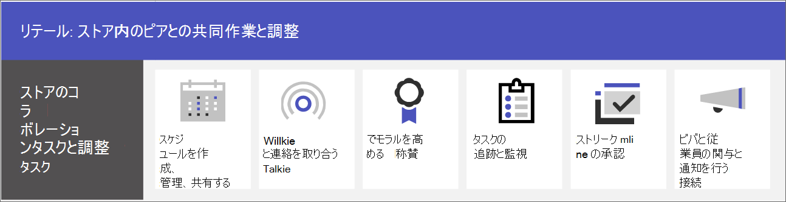

# 販売店チーム間のコラボレーション

Microsoft Teams を使用して、店舗の従業員と経営陣が一緒になって、コミュニケーションや共同作業を行い、業務を効率化できます。 [Viva コネクションを使用した従業員の組織への接続](#connect-information-from-across-the-organization-with-viva-connections)をサポートし、[Yammer コミュニティ](#connect-across-your-organization-with-yammer-and-teams)を使用して店舗間や本社とのコミュニケーションを可能にします。

> [!VIDEO https://www.microsoft.com/videoplayer/embed/RWRJVw]

> [!NOTE]
> これらのシナリオは、Microsoft Cloud for Retail の一部でもあります。 Microsoft Dynamics 365 などの Microsoft Cloud for Retail の他の機能も使用すると、これらのシナリオでより多くのことができるようになります。 以下、Azure、Dynamics 365、Microsoft 365 の機能を [Microsoft Cloud for Retail](/industry/retail) で統合するこのソリューションの使用方法について説明します。

## Teams での日々のコミュニケーションとコラボレーション

Microsoft Teams を使用すると、従業員とマネージャーは内蔵のコラボレーション機能とアプリを活用して、効率的なコラボレーションを実現できます。 現場担当者は、組織のニーズに応じて、個人用デバイスまたは共有デバイスのいずれかで Teams を使用できます。

Teams には、以下のようなコミュニケーションや情報共有の方法があります。

| タスク | 説明 | この機能の管理 | エンドユーザー トレーニング |
| ---- | ---- | ---- | ---- |
| チャット、メッセージの投稿、コミュニケーション | 店舗の従業員は、部門を超えたシームレスなコミュニケーションを行い、注文の処理、顧客へのサポート、在庫の管理などを行うことができます。   Teams は、すぐに使用できる優れたコラボレーション エクスペリエンスを組織に提供します。既定の設定は、ほとんどの組織の業務に通用します。 | [Microsoft Teams のチャット、チーム、チャネル、およびアプリ](../deploy-chat-teams-channels-microsoft-teams-landing-page.md) | [チャットを開始](https://support.microsoft.com/office/start-and-pin-chats-a864b052-5e4b-4ccf-b046-2e26f40e21b5)し、[投稿とメッセージを使用する](https://support.microsoft.com/office/create-and-format-a-post-e66777da-636b-49eb-9408-b0d88b212885) |
|チーム メンバーとの電話と会議 | マネージャーは、個別の会議を作成したりチャネル会議を使用したりして日々の会議を管理できます。いずれのタイプの会議でも、Teams のオーディオ、ビデオ、画面共有、録音、および文字起こしの機能を活用できます。 たとえば、マネージャーは、朝にさまざまな部署の店員とのビデオ会議を設定し、開店前に状況を確認することができます。   ミーティングや会議の設定を構成し、音声ソリューションを有効にして通話を使用できるようにする必要があります。 | [Microsoft Teams でのミーティングと会議](../deploy-meetings-microsoft-teams-landing-page.md)と[Teams の音声ソリューションを計画する](../cloud-voice-landing-page.md) | [通話を発信する](https://support.microsoft.com/office/overview-of-teams-calls-425d6970-6e27-47b6-bc61-4c38fff51c4f)と[会議に参加する](https://support.microsoft.com/office/join-a-teams-meeting-078e9868-f1aa-4414-8bb9-ee88e9236ee4) |
|ファイルやドキュメントの保管と共有 | ファイル共有により、店舗のスタッフは、売り場を離れたり、マネージャーのサポートを受けたりすることなく、販売図などの情報に簡単にアクセスできます。 すべてのチームに自動的に [ファイル] タブが用意され、ドキュメントの保存や共有に使用できます。 このタブは、実際には、チームの作成時に自動的に作成される SharePoint 既定のチーム サイトのドキュメント ライブラリ内のフォルダーを表します。 | [Microsoft Teams との SharePoint と OneDrive の連携](../sharepoint-onedrive-interact.md) | [ファイルをアップロードして共有する](https://support.microsoft.com/office/upload-and-share-files-57b669db-678e-424e-b0a0-15d19215cb12) |

チームでは、Teams でアプリを使用して、お互いに次のような日々のタスクの調整や共同作業を行います。

| タスク | アプリ | 説明 | このアプリを管理する | エンドユーザー トレーニング |
| ---- | ---- | ---- | ---- | ---- |
| スケジュールを作成し、管理し、共有する| Shifts | Shifts を使用して、スケジュールをシームレスに管理および共有します。 マネージャーは、レジ係やあいさつ係などのカスタム グループを作成したり、従業員にシフトを割り当てたり、カスタム ラベルや休憩時間を追加したり、従業員が要求するオープン シフトを追加したりすることができます。 従業員は、Shifts を使用して、自分の勤務時間の設定、スケジュールの表示、同僚とのシフト交代、出退社時間の設定などを行うことができます。 | [Shifts を管理する](/microsoftteams/expand-teams-across-your-org/shifts/manage-the-shifts-app-for-your-organization-in-teams)|[Shifts のビデオ トレーニング](https://support.microsoft.com/office/what-is-shifts-f8efe6e4-ddb3-4d23-b81b-bb812296b821)|
| 連絡を取り合う | トランシーバー | トランシーバー アプリは、すぐにプッシュして話しかけるコミュニケーションが可能です。 トランシーバーを使用すると、従業員やマネージャーは店内のどこにいてもコミュニケーションをとることができます。 たとえば、店舗のある側にいる顧客が、従業員に店舗の反対側に商品の在庫があるかたずねた場合、従業員はトランシーバーを使用して、その商品の近くで作業している従業員に連絡を取ることができます。 トランシーバーは通話範囲に制限がないため、他の店舗や会社の専門家にも気軽に相談することができます。 | [トランシーバーを管理する](../walkie-talkie.md)  | [トランシーバーのビデオ トレーニング](https://support.microsoft.com/office/use-walkie-talkie-in-teams-884a008a-761e-4b62-99f8-15671d9a2f69) |
| 士気を高める | 称賛 | 称賛アプリを使用すると、経営陣と店舗従業員が、事前に作成したバッジやカスタム バッジを送ることで、お互いに祝福し、感謝の気持ちを共有できます。 称賛により、売上目標を達成したことや、顧客のサポートを超えた行動などの成果が認められたと感じることができます。 | [称賛アプリを管理する](../manage-praise-app.md) |[称賛のビデオ トレーニング](https://support.microsoft.com/office/communication-and-praise-7d37ef80-542b-42e5-aa01-0fabbaa634b6) |
| タスクの追跡と監視 | タスク | Teams のタスクを使用すると、販売店チーム全体の To Do アイテムを追跡することができます。 店舗の経営陣と従業員は、Teams を実行しているどのデバイスからでも、タスクの作成、割り当て、タスクのスケジュール設定、タスクの分類、および状態の更新をいつでも行うことができます。 IT プロフェッショナルと IT 管理者は、組織の特定のチームに対してタスクを発行することもできます。 たとえば、毎日の掃除の一連のタスクや、新しいディスプレイを設定するための手順などを公開することができます。| [タスク アプリを管理する](/microsoftteams/manage-tasks-app) |[タスクのビデオ トレーニング](https://support.microsoft.com/office/use-the-tasks-app-in-teams-e32639f3-2e07-4b62-9a8c-fd706c12c070) |
| 承認を効率化する | 承認 | 承認を使用して、チームでの要求とプロセスを効率化します。 承認の作成、管理、共有をハブから直接行うことができるため、チームワークの効率が高まります。 承認フローは、チャットを送信する際の画面、チャネルの会話、または承認アプリ自体から開始できます。 承認の種類を選択し、情報を追加し、ファイルを添付し、承認者を選択します。 リクエストが送信されると、承認者に通知が届きます。承認者はリクエストを確認して対応できます。 組織での承認アプリの使用を許可することで、承認アプリを Teams に追加することができます。 | [Teams 承認アプリの利用の可否](/microsoftteams/approval-admin) | [承認のビデオ トレーニング](https://support.microsoft.com/office/what-is-approvals-a9a01c95-e0bf-4d20-9ada-f7be3fc283d3?wt.mc_id=otc_microsoft_teams)|

### チーム、チャネル、アプリを設定する

店舗従業員を Teams に接続する準備ができたら、事前構築済み、またはカスタムのテンプレートやカスタム テンプレートを使用して、店舗のチームやマネージャーのためのチームやチャネルを設定できます。 最も簡単なのは、テンプレートから始める方法です。 「**店舗を整理する**」と **「マネージャー用小売業**[テンプレート](/microsoftteams/get-started-with-retail-teams-templates)」は、販売店向けに設計されたチャネルとアプリを含む事前に作成済みのテンプレートです。 また、既存のチームに基づいてテンプレートを作成することもできます。 テンプレートから始める場合でも、チームとチャネルをカスタマイズし、チームのニーズに合わせてアプリを追加することができます。

- タブ付きチャネルを使用して、ニュースを共有したり、従業員がシフトを超えて連絡を取り合ったり、コミュニティを構築したりすることができます。
- チーム テンプレートを使用して、店舗や地域間で類似した構造 (チャネルやタブなど) を持つチームを設定します。

#### テンプレートをもとにチームを作成する

1. Microsoft Teams で、[**チームへの参加または作成**] を選択します。

2. [**チームの作成**] を選択し、下にスクロールして使用可能なテンプレートを表示します。

詳細情報: [テンプレートを使用してチームを作成する](https://support.microsoft.com/office/create-a-team-with-team-templates-702a2977-e662-4038-bef5-bdf8ee47b17b)

### アプリを管理する

アプリを使用してチームの機能を絞り込みます。 Microsoft Teams 管理センターで、組織のアプリの許可またはブロックを行ったり、アプリの設定を構成したりすることができます。 アプリの管理に関する詳細については、「[Microsoft Teams 管理センターでチームを管理する](../manage-apps.md)」を参照してください。

ユーザーは、許可したアプリをチームに追加することができます。 このトレーニングをユーザーと共有して、以下の方法を示します: [アプリの検索と使用](https://support.microsoft.com/office/find-and-use-apps-6e22a734-c002-4da0-ba63-681f155b142d)。

## Viva コネクションを使用して組織全体の情報につながる

Viva コネクションを使用して、従業員との関わりや情報交換を行います。 Viva コネクションは Teams 内にハブを作成し、小売店の従業員が組織でカスタマイズされたニュース フィードや、必要なリソースを使用した個人向けのダッシュボードを閲覧できるようにします。 従業員が Viva コネクションを使用すると、重要な情報をより早く入手できるようになり、マネージャーは最新情報の伝達に貴重な時間を費やす必要がなくなります。 Viva コネクション ダッシュボードでは、重要な情報、個人向けのニュース、タスク、お知らせ、その他のリソースを公開します。

[Viva コネクション](/sharepoint/viva-connections-overview)の詳細を学び、従業員やスタッフが [Microsoft Teams の Viva コネクション](https://support.microsoft.com/office/your-intranet-is-now-in-microsoft-teams-8b4e7f76-f305-49a9-b6d2-09378476f95b)の使用を開始するサポートを行います。

Microsoft Teams、Viva コネクション、SharePoint を使用して、以下のシナリオを実現できます。

- 新入社員のオンボーディング[詳細情報](/sharepoint/onboard-employees)
- リーダー チームと現場担当者をつなぐ[詳細情報](/sharepoint/leadership-connection)
- 組織にニュースを配布する[詳細情報](/sharepoint/distribute-corporate-news-to-your-organization)

[組織のコミュニケーションを推進する方法に関する詳細情報](/sharepoint/corporate-communications-overview)

## Yammer と Teams を使用して組織全体をつなぐ

Yammer でコミュニティ内の交流を深めます。 Yammer のコミュニティでは、会話、ファイル、イベント、更新プログラムのための一元的な場所を提供して、知識の共有、従業員の経験、会社全体のコミュニケーション、リーダーシップ関与のニーズに対応しています。 スタッフは、Yammer コミュニティで問題提起、フィードバックの提供、質問や回答を行うことができます。 ライブ イベントやタウン ホールを開催し、組織内のすべてのユーザーの輪を維持します。

[Yammer ページを Teams チャネルに追加する](https://support.microsoft.com/office/add-a-yammer-page-to-a-teams-channel-ca06ec83-f22d-4b76-83a5-c83aa2a33528)および [Yammer でコミュニティへの参加および作成を行う](https://support.microsoft.com/office/join-and-create-a-community-in-yammer-56aaf591-1fbc-4160-ba26-0c4723c23fd6)方法をご紹介します。

Yammer の詳細については、以下をご覧ください。

- 管理者向け: [Yammer を管理する](/yammer)
- ユーザー向け: [Yammer を使う](https://support.microsoft.com/office/what-is-yammer-1b0f3b3e-89ee-4b66-aac5-30def12f287c)
