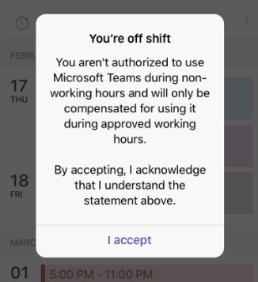

# <a name="manage-shift-based-access-for-firstline-workers-in-teams"></a>Teams での Firstline Worker のシフトベースのアクセスを管理する

> [!IMPORTANT]
> 2020年6月30日有効な Microsoft StaffHub は廃止されました。 Microsoft では、StaffHub の機能を Microsoft Teams に組み込む作業に取り組んでいます。 現在、Teams にはシフト アプリのスケジュール管理機能が含まれています。今後、他の機能もロールアウトされる予定です。 2020年6月30日に、StaffHub がすべてのユーザーに対して動作を停止しました。 StaffHub を開こうとするユーザーには、チームをダウンロードするように指示するメッセージが表示されます。 詳細については、「 [Microsoft StaffHub が廃止されました](microsoft-staffhub-to-be-retired.md)」を参照してください。  

## <a name="overview"></a>概要

[!INCLUDE [preview-feature](../../includes/preview-feature.md)]

Microsoft Teams のプレゼンスは、ユーザーの現在の可用性と状態を他のユーザーに表示することを示します。 通常、Firstline Worker の存在は、他の従業員よりも、その稼働時間が毎日同じではないことが多いためです。 管理者として、チームを構成して、組織内の最初の営業員がシフトの有無を示す、シフトベースのプレゼンス状態のセットを表示することができます。

このようなシフトベースのプレゼンス状態は、緑色のチェックマーク、[シフト時のシフト]、[x の付いた灰色の円] は、[予定あり] &mdash;  **On shift**  **Off shift**  **Busy** &mdash; チーム内の[既定のプレゼンス状態](../../presence-admins.md)] とは別のものであることを示します。 この2つのプレゼンス状態のセットを使用すると、組織内のユーザーの役割に基づいて、さまざまなエクスペリエンスを構成できます。

シフトベースのアクセスを使用すると、Firstline Worker がシフトをオフにしている場合にチームへのアクセスを管理できます。 たとえば、チームがスケジュールされたシフトを使っていないときに、チームを使用できるようにする前に、Firstline Worker が確認する必要があるというメッセージが表示されるように設定できます。  

## <a name="scenario"></a>シナリオ

組織でシフトベースのアクセスを管理する方法の例を次に示します。

組織内の最初の営業担当者が、マネージャーがスケジュールされて承認したシフトで作業した時間だけ支払いを行う必要がある場合。 スケジュールされたシフト以外での作業に費やした時間は、Teams アプリの使用も含めて支払われません。 "シフトが表示されていないときにチームに時間がかかることはありません" というカスタムメッセージを設定します。これは、shift キーをオフにすると、Firstline Worker がチームにアクセスしようとしたときに表示されます。 チームの使用を選択した場合は、[ **同意** する] をクリックすると、今回は支払いされません。

また、salaried の勤務先であり、シフトが行われない組織内のインフォメーションワーカーもいます。 Firstline Worker のシフトベースのプレゼンスを指定しながら、Teams で既定のプレゼンス状態を使用するようにインフォメーションワーカーを構成します。

## <a name="shift-based-presence-states"></a>シフトベースのプレゼンス状態

シフトベースのプレゼンス状態を次に示します。

|アプリが設定 |ユーザーが設定  |詳細情報  |
|---------|---------|---------|
| シフト     |         |シフトの開始時に自動的に設定する         |
|![[X] の灰色の円は、shift キーをオフにします。](../../media/flw-presence-off-shift.png) シフトオフ     |         |シフトの終了時に自動的に設定する         |
| 取り込み中      |  取り込み中         |自動的に設定されます。 Firstline Worker がシフトになったときに手動で設定することもできます。|

## <a name="off-shift-access-to-teams"></a>Shift キーを押しながら Teams にアクセス

この機能を使用すると、Firstline Worker がシフトをオフにしている場合にチームへのアクセスを管理することができます。 ユーザーが shift キーをオフにしたときにチームにアクセスすると、Firstline Worker にメッセージを表示するようにチームを設定することができます。 Firstline Worker は、チームを使用する前に、メッセージを承認するために [ **承諾** ] をクリックする必要があります。

既定のメッセージを使用するか、あらかじめ定義された一連のメッセージから選ぶか、メッセージをカスタマイズして必要なテキストを表示することができます。 既定のメッセージは次のとおりです。



また、メッセージが表示されるときの頻度を設定して、最初のシフトが開始または終了してから、チームへのアクセスが制限されるまでの猶予期間を設定することもできます。

## <a name="manage-shift-based-access"></a>シフトベースのアクセスを管理する

管理者は、ポリシーを使って、組織内の Firstline Worker のシフトベースのプレゼンスを制御します。 これらのポリシーを管理するには、次の PowerShell コマンドレットを使用します。

- [新規-CsTeamsShiftsPolicy](https://docs.microsoft.com/powershell/module/teams/new-csteamsshiftspolicy)
- [Get-CsTeamsShiftsPolicy](https://docs.microsoft.com/powershell/module/teams/get-csteamsshiftspolicy)
- [Set-CsTeamsShiftsPolicy](https://docs.microsoft.com/powershell/module/teams/set-csteamsshiftspolicy)
- [Grant-CsTeamsShiftsPolicy](https://docs.microsoft.com/powershell/module/teams/grant-csteamsshiftspolicy)
- [Remove-CsTeamsShiftsPolicy](https://docs.microsoft.com/powershell/module/teams/remove-csteamsshiftspolicy)

New-CsTeamsShiftsPolicy コマンドレットを使用して新しいポリシーを作成し、必要なポリシー設定を設定してから、Grant-CsTeamsShiftsPolicy コマンドレットを使用してユーザーにポリシーを割り当てます。

いくつかの例を次に示します。 選択できる事前設定されたオフシフトメッセージの一覧など、各ポリシー設定とパラメーターの詳細については、「 [New-CsTeamsShiftsPolicy](https://docs.microsoft.com/powershell/module/teams/new-csteamsshiftspolicy)」を参照してください。

### <a name="example-1"></a>例 1

この例では、"Shift Teams/チームアクセスの既定のメッセージ" という名前の新しいポリシーを作成します。 このポリシーでは、shift ベースのプレゼンスがオンになっており、このポリシーを割り当てられたユーザーがシフトをオフにすると、チームにアクセスするたびに既定のメッセージが表示されます。 ユーザーはシフトをオフにしたときに、そのメッセージを受け取ることができます。また、最初のシフトの開始または終了の間の猶予期間と、10分間のアクセスが制限されている場合には、チームを使うことができます。  

```powershell
New-CsTeamsShiftsPolicy -Identity "Off Shift Teams Access Default Message" -EnableShiftPresence $true -ShiftNoticeFrequency always -ShiftNoticeMessageType DefaultMessage -AccessType UnrestrictedAccess_TeamsApp -AccessGracePeriodMinutes 10
```

> [!NOTE]
> **ShiftNoticeMessageType**パラメーターを使用して、表示するメッセージを設定します。 このパラメーターに対して選ぶことができる定義済みメッセージの一覧を表示するには、「 [New-CsTeamsShiftsPolicy](https://docs.microsoft.com/powershell/module/teams/new-csteamsshiftspolicy)」を参照してください。

### <a name="example-2"></a>例 2 

この例では、"Shift Teams/チームアクセスのカスタムメッセージ" という名前の新しいポリシーを作成します。 このポリシーでは、shift ベースのプレゼンスが有効になっており、このポリシーを割り当てられたユーザーがシフトをオフにすると、チームにアクセスするたびにユーザー設定のメッセージが表示されます。 ユーザーはシフトをオフにしたときに、そのメッセージを受け取ることができます。また、最初のシフトの開始または終了の間の猶予期間と、アクセスが制限されている場合は15分となります。  

```powershell
New-CsTeamsShiftsPolicy -Identity "Off Shift Teams Access Custom Message" -EnableShiftPresence $true -ShiftNoticeFrequency always -ShiftNoticeMessageType CustomMessage -ShiftNoticeMessageCustom "Your time on Teams when on off shift won't count toward payable hours" -AccessType UnrestrictedAccess_TeamsApp -AccessGracePeriodMinutes 15
```

> [!NOTE]
> **ShiftNoticeMessageType**パラメーターを使用して、表示するメッセージを設定します。 詳細については、「 [New-CsTeamsShiftsPolicy](https://docs.microsoft.com/powershell/module/teams/new-csteamsshiftspolicy)」を参照してください。

### <a name="example-3"></a>例 3

この例では、"Off Shift Teams" アクセス Message1 という名前の新しいポリシーを作成します。 このポリシーでは、shift ベースのプレゼンスがオンになっており、このポリシーを割り当てられたユーザーがシフトをオフにすると、チームにアクセスするたびに、次の定義済みのメッセージが表示されます。

  "お客様のネットワーク、アプリケーション、システム、またはツールの使用に関して非免税または毎時の従業員による作業は、非稼働時間中に承認または承認されません。 承認を受けることで、シフトの外部でのチームの使用が許可されておらず、お客様は補償できないことが認められます。 " 

ユーザーはシフトをオフにしたときに、そのメッセージを受け取ることができます。また、最初のシフトの開始または終了の間の猶予期間と、3分間のアクセスが制限されている場合には、チームを使うことができます。  

```powershell
New-CsTeamsShiftsPolicy -Identity "Off Shift Teams Access Message1" -EnableShiftPresence $true -ShiftNoticeFrequency always -ShiftNoticeMessageType Message1 -AccessType  UnrestrictedAccess_TeamsApp -AccessGracePeriodMinutes 3
```

> [!NOTE]
> **ShiftNoticeMessageType**パラメーターを使用して、表示するメッセージを設定します。 このパラメーターに対して選ぶことができる定義済みメッセージの一覧を表示するには、「New-TeamsShiftPolicy」を参照してください。

### <a name="example-4"></a>例 4

この例では、remy@contoso.com という名前のユーザーへの Shift チームへのアクセスのカスタムメッセージという名前のポリシーを割り当てます。

```powershell
Grant-CsTeamsShiftsPolicy -Identity remy@contoso.com -PolicyName "Off Shift Teams Access Custom Message"
```

## <a name="related-topics"></a>関連項目

- [Teams で組織の Shifts アプリを管理する](manage-the-shifts-app-for-your-organization-in-teams.md)
- [Teams での PowerShell の概要](../../teams-powershell-overview.md)
