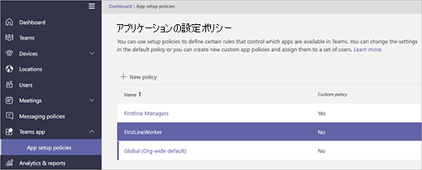

# <a name="manage-the-shifts-app-for-your-organization-in-microsoft-teams"></a>Microsoft Teams で組織のシフト アプリを管理する

> [!IMPORTANT]
> 2019年12月31日有効な場合、Microsoft StaffHub は廃止されます。 Microsoft Teams で StaffHub 機能を構築しています。 現在、チームには、スケジュール管理のためのシフトアプリが含まれており、その他の機能も時間の経過と共にロールアウトされます。 StaffHub は、2019年12月31日にすべてのユーザーに対して機能しなくなります。 StaffHub を開こうとしたユーザーには、チームをダウンロードするように指示するメッセージが表示されます。 詳細については、「[Microsoft StaffHub の廃止](microsoft-staffhub-to-be-retired.md)」を参照してください。  

## <a name="overview-of-shifts"></a>シフトの概要
Microsoft Teams の [シフト] アプリでは、Firstline Worker が接続され、同期されます。モバイル機能を搭載しているので、チームの時間管理とコミュニケーションを迅速かつ効率的に行うことができます。 [シフト] では、最初の行の作業者とそのマネージャーは、モバイルデバイスを使ってスケジュールを管理し、連絡を取ることができます。 

- マネージャーは、チームのシフト スケジュールを作成、更新、および管理します。 マネージャーは、メッセージを 1 人のユーザーに送ることも ("床が汚れています" など)、チーム全体に送ることもできます ("地区本部長があと 20 分で到着します" など)。 マネージャーは、ポリシー ドキュメント、ニュース速報、およびビデオを送信することもできます。 
- 従業員は、自分の今後のシフトの確認、自分の他にその日にスケジュールが入っている従業員の表示、シフトの入れ替えや申し出のリクエスト、および休暇のリクエストが行えます。 

シフトでは現在、ゲスト ユーザーはサポートされていませんのでご注意ください。 つまり、Teams でゲスト アクセスがオンになっていると、チームのゲストをシフト スケジュールに追加することも、チームのゲストがシフト スケジュールを使用することもできません。 

## <a name="availability-of-shifts"></a>シフトの可用性

シフトは Teams を含むすべての Office 365 サブスクリプションでご利用いただけますが、いくつかの例外があります。 例外となるのは、米国の Government Community Cloud (GCC) および無料版の Teams です。 シフトは、Office 365 US Government または Teams の無料サービスでは利用できません。

Teams を含む Office 365 サブスクリプションの一覧など、Teams のライセンスの詳細については、「[Teams の Office 365 ライセンス](../../Office-365-licensing.md)」を参照してください。

## <a name="location-of-shifts-data"></a>シフトのデータの場所

現在、シフトのデータは、北米、西ヨーロッパ、およびアジア太平洋にあるデータ センターの Azure に保存されています。 データが保存される場所の詳細については、「[データの保存場所](http://o365datacentermap.azurewebsites.net/)」を参照してください。

## <a name="set-up-shifts"></a>シフトのセットアップ

### <a name="enable-or-disable-shifts-in-your-organization"></a>組織のシフトを有効または無効にする

シフトは、組織内のすべての Teams ユーザーに対して既定で有効になっています。 Microsoft Teams 管理センターのアプリのアクセス許可ポリシーで、組織全体の設定を使用して、組織全体のアプリを無効にするか、有効にすることができます。

1. Microsoft Teams 管理センターの左のナビゲーションで、[**チームアプリ** > の**アクセス許可ポリシー** ] に移動します。
2. [**組織全体の設定**] をクリックします。
3. [**組織全体の設定**] パネルの [**ブロック**されているアプリ] で、次のいずれかの操作を行います。

    - 組織のシフトをオフにするには、[シフト] アプリを検索し、[**追加**] をクリックして、ブロックするアプリの一覧に追加します。
    - 組織のシフトを有効にするには、[ブロックされたアプリ] リストからシフトアプリを削除します。
4. [**保存**] をクリックします。 

### <a name="enable-or-disable-shifts-for-specific-users-in-your-organization"></a>組織内の特定のユーザーのシフトを有効または無効にする

組織内の特定のユーザーによるシフトの使用を許可またはブロックするには、組織全体の設定で、組織のシフトがオンになっていることを確認してから、カスタムのアプリのアクセス許可ポリシーを作成し、それらのユーザーに割り当てます。 詳細については、「 [Teams でアプリのアクセス許可ポリシーを管理](../../teams-app-permission-policies.md)する」を参照してください。

### <a name="use-the-firstlineworker-app-setup-policy-to-pin-shifts-to-teams"></a>FirstlineWorker アプリのセットアップポリシーを使用して、チームにシフトをピン留めする

アプリ セットアップ ポリシーを使用すると、組織内のユーザーにとって最も重要なアプリを強調表示するように Teams をカスタマイズできます。 ポリシーに設定されたアプリは、アプリ バー (Teams デスクトップ クライアントの横、および Teams モバイル クライアントの一番下にある) にピン留めされ、ユーザーはそこからすばやく簡単にアプリにアクセスできます。 
 
Teams には、組織内の Firstline Worker に割り当てることができる、FirstlineWorker アプリセットアップポリシーが組み込まれています。 既定では、ポリシーにはアクティビティ、シフト、チャット、および通話の各アプリが含まれています。 

Firstlineworker ポリシーを表示するには、Microsoft Teams 管理センターの左側のナビゲーションで、[ **Teams アプリ** > **アプリセットアップポリシー**] に移動します。



#### <a name="assign-the-firstlineworker-policy-to-individual-users"></a>FirstlineWorker ポリシーを個々のユーザーに割り当てる

1. Microsoft Teams 管理センターの左側のナビゲーションで、**[ユーザー]** に移動してユーザーをクリックします。
2. **[割り当てられているポリシー]** の隣にある **[編集]** を選択します。
3. [ **Teams アプリセットアップポリシー**] で [ **firstlineworker**] を選択し、[**保存**] を選択します。

#### <a name="assign-the-firstlineworker-app-setup-policy-to-users-in-a-group"></a>FirstlineWorker アプリのセットアップポリシーをグループ内のユーザーに割り当てる

最初の Lineworker アプリセットアップポリシーは、セキュリティグループなどのグループ内のユーザーに割り当てることができます。これには、Azure Active Directory PowerShell for Graph モジュールと Skype for Business PowerShell モジュールに接続します。 PowerShell を使用して Teams を管理する方法の詳細については、「[Teams での PowerShell の概要](../../teams-powershell-overview.md)」を参照してください。

この例では、Contoso Firstline チームグループ内のすべてのユーザーに FirstlineWorker アプリセットアップポリシーを割り当てます。

> [!NOTE]
> 「[単一の Windows PowerShell ウィンドウですべての Office 365 サービスに接続する](https://docs.microsoft.com/office365/enterprise/powershell/connect-to-all-office-365-services-in-a-single-windows-powershell-window)」の手順に従って、必ず最初に Azure Active Directory PowerShell for Graph モジュールと Skype for Business PowerShell モジュールに接続してください。

特定のグループの GroupObjectId を取得します。
```
$group = Get-AzureADGroup -SearchString "Contoso Firstline Team"
```
指定したグループのメンバーを取得します。
```
$members = Get-AzureADGroupMember -ObjectId $group.ObjectId -All $true | Where-Object {$_.ObjectType -eq "User"}
```
グループ内のすべてのユーザーを FirstlineWorker アプリセットアップポリシーに割り当てます。
```
$members | ForEach-Object { Grant-CsTeamsAppSetupPolicy -PolicyName "FirstlineWorker" -Identity $_.EmailAddress}
``` 
グループ内のメンバー数によっては、このコマンドの実行に数分かかる場合があります。

## <a name="related-topics"></a>関連項目
- [Firstline Worker のヘルプをシフトする](https://support.office.com/article/apps-and-services-cc1fba57-9900-4634-8306-2360a40c665b)
