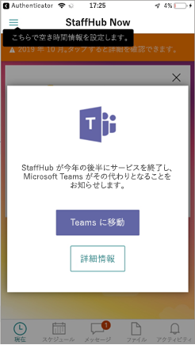

# <a name="move-your-microsoft-staffhub-teams-to-shifts-in-microsoft-teams"></a><span data-ttu-id="832eb-103">Microsoft Teams で Microsoft StaffHub teams をシフトに移行する</span><span class="sxs-lookup"><span data-stu-id="832eb-103">Move your Microsoft StaffHub teams to Shifts in Microsoft Teams</span></span>

> [!IMPORTANT]
> <span data-ttu-id="832eb-104">2019年12月31日有効な場合、Microsoft StaffHub は廃止されます。</span><span class="sxs-lookup"><span data-stu-id="832eb-104">Effective December 31, 2019, Microsoft StaffHub will be retired.</span></span> <span data-ttu-id="832eb-105">Microsoft Teams で StaffHub 機能を構築しています。</span><span class="sxs-lookup"><span data-stu-id="832eb-105">We’re building StaffHub capabilities into Microsoft Teams.</span></span> <span data-ttu-id="832eb-106">現在、チームには、スケジュール管理のためのシフトアプリが含まれており、その他の機能も時間の経過と共にロールアウトされます。</span><span class="sxs-lookup"><span data-stu-id="832eb-106">Today, Teams includes the Shifts app for schedule management and additional capabilities will roll out over time.</span></span> <span data-ttu-id="832eb-107">StaffHub は、2019年12月31日にすべてのユーザーに対して機能しなくなります。</span><span class="sxs-lookup"><span data-stu-id="832eb-107">StaffHub will stop working for all users on December 31, 2019.</span></span> <span data-ttu-id="832eb-108">StaffHub を開こうとしたユーザーには、チームをダウンロードするように指示するメッセージが表示されます。</span><span class="sxs-lookup"><span data-stu-id="832eb-108">Anyone who tries to open StaffHub will be shown a message directing them to download Teams.</span></span> <span data-ttu-id="832eb-109">詳細については、「[Microsoft StaffHub の廃止](microsoft-staffhub-to-be-retired.md)」を参照してください。</span><span class="sxs-lookup"><span data-stu-id="832eb-109">To learn more, see [Microsoft StaffHub to be retired](microsoft-staffhub-to-be-retired.md).</span></span>

<span data-ttu-id="832eb-110">Teams のシフトアプリは、スケジュールを管理するための簡単なアプローチを提供します。また、1日のうちに発生するシフト交換とキャンセルの流れを定期的に行うことができます。</span><span class="sxs-lookup"><span data-stu-id="832eb-110">The Shifts app in Teams provides a simple approach to managing schedules and the constant flow of shift swaps and cancellations that occur on a daily basis.</span></span> <span data-ttu-id="832eb-111">チームメンバーは、アプリやデバイス間で直接、スケジュールとシフト情報にアクセスして、ユーザー設定の設定、スケジュールの管理、休暇のリクエストを行うことができます。</span><span class="sxs-lookup"><span data-stu-id="832eb-111">Team members can access their schedule and shift information directly in the app and across their devices to set their preferences, manage their schedules, and request time off.</span></span>

<span data-ttu-id="832eb-112">この記事では、組織の StaffHub teams を移動して、チーム内のシフトにデータをスケジュールする方法について説明します。</span><span class="sxs-lookup"><span data-stu-id="832eb-112">This article walks you through how to move your organization’s StaffHub teams and schedule data to Shifts in Teams.</span></span> <span data-ttu-id="832eb-113">次の内容について説明します。</span><span class="sxs-lookup"><span data-stu-id="832eb-113">It covers:</span></span>

- [<span data-ttu-id="832eb-114">Teams への移行について知っておくべきこと</span><span class="sxs-lookup"><span data-stu-id="832eb-114">What you need to know about the move to Teams</span></span>](#what-you-need-to-know-about-the-move-to-teams)
- [<span data-ttu-id="832eb-115">備える</span><span class="sxs-lookup"><span data-stu-id="832eb-115">Prepare</span></span>](#prepare)
- [<span data-ttu-id="832eb-116">パイロットの実施</span><span class="sxs-lookup"><span data-stu-id="832eb-116">Conduct a pilot</span></span>](#conduct-a-pilot) 
- [<span data-ttu-id="832eb-117">パイロット以外の場所に移動して、すべての StaffHub teams を移動する</span><span class="sxs-lookup"><span data-stu-id="832eb-117">Go beyond your pilot and move all StaffHub teams</span></span>](#go-beyond-your-pilot-and-move-all-staffhub-teams)
- [<span data-ttu-id="832eb-118">チームの利用状況を監視する</span><span class="sxs-lookup"><span data-stu-id="832eb-118">Monitor Teams usage</span></span>](#monitor-teams-usage)
- [<span data-ttu-id="832eb-119">トラブルシューティング</span><span class="sxs-lookup"><span data-stu-id="832eb-119">Troubleshooting</span></span>](#troubleshooting)

<span data-ttu-id="832eb-120">1人または2人の StaffHub チームを持つ小規模企業でも、数百人の StaffHub teams を持つ大企業でも、チームへの移行を成功させるために必要な管理ガイダンスが記載されています。</span><span class="sxs-lookup"><span data-stu-id="832eb-120">Whether you’re a small business with one or two StaffHub teams or a large enterprise with hundreds of StaffHub teams, here you’ll find the admin guidance you need to help make your transition to Teams successful.</span></span>

<span data-ttu-id="832eb-121">この記事の手順を実行するには、グローバル管理者である必要があります。</span><span class="sxs-lookup"><span data-stu-id="832eb-121">You must be a global admin to perform the steps in this article.</span></span> <span data-ttu-id="832eb-122">まだインストールしていない場合は、 [StaffHub 定年](microsoft-staffhub-to-be-retired.md)に関する faq を参照して、お客様からの質問に回答してください。</span><span class="sxs-lookup"><span data-stu-id="832eb-122">If you haven't already done so, have a look through the [StaffHub retirement FAQ](microsoft-staffhub-to-be-retired.md) to get answers to any questions you may have.</span></span>

## <a name="what-you-need-to-know-about-the-move-to-teams"></a><span data-ttu-id="832eb-123">Teams への移行について知っておくべきこと</span><span class="sxs-lookup"><span data-stu-id="832eb-123">What you need to know about the move to Teams</span></span>

### <a name="when-to-move-to-teams"></a><span data-ttu-id="832eb-124">Teams に移動する場合</span><span class="sxs-lookup"><span data-stu-id="832eb-124">When to move to Teams</span></span>

<span data-ttu-id="832eb-125">2019年12月31日有効な StaffHub は廃止されます。</span><span class="sxs-lookup"><span data-stu-id="832eb-125">Effective December 31, 2019, StaffHub will be retired.</span></span> <span data-ttu-id="832eb-126">今すぐ Teams の使用を開始して、組織のチームとユーザーを StaffHub から移行することをお勧めします。</span><span class="sxs-lookup"><span data-stu-id="832eb-126">We encourage you to start using Teams today and begin to transition your organization's teams and users from StaffHub.</span></span> <span data-ttu-id="832eb-127">StaffHub でスケジュール管理が最も一般的に使用される機能である場合は、チームでのシフトアプリの使用を進めることをお勧めします。</span><span class="sxs-lookup"><span data-stu-id="832eb-127">With schedule management being the most commonly-used feature in StaffHub, we recommend you use the Shifts app in Teams moving forward.</span></span>

### <a name="what-is-moved-to-teams"></a><span data-ttu-id="832eb-128">Teams に移動されるもの</span><span class="sxs-lookup"><span data-stu-id="832eb-128">What is moved to Teams</span></span>

<span data-ttu-id="832eb-129">StaffHub チームを移動すると、チームメンバーシップ、ユーザーの詳細、チームのスケジュール、チャットデータが Teams に移動します。</span><span class="sxs-lookup"><span data-stu-id="832eb-129">When you move a StaffHub team, team membership, user details, team schedules, and chat data are moved to Teams.</span></span> <span data-ttu-id="832eb-130">StaffHub チームを移動すると、ファイルが移動されません。</span><span class="sxs-lookup"><span data-stu-id="832eb-130">Files aren't moved when you move a StaffHub team.</span></span> <span data-ttu-id="832eb-131">StaffHub チームに、teams にも移動するファイルが含まれている場合は、ファイルを別の手順で移動します。</span><span class="sxs-lookup"><span data-stu-id="832eb-131">If a StaffHub team contains files that you also want to move to teams, you move the files in a separate step.</span></span>

<span data-ttu-id="832eb-132">すべての StaffHub チームには、対応する Office 365 グループが必要です。</span><span class="sxs-lookup"><span data-stu-id="832eb-132">Every StaffHub team needs a corresponding Office 365 Group.</span></span> <span data-ttu-id="832eb-133">StaffHub チームが Office 365 グループに関連付けられている場合、チームを移動すると、グループのプライバシー設定が保持されます。</span><span class="sxs-lookup"><span data-stu-id="832eb-133">If a StaffHub team is associated with an Office 365 Group, the privacy setting of the group is retained when you move the team.</span></span> <span data-ttu-id="832eb-134">StaffHub チームに Office 365 グループが関連付けられていない場合は、移行をサポートするために、プライバシー設定のグループが [プライベート] に自動的に作成されます。</span><span class="sxs-lookup"><span data-stu-id="832eb-134">If a StaffHub team doesn't have an Office 365 Group associated with it, a group with a privacy setting of Private is automatically created for you to support the transition.</span></span>  <span data-ttu-id="832eb-135">Teams と StaffHub の間でのチームとグループの名前の違いにより、Teams に異なるチーム名が表示されることがあります。</span><span class="sxs-lookup"><span data-stu-id="832eb-135">Given the difference in team and group naming between Teams and StaffHub, you may see a different team name in Teams.</span></span> 

<span data-ttu-id="832eb-136">チームを StaffHub から Teams に移行すると、ユーザーは StaffHub のスケジュールにアクセスできなくなり、Teams のシフトにリダイレクトされます。</span><span class="sxs-lookup"><span data-stu-id="832eb-136">As you transition teams from StaffHub to Teams, users will no longer have access to their schedules in StaffHub and are redirected to Shifts in Teams.</span></span> <span data-ttu-id="832eb-137">この変更を組織全体で伝達することをお勧めします。中断を最小限に抑え、ユーザーにチームの採用と検討を促します。</span><span class="sxs-lookup"><span data-stu-id="832eb-137">We recommend you communicate this change across your organization to minimize disruption and to encourage users to adopt and explore Teams.</span></span> <span data-ttu-id="832eb-138">Azure AD Premium を使用している場合は、[レポートを実行](run-report-to-show-staffhub-usage.md)して、この変更について知っておく必要がある、組織内の StaffHub ユーザーの一覧を取得できます。</span><span class="sxs-lookup"><span data-stu-id="832eb-138">If you have Azure AD Premium, you can [run a report](run-report-to-show-staffhub-usage.md) to get a list of StaffHub users in your organization who need to know about this change.</span></span>  

<span data-ttu-id="832eb-139">StaffHub チームを Teams に移動しても、ロールバックオプションはありません。</span><span class="sxs-lookup"><span data-stu-id="832eb-139">There's no rollback option after you move a StaffHub team to Teams.</span></span>

### <a name="user-experience-when-you-move-a-team"></a><span data-ttu-id="832eb-140">チームを移動するときのユーザーエクスペリエンス</span><span class="sxs-lookup"><span data-stu-id="832eb-140">User experience when you move a team</span></span>

<span data-ttu-id="832eb-141">チームの StaffHub からシフトへの切り替えが発生した場合、ユーザーに対してダウンタイム (1 秒未満) が最小限に抑えられます。</span><span class="sxs-lookup"><span data-stu-id="832eb-141">There's minimal downtime (less than a second, if any at all) for users when their team is switched from StaffHub to Shifts in Teams.</span></span> <span data-ttu-id="832eb-142">チームへの移動が完了するまで、ユーザーは StaffHub を引き続き使用することができます。</span><span class="sxs-lookup"><span data-stu-id="832eb-142">Users can continue using StaffHub until the move to Teams is completed.</span></span> <span data-ttu-id="832eb-143">移動が完了すると、チームメンバーにメッセージが表示され、チームのスケジュールにアクセスするためにチームのシフトの使用を開始する必要があることがわかります。</span><span class="sxs-lookup"><span data-stu-id="832eb-143">When the move is completed, team members will see a message to let them know that they need to start using Shifts in Teams to access their team schedule.</span></span> <span data-ttu-id="832eb-144">ここでは、StaffHub チームが Teams に移動した後に StaffHub に表示されるメッセージの例を示します。</span><span class="sxs-lookup"><span data-stu-id="832eb-144">Here's an example of the message that users see in StaffHub after the StaffHub team is moved to Teams.</span></span>

<span data-ttu-id="832eb-145"></span><span class="sxs-lookup"><span data-stu-id="832eb-145"></span></span>

## <a name="prepare"></a><span data-ttu-id="832eb-146">備える</span><span class="sxs-lookup"><span data-stu-id="832eb-146">Prepare</span></span>

<span data-ttu-id="832eb-147">ここでは、Teams への移行を準備する方法について説明します。</span><span class="sxs-lookup"><span data-stu-id="832eb-147">Here's how to prepare for the move to Teams.</span></span>

### <a name="check-that-prerequisites-are-met"></a><span data-ttu-id="832eb-148">前提条件が満たされていることを確認する</span><span class="sxs-lookup"><span data-stu-id="832eb-148">Check that prerequisites are met</span></span>

<span data-ttu-id="832eb-149">StaffHub チームを Teams に移動する前に、次のことを確認してください。</span><span class="sxs-lookup"><span data-stu-id="832eb-149">Before you move a StaffHub team to Teams, make sure that:</span></span>

- <span data-ttu-id="832eb-150">サインインしたユーザーはグローバル管理者です。</span><span class="sxs-lookup"><span data-stu-id="832eb-150">The signed-in user is a global admin.</span></span>
- <span data-ttu-id="832eb-151">チームは、テナント内のすべてのユーザーに対して有効になっています。</span><span class="sxs-lookup"><span data-stu-id="832eb-151">Teams is enabled for all users in the tenant.</span></span>
- <span data-ttu-id="832eb-152">テナントで Office 365 グループの作成が有効になっています。</span><span class="sxs-lookup"><span data-stu-id="832eb-152">Office 365 Groups creation is enabled in the tenant.</span></span>
- <span data-ttu-id="832eb-153">StaffHub teamId が有効です。</span><span class="sxs-lookup"><span data-stu-id="832eb-153">The StaffHub teamId is valid.</span></span>
- <span data-ttu-id="832eb-154">StaffHub チームには、少なくとも1つのチーム所有者がいます。</span><span class="sxs-lookup"><span data-stu-id="832eb-154">The StaffHub team has at least one team owner.</span></span>
- <span data-ttu-id="832eb-155">StaffHub チームにはメンバーが含まれています。</span><span class="sxs-lookup"><span data-stu-id="832eb-155">The StaffHub team contains members.</span></span>
- <span data-ttu-id="832eb-156">すべての StaffHub チームメンバーは、Azure AD アカウントにリンクされています。</span><span class="sxs-lookup"><span data-stu-id="832eb-156">All StaffHub team members are linked to an Azure AD account.</span></span>
- <span data-ttu-id="832eb-157">すべての StaffHub チームメンバーに Teams ライセンスが割り当てられます。</span><span class="sxs-lookup"><span data-stu-id="832eb-157">All StaffHub team members are assigned a Teams license.</span></span>  

<span data-ttu-id="832eb-158">これらの前提条件が満たされない場合、移動要求は失敗します。</span><span class="sxs-lookup"><span data-stu-id="832eb-158">If these prerequisites aren't met, the move request will fail.</span></span>

### <a name="assign-teams-licenses"></a><span data-ttu-id="832eb-159">Teams のライセンスを割り当てる</span><span class="sxs-lookup"><span data-stu-id="832eb-159">Assign Teams licenses</span></span>

<span data-ttu-id="832eb-160">各ユーザーは、ライセンス付与された有効な Microsoft 365 または Office 365 ライセンスを所有している必要があります。[また、Teams](microsoft-staffhub-to-be-retired.md#which-plans-is-shifts-available-in)ライセンスを割り当てる必要があります。</span><span class="sxs-lookup"><span data-stu-id="832eb-160">Each user must have an active Microsoft 365 or Office 365 license from [an eligible plan](microsoft-staffhub-to-be-retired.md#which-plans-is-shifts-available-in) and must be assigned a Teams license.</span></span> <span data-ttu-id="832eb-161">Teams ライセンスをユーザーに割り当てると、チームにアクセスできます。</span><span class="sxs-lookup"><span data-stu-id="832eb-161">Assigning a Teams license to users gives them access to Teams.</span></span>

<span data-ttu-id="832eb-162">Teams のライセンスは、Microsoft 365 管理センターで管理します。</span><span class="sxs-lookup"><span data-stu-id="832eb-162">You manage Teams licenses in the Microsoft 365 admin center.</span></span> <span data-ttu-id="832eb-163">詳細については、「[チームへのユーザーアクセスを管理](../../user-access.md)する」を参照してください。</span><span class="sxs-lookup"><span data-stu-id="832eb-163">To learn more, see [Manage user access to Teams](../../user-access.md).</span></span>

> [!NOTE]
> <span data-ttu-id="832eb-164">組織で Skype for Business を使用していて、すべてのユーザーをチームに移行する準備ができていない場合は、最初に Skype for Business を使用してチームを実行できるようにすることができます。</span><span class="sxs-lookup"><span data-stu-id="832eb-164">If your organization uses Skype for Business and you’re not ready to move all your users to Teams, you can enable Teams for your Firstline Workers who can then run Teams alongside Skype for Business.</span></span> <span data-ttu-id="832eb-165">この共存モード (*孤島*) では、各クライアントアプリは個別のソリューションとして動作します。</span><span class="sxs-lookup"><span data-stu-id="832eb-165">In this coexistence mode, called *Islands*, each client app operates as a separate solution.</span></span> <span data-ttu-id="832eb-166">詳細については、「[チームと Skype For business の共存と相互運用性につい](../../teams-and-skypeforbusiness-coexistence-and-interoperability.md)て」を参照してください。</span><span class="sxs-lookup"><span data-stu-id="832eb-166">To learn more, see [Understand Teams and Skype for Business coexistence and interoperability](../../teams-and-skypeforbusiness-coexistence-and-interoperability.md).</span></span>

### <a name="install-the-prerelease-version-of-the-staffhub-powershell-module"></a><span data-ttu-id="832eb-167">プレリリース版の StaffHub PowerShell モジュールをインストールする</span><span class="sxs-lookup"><span data-stu-id="832eb-167">Install the prerelease version of the StaffHub PowerShell module</span></span>

<span data-ttu-id="832eb-168">まだインストールしていない場合は、[プレリリース版の StaffHub PowerShell モジュールをインストール](install-the-staffhub-powershell-module.md)します。</span><span class="sxs-lookup"><span data-stu-id="832eb-168">If you haven't already, [install the prerelease version of the StaffHub PowerShell module](install-the-staffhub-powershell-module.md).</span></span>

<span data-ttu-id="832eb-169">StaffHub teams を Teams に移行するには、プレリリース版のモジュールがインストールされている必要があります。</span><span class="sxs-lookup"><span data-stu-id="832eb-169">You must have the prerelease version of the module installed to move your StaffHub teams to Teams.</span></span>

### <a name="link-an-azure-ad-account-for-staffhub-team-members-who-dont-have-one"></a><span data-ttu-id="832eb-170">StaffHub チームメンバーがない場合に、Azure AD アカウントをリンクさせる</span><span class="sxs-lookup"><span data-stu-id="832eb-170">Link an Azure AD account for StaffHub team members who don't have one</span></span>

<span data-ttu-id="832eb-171">各 StaffHub チームメンバーは、Azure Active Directory (Azure AD) アカウントにリンクされている必要があります。</span><span class="sxs-lookup"><span data-stu-id="832eb-171">Each StaffHub team member must be linked to an Azure Active Directory (Azure AD) account.</span></span> <span data-ttu-id="832eb-172">次のシナリオのいずれかが適用されている場合、組織内のユーザーは Azure AD アカウントにリンクされません。</span><span class="sxs-lookup"><span data-stu-id="832eb-172">Users in your organization won't be linked to an Azure AD account if any of the following scenarios apply:</span></span>

- <span data-ttu-id="832eb-173">チーム所有者が、Azure AD アカウントを持っていないユーザーを追加しました。</span><span class="sxs-lookup"><span data-stu-id="832eb-173">A team owner added a user who doesn't have an Azure AD account.</span></span>
- <span data-ttu-id="832eb-174">チーム所有者が、ユーザーを StaffHub チームに招待し、そのユーザーが招待を承諾しなかった。</span><span class="sxs-lookup"><span data-stu-id="832eb-174">A team owner invited a user to a StaffHub team and that user didn't accept the invitation.</span></span>

<span data-ttu-id="832eb-175">これらのユーザーには非アクティブなアカウントがあり、不明、招待、または InviteRejected のユーザー状態が表示されます。</span><span class="sxs-lookup"><span data-stu-id="832eb-175">These users have inactive accounts and show a user state of Unknown, Invited, or InviteRejected.</span></span> <span data-ttu-id="832eb-176">これらのユーザーに Azure AD アカウントをリンクさせることができます。</span><span class="sxs-lookup"><span data-stu-id="832eb-176">You can link an Azure AD account for these users.</span></span>  <span data-ttu-id="832eb-177">これを行うには、次の操作を実行します。</span><span class="sxs-lookup"><span data-stu-id="832eb-177">Here's how.</span></span>

#### <a name="get-a-list-of-all-inactive-accounts-on-staffhub-teams"></a><span data-ttu-id="832eb-178">StaffHub teams の非アクティブなアカウントの一覧を取得する</span><span class="sxs-lookup"><span data-stu-id="832eb-178">Get a list of all inactive accounts on StaffHub teams</span></span>

<span data-ttu-id="832eb-179">次の一連のコマンドを実行して、StaffHub teams 上の非アクティブなアカウントの一覧を取得し、リストを CSV ファイルにエクスポートします。</span><span class="sxs-lookup"><span data-stu-id="832eb-179">Run the following series of commands to get a list of all inactive accounts on StaffHub teams and export the list to a CSV file.</span></span> <span data-ttu-id="832eb-180">各コマンドは個別に実行する必要があります。</span><span class="sxs-lookup"><span data-stu-id="832eb-180">Each command should be run separately.</span></span>

```
$InvitedUsersObject = @()

$StaffHubTeams = Get-StaffHubTeamsForTenant

$StaffHubTeams[0] = $StaffHubTeams[0] | Where-Object { $_.ManagedBy -eq 'StaffHub' }

foreach($team in $StaffHubTeams[0])
{ 
    Write-host $team.name
    $StaffHubUsers = Get-StaffHubMember -TeamId $team.Id | where {$_.State -eq "Invited"}
    foreach($StaffHubUser in $StaffHubUsers) {
        $InvitedUsersObject  += New-Object PsObject -Property @{
          "TeamID"="$($team.Id)"
          "TeamName"="$($team.name)"
          "MemberID"="$($StaffHubUser.Id)"
            }
    }
}

$InvitedUsersObject | SELECT * | export-csv InvitedUsers.csv -NoTypeInformation  
```

#### <a name="link-the-account"></a><span data-ttu-id="832eb-181">アカウントをリンクする</span><span class="sxs-lookup"><span data-stu-id="832eb-181">Link the account</span></span>

<span data-ttu-id="832eb-182">次のいずれかの操作を行います。</span><span class="sxs-lookup"><span data-stu-id="832eb-182">Do one of the following:</span></span>

- <span data-ttu-id="832eb-183">アカウントを変換してリンクします。</span><span class="sxs-lookup"><span data-stu-id="832eb-183">Convert and link the account.</span></span>

  <span data-ttu-id="832eb-184">StaffHub チーム所有者と管理者は、ユーザーのメールアドレスを StaffHub チームの設定ページで有効な UPN に変更することによって、非アクティブなアカウントを変換し、StaffHub の Azure AD アカウントにリンクすることができます。</span><span class="sxs-lookup"><span data-stu-id="832eb-184">StaffHub team owners and managers can convert an inactive account and link it to an Azure AD account in StaffHub by changing the user's email address to a valid UPN on the StaffHub team settings page.</span></span>

- <span data-ttu-id="832eb-185">リンクされていないアカウントを削除し、UPN を使用してアカウントをもう一度追加します。</span><span class="sxs-lookup"><span data-stu-id="832eb-185">Remove the unlinked account and then re-add the account by using the UPN.</span></span>
    1. <span data-ttu-id="832eb-186">StaffHub チームからプロビジョニングされていないアカウントを削除するには、 [StaffHubMember](https://docs.microsoft.com/powershell/module/staffhub/Remove-StaffHubMember?view=staffhub-ps)コマンドレットを実行します。</span><span class="sxs-lookup"><span data-stu-id="832eb-186">Run the [Remove-StaffHubMember](https://docs.microsoft.com/powershell/module/staffhub/Remove-StaffHubMember?view=staffhub-ps) cmdlet to remove the non-provisioned account from the StaffHub team.</span></span>
    2. <span data-ttu-id="832eb-187">UPN を使用して StaffHub チームにアカウントを戻すには、 [StaffHubMember](https://docs.microsoft.com/powershell/module/staffhub/add-staffhubmember?view=staffhub-ps)コマンドレットを実行します。</span><span class="sxs-lookup"><span data-stu-id="832eb-187">Run the [Add-StaffHubMember](https://docs.microsoft.com/powershell/module/staffhub/add-staffhubmember?view=staffhub-ps) cmdlet to add the account back to the StaffHub team by using the UPN.</span></span>

- <span data-ttu-id="832eb-188">非アクティブなアカウントを削除します。</span><span class="sxs-lookup"><span data-stu-id="832eb-188">Remove the inactive account.</span></span> <span data-ttu-id="832eb-189">ユーザーアカウントが不要になった場合は、このオプションを使用します。</span><span class="sxs-lookup"><span data-stu-id="832eb-189">Use this option if the user account is no longer needed.</span></span>

### <a name="assign-the-firstlineworker-app-setup-policy-to-users"></a><span data-ttu-id="832eb-190">FirstlineWorker アプリのセットアップポリシーをユーザーに割り当てる</span><span class="sxs-lookup"><span data-stu-id="832eb-190">Assign the FirstlineWorker app setup policy to users</span></span>

<span data-ttu-id="832eb-191">Teams には、組織内の最初の社員にとって最も重要なアプリを強調表示するために、チームをカスタマイズするために使用できる、標準の Lineworker アプリのセットアップポリシーが用意されています。</span><span class="sxs-lookup"><span data-stu-id="832eb-191">Teams includes a built-in FirstlineWorker app setup policy that you can use to customize Teams to highlight the apps that are most important for the Firstline Workers in your organization.</span></span> <span data-ttu-id="832eb-192">このポリシーをユーザーに割り当てると、ポリシーに含まれるアプリが、すばやく簡単にアクセスできるように Teams のアプリバーに固定されます。</span><span class="sxs-lookup"><span data-stu-id="832eb-192">When you assign this policy to users, the apps in the policy are pinned to the app bar in Teams for quick and easy access.</span></span> <span data-ttu-id="832eb-193">他のチームに追加されたアプリは、[...] をクリックしてアプリバーに表示されます。 \*\*\*\* Teams のデスクトップと web クライアントでのアプリの増加、および teams のモバイルクライアントでの追加アプリ。</span><span class="sxs-lookup"><span data-stu-id="832eb-193">Other apps added to Teams can be found in the app bar by clicking **... More apps** in the Teams desktop and web clients and by swiping up in the Teams mobile client.</span></span> <span data-ttu-id="832eb-194">既定では、FirstlineWorker アプリのセットアップポリシーには、アクティビティ、シフト、チャット、通話アプリが含まれます。</span><span class="sxs-lookup"><span data-stu-id="832eb-194">By default, the FirstlineWorker app setup policy includes the Activity, Shifts, Chat, and Calling apps.</span></span>

<span data-ttu-id="832eb-195">FirstlineWorker アプリのセットアップポリシーをユーザーに割り当てる手順については、「 [firstlineworker アプリのセットアップポリシーを使用してチームへのシフトを固定](manage-the-shifts-app-for-your-organization-in-teams.md#use-the-firstlineworker-app-setup-policy-to-pin-shifts-to-teams)する」を参照してください。</span><span class="sxs-lookup"><span data-stu-id="832eb-195">For steps on how to assign the FirstlineWorker app setup policy to users, see [Use the FirstlineWorker app setup policy to pin Shifts to Teams](manage-the-shifts-app-for-your-organization-in-teams.md#use-the-firstlineworker-app-setup-policy-to-pin-shifts-to-teams).</span></span> <span data-ttu-id="832eb-196">ポリシーを割り当てた後は、最長24時間かかる場合があります。</span><span class="sxs-lookup"><span data-stu-id="832eb-196">After you assign a policy, it can take up to 24 hours to take effect.</span></span>

<span data-ttu-id="832eb-197">StaffHub teams とユーザーを Teams に移行する前に、少なくとも1週間以上この手順を実行することをお勧めします。</span><span class="sxs-lookup"><span data-stu-id="832eb-197">We recommend you complete this step at least a week before you move your StaffHub teams and users to Teams.</span></span> <span data-ttu-id="832eb-198">ユーザーが Teams を使用している場合は、シフトアプリを表示してアクセスできることを確認します。</span><span class="sxs-lookup"><span data-stu-id="832eb-198">When users are on Teams, confirm that they can see and access the Shifts app.</span></span>

<span data-ttu-id="832eb-199">また、カスタムアプリセットアップポリシーを作成して、グローバルアプリセットアップポリシーの設定を編集することもできます。</span><span class="sxs-lookup"><span data-stu-id="832eb-199">You can also create custom app setup policies and edit the settings in the global app setup policy.</span></span> <span data-ttu-id="832eb-200">詳細については、「[Teams でアプリの設定ポリシーを管理する](../../teams-app-setup-policies.md)」を確認してください。</span><span class="sxs-lookup"><span data-stu-id="832eb-200">To learn more, check out [Manage app setup policies in Teams](../../teams-app-setup-policies.md).</span></span>

### <a name="onboard-users-to-teams"></a><span data-ttu-id="832eb-201">チームへのオンボードユーザー</span><span class="sxs-lookup"><span data-stu-id="832eb-201">Onboard users to Teams</span></span>

<span data-ttu-id="832eb-202">オンボード戦略の一環として、チームに慣れてもらうためのトレーニングとガイダンスをユーザーに提供します。</span><span class="sxs-lookup"><span data-stu-id="832eb-202">As part of your onboarding strategy, provide training and guidance for users to help them get familiar with Teams.</span></span> <span data-ttu-id="832eb-203">次のリソースをユーザーと共有して、チームのクライアント、トレーニング、サポートを取得する場所を確認します。</span><span class="sxs-lookup"><span data-stu-id="832eb-203">Share the following resources with users so they know where to get Teams clients, training, and support:</span></span>

- [<span data-ttu-id="832eb-204">Teams の Web クライアント</span><span class="sxs-lookup"><span data-stu-id="832eb-204">Teams web client</span></span>](https://teams.microsoft.com)
- [<span data-ttu-id="832eb-205">デスクトップとモバイル クライアントのダウンロード リンク</span><span class="sxs-lookup"><span data-stu-id="832eb-205">Desktop and mobile client download links</span></span>](https://teams.microsoft.com/downloads)
- [<span data-ttu-id="832eb-206">Teams のトレーニング用ビデオ</span><span class="sxs-lookup"><span data-stu-id="832eb-206">Teams training videos</span></span>](https://support.office.com/article/microsoft-teams-video-training-4f108e54-240b-4351-8084-b1089f0d21d7)
- [<span data-ttu-id="832eb-207">Teams のヘルプ ドキュメント</span><span class="sxs-lookup"><span data-stu-id="832eb-207">Teams Help documentation</span></span>](https://support.office.com/teams)

<span data-ttu-id="832eb-208">チームを展開してチームを導入するためのガイダンスについては、「チームをロールアウトして[チームを採用](../../adopt-microsoft-teams-landing-page.md)[する方法](../../How-to-roll-out-teams.md)」を参照してください。</span><span class="sxs-lookup"><span data-stu-id="832eb-208">For guidance on deploying Teams and driving Teams adoption, see [How to roll out Teams](../../How-to-roll-out-teams.md) and [Adopt Teams](../../adopt-microsoft-teams-landing-page.md).</span></span>

## <a name="conduct-a-pilot"></a><span data-ttu-id="832eb-209">パイロットの実施</span><span class="sxs-lookup"><span data-stu-id="832eb-209">Conduct a pilot</span></span>

<span data-ttu-id="832eb-210">最初に、2つまたは3つの StaffHub teams を、最早採用者のグループごとに移動することをお勧めします。</span><span class="sxs-lookup"><span data-stu-id="832eb-210">We recommend you start by moving two or three StaffHub teams for a select group of early adopters.</span></span> <span data-ttu-id="832eb-211">パイロットを実行すると、移行計画を調整して、組織のすべての StaffHub チームをチームに移行できるようになります。</span><span class="sxs-lookup"><span data-stu-id="832eb-211">Running a pilot helps you refine your transition plan and ensure you're ready to move all your organization's StaffHub teams to Teams.</span></span> <span data-ttu-id="832eb-212">また、組織全体での導入を促進できるエキスパートも特定します。</span><span class="sxs-lookup"><span data-stu-id="832eb-212">It also identifies champions who can help drive adoption across your organization.</span></span> <span data-ttu-id="832eb-213">段階的アプローチを必要としない小規模企業の場合は、このセクションの手順に従って、StaffHub から Teams に切り替える必要があります。</span><span class="sxs-lookup"><span data-stu-id="832eb-213">If you're a small business who doesn't need a phased approach, the steps in this section may be all you need to make the switch from StaffHub to Teams.</span></span>

### <a name="identify-pilot-teams"></a><span data-ttu-id="832eb-214">パイロットチームの特定</span><span class="sxs-lookup"><span data-stu-id="832eb-214">Identify pilot teams</span></span>

<span data-ttu-id="832eb-215">パイロットチームの2つまたは3つを確認してください。</span><span class="sxs-lookup"><span data-stu-id="832eb-215">Reach out to identify two or three pilot teams.</span></span> <span data-ttu-id="832eb-216">すべてのチームメンバーは、チームでシフトを使用して、スケジュールを管理し、相互に通信して共同作業を行う必要があります。</span><span class="sxs-lookup"><span data-stu-id="832eb-216">All team members should commit to using Shifts in Teams to manage their schedules and communicate and collaborate with each other.</span></span>

### <a name="identify-team-champions"></a><span data-ttu-id="832eb-217">チームのチャンピオンの特定</span><span class="sxs-lookup"><span data-stu-id="832eb-217">Identify team champions</span></span>

<span data-ttu-id="832eb-218">パイロットチーム全体のチャンピオンを特定し、啓蒙シフトを支援するために参加します。</span><span class="sxs-lookup"><span data-stu-id="832eb-218">Identify champions across pilot teams and enlist them to help evangelize Shifts.</span></span> <span data-ttu-id="832eb-219">チームの支持者は、チームメンバーのサポートとガイダンスを提供するために、独自の高い知識を共有しています。</span><span class="sxs-lookup"><span data-stu-id="832eb-219">Team champions are passionate about what they do, sharing their own learnings to offer support and guidance to team members.</span></span> <span data-ttu-id="832eb-220">チームチャンピオンはチームの所有者または管理者になることができます。</span><span class="sxs-lookup"><span data-stu-id="832eb-220">Team champions can be team owners or managers.</span></span>

<span data-ttu-id="832eb-221">チームのメンバーがチームの[クライアントを取得](../../get-clients.md)し、teams にサインインして、スケジュールをシフトで確認し、互いにチャットを開始するためには、チームメンバーが設定されていることを確認する必要があります。</span><span class="sxs-lookup"><span data-stu-id="832eb-221">Team champions should ensure team members are set up by dedicating time for everyone to [get Teams clients](../../get-clients.md), sign in to Teams and check out their schedules in Shifts, and start chatting with each other.</span></span> <span data-ttu-id="832eb-222">すでに StaffHub に慣れているユーザーは、シフトですぐに稼動することになります。</span><span class="sxs-lookup"><span data-stu-id="832eb-222">Users who are already familiar with StaffHub will be up and running quickly in Shifts.</span></span> <span data-ttu-id="832eb-223">その他のヘルプについては、[[シフトヘルプ](https://support.office.com/article/apps-and-services-cc1fba57-9900-4634-8306-2360a40c665b)] をポイントすることもできます。</span><span class="sxs-lookup"><span data-stu-id="832eb-223">You can also point them to [Shifts Help](https://support.office.com/article/apps-and-services-cc1fba57-9900-4634-8306-2360a40c665b) for additional help.</span></span>

### <a name="move-a-staffhub-team"></a><span data-ttu-id="832eb-224">StaffHub チームを移動する</span><span class="sxs-lookup"><span data-stu-id="832eb-224">Move a StaffHub team</span></span>

<span data-ttu-id="832eb-225">次の手順を使用して、一度に1つの StaffHub チームを移動します。</span><span class="sxs-lookup"><span data-stu-id="832eb-225">Use these steps to move one StaffHub team at a time.</span></span> <span data-ttu-id="832eb-226">パイロットチームでは、この方法をお勧めします。</span><span class="sxs-lookup"><span data-stu-id="832eb-226">We recommend this approach for your pilot teams.</span></span> <span data-ttu-id="832eb-227">後で、組織のすべての StaffHub チームを移行する準備ができたら、「複数のチームを一度に移動する」の手順については、「 [StaffHub teams を移行](#move-your-staffhub-teams)する」を参照してください。</span><span class="sxs-lookup"><span data-stu-id="832eb-227">Later, when you're ready to move all your organization's StaffHub teams, see [Move your StaffHub teams](#move-your-staffhub-teams) for steps on how move multiple teams at a time.</span></span>

<span data-ttu-id="832eb-228">StaffHub チームを移動するには、次を実行します。</span><span class="sxs-lookup"><span data-stu-id="832eb-228">Run the following to move a StaffHub team.</span></span>

```
Move-StaffHubTeam -TeamId <String>
```
<span data-ttu-id="832eb-229">次</span><span class="sxs-lookup"><span data-stu-id="832eb-229">Example:</span></span>

```
Move-StaffHubTeam -TeamId "TEAM_4bbc03af-c764-497f-a8a5-1c0708475e5f"
```

<span data-ttu-id="832eb-230">次に示すのは、StaffHub チームを Teams に移動する要求を送信するときに表示される応答の例です。</span><span class="sxs-lookup"><span data-stu-id="832eb-230">Here's an example of the response you get when you submit a request to move a StaffHub team to Teams.</span></span>

```
 jobId                                      teamId                                      teamAlreadyInMicrosofteams  
---------------------------------------    ----------------------------------------    ---------------------------          
JOB_81b1f191-3e19-45ce-ab32-3ef51f100000   TEAM_4bbc03af-c764-497f-a8a5-1c0708475e5f   false
```

<span data-ttu-id="832eb-231">移動要求の状態を確認するには、次を実行します。</span><span class="sxs-lookup"><span data-stu-id="832eb-231">To check the status of a move request, run the following.</span></span>

```
Get-TeamMigrationJobStatus <String>
```
<span data-ttu-id="832eb-232">次</span><span class="sxs-lookup"><span data-stu-id="832eb-232">Example:</span></span>

```
Get-TeamMigrationJobStatus -JobId "JOB_81b1f191-3e19-45ce-ab32-3ef51f100000"
```

<span data-ttu-id="832eb-233">次に示すのは、移動が進行中の場合に表示される応答の例です。</span><span class="sxs-lookup"><span data-stu-id="832eb-233">Here's an example of the response you get when a move is in progress.</span></span>

```
jobId                                     status       teamId                                     isO365GroupCreated  Error
----------------------------------------  ----------   ----------------------------------------   ------------------  -----    
JOB_81b1f191-3e19-45ce-ab32-3ef51f100000  inProgress   TEAM_4bbc03af-c764-497f-a8a5-1c0708475e5f  true                none
```

### <a name="move-files-from-a-staffhub-team-to-teams"></a><span data-ttu-id="832eb-234">StaffHub チームから Teams にファイルを移動する</span><span class="sxs-lookup"><span data-stu-id="832eb-234">Move files from a StaffHub team to Teams</span></span>

<span data-ttu-id="832eb-235">この手順は、Teams に移動した StaffHub チームが、Teams にも移動するファイルを持っている場合にのみ適用されます。</span><span class="sxs-lookup"><span data-stu-id="832eb-235">This step only applies if the StaffHub team that you moved to Teams has files that you want to also move to Teams.</span></span> <span data-ttu-id="832eb-236">SharePoint Online または PowerShell を使用して、ファイルを直接移動できます。</span><span class="sxs-lookup"><span data-stu-id="832eb-236">You can move files directly in SharePoint Online or by using PowerShell.</span></span>

#### <a name="in-sharepoint-online"></a><span data-ttu-id="832eb-237">SharePoint Online の場合</span><span class="sxs-lookup"><span data-stu-id="832eb-237">In SharePoint Online</span></span>

<span data-ttu-id="832eb-238">[SharePoint Online でファイルを移動する方法に](https://support.office.com/article/how-to-move-files-in-sharepoint-online-8c86f6c3-9612-4031-95b2-3d9d5c6e5a30)ついて説明します。</span><span class="sxs-lookup"><span data-stu-id="832eb-238">See [How to move files in SharePoint Online](https://support.office.com/article/how-to-move-files-in-sharepoint-online-8c86f6c3-9612-4031-95b2-3d9d5c6e5a30).</span></span>

#### <a name="using-powershell"></a><span data-ttu-id="832eb-239">PowerShell を使用する</span><span class="sxs-lookup"><span data-stu-id="832eb-239">Using PowerShell</span></span>

<span data-ttu-id="832eb-240">[SharePoint Online 管理シェル](https://www.microsoft.com/download/details.aspx?id=35588)をダウンロードしてインストールします (まだインストールしていない場合)。</span><span class="sxs-lookup"><span data-stu-id="832eb-240">Download and install the [SharePoint Online Management Shell](https://www.microsoft.com/download/details.aspx?id=35588), if you haven't already.</span></span> <span data-ttu-id="832eb-241">ファイルを移動するために必要なコマンドレットが含まれています。</span><span class="sxs-lookup"><span data-stu-id="832eb-241">It contains the cmdlets you need to move files.</span></span>  

<span data-ttu-id="832eb-242">[Connect-admin.sharepoint.com](https://docs.microsoft.com/powershell/module/sharepoint-pnp/connect-pnponline?view=sharepoint-ps)コマンドレットを使用して、SharePoint Online チームサイトに接続します。</span><span class="sxs-lookup"><span data-stu-id="832eb-242">Use the [Connect-PnPOnline](https://docs.microsoft.com/powershell/module/sharepoint-pnp/connect-pnponline?view=sharepoint-ps) cmdlet to connect to the SharePoint Online team site.</span></span>

```
Connect-PnPOnline -Url https://<sharepoint URL>/sites/<Group Name>  
```

<span data-ttu-id="832eb-243">StaffHub から Teams に移動する各ファイルについて、 [PnPFile](https://docs.microsoft.com/powershell/module/sharepoint-pnp/move-pnpfile)コマンドレットを使用してファイルを移動します。</span><span class="sxs-lookup"><span data-stu-id="832eb-243">For each file that you want to move from StaffHub to Teams, use the [Move-PnPFile](https://docs.microsoft.com/powershell/module/sharepoint-pnp/move-pnpfile) cmdlet to move the file.</span></span>

```
Move-PnPFile -ServerRelativeUrl "/sites/<Group Name>/Shared Documents/<File Name>" -TargetUrl "/sites/<Group Name>/Shared Documents/General/<File Name>" 
```

<span data-ttu-id="832eb-244">複数のファイルを移動するには、ファイルをループして、ループの2番目のコマンドを実行します。</span><span class="sxs-lookup"><span data-stu-id="832eb-244">To move multiple files, loop over the files and run the second command on the loop.</span></span> <span data-ttu-id="832eb-245">セッションがアクティブな場合は、最初のコマンドを繰り返す必要はありません。</span><span class="sxs-lookup"><span data-stu-id="832eb-245">You don't need to repeat the first command if the session remains active.</span></span>

## <a name="go-beyond-your-pilot-and-move-all-staffhub-teams"></a><span data-ttu-id="832eb-246">パイロット以外の場所に移動して、すべての StaffHub teams を移動する</span><span class="sxs-lookup"><span data-stu-id="832eb-246">Go beyond your pilot and move all StaffHub teams</span></span>

### <a name="raise-awareness"></a><span data-ttu-id="832eb-247">認識を高める</span><span class="sxs-lookup"><span data-stu-id="832eb-247">Raise awareness</span></span>

<span data-ttu-id="832eb-248">パイロットチームを超えて組織の StaffHub チームをチームに移行する準備ができたら、まず組織全体で変更を伝えることが重要です。</span><span class="sxs-lookup"><span data-stu-id="832eb-248">When you're ready to go beyond your pilot teams and move your organization's StaffHub teams to Teams, it's important to first communicate the change across your organization.</span></span> <span data-ttu-id="832eb-249">シフトについての単語を広げ、チームへの切り替えを行って、認知度を上げ、興奮を生み出し、導入を推進します。</span><span class="sxs-lookup"><span data-stu-id="832eb-249">Spread the word about Shifts and the transition to Teams to raise awareness, generate excitement, and drive adoption.</span></span>

### <a name="move-your-staffhub-teams"></a><span data-ttu-id="832eb-250">StaffHub teams を移動する</span><span class="sxs-lookup"><span data-stu-id="832eb-250">Move your StaffHub teams</span></span>

<span data-ttu-id="832eb-251">次の手順を使用して、StaffHub teams をまとめて移動します。</span><span class="sxs-lookup"><span data-stu-id="832eb-251">Use these steps to move StaffHub teams in bulk.</span></span> <span data-ttu-id="832eb-252">組織のすべての StaffHub チームを移動するか、または特定の StaffHub teams を移動するかを選ぶことができます。</span><span class="sxs-lookup"><span data-stu-id="832eb-252">You can choose to move all your organization's StaffHub teams or move specific StaffHub teams.</span></span> <span data-ttu-id="832eb-253">StaffHub teams を1つずつ移動する方法については、「 [StaffHub チームを移行](#move-a-staffhub-team)する」を参照してください。</span><span class="sxs-lookup"><span data-stu-id="832eb-253">If you want to move StaffHub teams one at a time, see [Move a StaffHub team](#move-a-staffhub-team).</span></span>

#### <a name="move-all-staffhub-teams"></a><span data-ttu-id="832eb-254">すべての StaffHub teams を移動する</span><span class="sxs-lookup"><span data-stu-id="832eb-254">Move all StaffHub teams</span></span>

<span data-ttu-id="832eb-255">組織内のすべての StaffHub teams の一覧を取得するには、次を実行します。</span><span class="sxs-lookup"><span data-stu-id="832eb-255">Run the following to get a list of all StaffHub teams in your organization.</span></span>

```
$StaffHubTeams = Get-StaffHubTeamsForTenant

$StaffHubTeams[0] | Where-Object { $_.ManagedBy -eq ‘StaffHub’ }
```

<span data-ttu-id="832eb-256">次に、次のことを実行してすべてのチームを移動します。</span><span class="sxs-lookup"><span data-stu-id="832eb-256">Then, run the following to move all teams.</span></span>

```
foreach ($team in $StaffHubTeams[0]) {Move-StaffHubTeam -TeamId $team.Id}
```

<span data-ttu-id="832eb-257">応答の例を次に示します。</span><span class="sxs-lookup"><span data-stu-id="832eb-257">Here's an example of the response.</span></span>

<span data-ttu-id="832eb-258">既に Teams に移動されているか、Teams に既に存在しているチームの場合は、そのチームに移動するためにジョブを送信する必要がないため、jobId は "null" になります。</span><span class="sxs-lookup"><span data-stu-id="832eb-258">For any team that was already moved to Teams or already exists in Teams, the jobId will be "null" as a job doesn't need to be submitted to move that team.</span></span>

```
jobId                                      teamId                                      teamAlreadyInMicrosofteams  
----------------------------------------   -----------------------------------------   --------------------------         
null                                       TEAM_4bbc03af-c764-497f-a8a5-1c0708475e5f   true
JOB_81b1f191-3e19-45ce-ab32-3ef51f100000   TEAM_81b1f191-3e19-45ce-ab32-3ef51f100000   false
```

#### <a name="move-specific-staffhub-teams"></a><span data-ttu-id="832eb-259">特定の StaffHub チームを移動する</span><span class="sxs-lookup"><span data-stu-id="832eb-259">Move specific StaffHub teams</span></span>

<span data-ttu-id="832eb-260">組織内のすべての StaffHub チーム Id の一覧を取得するには、次を実行します。</span><span class="sxs-lookup"><span data-stu-id="832eb-260">Run the following to get a list of all StaffHub team Ids in your organization.</span></span>

```
Get-StaffHubTeamsForTenant -ManagedBy "Staffhub"
```

<span data-ttu-id="832eb-261">前に実行した`Get-StaffHubteamsForTenant`コマンドレットによって返された結果で、移動するチーム id を選択し、コンマ区切り値 (CSV) ファイルに追加します。</span><span class="sxs-lookup"><span data-stu-id="832eb-261">In the results returned by the `Get-StaffHubteamsForTenant` cmdlet you ran earlier, select the Team Ids you want to move, and then add them to a comma-separated values (CSV) file.</span></span>

<span data-ttu-id="832eb-262">CSV ファイルを書式設定する方法の例を次に示します。</span><span class="sxs-lookup"><span data-stu-id="832eb-262">Here's an example of how the CSV file should be formatted.</span></span>

|<span data-ttu-id="832eb-263">Id</span><span class="sxs-lookup"><span data-stu-id="832eb-263">Id</span></span>  |
|---------|
|<span data-ttu-id="832eb-264">TEAM_4bbc03af-c764-497f-a8a5-1c0708475e5f</span><span class="sxs-lookup"><span data-stu-id="832eb-264">TEAM_4bbc03af-c764-497f-a8a5-1c0708475e5f</span></span><br><span data-ttu-id="832eb-265">TEAM_81b1f191-3e19-45ce-ab32-3ef51f100000</span><span class="sxs-lookup"><span data-stu-id="832eb-265">TEAM_81b1f191-3e19-45ce-ab32-3ef51f100000</span></span><br><span data-ttu-id="832eb-266">TEAM_b42d0fa2-0fc9-408b-85ff-c14a26700000</span><span class="sxs-lookup"><span data-stu-id="832eb-266">TEAM_b42d0fa2-0fc9-408b-85ff-c14a26700000</span></span><br><span data-ttu-id="832eb-267">TEAM_b42d0fa2-0fc9-408b-85ff-c14a26700000</span><span class="sxs-lookup"><span data-stu-id="832eb-267">TEAM_b42d0fa2-0fc9-408b-85ff-c14a26700000</span></span>|

<span data-ttu-id="832eb-268">CSV ファイルを作成したら、CSV ファイルで指定したチームを移動するには、次のように実行します。</span><span class="sxs-lookup"><span data-stu-id="832eb-268">After you create the CSV file, run the following to move the teams you specified in the CSV file.</span></span>

```
$StaffHubTeams = Import-Csv .\teams.csv

foreach ($team in $StaffHubTeams[0]) {Move-StaffHubTeam -TeamId $team.Id}
```

### <a name="confirm-that-your-staffhub-teams-have-moved-to-teams"></a><span data-ttu-id="832eb-269">StaffHub teams が Teams に移行されたことを確認する</span><span class="sxs-lookup"><span data-stu-id="832eb-269">Confirm that your StaffHub teams have moved to Teams</span></span>

<span data-ttu-id="832eb-270">組織内のすべてのチームの一覧を取得するには、次の操作を実行します。</span><span class="sxs-lookup"><span data-stu-id="832eb-270">Run the following to get a list of all teams in Shifts in your organization.</span></span> 

```
Get-StaffHubTeamsForTenant -ManagedBy "Teams"
```

### <a name="move-files-from-your-staffhub-teams-to-teams"></a><span data-ttu-id="832eb-271">StaffHub teams から Teams にファイルを移動する</span><span class="sxs-lookup"><span data-stu-id="832eb-271">Move files from your StaffHub teams to Teams</span></span>

<span data-ttu-id="832eb-272">移動した StaffHub teams に、Teams にも移動するファイルが含まれている場合は、「 [StaffHub チームからチームにファイルを移動](#move-files-from-a-staffhub-team-to-teams)する」を参照してください。</span><span class="sxs-lookup"><span data-stu-id="832eb-272">If the StaffHub teams that you moved contain files that you also want to move to Teams, see [Move files from a StaffHub team to Teams](#move-files-from-a-staffhub-team-to-teams).</span></span>

## <a name="monitor-teams-usage"></a><span data-ttu-id="832eb-273">チームの利用状況を監視する</span><span class="sxs-lookup"><span data-stu-id="832eb-273">Monitor Teams usage</span></span>

<span data-ttu-id="832eb-274">利用状況レポートは、使用パターンをより理解しやすくするのに役立ちます。また、組織全体でトレーニングとコミュニケーション作業の優先順位を決定する場所について理解を深めます。</span><span class="sxs-lookup"><span data-stu-id="832eb-274">Usage reports can help you better understand usage patterns and give you insights on where to prioritize training and communication efforts across your organization.</span></span> <span data-ttu-id="832eb-275">チーム全体の利用状況、ユーザーが Teams で実行するアクティビティの種類、ユーザーが Teams に接続する方法などのレポートを実行できます。</span><span class="sxs-lookup"><span data-stu-id="832eb-275">You can run reports that show you overall Teams usage, the types of activities that users perform in Teams, how users connect to Teams, and more.</span></span> <span data-ttu-id="832eb-276">詳細については、microsoft [teams 管理センターのチームレポート](../../teams-analytics-and-reports/teams-reporting-reference.md)と、 [microsoft 365 管理センターの teams アクティビティレポート](../../teams-activity-reports.md)を参照してください。</span><span class="sxs-lookup"><span data-stu-id="832eb-276">For more information, see [Teams reporting in the Microsoft Teams admin center](../../teams-analytics-and-reports/teams-reporting-reference.md) and [Teams activity reports in the Microsoft 365 admin center](../../teams-activity-reports.md).</span></span>

## <a name="troubleshooting"></a><span data-ttu-id="832eb-277">トラブルシューティング</span><span class="sxs-lookup"><span data-stu-id="832eb-277">Troubleshooting</span></span>

<span data-ttu-id="832eb-278">**エラーエラーの詳細情報を取得する方法**</span><span class="sxs-lookup"><span data-stu-id="832eb-278">**How to get more information about failure errors**</span></span>

<span data-ttu-id="832eb-279">チームを移動しようとしたときに発生する "エラー" エラーの詳細については、次の手順を実行してください。</span><span class="sxs-lookup"><span data-stu-id="832eb-279">Run the following to get more information about "Failure" errors that occur when you try to move a team:</span></span>

```
Move-StaffHubTeam -TeamId <TeamId>

$res = Get-TeamMigrationJobStatus -JobId <JobId>

$res.Status
```

<span data-ttu-id="832eb-280">次の状態のいずれかが返されます: 成功、失敗、InProgress、キューに入れられます。</span><span class="sxs-lookup"><span data-stu-id="832eb-280">You'll see one of the following statuses returned: Success, Failure, InProgress, Queued.</span></span>

<span data-ttu-id="832eb-281">"Failure" というエラーが返された場合は、次の操作を実行して、エラーに関する詳細情報を入手します。</span><span class="sxs-lookup"><span data-stu-id="832eb-281">If "Failure" is returned, run the following to get more information about the error:</span></span>

```
$res.Result.Error.Innererror
```

<span data-ttu-id="832eb-282">**StaffHub チームを移動しようとすると、状態が "失敗" と表示され、"ユーザーの該当する SKU カテゴリを取得できませんでした" というエラーメッセージが表示されます。**</span><span class="sxs-lookup"><span data-stu-id="832eb-282">**When you try to move a StaffHub team, the status shows as "Failure" and you receive a "Failed to retrieve applicable SKU categories for the user" error message**</span></span>

<span data-ttu-id="832eb-283">この問題は、1人以上のチームメンバーが Teams ライセンスを所有していない場合に発生する可能性があります。</span><span class="sxs-lookup"><span data-stu-id="832eb-283">This can occur if one or more team members don't have a Teams license.</span></span> <span data-ttu-id="832eb-284">Portal.office.com にアクセスし、グループを見つけて、グループメンバーに Teams ライセンスが割り当てられていることを確認します。</span><span class="sxs-lookup"><span data-stu-id="832eb-284">Go to portal.office.com, find the group, and then confirm that group members are assigned a Teams license.</span></span>

<span data-ttu-id="832eb-285">**StaffHub チームを移動しようとすると、状態が "失敗" と表示され、"チーム所有者が見つかりませんでした" というエラーメッセージが表示される**</span><span class="sxs-lookup"><span data-stu-id="832eb-285">**When you try to move a StaffHub team, the status shows as "Failure" and you receive a "Team owner not found" error message**</span></span>

<span data-ttu-id="832eb-286">この問題は、StaffHub チームに関連付けられているグループにチーム所有者がない場合に発生する可能性があります。</span><span class="sxs-lookup"><span data-stu-id="832eb-286">This can occur if the group that's associated with the StaffHub team doesn't have a team owner.</span></span> <span data-ttu-id="832eb-287">Portal.office.com にアクセスし、グループを見つけて、グループに1つ以上の所有者を追加します。</span><span class="sxs-lookup"><span data-stu-id="832eb-287">Go to portal.office.com, find the group, and then add one or more owners to the group.</span></span>

<span data-ttu-id="832eb-288">**StaffHub から Teams にファイルを移動しようとすると、"アクセス許可は拒否されました" というエラーメッセージが表示されます。**</span><span class="sxs-lookup"><span data-stu-id="832eb-288">**When you try to move files from StaffHub to Teams, you get a "Permission denied" error message.**</span></span>

<span data-ttu-id="832eb-289">この問題は、自分がメンバーでないプライベートの Office 365 グループでファイルを移動しようとしている場合に発生することがあります。</span><span class="sxs-lookup"><span data-stu-id="832eb-289">This may occur if you're trying to move files in a private Office 365 group that you're not a member of.</span></span> <span data-ttu-id="832eb-290">この場合は、 [AddStaffHubMember](https://docs.microsoft.com/powershell/module/staffhub/add-staffhubmember)コマンドレットを使用して StaffHub チームに自分を追加してから、ファイルを移動します。</span><span class="sxs-lookup"><span data-stu-id="832eb-290">If this is the case, use the [AddStaffHubMember](https://docs.microsoft.com/powershell/module/staffhub/add-staffhubmember) cmdlet to add yourself to the StaffHub team, and then move the files.</span></span> <span data-ttu-id="832eb-291">ファイルを移動した後、 [StaffHubMember](https://docs.microsoft.com/powershell/module/staffhub/remove-staffhubmember)コマンドレットを使用してチームから自分自身を削除します。</span><span class="sxs-lookup"><span data-stu-id="832eb-291">After you move the files, use the [Remove-StaffHubMember](https://docs.microsoft.com/powershell/module/staffhub/remove-staffhubmember) cmdlet to remove yourself from the team.</span></span> 

<span data-ttu-id="832eb-292">**StaffHub から Teams にファイルを移動しようとすると、[全般] フォルダーが存在しないというエラーが表示されます。**</span><span class="sxs-lookup"><span data-stu-id="832eb-292">**When you try to move files from StaffHub to Teams, you get an error that says the General folder doesn't exist.**</span></span>

<span data-ttu-id="832eb-293">次のコマンドを実行して、[全般] フォルダーを SharePoint に追加してから、もう一度試してください。</span><span class="sxs-lookup"><span data-stu-id="832eb-293">Run the following command to add the General folder to SharePoint, and then try again:</span></span>

  ```
  Add-PnPFolder -Name General -Folder 'Shared Documents'
  ```  

## <a name="related-topics"></a><span data-ttu-id="832eb-294">関連項目</span><span class="sxs-lookup"><span data-stu-id="832eb-294">Related topics</span></span>
- [<span data-ttu-id="832eb-295">Microsoft Teams の展開方法</span><span class="sxs-lookup"><span data-stu-id="832eb-295">How to roll out Microsoft Teams</span></span>](../../How-to-roll-out-teams.md)
- [<span data-ttu-id="832eb-296">Microsoft StaffHub はまもなく廃止予定です</span><span class="sxs-lookup"><span data-stu-id="832eb-296">Microsoft StaffHub to be retired</span></span>](microsoft-staffhub-to-be-retired.md)
- [<span data-ttu-id="832eb-297">Microsoft Teams で組織のシフト アプリを管理する</span><span class="sxs-lookup"><span data-stu-id="832eb-297">Manage the Shifts app for your organization in Microsoft Teams</span></span>](manage-the-shifts-app-for-your-organization-in-teams.md)
- [<span data-ttu-id="832eb-298">StaffHub PowerShell リファレンス</span><span class="sxs-lookup"><span data-stu-id="832eb-298">StaffHub PowerShell reference</span></span>](https://docs.microsoft.com/powershell/module/staffhub/?view=staffhub-ps)
