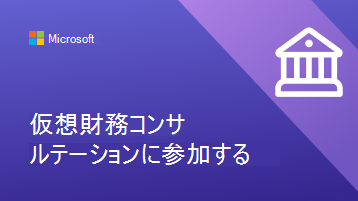
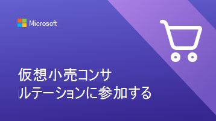
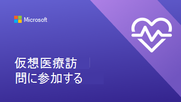

# クライアントと顧客が仮想予定を使用できるように支援する

組織で仮想予定のMicrosoft TeamsとBookings アプリの使用を開始したので、クライアントと顧客がこれらの予定を予約して参加する方法を理解しておく必要があります。

このビデオでは、組織に対して実行できる仮想予定の概要を簡単に確認できます。

> [!VIDEO https://www.microsoft.com/videoplayer/embed/RE4TQop]

## このツールキットに含まれるもの

このツールキットは、お客様とクライアントが仮想予定に正常に参加するのに役立ちます。 提供するリソースをカスタマイズし、仮想予定に関するコミュニケーションにそれらのリソースへのリンクを含めることができます。 このツールキットには、次のものが含まれます。

[Web サイトのガイダンス](#guidance-for-your-website):   カスタマイズして Web サイトでホストできる仮想予定に関する FAQ。 独自のリンクと、ポリシーについて顧客が知る必要がある追加情報を必ず追加してください。

[チームのリソース](#resources-for-your-team):   チームが仮想予定をより快適に実施するのに役立つ記事やビデオ。

[クライアントのリソース](#resources-for-your-clients):  
仮想予定への参加に関するビデオを含む、Microsoft のサポート コンテンツへのリンク。 
組織に合わせてカスタマイズできるインフォグラフィック。

## Web サイトのガイダンス

一般的な質問に答えることで、仮想予定で何を期待するかを顧客に知らせます。 この Q&A を編集して仮想予定ポリシーに合わせて編集し、Web サイトに貼り付ける必要があります。

### 仮想予定の基本

**仮想予定とは**

仮想予定は、Microsoft Teamsを介して行われるオンライン予定です。 スタッフの 1 人と 1 対 1 で話します。これは、実際に訪問する場合と同様です。

**仮想予定は、実際の訪問とどのように異なりますか?**

実際に提供するサービスに違いがあるかどうかを顧客に知らせます。 仮想予定と対人予定の料金の違いについても説明できます。

**仮想予定はどのように行くのですか?**

メール確認のリンクから参加すると、仮想待機室に入ります。 スタッフが通話に参加すると、1 対 1 の訪問が行われる仮想ルームに入ります。

**仮想予定の支払いのしくみ**

仮想予定のさまざまな種類の支払いを受け入れるかどうかを顧客に知らせます。

### 予定を予約する

**操作方法予定を作成しますか?**

組織の予約ページにリンクします。 電話、電子メール、ソーシャル メディアなど、仮想予定を作成する別の方法があるかどうかを顧客に知らせます。

**Who予定を作成できますか?**

スタッフメンバーが排他的に仮想的または対人的に操作している場合は、クライアントが優先プロバイダーとの関係を維持できることを確認します。

**仮想予定をキャンセルまたは再スケジュール操作方法?**

ここで組織の取り消しポリシーと再スケジュール ポリシーにリンクしたり、仮想予定と対人予定のポリシーの違いを説明したりできます。

### 技術

**仮想予定に必要な機器は何ですか?**

お客様は、任意の Web ブラウザーまたはMicrosoft Teams アプリから仮想予定に参加できます。 組織に高品質の Web カメラやマイクなどの追加の仕様がある場合は、ここに一覧表示します。 医療組織が EHR をチームに統合している場合、患者は医療ポータルから訪問に参加できます。

**仮想予定に参加操作方法?**

ここで顧客をリンクして、Bookingsの予定を出席者 (microsoft.com) として参加させ、予定に参加する方法の詳細なビデオとステップ バイ ステップ プロセスを表示できます。

## チームのリソース

スタッフメンバーが実行方法を知っていることを確認して、仮想予定を最大限に活用します。 これらの記事やビデオをチーム メンバーと共有して、仮想予定の理解を深めることができます。

- [TeamsでBookings アプリを使用する方法について説明します](https://support.microsoft.com/office/what-is-bookings-42d4e852-8e99-4d8f-9b70-d7fc93973cb5)
- [Bookings予定に参加する方法について説明します](https://support.microsoft.com/office/join-a-bookings-appointment-attendees-3deb7bde-3ea3-4b41-8a06-741ad0db9fc0)
- [仮想訪問を実施する](/microsoftteams/expand-teams-across-your-org/bookings-virtual-visits#conduct-a-visit)
- [仮想予定に関するビデオを見る](#help-your-clients-and-customers-use-virtual-appointments)

## クライアントのリソース

この記事にリンクして、仮想予定に参加する方法をクライアントに示すことができます。  
[仮想予定に参加する方法について説明します](https://support.microsoft.com/office/join-a-bookings-appointment-as-an-attendee-95cea12d-2220-421f-a663-6efb20913c7f)

Web サイトで機能するように、これらのインフォグラフィックのいずれかをダウンロードして [カスタマイズ](#customize-your-infographic) します。 これにより、クライアントは、組織での仮想予定の動作を理解するための、すばやく視覚的に魅力的な方法を提供します。

| グラフィック                | 説明とリンク              |
| :------------------- | -------------------: |
|  | 金融サービス組織向けのカスタマイズ可能なインフォグラフィック   [PDF としてダウンロードする](https://go.microsoft.com/fwlink/?linkid=2196520&clcid=0x409)   [PowerPointとしてダウンロードする](https://go.microsoft.com/fwlink/?linkid=2196449&clcid=0x409)
|  | 小売組織向けのカスタマイズ可能なインフォグラフィック   [PDF としてダウンロードする](https://go.microsoft.com/fwlink/?linkid=2196452&clcid=0x409)   [PowerPointとしてダウンロードする](https://go.microsoft.com/fwlink/?linkid=2196451&clcid=0x409) |
|  | 医療組織向けのカスタマイズ可能なインフォグラフィック   [PDF としてダウンロードする](https://go.microsoft.com/fwlink/?linkid=2196357&clcid=0x409)   [PowerPointとしてダウンロードする](https://go.microsoft.com/fwlink/?linkid=2196450&clcid=0x409) |
|  | 特定の業界に固有ではないカスタマイズ可能なインフォグラフィック   [PDF としてダウンロードする](https://go.microsoft.com/fwlink/?linkid=2196355&clcid=0x409)   [PowerPointとしてダウンロードする](https://go.microsoft.com/fwlink/?linkid=2196356&clcid=0x409) |

### インフォグラフィックをカスタマイズする

1. 組織のニーズに応じて、事前に作成された 3 つのインフォグラフィックのいずれかを選択します。
    1. 医療
    2. 金融サービス
    3. 小売

2. PowerPointでインフォグラフィックをカスタマイズします。
    1. 組織の色と優先フォントを使用します。
    2. 組織のロゴまたはブランドイメージを追加します。
    3. 予約ページ、課金情報、ホームページなどの Web サイト上のページへのリンク。
    4. 仮想予定に参加する前に、顧客が知る必要がある追加情報を追加します。

3. カスタマイズしたインフォグラフィックを PDF としてエクスポートします。
