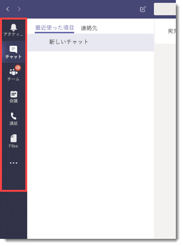
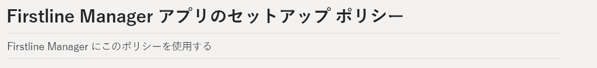
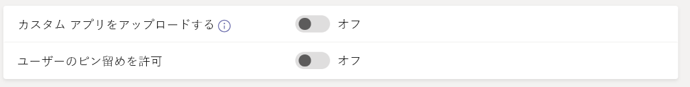
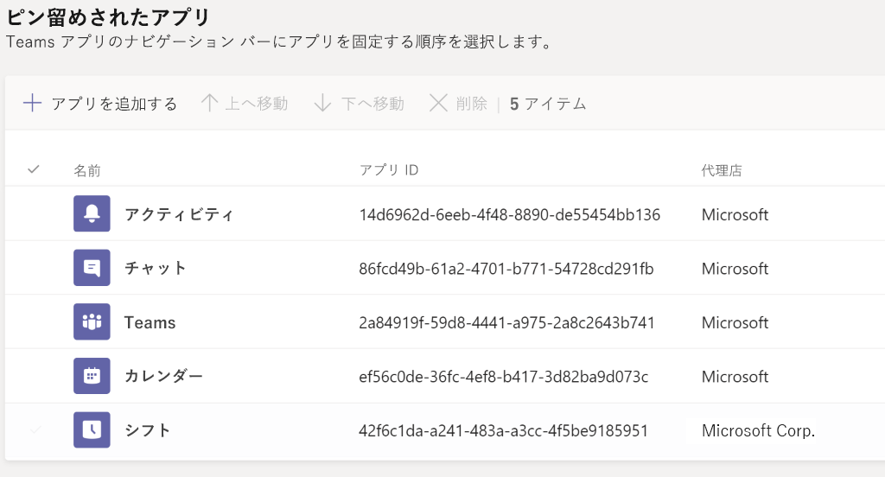
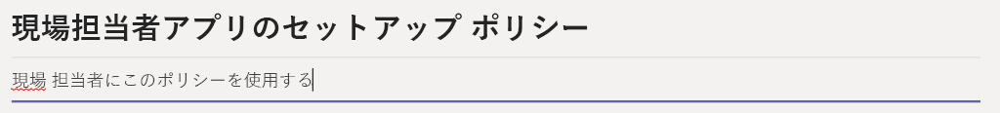
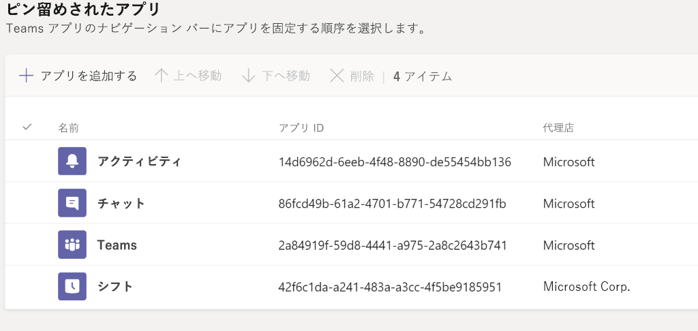
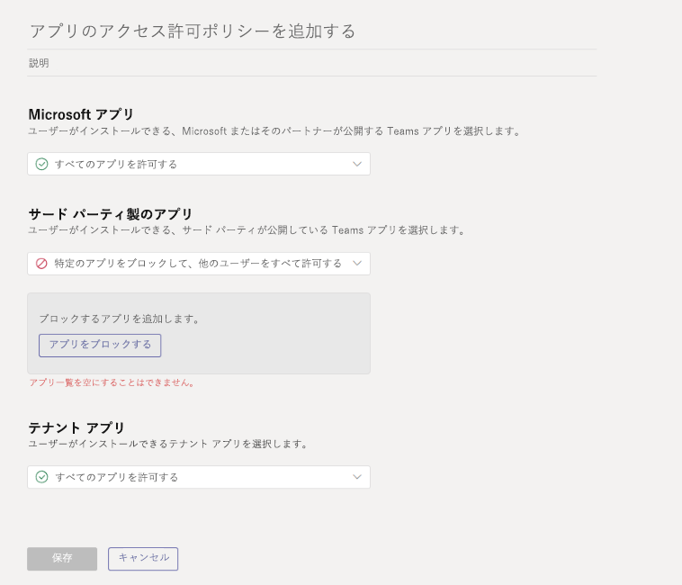

# <a name="how-to-provision-teams-at-scale-for-firstline-workers"></a><span data-ttu-id="75d8a-103">現場担当者向けにTeams 大規模にプロビジョニングする方法</span><span class="sxs-lookup"><span data-stu-id="75d8a-103">How to provision Teams at scale for Firstline Workers</span></span>

<span data-ttu-id="75d8a-104">Microsoft Teams に多数のユーザーをすばやく登録し、作業を効率化する必要がありますか?</span><span class="sxs-lookup"><span data-stu-id="75d8a-104">Do you need to rapidly onboard a large number of users to Microsoft Teams and configure a streamlined experience for them?</span></span> <span data-ttu-id="75d8a-105">次の手順を実行して、ID のプロビジョニング、Teams のプロビジョニング、関連するすべてのポリシーの割り当てをすばやく行い、エンド ユーザー エクスペリエンスを制御できます。</span><span class="sxs-lookup"><span data-stu-id="75d8a-105">You can quickly provision identities, provision teams, and assign all relevant policies to control the end user experience by walking through the following instructions.</span></span>

<span data-ttu-id="75d8a-106">このチュートリアルでは、以下の操作を実行する方法を説明します。</span><span class="sxs-lookup"><span data-stu-id="75d8a-106">In this walkthrough, you'll learn how to:</span></span>

- <span data-ttu-id="75d8a-107">多数のユーザーを作成します。</span><span class="sxs-lookup"><span data-stu-id="75d8a-107">Create a large number of users.</span></span>
- <span data-ttu-id="75d8a-108">多数のチームを作成し、適切なチャネルを設定します。</span><span class="sxs-lookup"><span data-stu-id="75d8a-108">Create a large number of teams and set up the appropriate channels.</span></span>
- <span data-ttu-id="75d8a-109">規模に応じてライセンスを割り当てます。</span><span class="sxs-lookup"><span data-stu-id="75d8a-109">Assign licensing at scale.</span></span>
- <span data-ttu-id="75d8a-110">適切な Teams メッセージング ポリシー、アプリ セットアップ ポリシー、アプリ アクセス許可ポリシーを作成します。</span><span class="sxs-lookup"><span data-stu-id="75d8a-110">Create appropriate Teams Messaging Policies, App Setup Policies, and App Permission Policies.</span></span>
- <span data-ttu-id="75d8a-111">ユーザーにこれらのポリシーを規模に応じて適用します。</span><span class="sxs-lookup"><span data-stu-id="75d8a-111">Apply those policies to users at scale.</span></span>
- <span data-ttu-id="75d8a-112">指定されたチームに多数のユーザーを割り当てます。</span><span class="sxs-lookup"><span data-stu-id="75d8a-112">Assign a large number of users into a designated team.</span></span>

> [!NOTE]
> <span data-ttu-id="75d8a-113">この情報を確認して、支援が必要であったり、質問があったりする場合は、[**こちらをクリック**](https://forms.office.com/Pages/ResponsePage.aspx?id=v4j5cvGGr0GRqy180BHbRyMDv-1voW9MqL7zkQ11DzBUREZaU1E0WEk5T0NYS0NDSkFMSDROUUdYMC4u)して、ホワイト グローブ サポートにアクセスしてください。</span><span class="sxs-lookup"><span data-stu-id="75d8a-113">If you've reviewed this information and feel like you need some help or have some questions, you can [**click here**](https://forms.office.com/Pages/ResponsePage.aspx?id=v4j5cvGGr0GRqy180BHbRyMDv-1voW9MqL7zkQ11DzBUREZaU1E0WEk5T0NYS0NDSkFMSDROUUdYMC4u) to reach out for White Glove Support.</span></span>

## <a name="prerequisites"></a><span data-ttu-id="75d8a-114">前提条件</span><span class="sxs-lookup"><span data-stu-id="75d8a-114">Prerequisites</span></span>

<span data-ttu-id="75d8a-115">[この場所](https://aka.ms/flwteamsscale)から資産をダウンロードします。</span><span class="sxs-lookup"><span data-stu-id="75d8a-115">Download the assets from [this location](https://aka.ms/flwteamsscale).</span></span>

> [!IMPORTANT]
> <span data-ttu-id="75d8a-116">上記のリンクに掲載されているスクリプトは、Microsoft が現状のまま提供しているもので、個別のニーズに合わせて変更する必要があります。</span><span class="sxs-lookup"><span data-stu-id="75d8a-116">The scripts in the link provided above are provided as-is by Microsoft, and must be modified for your individual needs.</span></span>

## <a name="technical-requirements"></a><span data-ttu-id="75d8a-117">技術的要件</span><span class="sxs-lookup"><span data-stu-id="75d8a-117">Technical requirements</span></span>

- <span data-ttu-id="75d8a-118">テナントには、Microsoft Teams を含む適切な数の使用可能なライセンスが必要です。</span><span class="sxs-lookup"><span data-stu-id="75d8a-118">Your tenant must have the appropriate number of licenses available that include Microsoft Teams.</span></span> <span data-ttu-id="75d8a-119">これらのライセンスをまだお持ちでない場合は、無料試用版のサブスクリプションについて、[Teams Exploratory](teams-exploratory.md) をご確認ください。</span><span class="sxs-lookup"><span data-stu-id="75d8a-119">If you do not already have these licenses, check out [Teams Exploratory](teams-exploratory.md) for a free trial subscription.</span></span>
- <span data-ttu-id="75d8a-120">これらの手順を実行するユーザーには、Azure AD で、グローバル管理者、ユーザー管理者、Teams サービス管理者の役割が割り当てられている必要があります。</span><span class="sxs-lookup"><span data-stu-id="75d8a-120">The user taking these steps must have these roles assigned: Global Admin, User Admin, and Teams Service Admin, in Azure AD.</span></span>
- <span data-ttu-id="75d8a-121">ユーザーには、ローカル コンピューターにソフトウェアをインストールして構成する権限が必要です。</span><span class="sxs-lookup"><span data-stu-id="75d8a-121">User must have the rights to install and configure software on their local machine.</span></span>

## <a name="step-by-step-process-overview"></a><span data-ttu-id="75d8a-122">手順を追ったプロセスの概要</span><span class="sxs-lookup"><span data-stu-id="75d8a-122">Step-by-step process overview</span></span>

1. <span data-ttu-id="75d8a-123">**環境を設定する**</span><span class="sxs-lookup"><span data-stu-id="75d8a-123">**Set up Your Environment**</span></span>
    1. <span data-ttu-id="75d8a-124">サンプルの PowerShell スクリプトとドキュメントが含まれている GitHub レポジトリからダウンロードする</span><span class="sxs-lookup"><span data-stu-id="75d8a-124">Download from the GitHub repository containing the sample PowerShell scripts and documentation</span></span>
    1. <span data-ttu-id="75d8a-125">ローカル環境を構成する</span><span class="sxs-lookup"><span data-stu-id="75d8a-125">Configure the local environment</span></span>
    1. <span data-ttu-id="75d8a-126">資格情報を設定する</span><span class="sxs-lookup"><span data-stu-id="75d8a-126">Setup credentials</span></span>
    1. <span data-ttu-id="75d8a-127">PowerShell モジュールと環境変数を構成する</span><span class="sxs-lookup"><span data-stu-id="75d8a-127">Configure PowerShell Modules and environmental variables</span></span>
1. <span data-ttu-id="75d8a-128">**チームを作成して設定する**</span><span class="sxs-lookup"><span data-stu-id="75d8a-128">**Create and Setup Teams**</span></span>
    1. <span data-ttu-id="75d8a-129">チームを作成する</span><span class="sxs-lookup"><span data-stu-id="75d8a-129">Create teams</span></span>
    1. <span data-ttu-id="75d8a-130">チームを作成する手順</span><span class="sxs-lookup"><span data-stu-id="75d8a-130">Steps to create teams</span></span>
    1. <span data-ttu-id="75d8a-131">チームのチャネルを作成する</span><span class="sxs-lookup"><span data-stu-id="75d8a-131">Create channels for teams</span></span>
1. <span data-ttu-id="75d8a-132">**チームのポリシーを作成する**</span><span class="sxs-lookup"><span data-stu-id="75d8a-132">**Create Teams Policies**</span></span>
    1. <span data-ttu-id="75d8a-133">チームのメッセージング ポリシーを作成する</span><span class="sxs-lookup"><span data-stu-id="75d8a-133">Create Teams message policies</span></span>
    1. <span data-ttu-id="75d8a-134">Teams アプリのセットアップ ポリシーを作成する</span><span class="sxs-lookup"><span data-stu-id="75d8a-134">Create Teams app setup policies</span></span>
    1. <span data-ttu-id="75d8a-135">Teams アプリのアクセス許可ポリシーを作成する</span><span class="sxs-lookup"><span data-stu-id="75d8a-135">Create Teams app permission policies</span></span>
1. <span data-ttu-id="75d8a-136">**ユーザーとセキュリティ グループ**</span><span class="sxs-lookup"><span data-stu-id="75d8a-136">**Users and Security Groups**</span></span>
    1. <span data-ttu-id="75d8a-137">ユーザーとセキュリティ グループを作成する</span><span class="sxs-lookup"><span data-stu-id="75d8a-137">Create users and security groups</span></span>
    1. <span data-ttu-id="75d8a-138">グループベースのライセンスを通じてユーザーにライセンスを割り当てる</span><span class="sxs-lookup"><span data-stu-id="75d8a-138">Assign licensing to users via group-based licensing</span></span>
1. <span data-ttu-id="75d8a-139">**ユーザーとポリシーを割り当てる**</span><span class="sxs-lookup"><span data-stu-id="75d8a-139">**Assign Users and Policies**</span></span>
    1. <span data-ttu-id="75d8a-140">チームにユーザーを割り当てる</span><span class="sxs-lookup"><span data-stu-id="75d8a-140">Assign users to Teams</span></span>
    1. <span data-ttu-id="75d8a-141">ユーザーにチーム ポリシーを割り当てる</span><span class="sxs-lookup"><span data-stu-id="75d8a-141">Assign Teams policies to users</span></span>
    1. <span data-ttu-id="75d8a-142">オプション: グループ メンバーシップの種類の変換</span><span class="sxs-lookup"><span data-stu-id="75d8a-142">OPTIONAL: Convert group membership type</span></span>
1. <span data-ttu-id="75d8a-143">**テストと検証**</span><span class="sxs-lookup"><span data-stu-id="75d8a-143">**Test and Validate**</span></span>
    1. <span data-ttu-id="75d8a-144">テスト ユーザーで Teams にログインする</span><span class="sxs-lookup"><span data-stu-id="75d8a-144">Login to Teams with a test user</span></span>
    1. <span data-ttu-id="75d8a-145">エラーをチェックする</span><span class="sxs-lookup"><span data-stu-id="75d8a-145">Check for errors</span></span>
    1. <span data-ttu-id="75d8a-146">エラー処理</span><span class="sxs-lookup"><span data-stu-id="75d8a-146">Error handling</span></span>
1. <span data-ttu-id="75d8a-147">**参照情報**</span><span class="sxs-lookup"><span data-stu-id="75d8a-147">**Further reading**</span></span>

## <a name="set-up-your-environment"></a><span data-ttu-id="75d8a-148">環境を設定する</span><span class="sxs-lookup"><span data-stu-id="75d8a-148">Set up your environment</span></span>

<span data-ttu-id="75d8a-149">次の手順で、環境を設定できます。</span><span class="sxs-lookup"><span data-stu-id="75d8a-149">The following steps will allow you to set up your environment:</span></span>

### <a name="download-from-the-github-repository-containing-sample-powershell-scripts-and-documentation"></a><span data-ttu-id="75d8a-150">サンプルの PowerShell スクリプトとドキュメントが含まれている GitHub レポジトリからダウンロードする</span><span class="sxs-lookup"><span data-stu-id="75d8a-150">Download from the GitHub repository containing sample PowerShell scripts and documentation</span></span>

<span data-ttu-id="75d8a-151">続行する前に、[この場所](https://aka.ms/flwteamsscale)からスクリプトをダウンロードする必要があります。</span><span class="sxs-lookup"><span data-stu-id="75d8a-151">Before you can proceed, you'll need to download the scripts at [this location](https://aka.ms/flwteamsscale).</span></span>

### <a name="configure-the-local-environment"></a><span data-ttu-id="75d8a-152">ローカル環境を構成する</span><span class="sxs-lookup"><span data-stu-id="75d8a-152">Configure the local environment</span></span>

<span data-ttu-id="75d8a-153">ローカル環境変数を設定すると、ここで参照するスクリプトを相対パスを使用して実行できます。</span><span class="sxs-lookup"><span data-stu-id="75d8a-153">Setting the local environment variables allows the scripts referenced here to be run using relative paths.</span></span> <span data-ttu-id="75d8a-154">rootPath は、このリポジトリのクローンを作成した場所のルートであり、tenantName は**yourTenant.onmicrosoft.com** の形式です (https は含めません)。</span><span class="sxs-lookup"><span data-stu-id="75d8a-154">The rootPath is the root of where you cloned this repository, and the tenantName is in the form **yourTenant.onmicrosoft.com** (https should not be included).</span></span>

1. <span data-ttu-id="75d8a-155">PowerShell セッションを開き、複製された git リポジトリ内の [scripts] フォルダーに移動します。</span><span class="sxs-lookup"><span data-stu-id="75d8a-155">Open a PowerShell session and navigate to the scripts folder inside the cloned git repo.</span></span>
1. <span data-ttu-id="75d8a-156">次のスクリプトを実行します。.\SetConfig.ps1 -tenantName [your tenant name] -rootPath "full path to the root of the git repo"。</span><span class="sxs-lookup"><span data-stu-id="75d8a-156">Run the script .\SetConfig.ps1 -tenantName [your tenant name] -rootPath "full path to the root of the git repo".</span></span>

<span data-ttu-id="75d8a-157">例: .\SetConfig.ps1 -tenantName contoso.onmicrosoft.com -rootPath "C:\data\source\FLWTeamsScale"</span><span class="sxs-lookup"><span data-stu-id="75d8a-157">For example: .\SetConfig.ps1 -tenantName contoso.onmicrosoft.com -rootPath "C:\data\source\FLWTeamsScale"</span></span>

### <a name="setup-credentials"></a><span data-ttu-id="75d8a-158">資格情報を設定する</span><span class="sxs-lookup"><span data-stu-id="75d8a-158">Setup credentials</span></span>

> [!IMPORTANT]
> <span data-ttu-id="75d8a-159">これらのスクリプトでの資格情報の管理方法は、使用環境に適していない場合があります。要件を満たすために簡単に変更することができます。</span><span class="sxs-lookup"><span data-stu-id="75d8a-159">How credentials are managed in these scripts may not be appropriate for your use, and they're easily changed to meet your requirements.</span></span> <span data-ttu-id="75d8a-160">会社の基準と慣行に常に準拠して、サービス アカウントと管理されている ID をセキュリティで保護します。</span><span class="sxs-lookup"><span data-stu-id="75d8a-160">Always follow your company's standards and practices for securing service accounts and managed identities.</span></span>

<span data-ttu-id="75d8a-161">このスクリプトは、$ENV:LOCALAPPDATA\keys (AppData\Local フォルダー) 内に xml ファイルとして格納されている資格情報を使用します。</span><span class="sxs-lookup"><span data-stu-id="75d8a-161">The scripts use credentials that are stored as XML files in $ENV:LOCALAPPDATA\keys, that is, the AppData\Local folder.</span></span> <span data-ttu-id="75d8a-162">**BulkAddFunctions.psm1** モジュールのヘルパー関数 **Set-Creds** を呼び出して、これらのスクリプトの実行に使用する資格情報を設定する必要があります。</span><span class="sxs-lookup"><span data-stu-id="75d8a-162">The helper function **Set-Creds** in the module **BulkAddFunctions.psm1** needs to be called to set the credentials used to run these scripts.</span></span> <span data-ttu-id="75d8a-163">この手法により、ローカル ストアで資格情報を維持しながら、さまざまなサービス エンドポイントすべてに対して認証を行う必要がなくなります。</span><span class="sxs-lookup"><span data-stu-id="75d8a-163">This technique removes the need for you to authenticate to all various service endpoints while maintaining the credentials in a local store.</span></span> <span data-ttu-id="75d8a-164">各スクリプト内から、適切な資格情報が **Get-Creds** ヘルパー関数で読み取られ、それらの認証情報はさまざまなサービスへの接続に使用されます。</span><span class="sxs-lookup"><span data-stu-id="75d8a-164">From within each script, the appropriate credentials are read with the helper function **Get-Creds** and those credentials are used to connect to the various services.</span></span>

<span data-ttu-id="75d8a-165">**Set-Creds** を呼び出すと、$ENV:LOCALAPPDATAkeys に書き込まれる XML ファイル名を指定するよう求めるメッセージが表示されます。</span><span class="sxs-lookup"><span data-stu-id="75d8a-165">When you call **Set-Creds**, you're prompted to provide an XML file name that will be written to $ENV:LOCALAPPDATA\keys.</span></span> <span data-ttu-id="75d8a-166">サービスごとに資格情報が異なる場合があります。</span><span class="sxs-lookup"><span data-stu-id="75d8a-166">You might have different credentials for different services.</span></span> <span data-ttu-id="75d8a-167">たとえば、Microsoft Teams、AzureAD、MSonline に異なる資格情報がある場合、**Set-Creds** を複数回実行して、各資格情報ファイルを独自の意味のある名前を付けて保存できます。</span><span class="sxs-lookup"><span data-stu-id="75d8a-167">For example, you might have different credentials for MicrosoftTeams, AzureAD, and MSonline, in which case you can run **Set-Creds** more than once, saving each credential file with its own meaningful name.</span></span>

<span data-ttu-id="75d8a-168">例: Set-Creds msol-cred.xml Set-Creds azuread-cred.xml Set-Creds teams-cred.xml</span><span class="sxs-lookup"><span data-stu-id="75d8a-168">Examples: Set-Creds msol-cred.xml Set-Creds azuread-cred.xml Set-Creds teams-cred.xml</span></span>

<span data-ttu-id="75d8a-169">スクリプト **SetCreds.ps1** を実行して、資格情報を保存します。</span><span class="sxs-lookup"><span data-stu-id="75d8a-169">Run the script **SetCreds.ps1** to save your credentials.</span></span> <span data-ttu-id="75d8a-170">"操作 "Export-Clixml" の実行中です..." というメッセージが表示されます。承認するには 'Y' を入力します。</span><span class="sxs-lookup"><span data-stu-id="75d8a-170">You will be prompted with "Performing the operation "Export-Clixml"..." and enter 'Y' to approve.</span></span>

> [!NOTE]
> <span data-ttu-id="75d8a-171">資格情報に使用されるアカウントでは、多要素認証 (MFA) を要求することはできません。</span><span class="sxs-lookup"><span data-stu-id="75d8a-171">The account used for the credentials cannot require Multi-Factor Auth (MFA).</span></span>

<span data-ttu-id="75d8a-172">次に、さまざまなスクリプトが保存された資格情報を使用して認証する方法の例を示します。</span><span class="sxs-lookup"><span data-stu-id="75d8a-172">Here's an example of how the various scripts use the saved credentials to authenticate:</span></span>

```azurepowershell
# Connect to MicrosoftTeams
$teams_cred = Get-Creds teams-cred.xml
Connect-MicrosoftTeams -Credential $teams_cred
```

### <a name="configure-powershell-modules-and-environmental-variables"></a><span data-ttu-id="75d8a-173">PowerShell のモジュールと環境変数を構成する</span><span class="sxs-lookup"><span data-stu-id="75d8a-173">Configure PowerShell modules and environmental variables</span></span>

<span data-ttu-id="75d8a-174">Azure AD、MSAL、MSCloudUtils、MicrosoftTeams などのいくつかの PowerShell モジュールをインストールして接続する必要があります。</span><span class="sxs-lookup"><span data-stu-id="75d8a-174">You'll need to install and connect to several PowerShell modules, including Azure AD, MSAL, MSCloudUtils, and MicrosoftTeams.</span></span>

1. <span data-ttu-id="75d8a-175">リポジトリの [scripts] フォルダーで **ConfigurePowerShellModules.ps1** を見つけます。</span><span class="sxs-lookup"><span data-stu-id="75d8a-175">Find the **ConfigurePowerShellModules.ps1** in the scripts folder in the repository.</span></span>
1. <span data-ttu-id="75d8a-176">PowerShell から、**ConfigurePowerShellModules.ps1** スクリプトを実行します。</span><span class="sxs-lookup"><span data-stu-id="75d8a-176">From PowerShell, run the **ConfigurePowerShellModules.ps1** script.</span></span>

## <a name="create-and-set-up-teams"></a><span data-ttu-id="75d8a-177">チームを作成して設定する</span><span class="sxs-lookup"><span data-stu-id="75d8a-177">Create and set up Teams</span></span>

<span data-ttu-id="75d8a-178">Firstline Worker と通信して共同作業を行うには、最初に一連のチームを確立し、これらのチームに標準チャネルを追加する必要があります。これについては、次に説明します。</span><span class="sxs-lookup"><span data-stu-id="75d8a-178">In order to communicate and collaborate with your Firstline Workers, you will first need to establish a series of Teams and add standard Channels to those teams, which we'll walk through next.</span></span>

### <a name="create-teams"></a><span data-ttu-id="75d8a-179">チームを作成する</span><span class="sxs-lookup"><span data-stu-id="75d8a-179">Create teams</span></span>

<span data-ttu-id="75d8a-180">チームは、組織内のユーザー、コンテンツ、ツールの集合です。</span><span class="sxs-lookup"><span data-stu-id="75d8a-180">Teams are a collection of people, content, and tools within your organization.</span></span> <span data-ttu-id="75d8a-181">ほとんどの Firstline Worker 中心の組織では、チームを実際の場所に固定するのがベスト プラクティスです。</span><span class="sxs-lookup"><span data-stu-id="75d8a-181">For most Firstline Worker-centric organizations, it is best practice to anchor a Team around a physical location.</span></span> <span data-ttu-id="75d8a-182">たとえば、次の各チームがあります。</span><span class="sxs-lookup"><span data-stu-id="75d8a-182">For example, a Team for each of the following:</span></span>

- <span data-ttu-id="75d8a-183">ストア</span><span class="sxs-lookup"><span data-stu-id="75d8a-183">Store</span></span>
- <span data-ttu-id="75d8a-184">配布センター</span><span class="sxs-lookup"><span data-stu-id="75d8a-184">Distribution Center</span></span>
- <span data-ttu-id="75d8a-185">製造工場</span><span class="sxs-lookup"><span data-stu-id="75d8a-185">Manufacturing Plant</span></span>
- <span data-ttu-id="75d8a-186">病院</span><span class="sxs-lookup"><span data-stu-id="75d8a-186">Hospital</span></span>
- <span data-ttu-id="75d8a-187">食品店</span><span class="sxs-lookup"><span data-stu-id="75d8a-187">Grocery Store</span></span>

<span data-ttu-id="75d8a-188">*ベスト プラクティス ディスカッション*: チームを設計するときは、[Teams の制限と仕様](limits-specifications-teams.md)に留意することが重要です。</span><span class="sxs-lookup"><span data-stu-id="75d8a-188">*Best Practice Discussion*: When designing your teams, it's important to keep in mind [Teams limits and specifications](limits-specifications-teams.md).</span></span> <span data-ttu-id="75d8a-189">小規模な組織では、組織全体のチームを使用してコミュニケーションを合理化し、物理的な場所の構造を補完できます。</span><span class="sxs-lookup"><span data-stu-id="75d8a-189">For smaller organizations, an org-wide team can be used to streamline communication and complement a physical location structure.</span></span> <span data-ttu-id="75d8a-190">構造化された物理的な場所のチームの命名規則により、他のユーザーは、複数チームに対して同時にクロス投稿を使って、社内コミュニケーションを容易に行うことができます。</span><span class="sxs-lookup"><span data-stu-id="75d8a-190">For others, a structured physical location Team naming convention helps assist Corporate Communications with Cross Posting to multiple teams simultaneously with ease.</span></span> <span data-ttu-id="75d8a-191">たとえば、名前に US が含まれるすべてのチームを検索してクロス投稿し、米国のすべての場所を対象にすることができます。</span><span class="sxs-lookup"><span data-stu-id="75d8a-191">For example, you can search and cross-post to all Teams with US in the name to target all US locations.</span></span> <span data-ttu-id="75d8a-192">クロス投稿の詳細については、[こちら](https://support.office.com/article/cross-post-a-channel-conversation-in-teams-9c1252a3-67ef-498e-a7c1-dd7147b3d295)をご覧ください。</span><span class="sxs-lookup"><span data-stu-id="75d8a-192">More information on cross-posting can be found [here](https://support.office.com/article/cross-post-a-channel-conversation-in-teams-9c1252a3-67ef-498e-a7c1-dd7147b3d295).</span></span>

#### <a name="steps-to-create-teams"></a><span data-ttu-id="75d8a-193">チームを作成する手順</span><span class="sxs-lookup"><span data-stu-id="75d8a-193">Steps to create teams</span></span>

1. <span data-ttu-id="75d8a-194">リポジトリの [data] フォルダーで、**TeamsInformation.csv** ファイルを見つけます。</span><span class="sxs-lookup"><span data-stu-id="75d8a-194">Find the **TeamsInformation.csv** file in the data folder in the repository.</span></span>
1. <span data-ttu-id="75d8a-195">組織固有の情報を使用して、**TeamsInformation.csv** ファイル内の情報を更新します。</span><span class="sxs-lookup"><span data-stu-id="75d8a-195">Update the information in the **TeamsInformation.csv** file with your organization's specific information.</span></span> <span data-ttu-id="75d8a-196">上記のベスト プラクティスに留意してください。</span><span class="sxs-lookup"><span data-stu-id="75d8a-196">Keep in mind our best practices above.</span></span>
1. <span data-ttu-id="75d8a-197">**CreateTeams. ps1** スクリプトを見つけます。</span><span class="sxs-lookup"><span data-stu-id="75d8a-197">Find the **CreateTeams.ps1** script.</span></span>
1. <span data-ttu-id="75d8a-198">PowerShell から **CreateTeams.ps1** スクリプトを実行します。</span><span class="sxs-lookup"><span data-stu-id="75d8a-198">From PowerShell, run the **CreateTeams.ps1** script.</span></span>

### <a name="create-channels-for-teams"></a><span data-ttu-id="75d8a-199">チームのチャネルを作成する</span><span class="sxs-lookup"><span data-stu-id="75d8a-199">Create channels for teams</span></span>

<span data-ttu-id="75d8a-200">チャネルは、特定のトピック、プロジェクト、分野などごとに会話を整理するチーム内の専用セクションです。</span><span class="sxs-lookup"><span data-stu-id="75d8a-200">Channels are dedicated sections within a team to keep conversations organized by specific topic, project, discipline, and more.</span></span> <span data-ttu-id="75d8a-201">すべてのチームは自動的に全般チャネルを取得しますが、そこからビジネス ニーズに応じて構造をカスタマイズできます。</span><span class="sxs-lookup"><span data-stu-id="75d8a-201">Every Team automatically gets a General channel, but from there you can customize your structure according to the needs of your business.</span></span> <span data-ttu-id="75d8a-202">たとえば、チャネル構造には以下が追加されます。</span><span class="sxs-lookup"><span data-stu-id="75d8a-202">For example, your additional channel structure could include:</span></span>

- <span data-ttu-id="75d8a-203">**製造** - 安全、ライン 1、ライン 2、社内コミュニケーション、トレーニング</span><span class="sxs-lookup"><span data-stu-id="75d8a-203">**Manufacturing** - Safety, Line 1, Line 2, Corporate Communications, Training</span></span>
- <span data-ttu-id="75d8a-204">**食料品** - パン屋、農産物、肉、社内コミュニケーション、トレーニング</span><span class="sxs-lookup"><span data-stu-id="75d8a-204">**Grocery** - Bakery, Produce, Meat, Corporate Communications, Training</span></span>
- <span data-ttu-id="75d8a-205">**医療** - 看護師、医師、重症管理室 1、重症管理室 2</span><span class="sxs-lookup"><span data-stu-id="75d8a-205">**Healthcare** - Nurses, Doctors, Critical Care Unit 1, Critical Care Unit 2</span></span>
- <span data-ttu-id="75d8a-206">**サービス業** - フロント デスク、メンテナンス、ハウスキーピング、ベルボーイ、社内コミュニケーション、トレーニング</span><span class="sxs-lookup"><span data-stu-id="75d8a-206">**Hospitality** - Front Desk, Maintenance, Housekeeping, Valet and Baggage, Corporate Communications, Training</span></span>
- <span data-ttu-id="75d8a-207">**小売店** - 店頭、バックヤード、社内コミュニケーション、トレーニング</span><span class="sxs-lookup"><span data-stu-id="75d8a-207">**Retail** - Front of Store, Back of Store, Corporate Communications, Training</span></span>

> [!NOTE]
> <span data-ttu-id="75d8a-208">チャネルをセキュリティの境界と見なすべきではありません。</span><span class="sxs-lookup"><span data-stu-id="75d8a-208">Channels should not be thought of as a security boundary.</span></span> <span data-ttu-id="75d8a-209">これらは、共同作業を行うために、作業者を整理する手段です。</span><span class="sxs-lookup"><span data-stu-id="75d8a-209">They are a means of organizing your workers for the purposes of collaboration.</span></span>

<span data-ttu-id="75d8a-210">*ベスト プラクティス ディスカッション*: チャネル構造を設計するとき、特に多数のユーザーを登録する必要がある場合は、シンプルなものにすることが重要です。</span><span class="sxs-lookup"><span data-stu-id="75d8a-210">*Best Practice Discussion*: When designing your channel structure, it's important to keep things simple, especially when you're looking to onboard a lot of users.</span></span> <span data-ttu-id="75d8a-211">トレーニングの必要性を最小限に抑えるために、あらゆる状況、役割、またはトピックのチャネルを作成しようとする衝動を抑えてください。</span><span class="sxs-lookup"><span data-stu-id="75d8a-211">Resist the urge to create channels for every situation, role, or topic in order to minimize the need for training.</span></span> <span data-ttu-id="75d8a-212">最大 3 ～ 5 チャネルから開始してください。</span><span class="sxs-lookup"><span data-stu-id="75d8a-212">Pick 3-5 channels at most to get started.</span></span> <span data-ttu-id="75d8a-213">必要に応じて、追加のチャネルを簡単に作成できます。</span><span class="sxs-lookup"><span data-stu-id="75d8a-213">Additional channels can easily be created as the need arises.</span></span> <span data-ttu-id="75d8a-214">実際には、全般チャネルだけを使用しても問題ありません。</span><span class="sxs-lookup"><span data-stu-id="75d8a-214">In fact, it's okay to just use the General channel alone for now!</span></span>

#### <a name="steps-to-create-channels-for-teams"></a><span data-ttu-id="75d8a-215">チームのチャネルを作成する手順</span><span class="sxs-lookup"><span data-stu-id="75d8a-215">Steps to Create Channels for Teams</span></span>

1. <span data-ttu-id="75d8a-216">リポジトリの [scripts] フォルダーで、**TeamsChannels.csv** ファイルを見つけます。</span><span class="sxs-lookup"><span data-stu-id="75d8a-216">Find the **TeamsChannels.csv** file in the scripts folder in the repository.</span></span>
1. <span data-ttu-id="75d8a-217">組織固有の情報を使用して、**Teams Information.csv** ファイルを更新します。</span><span class="sxs-lookup"><span data-stu-id="75d8a-217">Update the **TeamsChannels.csv** file with your organization's specific information.</span></span> <span data-ttu-id="75d8a-218">上記のベスト プラクティスに留意してください。</span><span class="sxs-lookup"><span data-stu-id="75d8a-218">Keep in mind our best practices above.</span></span>
1. <span data-ttu-id="75d8a-219">リポジトリの [scripts] フォルダーで、**CreateTeamsChannels.ps1** スクリプトを見つけます。</span><span class="sxs-lookup"><span data-stu-id="75d8a-219">Find the **CreateTeamsChannels.ps1** script in the scripts folder in the repository.</span></span>
1. <span data-ttu-id="75d8a-220">PowerShell から **CreateTeamsChannels.ps1** スクリプトを実行します。</span><span class="sxs-lookup"><span data-stu-id="75d8a-220">From PowerShell, run the **CreateTeamsChannels.ps1** script.</span></span>

## <a name="create-teams-policies"></a><span data-ttu-id="75d8a-221">チーム ポリシーを作成する</span><span class="sxs-lookup"><span data-stu-id="75d8a-221">Create Teams policies</span></span>

<span data-ttu-id="75d8a-222">管理者は、Microsoft Teams でチーム ポリシーを使用して、組織内のユーザーが閲覧できる内容や実行できる操作を制御できます。</span><span class="sxs-lookup"><span data-stu-id="75d8a-222">As an admin, you can use teams policies in Microsoft Teams to control what users in your organization see and can.</span></span> <span data-ttu-id="75d8a-223">たとえば、多数のユーザーを登録するとき、エンド ユーザー エクスペリエンスを簡素化するために、デスクトップまたは Web ブラウザーの左のレールにピン留めするアプリケーション、またはモバイル デバイスの下部バーにピン留めするアプリケーションを制御できます。</span><span class="sxs-lookup"><span data-stu-id="75d8a-223">For example, you can control which applications are pinned to the left rail on your Desktop or Web browser, or the bottom bar on mobile devices, in order to simplify the end user experience when onboarding a large amount of users.</span></span> <span data-ttu-id="75d8a-224">これらのポリシーには PowerShell で作成できるものと、Teams 管理コンソールで手動で作成する必要があるものがあります。</span><span class="sxs-lookup"><span data-stu-id="75d8a-224">Some of these policies can be created with PowerShell, and others have to be manually created in the Teams Admin Console.</span></span>

<span data-ttu-id="75d8a-225">*ベスト プラクティス ディスカッション*: 次の各ポリシーについて、実際には 2 つのポリシーを作成することを選択しています。1 つは Firstline Workers 用で、もう 1 つは Firstline Manager 用です。</span><span class="sxs-lookup"><span data-stu-id="75d8a-225">*Best Practice Discussion*: For each of the following policies, we're choosing to actually create two policies: one for Firstline Workers and one for Firstline Managers.</span></span> <span data-ttu-id="75d8a-226">必要な数だけ作成できます。</span><span class="sxs-lookup"><span data-stu-id="75d8a-226">You can choose to create as many or as few as you like.</span></span> <span data-ttu-id="75d8a-227">ほとんどのお客様にとって、最初に各グループに同じ設定を適用した場合でも、2 つから開始することをお勧めします。</span><span class="sxs-lookup"><span data-stu-id="75d8a-227">For most customers, two is a good place to start, even if you give the same settings to each group initially.</span></span> <span data-ttu-id="75d8a-228">Teams での経験が増えるにつれて、彼らの経験をさらに差別化することを選択できます。すでに作成されている 2 つの個別のポリシーがあると、それがさらに簡単になります。</span><span class="sxs-lookup"><span data-stu-id="75d8a-228">As your experience with Teams grows, you may choose to differentiate their experience further and having the two separate policies already created can make that simpler.</span></span>

### <a name="create-teams-message-policies"></a><span data-ttu-id="75d8a-229">チームのメッセージング ポリシーを作成する</span><span class="sxs-lookup"><span data-stu-id="75d8a-229">Create Teams message policies</span></span>

<span data-ttu-id="75d8a-230">メッセージング ポリシーを使用して、Microsoft Teams のユーザーが、チャットおよびチャネルのどのメッセージング機能を使用できるかを制御します。</span><span class="sxs-lookup"><span data-stu-id="75d8a-230">Messaging policies are used to control which chat and channel messaging features are available to users in Microsoft Teams.</span></span>

<span data-ttu-id="75d8a-231">*ベスト プラクティス ディスカッション*: 自動的に作成される既定のグローバル ポリシーを使用できますが、Firstline Managers と Firstline Worker にロックダウンされたシンプルで差別化されたエクスペリエンスを提供するために、以下の手順を使用してカスタム ポリシーを作成することを選択しました。</span><span class="sxs-lookup"><span data-stu-id="75d8a-231">*Best Practice Discussion*: While you can use the default Global policy that is created automatically, we have opted to create a custom policy using the steps below to provide a more locked down, simple, and differentiated experience for Firstline Managers and Firstline Workers.</span></span>

#### <a name="steps-to-create-teams-message-policies"></a><span data-ttu-id="75d8a-232">チームのメッセージング ポリシーを作成する手順</span><span class="sxs-lookup"><span data-stu-id="75d8a-232">Steps to Create Teams Message Policies</span></span>

1. <span data-ttu-id="75d8a-233">リポジトリの [scripts] フォルダーで、**TeamsMessagingPolicies.csv** ファイルを見つけます。</span><span class="sxs-lookup"><span data-stu-id="75d8a-233">Find the **TeamsMessagingPolicies.csv** file in the scripts folder in the repository.</span></span>
1. <span data-ttu-id="75d8a-234">組織固有の情報を使用して、**TeamsMessagingPolicies.csv** ファイルを更新します。</span><span class="sxs-lookup"><span data-stu-id="75d8a-234">Update the **TeamsMessagingPolicies.csv** file with your organization's specific information.</span></span> <span data-ttu-id="75d8a-235">さまざまなオプションのいくつかの詳細については、[こちら](https://docs.microsoft.com/microsoftteams/messaging-policies-in-teams#messaging-policy-settings)をご覧ください。</span><span class="sxs-lookup"><span data-stu-id="75d8a-235">Additional information on some of the various options can be found [here](https://docs.microsoft.com/microsoftteams/messaging-policies-in-teams#messaging-policy-settings).</span></span>
1. <span data-ttu-id="75d8a-236">リポジトリの [scripts] フォルダーで、**CreateTeamsMessagePolicies.ps1** スクリプトを見つけます。</span><span class="sxs-lookup"><span data-stu-id="75d8a-236">Find the **CreateTeamsMessagePolicies.ps1** script in the scripts folder in the repository.</span></span>
1. <span data-ttu-id="75d8a-237">PowerShell から **CreateTeamsMessagePolicies.ps1** スクリプトを実行します。</span><span class="sxs-lookup"><span data-stu-id="75d8a-237">From PowerShell, run the **CreateTeamsMessagePolicies.ps1** script.</span></span>

### <a name="create-teams-app-setup-policies"></a><span data-ttu-id="75d8a-238">Teams アプリのセットアップ ポリシーを作成する</span><span class="sxs-lookup"><span data-stu-id="75d8a-238">Create Teams app setup policies</span></span>

<span data-ttu-id="75d8a-239">管理者は、アプリ セットアップポリシーを使用して、次の操作を行うことができます。</span><span class="sxs-lookup"><span data-stu-id="75d8a-239">As an admin, you can use app setup policies to do the following:</span></span>

- <span data-ttu-id="75d8a-240">Teams をカスタマイズして、ユーザーにとって最も重要なアプリを強調表示します。</span><span class="sxs-lookup"><span data-stu-id="75d8a-240">Customize Teams to highlight the apps that are most important for your users.</span></span> <span data-ttu-id="75d8a-241">ピン留めするアプリを選択し、表示する順序を設定します。</span><span class="sxs-lookup"><span data-stu-id="75d8a-241">You choose the apps to pin and set the order in which they appear.</span></span> <span data-ttu-id="75d8a-242">アプリをピン留めすると、サード パーティ製のアプリや組織内の開発者が作成したアプリなど、組織内のユーザーが必要とするアプリを提示できます。</span><span class="sxs-lookup"><span data-stu-id="75d8a-242">Pinning apps lets you showcase apps that users in your organization need, including those built by third parties or by developers in your organization.</span></span>
- <span data-ttu-id="75d8a-243">ユーザーがアプリを Teams にピン留めできるかどうかを制御します。</span><span class="sxs-lookup"><span data-stu-id="75d8a-243">Control whether users can pin apps to Teams.</span></span>

<span data-ttu-id="75d8a-244">アプリは、アプリ バーにピン留めされます。</span><span class="sxs-lookup"><span data-stu-id="75d8a-244">Apps are pinned to the app bar.</span></span> <span data-ttu-id="75d8a-245">このバーは、Teams デスクトップ クライアントの横側および Teams モバイル クライアント (iOS および Android) の下側に表示されます。</span><span class="sxs-lookup"><span data-stu-id="75d8a-245">This is the bar on the side of the Teams desktop client and at the bottom of the Teams mobile clients (iOS and Android).</span></span>

|<span data-ttu-id="75d8a-246">Teams デスクトップ クライアント</span><span class="sxs-lookup"><span data-stu-id="75d8a-246">Teams Desktop Client</span></span>  |         |<span data-ttu-id="75d8a-247">Teams モバイル クライアント</span><span class="sxs-lookup"><span data-stu-id="75d8a-247">Teams Mobile Client</span></span>  |
|---------|---------|---------|
|         |         | |

<span data-ttu-id="75d8a-250">*ベスト プラクティス ディスカッション*: アプリの設定ポリシーは、Microsoft Teams 管理センターで管理します。</span><span class="sxs-lookup"><span data-stu-id="75d8a-250">*Best Practice Discussion*: You manage app setup policies in the Microsoft Teams admin center.</span></span> <span data-ttu-id="75d8a-251">PowerShell を使用して作成することはできません。</span><span class="sxs-lookup"><span data-stu-id="75d8a-251">They aren't able to be created with PowerShell.</span></span> <span data-ttu-id="75d8a-252">グローバル (組織全体の既定) ポリシーを使用することも、カスタム ポリシーを作成してユーザーに割り当てることもできます。</span><span class="sxs-lookup"><span data-stu-id="75d8a-252">You can use the global (Org-wide default) policy or create custom policies and assign them to users.</span></span> <span data-ttu-id="75d8a-253">カスタム ポリシーを作成して割り当てていない場合、組織内のユーザーにはグローバル ポリシーが自動的に割り当てられます。</span><span class="sxs-lookup"><span data-stu-id="75d8a-253">Users in your organization will automatically be assigned to the global policy unless you create and assign a custom policy.</span></span> <span data-ttu-id="75d8a-254">ここでは、Firstline Workers と Firstline Managers に 2 つの新しいポリシーを作成し、多数のユーザーの同時登録を容易にする、よりシンプルで合理的なエクスペリエンスを提供します。</span><span class="sxs-lookup"><span data-stu-id="75d8a-254">For our purposes, we are creating two new policies for Firstline Workers and Firstline Managers, in order to provide them a simpler and more streamlined experience to ease onboarding a large number of users simultaneously.</span></span> <span data-ttu-id="75d8a-255">ビジネスニーズに合わせて、エクスペリエンスをカスタマイズすることができます。</span><span class="sxs-lookup"><span data-stu-id="75d8a-255">You can choose to customize the experience as your business needs.</span></span>

#### <a name="create-the-firstline-manager-app-setup-policy"></a><span data-ttu-id="75d8a-256">Firstline Manager アプリのセットアップポリシーを作成する</span><span class="sxs-lookup"><span data-stu-id="75d8a-256">Create the Firstline Manager app setup policy</span></span>

<span data-ttu-id="75d8a-257">ビジネス ニーズに合わせて、次の設定をカスタマイズすることができます。</span><span class="sxs-lookup"><span data-stu-id="75d8a-257">The following settings can be customized to meet your business needs.</span></span> <span data-ttu-id="75d8a-258">ベスト プラクティスに基づいて、大規模な新規ユーザーの登録を容易にするために、いくつかの推奨オプションを選択しました。</span><span class="sxs-lookup"><span data-stu-id="75d8a-258">We have chosen some recommended options based on best practices and to improve the ease of onboarding new users at scale.</span></span> <span data-ttu-id="75d8a-259">詳細については、[こちら](https://docs.microsoft.com/MicrosoftTeams/teams-app-setup-policies#create-a-custom-app-setup-policy)をクリックしてください。</span><span class="sxs-lookup"><span data-stu-id="75d8a-259">For more information, click [here](https://docs.microsoft.com/MicrosoftTeams/teams-app-setup-policies#create-a-custom-app-setup-policy).</span></span>

1. <span data-ttu-id="75d8a-260">Microsoft Teams 管理センターの左側のナビゲーションで、 **[Teams アプリ]** > **[ポリシーの設定]** の順に移動します。</span><span class="sxs-lookup"><span data-stu-id="75d8a-260">In the left navigation of the Microsoft Teams admin center, go to **Teams apps** > **Setup policies**.</span></span>
2. <span data-ttu-id="75d8a-261"> *\*[追加]** をクリックします。</span><span class="sxs-lookup"><span data-stu-id="75d8a-261">Click **Add**.</span></span>  
3. <span data-ttu-id="75d8a-262">ポリシーの名前と説明を入力します。</span><span class="sxs-lookup"><span data-stu-id="75d8a-262">Enter a name and description for the policy.</span></span> <span data-ttu-id="75d8a-263">例: **Firstline Manager アプリのセットアップポリシー**。</span><span class="sxs-lookup"><span data-stu-id="75d8a-263">As an example: **Firstline Manager App Setup Policy**.</span></span>
<span data-ttu-id="75d8a-264"></span><span class="sxs-lookup"><span data-stu-id="75d8a-264"></span></span>

4. <span data-ttu-id="75d8a-265">**[カスタム アプリのアップロード]** をオフにします。</span><span class="sxs-lookup"><span data-stu-id="75d8a-265">Turn off **Upload custom apps**.</span></span>
5. <span data-ttu-id="75d8a-266">**[ユーザーのピン留めを許可]** をオフにします。</span><span class="sxs-lookup"><span data-stu-id="75d8a-266">Turn off **Allow user pinning**.</span></span>
<span data-ttu-id="75d8a-267"></span><span class="sxs-lookup"><span data-stu-id="75d8a-267"></span></span>

6. <span data-ttu-id="75d8a-268">一覧表示されていない場合は、**Shifts** アプリを追加します。</span><span class="sxs-lookup"><span data-stu-id="75d8a-268">If it's not already listed, add the **Shifts** app.</span></span> <span data-ttu-id="75d8a-269">**Shifts** の詳細については、[ここ](expand-teams-across-your-org/shifts/manage-the-shifts-app-for-your-organization-in-teams.md)をクリックしてください。</span><span class="sxs-lookup"><span data-stu-id="75d8a-269">For more information about **Shifts**, click [here](expand-teams-across-your-org/shifts/manage-the-shifts-app-for-your-organization-in-teams.md).</span></span>
<span data-ttu-id="75d8a-270">![[追加] ボタンの横に Shifts アプリが表示されているピン留めされたアプリ画面を追加します。](media/FLW-Add-Pinned-Apps.png)</span><span class="sxs-lookup"><span data-stu-id="75d8a-270"></span></span>

7. <span data-ttu-id="75d8a-271">通話が表示されている場合は削除します。</span><span class="sxs-lookup"><span data-stu-id="75d8a-271">Remove Calling, if it appears.</span></span> <span data-ttu-id="75d8a-272">注: この機能を削除しても、ユーザーに対して無効になることはありませんが、アプリ バーに表示されないので、エンド ユーザー エクスペリエンスが簡素化されます。</span><span class="sxs-lookup"><span data-stu-id="75d8a-272">Note: removing this feature will not disable it for the user, but will prevent it from appearing on the app bar to simplify the end user experience.</span></span>
8. <span data-ttu-id="75d8a-273">アプリを次の順序で配置して、Teams アプリ バーでの順序を指定し、 **[保存]** をクリックします。</span><span class="sxs-lookup"><span data-stu-id="75d8a-273">Arrange the apps in the following order to dictate their order in the Teams App Bar, and then click **Save**.</span></span>
    1. <span data-ttu-id="75d8a-274">アクティビティ</span><span class="sxs-lookup"><span data-stu-id="75d8a-274">Activity</span></span>
    1. <span data-ttu-id="75d8a-275">チャット</span><span class="sxs-lookup"><span data-stu-id="75d8a-275">Chat</span></span>
    1. <span data-ttu-id="75d8a-276">Teams</span><span class="sxs-lookup"><span data-stu-id="75d8a-276">Teams</span></span>
    1. <span data-ttu-id="75d8a-277">カレンダー</span><span class="sxs-lookup"><span data-stu-id="75d8a-277">Calendar</span></span>
    1. <span data-ttu-id="75d8a-278">シフトします。</span><span class="sxs-lookup"><span data-stu-id="75d8a-278">Shifts </span></span>

#### <a name="create-the-firstline-worker-app-setup-policy"></a><span data-ttu-id="75d8a-279">Firstline Worker アプリのセットアップ ポリシーを作成する</span><span class="sxs-lookup"><span data-stu-id="75d8a-279">Create the Firstline Worker app setup policy</span></span>

<span data-ttu-id="75d8a-280">ビジネス ニーズに合わせて、次の設定をカスタマイズすることができます。</span><span class="sxs-lookup"><span data-stu-id="75d8a-280">The following settings can be customized to meet your business needs.</span></span> <span data-ttu-id="75d8a-281">ベスト プラクティスに基づいて、大規模な新規ユーザーの登録を容易にするために、いくつかの推奨オプションを選択しました。</span><span class="sxs-lookup"><span data-stu-id="75d8a-281">We have chosen some recommended options based on best practices and to improve the ease of onboarding new users at scale.</span></span> <span data-ttu-id="75d8a-282">詳細については、[こちら](https://docs.microsoft.com/MicrosoftTeams/teams-app-setup-policies#create-a-custom-app-setup-policy)をクリックしてください。</span><span class="sxs-lookup"><span data-stu-id="75d8a-282">For more information, click [here](https://docs.microsoft.com/MicrosoftTeams/teams-app-setup-policies#create-a-custom-app-setup-policy).</span></span>

1. <span data-ttu-id="75d8a-283">Microsoft Teams 管理センターの左側のナビゲーションで、 **[Teams アプリ]** > **[ポリシーの設定]** の順に移動します。</span><span class="sxs-lookup"><span data-stu-id="75d8a-283">In the left navigation of the Microsoft Teams admin center, go to **Teams apps** > **Setup policies**.</span></span>
2. <span data-ttu-id="75d8a-284"> *\*[追加]** をクリックします。</span><span class="sxs-lookup"><span data-stu-id="75d8a-284">Click **Add**.</span></span>
3. <span data-ttu-id="75d8a-285">ポリシーの名前と説明を入力します。</span><span class="sxs-lookup"><span data-stu-id="75d8a-285">Enter a name and description for the policy.</span></span> <span data-ttu-id="75d8a-286">例: **Firstline Worker アプリのセットアップポリシー**。</span><span class="sxs-lookup"><span data-stu-id="75d8a-286">As an example: **Firstline Worker App Setup Policy**.</span></span>
<span data-ttu-id="75d8a-287"></span><span class="sxs-lookup"><span data-stu-id="75d8a-287"></span></span>

4. <span data-ttu-id="75d8a-288">**[カスタム アプリのアップロード]** をオフにします。</span><span class="sxs-lookup"><span data-stu-id="75d8a-288">Turn off **Upload custom apps**.</span></span>
5. <span data-ttu-id="75d8a-289">**[ユーザーのピン留めを許可]** をオフにします。</span><span class="sxs-lookup"><span data-stu-id="75d8a-289">Turn off **Allow user pinning**.</span></span>
<span data-ttu-id="75d8a-290"></span><span class="sxs-lookup"><span data-stu-id="75d8a-290"></span></span>

6. <span data-ttu-id="75d8a-291">一覧表示されていない場合は、**Shifts** アプリを追加します。</span><span class="sxs-lookup"><span data-stu-id="75d8a-291">If it's not already listed, add the **Shifts** app.</span></span> <span data-ttu-id="75d8a-292">**Shifts** の詳細については、ここをクリックしてください。</span><span class="sxs-lookup"><span data-stu-id="75d8a-292">For more information about **Shifts**, click here.</span></span>
<span data-ttu-id="75d8a-293">![[追加] ボタンの横に Shifts アプリが表示されているピン留めされたアプリ画面を追加します。](media/FLW-Add-Pinned-Apps.png)</span><span class="sxs-lookup"><span data-stu-id="75d8a-293"></span></span>

7. <span data-ttu-id="75d8a-294">会議と通話が表示されている場合は削除します。</span><span class="sxs-lookup"><span data-stu-id="75d8a-294">Remove Meetings and Calling, if they appear.</span></span> <span data-ttu-id="75d8a-295">注: これらの機能を削除しても、ユーザーに対して無効になることはありませんが、アプリ バーに表示されないので、エンド ユーザー エクスペリエンスが簡素化されます。</span><span class="sxs-lookup"><span data-stu-id="75d8a-295">Note: removing these features will not disable them for the user, but will prevent them from appearing on the app bar to simplify the end user experience.</span></span>
8. <span data-ttu-id="75d8a-296">アプリを次の順序で配置して、Teams アプリ バーでの順序を指定し、 **[保存]** をクリックします。</span><span class="sxs-lookup"><span data-stu-id="75d8a-296">Arrange the apps in the following order to dictate their order in the Teams App Bar, and then click **Save**.</span></span>
    1. <span data-ttu-id="75d8a-297">アクティビティ</span><span class="sxs-lookup"><span data-stu-id="75d8a-297">Activity</span></span>
    1. <span data-ttu-id="75d8a-298">チャット</span><span class="sxs-lookup"><span data-stu-id="75d8a-298">Chat</span></span>
    1. <span data-ttu-id="75d8a-299">Teams</span><span class="sxs-lookup"><span data-stu-id="75d8a-299">Teams</span></span>
    1. <span data-ttu-id="75d8a-300">シフトします。</span><span class="sxs-lookup"><span data-stu-id="75d8a-300">Shifts </span></span>

### <a name="create-teams-app-permission-policies"></a><span data-ttu-id="75d8a-301">Teams アプリのアクセス許可ポリシーを作成する</span><span class="sxs-lookup"><span data-stu-id="75d8a-301">Create Teams app permission policies</span></span>

<span data-ttu-id="75d8a-302">管理者であれば、アプリのアクセス許可ポリシーを使用して、組織の Microsoft Teams ユーザーが使用できるアプリを制御できます。</span><span class="sxs-lookup"><span data-stu-id="75d8a-302">As an admin, you can use app permission policies to control what apps are available to Microsoft Teams users in your organization.</span></span> <span data-ttu-id="75d8a-303">すべてのアプリ、または Microsoft、第三者、お客様の組織によって公開されている特定のアプリを許可またはブロックすることができます。</span><span class="sxs-lookup"><span data-stu-id="75d8a-303">You can allow or block all apps, or specific apps published by Microsoft, third-parties, and your organization.</span></span> <span data-ttu-id="75d8a-304">アプリをブロックした場合、ポリシーを持つユーザーは、Teams アプリ ストアからアプリをインストールできません。</span><span class="sxs-lookup"><span data-stu-id="75d8a-304">When you block an app, users who have the policy are unable to install it from the Teams app store.</span></span> <span data-ttu-id="75d8a-305">これらのポリシーを管理するには、グローバル管理者または Teams サービス管理者である必要があります。</span><span class="sxs-lookup"><span data-stu-id="75d8a-305">You must be a global admin or Teams service admin to manage these policies.</span></span>

<span data-ttu-id="75d8a-306">*ベスト プラクティス ディスカッション*: アプリの設定ポリシーは、Microsoft Teams 管理センターで管理します。</span><span class="sxs-lookup"><span data-stu-id="75d8a-306">*Best Practice Discussion*: You manage app setup policies in the Microsoft Teams admin center.</span></span> <span data-ttu-id="75d8a-307">PowerShell を使用して作成することはできません。</span><span class="sxs-lookup"><span data-stu-id="75d8a-307">They aren't able to be created with PowerShell.</span></span> <span data-ttu-id="75d8a-308">グローバル (組織全体の既定) ポリシーを使用することも、カスタム ポリシーを作成してユーザーに割り当てることもできます。</span><span class="sxs-lookup"><span data-stu-id="75d8a-308">You can use the global (Org-wide default) policy or create custom policies and assign them to users.</span></span> <span data-ttu-id="75d8a-309">カスタム ポリシーを作成して割り当てていない場合、組織内のユーザーにはグローバル ポリシーが自動的に適用されます。</span><span class="sxs-lookup"><span data-stu-id="75d8a-309">Users in your organization will automatically get the global policy unless you create and assign a custom policy.</span></span> <span data-ttu-id="75d8a-310">ここでは、Firstline Workers と Firstline Managers に 2 つの新しいポリシーを作成し、多数のユーザーの同時登録を容易にする、より安全で合理的なエクスペリエンスを提供します。</span><span class="sxs-lookup"><span data-stu-id="75d8a-310">For our purposes, we are creating two new policies for Firstline Workers and Firstline Managers in order to provide a secure and more streamlined experience to ease onboarding a large number of users simultaneously.</span></span> <span data-ttu-id="75d8a-311">もちろん、ビジネスニーズに合わせて、エクスペリエンスをカスタマイズすることができます。</span><span class="sxs-lookup"><span data-stu-id="75d8a-311">You can of course choose to customize the experience as your business needs.</span></span>

#### <a name="create-the-firstline-manager-app-permission-policy"></a><span data-ttu-id="75d8a-312">Firstline Manager アプリのアクセス許可ポリシーを作成する</span><span class="sxs-lookup"><span data-stu-id="75d8a-312">Create the Firstline Manager app permission policy</span></span>

<span data-ttu-id="75d8a-313">ビジネス ニーズに合わせて、次の設定をカスタマイズすることができます。</span><span class="sxs-lookup"><span data-stu-id="75d8a-313">The following settings can be customized to meet your business needs.</span></span> <span data-ttu-id="75d8a-314">これらは、ベスト プラクティスに基づいて、大規模な新規ユーザーの登録を容易にするためのいくつかの推奨オプションです。</span><span class="sxs-lookup"><span data-stu-id="75d8a-314">These are some recommended options based on best practices that can improve the ease of onboarding new users at scale.</span></span> <span data-ttu-id="75d8a-315">詳細については、[こちら](teams-app-permission-policies.md)をクリックしてください。</span><span class="sxs-lookup"><span data-stu-id="75d8a-315">For more information, click [here](teams-app-permission-policies.md).</span></span>

1. <span data-ttu-id="75d8a-316">Microsoft Teams 管理センターの左側のナビゲーションで、 **[Teams アプリ]** > **[アクセス許可ポリシー]** の順に移動します。</span><span class="sxs-lookup"><span data-stu-id="75d8a-316">In the left navigation of the Microsoft Teams admin center, go to **Teams apps** > **Permission policies**.</span></span>
2. <span data-ttu-id="75d8a-317"> *\*[追加]** をクリックします。</span><span class="sxs-lookup"><span data-stu-id="75d8a-317">Click **Add**.</span></span>
<span data-ttu-id="75d8a-318">![Microsoft、サード パーティ、テナントのアプリのセクションを含む、[アプリのアクセス許可ポリシーの追加] ページを示します。](media/FLW-add-app-permission-policy.png)</span><span class="sxs-lookup"><span data-stu-id="75d8a-318"></span></span>

3. <span data-ttu-id="75d8a-319">ポリシーの名前と説明を入力します。</span><span class="sxs-lookup"><span data-stu-id="75d8a-319">Enter a name and description for the policy.</span></span> <span data-ttu-id="75d8a-320">例: Firstline Manager アプリのアクセス許可ポリシー。</span><span class="sxs-lookup"><span data-stu-id="75d8a-320">As an example: Firstline Manager App Permission Policy.</span></span>
4. <span data-ttu-id="75d8a-321">[Microsoft アプリ] の下で、**[すべてのアプリを許可]** を選択します。</span><span class="sxs-lookup"><span data-stu-id="75d8a-321">Under Microsoft apps, select **Allow all apps**.</span></span>
5. <span data-ttu-id="75d8a-322">[サード パーティ製のアプリ] の下で、[**すべてのアプリを許可**] を選択します。</span><span class="sxs-lookup"><span data-stu-id="75d8a-322">Under Third-party apps, select **Allow all apps**.</span></span>
6. <span data-ttu-id="75d8a-323">[テナント アプリ] の下で、**[すべてのアプリを許可]** を選択します。</span><span class="sxs-lookup"><span data-stu-id="75d8a-323">Under Tenant apps, select **Allow all apps**.</span></span>
7. <span data-ttu-id="75d8a-324"> *\*[保存]** をクリックします。</span><span class="sxs-lookup"><span data-stu-id="75d8a-324">Click **Save**.</span></span>

#### <a name="create-the-firstline-worker-app-permission-policy"></a><span data-ttu-id="75d8a-325">Firstline Worker アプリのアクセス許可ポリシーを作成する</span><span class="sxs-lookup"><span data-stu-id="75d8a-325">Create the Firstline Worker App Permission Policy</span></span>

<span data-ttu-id="75d8a-326">ビジネス ニーズに合わせて、次の設定をカスタマイズすることができます。</span><span class="sxs-lookup"><span data-stu-id="75d8a-326">The following settings can be customized to meet your business needs.</span></span> <span data-ttu-id="75d8a-327">これらは、ベスト プラクティスに基づいて、大規模な新規ユーザーの登録を容易にするためのいくつかの推奨オプションです。</span><span class="sxs-lookup"><span data-stu-id="75d8a-327">These are some recommended options based on best practices that can improve the ease of onboarding new users at scale.</span></span> <span data-ttu-id="75d8a-328">詳細については、[こちら](teams-app-permission-policies.md)をクリックしてください。</span><span class="sxs-lookup"><span data-stu-id="75d8a-328">For more information, click [here](teams-app-permission-policies.md).</span></span>

1. <span data-ttu-id="75d8a-329">Microsoft Teams 管理センターの左側のナビゲーションで、 **[Teams アプリ]** > **[アクセス許可ポリシー]** の順に移動します。</span><span class="sxs-lookup"><span data-stu-id="75d8a-329">In the left navigation of the Microsoft Teams admin center, go to **Teams apps** > **Permission policies**.</span></span>
2. <span data-ttu-id="75d8a-330"> *\*[追加]** をクリックします。</span><span class="sxs-lookup"><span data-stu-id="75d8a-330">Click **Add**.</span></span>
<span data-ttu-id="75d8a-331">![Microsoft、サード パーティ、テナントのアプリのセクションを含む、[アプリのアクセス許可ポリシーの追加] ページを示します。](media/FLW-add-app-permission-policy.png)</span><span class="sxs-lookup"><span data-stu-id="75d8a-331"></span></span>

3. <span data-ttu-id="75d8a-332">ポリシーの名前と説明を入力します。</span><span class="sxs-lookup"><span data-stu-id="75d8a-332">Enter a name and description for the policy.</span></span> <span data-ttu-id="75d8a-333">例: Firstline Worker アプリのアクセス許可ポリシー。</span><span class="sxs-lookup"><span data-stu-id="75d8a-333">As an example: Firstline Worker App Permission Policy.</span></span>
4. <span data-ttu-id="75d8a-334">[Microsoft アプリ] の下で、**[すべてのアプリを許可]** を選択します。</span><span class="sxs-lookup"><span data-stu-id="75d8a-334">Under Microsoft apps, select **Allow all apps**.</span></span>
5. <span data-ttu-id="75d8a-335">[サード パーティ製のアプリ] の下で、**[すべてのアプリをブロック]** を選択します。</span><span class="sxs-lookup"><span data-stu-id="75d8a-335">Under Third-party apps, select **Block all apps**.</span></span>
6. <span data-ttu-id="75d8a-336">[テナント アプリ] の下で、**[すべてのアプリを許可]** を選択します。</span><span class="sxs-lookup"><span data-stu-id="75d8a-336">Under Tenant apps, select **Allow all apps**.</span></span>
7. <span data-ttu-id="75d8a-337"> *\*[保存]** をクリックします。</span><span class="sxs-lookup"><span data-stu-id="75d8a-337">Click **Save**.</span></span>

## <a name="users-and-security-groups"></a><span data-ttu-id="75d8a-338">ユーザーとセキュリティ グループ</span><span class="sxs-lookup"><span data-stu-id="75d8a-338">Users and security groups</span></span>

### <a name="create-users-and-security-groups"></a><span data-ttu-id="75d8a-339">ユーザーとセキュリティ グループを作成する</span><span class="sxs-lookup"><span data-stu-id="75d8a-339">Create users and security groups</span></span>

<span data-ttu-id="75d8a-340">Teams で大量のユーザーと共同作業するには、最初に Azure AD でユーザーを作成する必要があります。</span><span class="sxs-lookup"><span data-stu-id="75d8a-340">To work with a large amount of users in Teams you first need to have the users created in Azure AD.</span></span> <span data-ttu-id="75d8a-341">多数のユーザーをプロビジョニングする方法はたくさんありますが、以下を強調しておきます。</span><span class="sxs-lookup"><span data-stu-id="75d8a-341">There are many ways to provision a large number of users, but we're going to highlight the following:</span></span>

- <span data-ttu-id="75d8a-342">これらのユーザーが、次の人事システムのいずれかに既に存在している場合は、次のリンクを使用してユーザーのプロビジョニングを設定します。</span><span class="sxs-lookup"><span data-stu-id="75d8a-342">If these users already exist in one of the following HR systems, use the following links to set up user provisioning:</span></span>
  - <span data-ttu-id="75d8a-343">SAP SuccessFactors - [チュートリアル: SAP SuccessFactors を Active Directory ユーザー プロビジョニングに構成します](https://docs.microsoft.com/azure/active-directory/saas-apps/sap-successfactors-inbound-provisioning-tutorial)。</span><span class="sxs-lookup"><span data-stu-id="75d8a-343">SAP Success Factors - [Tutorial: Configure SAP SuccessFactors to Active Directory user provisioning](https://docs.microsoft.com/azure/active-directory/saas-apps/sap-successfactors-inbound-provisioning-tutorial).</span></span>
  - <span data-ttu-id="75d8a-344">Workday - [チュートリアル: Workday を自動ユーザー プロビジョニング用に構成します](https://docs.microsoft.com/azure/active-directory/saas-apps/workday-inbound-tutorial)。</span><span class="sxs-lookup"><span data-stu-id="75d8a-344">Workday - [Tutorial: Configure Workday for automatic user provisioning](https://docs.microsoft.com/azure/active-directory/saas-apps/workday-inbound-tutorial).</span></span>
- <span data-ttu-id="75d8a-345">他のシステムにユーザー情報がある場合は、次の手順に進みます。</span><span class="sxs-lookup"><span data-stu-id="75d8a-345">If you have your user information in other systems, proceed with the following steps.</span></span>

<span data-ttu-id="75d8a-346">これらのユーザーをより効果的に大規模に管理するには、Firstline Workers と Firstline Managers の 2 つのセキュリティ グループを作成し、次の手順に従って、これらのユーザーをセキュリティ グループに直接プロビジョニングする必要があります。</span><span class="sxs-lookup"><span data-stu-id="75d8a-346">In order to manage these users at scale more effectively, you need to create two security groups for Firstline Workers and Firstline Managers, and provision those users into the security groups directly, following these steps:</span></span>

1. <span data-ttu-id="75d8a-347">リポジトリの [scripts] フォルダーで、**Users.csv** ファイルを見つけます。</span><span class="sxs-lookup"><span data-stu-id="75d8a-347">Find the **Users.csv** file in the scripts folder in the repository.</span></span>
1. <span data-ttu-id="75d8a-348">組織固有の情報を使用して、**Users.csv** ファイルを更新します。</span><span class="sxs-lookup"><span data-stu-id="75d8a-348">Update the **Users.csv** file with your organization's specific information.</span></span>
    1. <span data-ttu-id="75d8a-349">既定で、提供されるスクリプトは、初回ログイン時に変更する必要のある一時的なパスワードを持つユーザーを作成します。</span><span class="sxs-lookup"><span data-stu-id="75d8a-349">By default, the script we've provided will create a user with a temporary password that must be changed on first login.</span></span> <span data-ttu-id="75d8a-350">既定のパスワードを使用しない場合は、**CreateUsers.ps1** スクリプトを編集して要件に合わせます。</span><span class="sxs-lookup"><span data-stu-id="75d8a-350">If you don't want to use the default password, edit the **CreateUsers.ps1** script to meet your requirements.</span></span>
    1. <span data-ttu-id="75d8a-351">SecurityGroup フィールドを更新して、前に作成した適切な名前を反映させます。</span><span class="sxs-lookup"><span data-stu-id="75d8a-351">Make sure to update the SecurityGroup field to reflect the appropriate name created earlier.</span></span>
1. <span data-ttu-id="75d8a-352">リポジトリの [scripts] フォルダーで、**SecurityGroups.csv** ファイルを見つけます。</span><span class="sxs-lookup"><span data-stu-id="75d8a-352">Find the **SecurityGroups.csv** file in the scripts folder in the repository.</span></span>
1. <span data-ttu-id="75d8a-353">組織固有のセキュリティ グループ情報を使用して、**SecurityGroups.csv** ファイルを更新します。</span><span class="sxs-lookup"><span data-stu-id="75d8a-353">Update the **SecurityGroups.csv** file with your organization's specific security group information.</span></span>
    1. <span data-ttu-id="75d8a-354">**MessagePolicy**、**AppPermissionPolicy**、**AppSetupPolicy** フィールドを更新して、前に作成した適切なポリシーにマップしてください。</span><span class="sxs-lookup"><span data-stu-id="75d8a-354">Make sure to update the **MessagePolicy**, **AppPermissionPolicy**, and **AppSetupPolicy** fields to map to the appropriate policies you created earlier.</span></span>
    1. <span data-ttu-id="75d8a-355">**LicensePlan** フィールドを更新して、これらのユーザーに付与する予定のライセンスを反映してください。</span><span class="sxs-lookup"><span data-stu-id="75d8a-355">Make sure to update the **LicensePlan** field to reflect the licensing that you intend to give each of these users.</span></span> <span data-ttu-id="75d8a-356">製品名とサービス プラン識別子の詳細については、[こちら](https://docs.microsoft.com/azure/active-directory/users-groups-roles/licensing-service-plan-reference)のドキュメントをご覧ください。</span><span class="sxs-lookup"><span data-stu-id="75d8a-356">For more information on product names and service plan identifiers, review the documentation [here](https://docs.microsoft.com/azure/active-directory/users-groups-roles/licensing-service-plan-reference).</span></span>
1. <span data-ttu-id="75d8a-357">PowerShell から、資産の **CreateUsers.ps1** スクリプトを実行します。</span><span class="sxs-lookup"><span data-stu-id="75d8a-357">From PowerShell, run the script **CreateUsers.ps1** from assets.</span></span>

### <a name="assign-licensing-to-users-via-group-based-licensing"></a><span data-ttu-id="75d8a-358">グループベースのライセンスを通じてユーザーにライセンスを割り当てる</span><span class="sxs-lookup"><span data-stu-id="75d8a-358">Assign licensing to users via group-based licensing</span></span>

<span data-ttu-id="75d8a-359">Microsoft 365、Office 365、Enterprise Mobility + Security、Dynamics 365 などの Microsoft 有料クラウドサービス、およびその他の同様の製品にはライセンスが必要です。</span><span class="sxs-lookup"><span data-stu-id="75d8a-359">Microsoft paid cloud services, such as Microsoft 365, Office 365, Enterprise Mobility + Security, Dynamics 365, and other similar products, require licenses.</span></span> <span data-ttu-id="75d8a-360">これらのライセンスは、これらのサービスにアクセスする必要がある各ユーザーに割り当てられます。</span><span class="sxs-lookup"><span data-stu-id="75d8a-360">These licenses are assigned to each user who needs access to these services.</span></span> <span data-ttu-id="75d8a-361">ライセンスを管理するために、管理者は、管理ポータル (Office または Azure) と PowerShell コマンドレットのいずれかを使用します。</span><span class="sxs-lookup"><span data-stu-id="75d8a-361">To manage licenses, administrators use one of the management portals (Office or Azure) and PowerShell cmdlets.</span></span> <span data-ttu-id="75d8a-362">Azure Active Directory (Azure AD) は、すべての Microsoft クラウド サービスの ID 管理をサポートする基盤となるインフラストラクチャです。</span><span class="sxs-lookup"><span data-stu-id="75d8a-362">Azure Active Directory (Azure AD) is the underlying infrastructure that supports identity management for all Microsoft cloud services.</span></span> <span data-ttu-id="75d8a-363">Azure AD には、ユーザーのライセンスの割り当て状態に関する情報が格納されます。</span><span class="sxs-lookup"><span data-stu-id="75d8a-363">Azure AD stores information about license assignment states for users.</span></span>

<span data-ttu-id="75d8a-364">規模に応じてライセンスを有効にするために、Azure AD にはグループベースのライセンスが含まれています。このため、この記事の前半でセキュリティ グループを作成しました。</span><span class="sxs-lookup"><span data-stu-id="75d8a-364">In order to enable licensing at scale, Azure AD now includes group-based licensing, and for this reason we created the security groups earlier in this article.</span></span> <span data-ttu-id="75d8a-365">1 つ以上の製品ライセンスをグループに割り当てることができます。</span><span class="sxs-lookup"><span data-stu-id="75d8a-365">You can assign one or more product licenses to a group.</span></span> <span data-ttu-id="75d8a-366">Azure AD では、グループのメンバー全員にライセンスが割り当てられていることを確認します。</span><span class="sxs-lookup"><span data-stu-id="75d8a-366">Azure AD ensures that the licenses are assigned to all members of the group.</span></span> <span data-ttu-id="75d8a-367">グループに参加する新しいメンバー全員に、適切なライセンスが割り当てられます。</span><span class="sxs-lookup"><span data-stu-id="75d8a-367">Any new members who join the group are assigned the appropriate licenses.</span></span> <span data-ttu-id="75d8a-368">グループを脱退するメンバーからライセンスが削除されます。</span><span class="sxs-lookup"><span data-stu-id="75d8a-368">Licenses are removed from members who leave the group.</span></span> <span data-ttu-id="75d8a-369">このライセンス管理により、PowerShell を介してライセンス管理を自動化し、組織および部門構造の変更をユーザーごとに反映する必要がなくなります。</span><span class="sxs-lookup"><span data-stu-id="75d8a-369">This licensing management eliminates the need for automating license management via PowerShell to reflect changes in the organization and departmental structure on a per-user basis.</span></span>

## <a name="assign-users-and-policies"></a><span data-ttu-id="75d8a-370">ユーザーとポリシーを割り当てる</span><span class="sxs-lookup"><span data-stu-id="75d8a-370">Assign Users and Policies</span></span>

### <a name="assign-users-to-teams"></a><span data-ttu-id="75d8a-371">チームにユーザーを割り当てる</span><span class="sxs-lookup"><span data-stu-id="75d8a-371">Assign users to teams</span></span>

<span data-ttu-id="75d8a-372">ユーザーを作成してチームを作成したので、今度はすべてのユーザーを適切なチームに配置します。</span><span class="sxs-lookup"><span data-stu-id="75d8a-372">Now that you've created the users and created the Teams, it's time to put all the users in the appropriate Teams.</span></span>

1. <span data-ttu-id="75d8a-373">レポジトリの [data] フォルダーで、**Users.csv** ファイルを見つけて、このファイルのチームに正確にマップしてください。</span><span class="sxs-lookup"><span data-stu-id="75d8a-373">Find the **Users.csv** file in the data folder in the repository and make sure you have accurate mapping to Teams in this file.</span></span>
1. <span data-ttu-id="75d8a-374">PowerShell から、レポジトリの [scripts] フォルダーで、**AssignPoliciestoUsers.ps1** スクリプトを実行します。</span><span class="sxs-lookup"><span data-stu-id="75d8a-374">From PowerShell, run the script **AssignUserstoTeams.ps1** from the scripts folder in the repository.</span></span>

### <a name="assign-teams-policies-to-users"></a><span data-ttu-id="75d8a-375">ユーザーにチーム ポリシーを割り当てる</span><span class="sxs-lookup"><span data-stu-id="75d8a-375">Assign Teams policies to users</span></span>

<span data-ttu-id="75d8a-376">Teams でユーザー エクスペリエンスを変更するためのユーザーとポリシーを作成したので、次に、それらのポリシーを正しいユーザーに割り当てます。</span><span class="sxs-lookup"><span data-stu-id="75d8a-376">Now that you've created the users and the policies to modify their experience in Teams, it's time to assign those policies to the correct users.</span></span>

1. <span data-ttu-id="75d8a-377">レポジトリの [data] フォルダーで、**SecurityGroups.csv** ファイルを見つけて、グループにポリシーを正確にマップしてください。</span><span class="sxs-lookup"><span data-stu-id="75d8a-377">Find the **SecurityGroups.csv** file in the data folder in the repository and make sure you have accurate mapping of the policies to the groups.</span></span>
1. <span data-ttu-id="75d8a-378">PowerShell から、レポジトリの [data] フォルダーで、**AssignPoliciestoUsers.ps1** スクリプトを実行します。</span><span class="sxs-lookup"><span data-stu-id="75d8a-378">From PowerShell, run the script **AssignPoliciestoUsers.ps1** from the scripts folder in the repository.</span></span>

### <a name="optional-convert-group-membership-type"></a><span data-ttu-id="75d8a-379">オプション: グループ メンバーシップの種類の変換</span><span class="sxs-lookup"><span data-stu-id="75d8a-379">OPTIONAL: Convert group membership type</span></span>

> [!NOTE]
> <span data-ttu-id="75d8a-380">この手順は、Azure AD P1 以上のユーザーが対象です。</span><span class="sxs-lookup"><span data-stu-id="75d8a-380">This step is for people who have Azure AD P1 or above.</span></span>

<span data-ttu-id="75d8a-381">Azure AD P1 以上のライセンスを取得した場合、割り当て済みのメンバーシップを使用する代わりに動的グループ メンバーシップを使用することができます。</span><span class="sxs-lookup"><span data-stu-id="75d8a-381">When licensed for Azure AD P1 or above, you have the option of using Dynamic Group Membership instead of using assigned membership.</span></span> <span data-ttu-id="75d8a-382">チームを作成したスクリプトにより、メンバーシップの種類が「割り当て済み」の Office グループも作成されています。そのメンバーは明示的に追加する必要があります。</span><span class="sxs-lookup"><span data-stu-id="75d8a-382">The scripts that created the Teams also created Office Groups of the membership type Assigned, which means its members must be explicitly added.</span></span>

<span data-ttu-id="75d8a-383">動的メンバーシップーを使用すると、ユーザーがチームのメンバーであるかどうかを判断するためのルールが記述されます。</span><span class="sxs-lookup"><span data-stu-id="75d8a-383">Using Dynamic membership, rules are written to determine if someone is a member of the team or not.</span></span>

> [!NOTE]
> <span data-ttu-id="75d8a-384">このスクリプトを実行すると、グループの現在のメンバーシップが削除されます (所有者を除く)。メンバーシップ同期ジョブが実行されると新しいメンバーが追加されます。</span><span class="sxs-lookup"><span data-stu-id="75d8a-384">When you run this script, the current membership of the group will be removed (except for its owners), and new members will be added when the membership synch job runs.</span></span>

1. <span data-ttu-id="75d8a-385">リポジトリの [data] フォルダーで、**migrateGroups.csv** ファイルを見つけます。</span><span class="sxs-lookup"><span data-stu-id="75d8a-385">Find the **migrateGroups.csv** file in the data folder in the repository.</span></span>
1. <span data-ttu-id="75d8a-386">移行先のグループを使用して、CSV ファイル **migrateGroups.csv** を、動的メンバーシップのルールと共に更新します。</span><span class="sxs-lookup"><span data-stu-id="75d8a-386">Update the CSV file **migrateGroups.csv** with the groups that will be migrated, along with the rule for dynamic membership.</span></span>
1. <span data-ttu-id="75d8a-387">リポジトリの [scripts] フォルダーで、**ConvertGroupMembershipType.ps1** ファイルを見つけます。</span><span class="sxs-lookup"><span data-stu-id="75d8a-387">Find the **ConvertGroupMembershipType.ps1** file in the scripts folder in the repository.</span></span>
1. <span data-ttu-id="75d8a-388">PowerShell から、スクリプト **ConvertGroupMembershipType.ps1** を実行します。</span><span class="sxs-lookup"><span data-stu-id="75d8a-388">From PowerShell, run the script **ConvertGroupMembershipType.ps1**</span></span>

## <a name="test-and-validate"></a><span data-ttu-id="75d8a-389">テストと検証</span><span class="sxs-lookup"><span data-stu-id="75d8a-389">Test and validate</span></span>

### <a name="login-to-teams-with-a-test-user"></a><span data-ttu-id="75d8a-390">テスト ユーザーで Teams にログインする</span><span class="sxs-lookup"><span data-stu-id="75d8a-390">Login to Teams with a test user</span></span>

<span data-ttu-id="75d8a-391">すべての手順を完了したので、完了した作業を確認します。</span><span class="sxs-lookup"><span data-stu-id="75d8a-391">Now that you've completed all the steps, it's time to verify the work you've completed.</span></span>

1. <span data-ttu-id="75d8a-392">作成されたユーザーには、CreateUsers.ps1 内の初期パスワードが設定されます。これは、最初のログイン時に変更する必要があります。</span><span class="sxs-lookup"><span data-stu-id="75d8a-392">The created user will have an initial password that is in the CreateUsers.ps1 and they are required to change it at their first login.</span></span>
1. <span data-ttu-id="75d8a-393">Teams のルックアンドフィールが期待どおりであることを確認します。</span><span class="sxs-lookup"><span data-stu-id="75d8a-393">Verify the look and feel of Teams is what you expected.</span></span> <span data-ttu-id="75d8a-394">そうでない場合、**[チームポリシーを作成する]** と **[ユーザーにチーム ポリシーを割り当てる]** のセクションを確認してください。</span><span class="sxs-lookup"><span data-stu-id="75d8a-394">If not, review the **Create Teams Policies** and the **Assign Teams Policies to Users** sections.</span></span>
1. <span data-ttu-id="75d8a-395">ユーザーが正しいチームに属していることを確認します。</span><span class="sxs-lookup"><span data-stu-id="75d8a-395">Verify the user is in the correct team.</span></span> <span data-ttu-id="75d8a-396">そうでない場合、**[ユーザーを作成し設定する]** と **[チームにユーザーを割り当てる]** のセクションを確認してください。</span><span class="sxs-lookup"><span data-stu-id="75d8a-396">If not, review the **Create and Setup Users** and **Assign Users to Teams** sections.</span></span>

> [!NOTE]
> <span data-ttu-id="75d8a-397">Firstline の従業員のプロビジョニングが、ID とアクセスの管理チームによって管理されている場合は、従業員の資格情報を提供するために、管理チームのプロセスに従う必要があります。</span><span class="sxs-lookup"><span data-stu-id="75d8a-397">If Firstline employee provisioning is managed through your Identity and Access Management team, you will need to follow their process for providing the employee their credentials.</span></span>

### <a name="check-for-errors"></a><span data-ttu-id="75d8a-398">エラーをチェックする</span><span class="sxs-lookup"><span data-stu-id="75d8a-398">Check for errors</span></span>

<span data-ttu-id="75d8a-399">以前のスクリプトを実行したときに、リポジトリのコピーのログ フォルダーにある .csv ファイルにエラーまたは例外が書き込まれました。</span><span class="sxs-lookup"><span data-stu-id="75d8a-399">As you ran the earlier scripts, errors or exceptions were written to a .csv file located in the logs folder in your copy of the repository.</span></span> <span data-ttu-id="75d8a-400">このファイルは、発生する可能性がある問題を調査するために使用できます。</span><span class="sxs-lookup"><span data-stu-id="75d8a-400">This file can be used to investigate any issues that may have occurred.</span></span>

<span data-ttu-id="75d8a-401">例外の例としては、テナントに既に存在するチームを作成しようとした場合があります。</span><span class="sxs-lookup"><span data-stu-id="75d8a-401">An example of an exception could be if you tried to create a team that already existed in your tenant.</span></span>

1. <span data-ttu-id="75d8a-402">[**Logs**] フォルダーを見つけ、それに含まれている .csv ファイルを確認します。</span><span class="sxs-lookup"><span data-stu-id="75d8a-402">Find the **Logs** folder and review any .csv file it may contain.</span></span> <span data-ttu-id="75d8a-403">例外がない場合は、ここに例外ファイルが見つからない可能性があります。</span><span class="sxs-lookup"><span data-stu-id="75d8a-403">If there are no exceptions, you may not find an exception file here.</span></span>

### <a name="error-handling"></a><span data-ttu-id="75d8a-404">エラー処理</span><span class="sxs-lookup"><span data-stu-id="75d8a-404">Error handling</span></span>

<span data-ttu-id="75d8a-405">これらのスクリプトのサンプルでは、最小限のエラー処理が実装されています。</span><span class="sxs-lookup"><span data-stu-id="75d8a-405">Minimal error handling has been implemented in these sample scripts.</span></span> <span data-ttu-id="75d8a-406">try ブロックまたは catch ブロックがあります。トリガーされた場合、catch ブロック内の変数にエラーを格納します。</span><span class="sxs-lookup"><span data-stu-id="75d8a-406">There are try/catch blocks and, if triggered, we store the error into a variable in the catch block.</span></span> <span data-ttu-id="75d8a-407">追加のエラー処理は、お客様の意向に従って実装してください。</span><span class="sxs-lookup"><span data-stu-id="75d8a-407">Additional error handling must be implemented according to your preferences.</span></span>

## <a name="further-reading"></a><span data-ttu-id="75d8a-408">参考資料</span><span class="sxs-lookup"><span data-stu-id="75d8a-408">Further reading</span></span>

- [<span data-ttu-id="75d8a-409">新しいチーム チャネル (Powershell)</span><span class="sxs-lookup"><span data-stu-id="75d8a-409">New Team Channel (Powershell)</span></span>](https://docs.microsoft.com/powershell/module/teams/new-teamchannel?view=teams-ps)
- [<span data-ttu-id="75d8a-410">新しい Teams メッセージング ポリシー (Powershell)</span><span class="sxs-lookup"><span data-stu-id="75d8a-410">New Teams Messaging Policy (Powershell)</span></span>](https://docs.microsoft.com/powershell/module/skype/new-csteamsmessagingpolicy?view=skype-ps)
- [<span data-ttu-id="75d8a-411">Microsoft Teams でユーザーにライセンスを割り当てる</span><span class="sxs-lookup"><span data-stu-id="75d8a-411">Assign policies to your users in Microsoft Teams</span></span>](assign-policies.md#install-and-connect-to-the-microsoft-teams-powershell-module)
- [<span data-ttu-id="75d8a-412">Office 365 PowerShell を使用してライセンスやユーザー アカウントを割り当てる</span><span class="sxs-lookup"><span data-stu-id="75d8a-412">Assign licenses and user accounts with Office 365 PowerShell</span></span>](https://docs.microsoft.com/office365/enterprise/powershell/assign-licenses-to-user-accounts-with-office-365-powershell)
