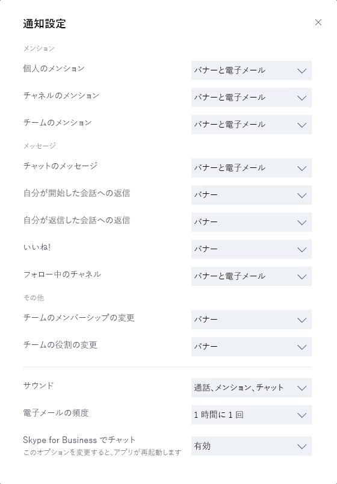

Microsoft Teams のクライアントを取得するGet clients for Microsoft Teams 
===========================

マイクロソフトのチームには、クライアント デスクトップ (Windows および Mac) は、web、およびモバイル (Android、iOS、および Windows Phone) があります。Microsoft Teams has clients available for desktop (Windows and Mac), web, and mobile (Android,  iOS, and Windows Phone). これらのクライアントはすべてアクティブなインターネット接続が必要で、オフライン モードをサポートしていません。These clients all require an active internet connection and do not support an offline mode.

デスクトップ クライアントDesktop client
--------------

マイクロソフト チームのデスクトップ クライアントは、スタンドアロン アプリケーションと現在の Office 365 用リソースの一部ではありません。The Microsoft Teams desktop client is a standalone application and currently not part of Office 365 ProPlus. チームは、Windows (7 +)、32 ビットと 64 ビットの両方のバージョンと macOS (10.10 +) の両方に使用できます。Teams is available for both Windows (7+), both 32-bit and 64-bit versions, and macOS (10.10+). Windows で Teams を使用するには .NET Framework 4.5 以降が必要です。.NET Framework 4.5 以降がない場合は、Teams のインストーラーでインストールすることになります。On Windows, Teams requires .NET framework 4.5 or later; the Teams installer will offer to install it for you if you don't have it. 

デスクトップ クライアントは、チーム会議、グループ通話、およびプライベートな 1 対 1 での通話に対応するリアルタイム通信のサポート (オーディオ、ビデオ、およびコンテンツ共有) を提供します。The desktop clients provide real-time communications support (audio, video, and content sharing) for team meetings, group calling, and private one-on-one calls.

デスクトップ クライアントは、適切なローカルのアクセス許可を持っているエンド ユーザーによって、[https://teams.microsoft.com/downloads](https://go.microsoft.com/fwlink/?linkid=855754) から直接ダウンロードおよびインストールできます (管理者権限は、Teams クライアントを PC にインストールする場合には必要ありませんが、Mac では必要になります) 。Desktop clients can be downloaded and installed by end users directly from [https://teams.microsoft.com/downloads](https://go.microsoft.com/fwlink/?linkid=855754) if they have the appropriate local permissions (admin rights are not required to install the Teams client on a PC but are required on a Mac).

IT 管理者は、システム センター構成マネージャー (Windows) または Jamf Pro (macOS) など、組織内のコンピューターにインストール ファイルを配布するが推奨される方法を選択できます。IT admins can choose their preferred method to distribute the installation files to computers in their organization, such as System Center Configuration Manager (Windows) or Jamf Pro (macOS). Windows ディストリビューションの MSI パッケージを取得するには、[マイクロソフト チームのインストールは、MSI を使用して](msi-deployment.md)参照してください。To get the MSI package for Windows distribution, see [Install Microsoft Teams using MSI](msi-deployment.md).

> [!NOTE]
> これらのメカニズムによるクライアントの配布は、Microsoft Teams クライアントの初回インストール時にのみ利用でき、それ以降の更新では利用できません。Distribution of the client via these mechanisms is only for the initial installation of Microsoft Team clients and not for future updates.

### WindowsWindows

Windows のマイクロソフトのチームのインストールには、32 ビットおよび 64 ビット アーキテクチャでは、ダウンロード可能なインストーラーが提供されます。The Microsoft Teams installation for Windows provides downloadable installers in 32-bit and 64-bit architecture.

> [!NOTE]
> マイクロソフト チームのアーキテクチャ (32 ビットと 64 ビット) は、Windows とインストールされている Office のアーキテクチャに依存しません。The architecture (32-bit vs. 64-bit) of Microsoft Teams is agnostic to the architecture of Windows and Office that is installed.

Windows クライアントは、ユーザーのプロファイルにある AppData フォルダーに展開されます。ユーザーのローカル プロファイルに展開すると、クライアントは管理者特権を必要とせずにインストール可能になります。Windows クライアントは次の場所にインストールされます。The Windows client is deployed to the AppData folder located in the user’s profile. Deploying to the user’s local profile allows the client to be installed without requiring elevated rights. The Windows client is installed in the following locations:

- %appdata%\\local\\Microsoft\\Teams%appdata%\\local\\Microsoft\\Teams

- %appdata%\\roaming\\Microsoft\\Teams%appdata%\\roaming\\Microsoft\\Teams

ユーザーは、最初にマイクロソフトのチームのクライアントを使用して呼び出しを開始するとき、Windows ファイアウォールの設定で通信を許可するユーザーの入力を求める警告がわかります。When users initiate a call using the Microsoft Teams client for the first time, they might notice a warning with the Windows firewall settings that asks for users to allow communication. 呼び出し機能しますが、警告を終了したときにもあるために、このメッセージを無視するようにユーザーを指示することがあります。Users might be instructed to ignore this message because the call will work, even when the warning is dismissed.

![[Windows セキュリティの重要な警告] ダイアログのスクリーンショット。](media/Get_clients_for_Microsoft_Teams_image3.png)

> [!NOTE]
> Windows ファイアウォール設定は、[キャンセル] の選択によりプロンプトが受け入れられなかった場合でも変更されます。TCP および UDP プロトコルの両方に関するブロック アクションで、teams.exe に関する2 つの着信ルールが作成されます。Windows Firewall configuration will be altered even when the prompt is dismissed by selecting “Cancel”. Two inbound rules for teams.exe will be created with Block action for both TCP and UDP protocols.

### MacMac

Mac ユーザーは、macOS のコンピューターでパッケージのインストール ファイルを使用してチームをインストールできます。Mac users can install Teams by using a PKG installation file for macOS computers. Mac クライアントをインストールするには管理アクセスが必要です。Administrative access is required to install the Mac client. /Applications フォルダーには、macOS クライアントがインストールされています。The macOS client is installed to the /Applications folder.

#### PKG ファイルを使用してチームをインストールします。Install Teams by using the PKG file

1. [チームがページをダウンロード](https://teams.microsoft.com/downloads)するから**Mac**では、下の [**ダウンロード**] をクリックします。From the [Teams download page](https://teams.microsoft.com/downloads), under **Mac**, click **Download**.
2. PKG ファイルをダブルクリックします。Double click the PKG file.
3. インストールを完了するのにはインストール ウィザードに従います。Follow the installation wizard to complete the installation.
4. チームは、/Applications フォルダーにインストールされます。Teams will be installed to /Applications folder. コンピューター全体にインストールすることをお勧めします。It is a machine-wide installation.

> [!NOTE]
> 、インストール中に、PKG は、管理者の資格情報を求められます。During the installation, the PKG will prompt for admin credentials. ユーザーは、ユーザーが管理者かどうかに関係なく、管理者の資格情報を入力する必要があります。The user needs to enter the admin credentials, regardless of whether or not the user is an admin.

ユーザー現在チームの攻撃力のインストールには、パッケージのインストールを交換したい場合、ユーザーする必要があります。If a user currently has a DMG installation of Teams and wants to replace it with the PKG installation, the user should:

1. チームのアプリケーションを終了します。Exit the Teams app.
2. チームのアプリケーションをアンインストールします。Uninstall the Teams app.
3. PKG ファイルをインストールします。Install the PKG file.

IT 管理者は、Jamf Pro など、組織内のすべての Mac にインストール ファイルを配布するのには、チームの管理された展開を使用できます。IT admins can use managed deployment of Teams to distribute the installation files to all Macs in their organization, such as Jamf Pro.

> [!NOTE]
> パッケージのインストールで問題が発生する場合お知らせします。If you experience issues installing the PKG, let us know. この資料の最後にある [**フィードバック**] セクションでは、**製品に関するフィードバック**をクリックします。In the **Feedback** section at the end of this article, click **Product feedback**.

Web クライアントWeb client 
----------

Web クライアント ([https://teams.microsoft.com](https://go.microsoft.com/fwlink/?linkid=855753)) は、さまざまなブラウザーから使用できる、完全な機能クライアントです。The web client ([https://teams.microsoft.com](https://go.microsoft.com/fwlink/?linkid=855753)) is a full, functional client that can be used from a variety of browsers. Web クライアントは WebRTC を使用することによって通話と会議をサポートするため、Web ブラウザーで Teams を実行するためのプラグインやダウンロードの必要がありません。The web client supports Calling and Meetings by using webRTC, so there is no plug-in or download required to run Teams in a web browser. ブラウザーはサードパーティの Cookie を許可するように設定する必要があります。The browser must be configured to allow third-party cookies. 

[!INCLUDE [browser-support](includes/browser-support.md)]

Web クライアントへの接続時にブラウザーのバージョンの検出を実行する[https://teams.microsoft.com](https://go.microsoft.com/fwlink/?linkid=855753)。The web client performs browser version detection upon connecting to [https://teams.microsoft.com](https://go.microsoft.com/fwlink/?linkid=855753). サポートされていないブラウザーのバージョンが検出された場合、web インタ フェースへのアクセスをブロックし、ユーザーがデスクトップ クライアントまたはモバイル アプリケーションをダウンロードすることをお勧めです。If an unsupported browser version is detected, it will block access to the web interface and recommend that the user download the desktop client or mobile app.

モバイル クライアントMobile clients
--------------

Microsoft Teams のモバイル アプリは Android、iOS、および Windows Phone で利用でき、チャットベースの会話に参加している外出中のユーザーを対象としており、ピアツーピアの音声通話が使用できます。モバイル アプリについては、Google Play、Apple App Store、および Microsoft Store の関連するモバイル ストアにアクセスしてください。The Microsoft Teams mobile apps are available for Android, iOS, and Windows Phones, and are geared for on-the-go users participating in chat-based conversations and allow peer-to-peer audio calls. For mobile apps, go to the relevant mobile store for Google Play, Apple App Store, and Microsoft Store.

Microsoft Teams モバイル アプリのサポートされるモバイル プラットフォームは次のとおりです。Supported mobile platforms for Microsoft Teams mobile apps are the following:

-   **Android**: 4.4 以降**Android**: 4.4 or later

-   **iOS**: 10.0 以降**iOS**: 10.0 or later

> [!NOTE]
> モバイル版は、チームが正常に機能するために一般に公開する必要があります。The mobile version must be available to the public in order for Teams to work as expected.

モバイル アプリはそれぞれのモバイル プラットフォームのアプリ ストアからのみ配布および更新され、MDM (モバイル デバイス管理) ソリューションまたはサイド ロードからは配布することはできません。Mobile apps are distributed and updated through the respective mobile platform’s app store only, and are not available to be distributed through MDM (mobile device management) solutions or side-loaded.

| | | |
|---------|---------|---------|
|      |判断ポイントDecision Point         |ユーザーが適切な Microsoft Teams クライアントをデバイスにインストールすることを妨げる制限事項はありますか?Are there any restrictions preventing users from installing the appropriate Microsoft Teams client on their devices?         |
|     |次のステップNext Steps         |組織によってソフトウェアのインストールが制限されている場合、処理が Microsoft Teams に対応していることを確認してください。注意: 管理者権限は、PC クライアント インストールでは必要ありませんが、Mac へのインストールでは必要になります。If your organization restricts software installation, make sure that process is compatible with Microsoft Teams. Note: Admin rights are not required for PC client installation but are required for installation on a Mac.         |

    判断ポイント   ユーザーが適切な Microsoft Teams クライアントをデバイスにインストールすることを妨げる制限事項はありますか?  Decision Point   Are there any restrictions preventing users from installing the appropriate Microsoft Teams client on their devices?

クライアントの更新管理Client update management
------------------------

クライアントは現在、IT 管理者の介入を必要とせずに Microsoft Teams サービスによって自動的に更新されています。利用可能な更新がある場合、クライアントは自動的にその更新をダウンロードします。アプリが一定時間アイドル状態となった場合には更新処理が開始されます。Clients are currently updated automatically by the Microsoft Teams service with no IT administrator intervention required. If an update is available, the client will automatically download the update and when the app has idled for a period of time, the update process will kick off.

クライアント側の設定Client-side configurations
---------------------------

現在、テナント管理者、PowerShell、グループ ポリシー オブジェクトまたはレジストリのいずれかを介してクライアントを設定するオプションはサポートされていません。Currently, there are no supported options available to configure the client either through the tenant admin, PowerShell, Group Policy Objects or the registry.

通知設定Notification settings
----------------------------

現在、IT 管理者がクライアント側の通知設定を設定するオプションはありません。通知オプションはすべてユーザーによって設定されます。次の図に、既定のクライアント設定の概要を示します。There are currently no options available for IT administrators to configure client-side notification settings. All notification options are set by the user. The figure below outlines the default client settings.

