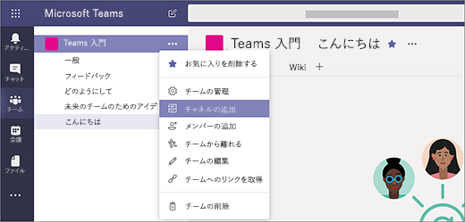

# Microsoft Teams で最初のチームとチャネルを作成するCreate your first teams and channels in Microsoft Teams

最初のチームとチャネルをセットアップして使用することで、Teams での経験を積み上げて、Teams の組織全体への導入を推進するために活躍できる主導者を特定します。Setting up and using your first set of teams and channels builds your experience with Teams and identifies champions who can help drive Teams adoption across your organization. まだ Teams をインストールしていない場合は、「[Teams のクライアントを入手する](get-clients.md)」と「[先進認証を使用して Teams にサインインする](sign-in-teams.md)」を参照してください。If you haven't installed Teams yet, check out [Get Teams clients](get-clients.md) and [Sign in to Teams using modern authentication](sign-in-teams.md).

## 最初のチームとチャネルの候補Suggestions for your first teams and channels

 チームとは、共通の目標に向けて集まったユーザーの集団のことです。A team is a collection of people who gather together around a common goal. チャネルとは、チーム内のコラボレーションの空間として、実際に作業する場所のことです。Channels are the collaboration spaces within a team where the actual work gets done. 

詳細については、「[Teams のチームとチャネルの概要](teams-channels-overview.md)」および「[チームを編成する際のベスト プラクティス](best-practices-organizing.md)」を参照してください。To learn more, see [Overview of teams and channels in Teams](teams-channels-overview.md) and [Best practices for organizing teams in Teams](best-practices-organizing.md).

 最初のチームは、「Get to know Teams」チームにすることをお勧めします。ここでは、早期導入者が自由に活動し、質問し、Teams の機能を発見できるようにします。We suggest you start with a “Get to know Teams” team where your early adopters can play around, ask questions, and discover the capabilities of Teams. このチームは、Teams の実験を始めるときに成功に不可欠なものになるでしょう。This team can be essential to your success as you begin to experiment with Teams. 

### 「Get to know Teams」チーム"Get to know Teams" team
プロジェクト チームは「Getting to know Teams」チームを使用することで、Teams のクライアントがセットアップされていることを確認し、最初の会話を実行し、Teams で実現可能になることを調査できます。Your project team can use the “Getting to know Teams” team to ensure they're set up with Teams clients, have some initial conversations, and explore what Teams can do. 組織には、新しい機能へ早期アクセスを利用しているユーザーのグループが既に存在していることがあります。You may already have a group of people in your organization who enjoy getting early access to new capabilities. こうしたグループを初期チームの 1 つとして参加させると、早期のフィードバックを得るために役立ちます。This can be one of their initial teams when you bring them on board and will help you get early feedback.

次に、このチームに推奨される構造を示します。Here's a suggested structure for the team.

| チャネルChannel | 説明および使用法Description and usage | 固定のタブ、ボット、およびアプリPinned tabs, bots, and apps |
| ------------ | -------------------- | -------------------- |
| GeneralGeneral | すべてのチームは General チャネルを出発点とします。All teams start with a General channel. このチャネルは、Teams のことが理解でき始めたことを発表するために使用します。Use this channel to make announcements as you start getting to know Teams. |  |
| Say hiSay hi | チームに自己紹介して、Teams で実現しようとしている内容を共有します。Introduce yourself to the team and share what you want to get from Teams. |  |
| How do IHow do I | 操作方法について質問するチャネル。A channel to ask how-to questions. ステップ 1: デスクトップ クライアントとモバイル クライアントをインストールする。Step 1 – install the desktop and mobile clients. ステップ 2: Teams に参加する。Step 2 – jump into Teams.| [Teams ヘルプ センター](https://support.office.com/teams)にリンクされた固定タブPinned tab that links to the [Teams help center](https://support.office.com/teams) [Teams のトレーニング ビデオ](https://support.office.com/article/microsoft-teams-video-training-4f108e54-240b-4351-8084-b1089f0d21d7)にリンクされた固定タブPinned tab that links to [Teams training videos](https://support.office.com/article/microsoft-teams-video-training-4f108e54-240b-4351-8084-b1089f0d21d7) [Teams のデスクトップ クライアントとモバイル クライアントのダウンロード リンク](https://teams.microsoft.com/downloads)にリンクされた固定タブPinned tab that links to [Teams desktop and mobile client download links](https://teams.microsoft.com/downloads) |
| FeedbackFeedback | Teams の使用感についての考えを共有します。Share your thoughts on your Teams experiences. | 意見調査の固定タブPinned tab with Polly Poll|
| Ideas for future teamsIdeas for future teams | 組織で Teams が付加価値を生み出せる状況についての考えを共有します。Share your thoughts on where Teams can drive additional value in your organization. このようなチームをどのように呼ぶか?What could these teams be called? 誰がメンバーになれるか?Who would be members? ||
| SupportSupport | 期待どおりに動作しないことがあったときには、このチャネルを使用して支援を求めます。If something isn't working as expected, use this channel to get help. ||

## 最初のチームを稼働させるGet your first teams up and running
管理者は、Teams のクライアントまたは Microsoft Teams 管理センターでチームとチャネルを作成および管理できます。As an admin, you can create and manage teams and channels in the Teams client or the Microsoft Teams admin center. チームはパブリックまたはプライベートとして作成できます。You can create teams as public or private. また、[組織全体のチーム](create-an-org-wide-team.md)を作成することもできます。You can also create an [org-wide team](create-an-org-wide-team.md). 組織内で Teams を使用するユーザーは、誰でもパブリック チームに参加できます。Anyone using Teams in your organization can join a public team. プライベート チームの場合は、チームの所有者がチームのメンバーシップを管理します。For private teams, team owners manage team membership. 組織全体のチームの場合は、組織内のすべてのユーザーが自動的に追加されます。And for an org-wide team, everyone in your organization is automatically added. 

最初は、プライベート チームを作成し、チームの設定とメンバーシップを管理する別の所有者を追加することをお勧めします。To get started, we recommend you create private teams and add another owner to manage team settings and membership. 

> [!NOTE]
> 次に示す手順では、Teams のデスクトップ クライアントを使用してチームとチャネルを作成します。In the steps that follow, we use the Teams desktop client to create teams and channels. 管理者は、このタスクを Microsoft Teams 管理センターで実行することもできる点に注意してください。Keep in mind that as an admin, you can also do these tasks in the Microsoft Teams admin center.

### チームを作成するCreate a team

Teams の左側にある **[Teams]** をクリックして、チームのリストの下側にある **[チームに参加またはチームの作成]** をクリックします。その後、**[新しいチームの作成]** をクリックします。On the left side of Teams, click **Teams**, at the bottom of the teams list, click **Join or create a team**, and then click **Create a new team**.

チームの作成後、チームに参加するようにユーザーを招待します。Once you've created the team, invite people to join it. 個別のユーザーやグループを追加することも、連絡先グループ (旧称: 配布リスト) 全体を追加することもできます。You can add individual users, groups, and even entire contact groups (formerly known as "distribution lists"). 

 

### チーム所有者を追加するAdd a team owner
作成したチームを探して、**[その他のオプション ˙˙˙]** > **[チームの管理]** をクリックします。Find the team that you created, click **More options ˙˙˙** > **Manage team**. **[メンバー]** タブに移動して、チーム所有者として指名するユーザーを探します。Then go to the **Members** tab. Find the people you want to designate as team owners. **[役割]** の **[所有者]** をクリックします。Under **Role**, click **Owner**.

### チームのチャネルを作成するCreate a channel in a team
作成したチームを探して、**[その他のオプション ...]** > **[チャネルの追加]** をクリックします。Find the team that you created, click **More options ...** > **Add channel**. **[チームの管理]** をクリックして、**[チャネル]** タブでチャネルを追加することもできます。You can also click **Manage team** and add a channel in the **Channels** tab. 

![[その他のオプション] をクリックしたときに使用可能なオプションのスクリーン ショット](media/get-started-with-teams-add-channel.png "[チャネルの追加] オプションや [チームの管理] オプションなど、チームの [その他のオプション] をクリックしたときに選択できるオプションを示すスクリーンショット") 

チャネルにわかりやすい名前を付けて、そのチャネルの目的をユーザーがすぐに理解できるようにします。Give the channel a descriptive name to make it easier for users to understand the purpose of the channel. 

チーム所有者は、チーム全体のチャネルを自動的にお気に入りに追加できます。これにより、チームのすべてのメンバーがチャネルを見つけやすくなります。As a team owner, you can automatically favorite channels for the whole team, making the channels more visible for everyone on the team. また、OneNote などツールを追加するためのタブ、Web ページなどのコンテンツへのリンクがあるタブをチャネルに固定することもできます。これにより、ユーザーは簡単に必要なものを見つけたり、自分の考えを共有したりできます。You can also pin tabs to the channel to add tools, such as OneNote, links to webpages, and other content to make it easy for users to find what they need and share their thoughts.  

次に、「Get to know Teams」チームの「How do I」チャネルの例を示します。このチャネルには、Teams の Web ページ &ndash; Teams ビデオ トレーニング、Teams ヘルプ センター、および Teams ダウンロード リンクにリンクされている固定タブが示されています。Here's an example of the "How do I" channel in the "Get to know Teams" team, showing pinned tabs that link to Teams webpages &ndash; Teams video training, Teams help center, and Teams download links. 

 

## 次の手順Next steps
「[早期導入者を参加させる](get-started-with-teams-onboard-early-adopters.md)」に移動します。Go to [Onboard your early adopters](get-started-with-teams-onboard-early-adopters.md).
