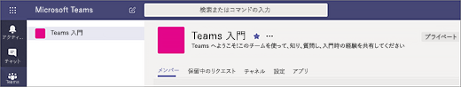
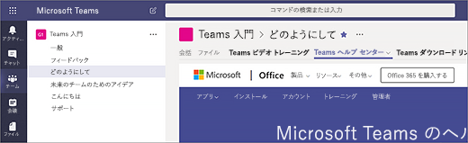

# Microsoft Teams で最初のチームとチャネルを作成する

最初のチームとチャネルをセットアップして使用することで、Teams での経験を積み上げて、Teams の組織全体への導入を推進するために活躍できる主導者を特定します。 まだ Teams をインストールしていない場合は、「[Teams のクライアントを入手する](get-clients.md)」と「[先進認証を使用して Teams にサインインする](sign-in-teams.md)」を参照してください。

## 最初のチームとチャネルの候補

 チームとは、共通の目標に向けて集まったユーザーの集団のことです。 チャネルとは、チーム内のコラボレーションの空間として、実際に作業する場所のことです。 

詳細については、「[Teams のチームとチャネルの概要](teams-channels-overview.md)」および「[チームを編成する際のベスト プラクティス](best-practices-organizing.md)」を参照してください。

 最初のチームは、「Get to know Teams」チームにすることをお勧めします。ここでは、早期導入者が自由に活動し、質問し、Teams の機能を発見できるようにします。 このチームは、Teams の実験を始めるときに成功に不可欠なものになるでしょう。 

### 「Get to know Teams」チーム
プロジェクト チームは「Getting to know Teams」チームを使用することで、Teams のクライアントがセットアップされていることを確認し、最初の会話を実行し、Teams で実現可能になることを調査できます。 組織には、新しい機能へ早期アクセスを利用しているユーザーのグループが既に存在していることがあります。 こうしたグループを初期チームの 1 つとして参加させると、早期のフィードバックを得るために役立ちます。

次に、このチームに推奨される構造を示します。

| チャネル | 説明および使用法 | 固定のタブ、ボット、およびアプリ |
| ------------ | -------------------- | -------------------- |
| General | すべてのチームは General チャネルを出発点とします。 このチャネルは、Teams のことが理解でき始めたことを発表するために使用します。 |  |
| Say hi | チームに自己紹介して、Teams で実現しようとしている内容を共有します。 |  |
| How do I | 操作方法について質問するチャネル。 ステップ 1: デスクトップ クライアントとモバイル クライアントをインストールする。 ステップ 2: Teams に参加する。| [Teams ヘルプ センター](https://support.office.com/teams)にリンクされた固定タブ [Teams のトレーニング ビデオ](https://support.office.com/article/microsoft-teams-video-training-4f108e54-240b-4351-8084-b1089f0d21d7)にリンクされた固定タブ [Teams のデスクトップ クライアントとモバイル クライアントのダウンロード リンク](https://teams.microsoft.com/downloads)にリンクされた固定タブ |
| Feedback | Teams の使用感についての考えを共有します。 | 意見調査の固定タブ|
| Ideas for future teams | 組織で Teams が付加価値を生み出せる状況についての考えを共有します。 このようなチームをどのように呼ぶか? 誰がメンバーになれるか? ||
| Support | 期待どおりに動作しないことがあったときには、このチャネルを使用して支援を求めます。 ||

## 最初のチームを稼働させる
管理者は、Teams のクライアントまたは Microsoft Teams 管理センターでチームとチャネルを作成および管理できます。 チームはパブリックまたはプライベートとして作成できます。 また、[組織全体のチーム](create-an-org-wide-team.md)を作成することもできます。 組織内で Teams を使用するユーザーは、誰でもパブリック チームに参加できます。 プライベート チームの場合は、チームの所有者がチームのメンバーシップを管理します。 組織全体のチームの場合は、組織内のすべてのユーザーが自動的に追加されます。 

最初は、プライベート チームを作成し、チームの設定とメンバーシップを管理する別の所有者を追加することをお勧めします。 

> [!NOTE]
> 次に示す手順では、Teams のデスクトップ クライアントを使用してチームとチャネルを作成します。 管理者は、このタスクを Microsoft Teams 管理センターで実行することもできる点に注意してください。

### チームを作成する

Teams の左側にある **[Teams]** をクリックして、チームのリストの下側にある **[チームに参加またはチームの作成]** をクリックします。その後、**[新しいチームの作成]** をクリックします。

チームの作成後、チームに参加するようにユーザーを招待します。 個別のユーザーやグループを追加することも、連絡先グループ (旧称: 配布リスト) 全体を追加することもできます。 

 

### チーム所有者を追加する
作成したチームを探して、**[その他のオプション ˙˙˙]** > **[チームの管理]** をクリックします。 **[メンバー]** タブに移動して、チーム所有者として指名するユーザーを探します。 **[役割]** の **[所有者]** をクリックします。

### チームのチャネルを作成する
作成したチームを探して、**[その他のオプション ...]** > **[チャネルの追加]** をクリックします。 **[チームの管理]** をクリックして、**[チャネル]** タブでチャネルを追加することもできます。 

![[その他のオプション] をクリックしたときに使用可能なオプションのスクリーン ショット](media/get-started-with-teams-add-channel.png "[チャネルの追加] オプションや [チームの管理] オプションなど、チームの [その他のオプション] をクリックしたときに選択できるオプションを示すスクリーンショット") 

チャネルにわかりやすい名前を付けて、そのチャネルの目的をユーザーがすぐに理解できるようにします。 

チーム所有者は、チーム全体のチャネルを自動的にお気に入りに追加できます。これにより、チームのすべてのメンバーがチャネルを見つけやすくなります。 また、OneNote などツールを追加するためのタブ、Web ページなどのコンテンツへのリンクがあるタブをチャネルに固定することもできます。これにより、ユーザーは簡単に必要なものを見つけたり、自分の考えを共有したりできます。  

次に、「Get to know Teams」チームの「How do I」チャネルの例を示します。このチャネルには、Teams の Web ページ &ndash; Teams ビデオ トレーニング、Teams ヘルプ センター、および Teams ダウンロード リンクにリンクされている固定タブが示されています。 

 

## 次の手順
「[早期導入者を参加させる](get-started-with-teams-onboard-early-adopters.md)」に移動します。
