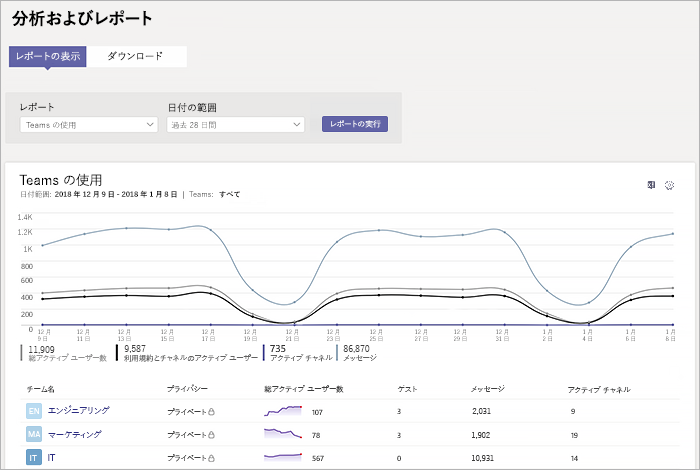
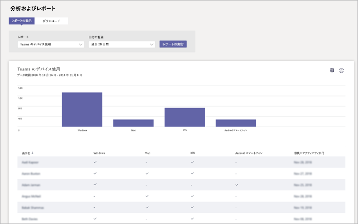

# Microsoft Teams での使用状況とフィードバックを監視するMonitor usage and feedback in Microsoft Teams
ユーザーがチームを使用する方法と、チームでの経験を知っているが重要です。It's important to know how users are using Teams and what their experience is with Teams. 利用状況レポートには、適切な使用法のパターンを理解すると、ユーザーからのフィードバックを使用すれば、広く公開し、トレーニングとコミュニケーションの取り組みの優先順位を設定する場所を通知するために情報を指定できます。Usage reports can help you better understand usage patterns, and along with user feedback, give you insights to inform your wider rollout and where to prioritize training and communication efforts.

## モニターの使用方法Monitor usage
チームの最初のセットの新しいトレンドを理解するのには週に 2 回のレポートを確認するをお勧めします。For your first set of teams, we recommend you review reports twice a week to understand emerging trends. 

など、多くのユーザーがチームのモバイル クライアントを使用している利用状況レポートを表示します。For example, usage reports show that not many users are using the Teams mobile clients. ユーザー方法がわからない、クライアントをインストールする可能性があります。This may indicate that users aren't sure how to install the clients. チャネルの転記のステップ バイ ステップのインストール手順についてより広範なクライアントのドライブの使用が役立つ場合があります。Posting step-by-step installation instructions in a channel may help drive usage of a wider range of clients. または、ユーザーが主に使用しているチーム プライベート チャットの利用状況レポートが表示されます。Or, usage reports show that users are primarily using Teams for private chats. この例では、初期チームとチャンネルが設定されている以外のユーザーがチャット、チームの状況を確認することがあります。In this example, you may want to review your team scenarios because users are chatting outside the initial teams and channels that were set up. 

チームの使用率を表示するレポートを取得するには。Here's how to get reports to view Teams usage. 

### チームの分析とレポート (マイクロソフトのチームと Skype のビジネス管理センター)Teams analytics & reports (Microsoft Teams & Skype for Business Admin Center)

マイクロソフトのチームとビジネス管理センターの Skype でのチームのレポートでは、組織内のチームの使用方法に関する見解を提供します。Teams reports in the Microsoft Teams & Skype for Business Admin Center give you insights into how Teams is used in your organization. レポートを使用して、組織全体にわたってチームの使用状況、ユーザーの利用状況、およびデバイスの使用状況を表示します。Use the reports to get a view into Teams usage, user activity, and device usage across your organization. 

これらのレポートを表示する Office 365 のグローバル管理者、サービス管理者のチーム、または Skype ビジネス管理者のマイクロソフトのチームとのビジネス管理センターは、左側のナビゲーションでは、Skype を選択、**分析とレポート**、および [**レポート**] で、実行するレポートを選択を参照してください。To view these reports, you must be a global admin in Office 365, Teams service admin, or Skype for Business admin. Go to the Microsoft Teams & Skype for Business Admin Center, in the left navigation, select **Analytics & reports**, and then under **Report**, choose the report you want to run.

- **チームの利用状況のレポート**: このレポートは、合計のアクティブなユーザーとチャネル、および作業中のユーザーとチャネル、来園者は、数を含む、チームの状況の概要を示し、各チームのメッセージです。**Teams usage report**: This report gives you an overview of usage activity in Teams, including the total active users and channels, and the number of active users and channels, guests, and messages in each team. 

         
- **チーム ユーザー アクティビティ レポート**: このレポートは、活動の種類を把握することなど、多くの人が 1 対 1 の呼び出し、チャネル メッセージ、および秘密のチャット メッセージを通信では、ユーザーが関与します。**Teams user activity report**: This report gives you insight into the types of activities users engage in, such as how many people communicate through 1:1 calls, channel messages, and private chat messages. 

     
\` 
\`
- **チームのデバイスの使用状況のレポート**: このレポートは、チームなど、多くの人が自分のモバイル デバイスに移動するときにチームを使用するユーザーを接続する方法を示します。**Teams device usage report**: This report shows you how users connect to Teams, including how many people use Teams on their mobile devices when on-the-go. 

    

詳細については、[チームの分析とレポート作成](teams-analytics-and-reports/teams-reporting-reference.md)を確認してください。To learn more, check out [Teams analytics and reporting](teams-analytics-and-reports/teams-reporting-reference.md). 

### チームの活動レポート (Office 365 管理センター)Teams activity reports (Office 365 admin center)
Office 365 管理センターから提供されるレポートをチームの活動を表示することもできます。You can also view Teams activity through reports that are available from the Office 365 admin center. これらのレポートは、Office 365 の管理センター内の Office 365 のレポートの一部であるし、ユーザーの利用状況とデバイスの使用状況に関する情報を提供します。These reports are part of the Office 365 reports in the Office 365 admin center and provide information about user activity and device usage. 

Office 365 管理センターを参照してこれらのレポートは**レポート**をクリックして表示する > **の使用率**です。To view these reports, go to the Office 365 admin center, click **Reports** > **Usage**. [**レポートの選択**] では、**マイクロソフトのチーム**をクリックします。Under **Select a report**, click **Microsoft Teams**. ここでは、表示するレポートを選択します。From here, choose the report you want to view.

詳細については、するには、[チームの活動レポートを使用して](teams-activity-reports.md)に移動します。To learn more, go to [Use activity reports for Teams](teams-activity-reports.md).

### Microsoft 365 の利用状況の分析Microsoft 365 usage analytics

電源双で Microsoft 365 の利用状況の分析を使用するには表示し、チームの利用状況データおよびその他の Office 365 の製品とサービスを分析します。You can use Microsoft 365 usage analytics in Power BI to view and analyze usage data for Teams and other Office 365 products and services. Microsoft 365 の利用状況分析は、事前構成済みのダッシュ ボードと、さまざまな事前構成済みレポートを含むコンテンツ パックです。Microsoft 365 usage analytics is a content pack that includes a pre-built dashboard and a number of pre-built reports. 各レポートを使用すると、特定の利用状況データおよび分析できます。Each report gives you specific usage data and insights. コンテンツ パックに接続するには、BI の電源を必要し、Office 365 またはレポートのリーダーでグローバル管理者である必要があります。To connect to the content pack, you need Power BI and must be a global admin in Office 365 or reports reader. なら既に電源双、[無料の電源の BI サービスにサインアップ](https://powerbi.microsoft.com)します。If you don't already have Power BI, [sign up for the free Power BI service](https://powerbi.microsoft.com). 

詳細については、[マイクロソフトの 365 の利用状況の分析](https://support.office.com/article/Microsoft-365-usage-analytics-77ff780d-ab19-4553-adea-09cb65ad0f1f)を参照してください。To learn more, see [Microsoft 365 usage analytics](https://support.office.com/article/Microsoft-365-usage-analytics-77ff780d-ab19-4553-adea-09cb65ad0f1f). 

## フィードバックを収集します。Gather feedback
新しいコラボレーション機能の導入は、ユーザーの動作を変更する方法です。The adoption of a new collaboration experience is about changing the behavior of users. 変更を有効にするには、トレーニング、激励、および正の例が必要です。Enabling change requires training, encouragement, and positive examples. ユーザーのチームへの移行中に音声があると、オープン、経験を共有できるが重要です。It's important for users to have a voice during the transition to Teams and to be able to openly share their experiences. フィードバック チャネルを使用することをお勧めで聞くチーム「チームを作成を収集しチームと自分の経験上のユーザーからフィードバックに対処します。We recommend using the Feedback channel in the "Get to know Teams" team you created to collect and address feedback from users on their experiences with Teams. 

## 次のステップNext steps
[チーム、組織全体の展開を計画するためのリソースを取得するの](get-started-with-teams-resources-for-org-wide-rollout.md)に移動します。Go to [Get resources to plan your organization-wide rollout of Teams](get-started-with-teams-resources-for-org-wide-rollout.md).
