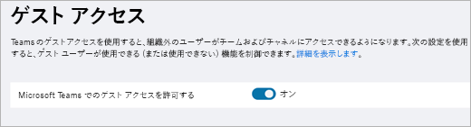

Teams のゲスト アクセスのチェックリストTeams guest access checklist
==========================================

このチェックリストを使用すると、自分の組織の基本設定に応じて Microsoft Teams のゲスト アクセス機能を有効にしたり、設定したりすることができるようになります。Use this checklist to help you enable and configure the guest access feature in Microsoft Teams according to the preferences of your organization.

> [!NOTE] 
> 共同作業の制限については[、「B2B 外部コラボレーションを有効にする」と「ゲストを招待できるユーザーを管理する](https://docs.microsoft.com/azure/active-directory/b2b/delegate-invitations)」をご覧くださいFor collaboration restrictions see [Enable B2B external collaboration and manage who can invite guests](https://docs.microsoft.com/azure/active-directory/b2b/delegate-invitations).

## ゲストに対する制限事項を理解するUnderstand the limitations for guests

ゲスト エクスペリエンスでは、デザインによる制限があります。問題ではないものを修正しようとしないために、必ずゲスト エクスペリエンスを理解してください。たとえば、Microsoft Teams のゲストが利用できない一部の機能を以下にリストします。The guest experience has limitations by design. Make sure you understand the guest experience so you don't try to fix something that isn't a problem. For example, here's a list of some of the functionality that isn't available to a guest in Microsoft Teams:

- OneDrive for BusinessOneDrive for Business
- Teams 外部のユーザーの検索People search outside of Teams
- カレンダー、予約済みの会議、会議の詳細Calendar, Scheduled Meetings, or Meeting Details
- PSTNPSTN
- 組織図Organization chart
- チームの作成または修正Create or revise a team
- チームの参照Browse for a team
- 個人対個人のチャットへのファイルのアップロードUpload files to a person-to-person chat
- ユーザーの完全なメール ID がわかっている場合でも、ゲストはユーザーを検索して検索できます。Guests can still search and find users (outside their team) if they know the user's full email ID. このようなことを防ぐため、IT 管理者は、ゲストを仮想 GAL に制限する機能を持つ、スコープ指定された[ディレクトリ検索](https://docs.microsoft.com/en-us/MicrosoftTeams/teams-scoped-directory-search)などのパターンを使用できます。To prevent this, IT admins can use patterns like [scoped directory search](https://docs.microsoft.com/en-us/MicrosoftTeams/teams-scoped-directory-search) that have the ability to restrict Guests into their own virtual GAL.

詳細については、「 [Office 365 グループで](https://support.office.com/article/guest-access-in-office-365-groups-bfc7a840-868f-4fd6-a390-f347bf51aff6)の[ゲストエクスペリエンスの概要](guest-experience.md)」と「ゲストアクセス」を参照してください。For more details, see [What the guest experience is like](guest-experience.md) and [Guest access in Office 365 Groups](https://support.office.com/article/guest-access-in-office-365-groups-bfc7a840-868f-4fd6-a390-f347bf51aff6).

### ゲスト アクセスと外部アクセス (フェデレーション)Guest access vs. external access (federation)

[!INCLUDE [guest-vs-external-access](includes/guest-vs-external-access.md)]

> [!NOTE] 
> 現時点では、Microsoft Teams はゲスト残っの役割をサポートしていません。Currently, Microsoft Teams does not support the guest inviter role. 少なくとも、Microsoft Teams でのゲストアクセスを有効にするには、[メンバーが招待できる] トグルを [はい] に設定する必要があります。At a minimum the "members can invite" toggle must be set to "Yes" for guest access to work in Microsoft Teams. "メンバーは招待できます" を "いいえ" に設定して、Office 365 グループおよび Microsoft Teams でゲストアクセスを有効にすると、管理者はディレクトリへのゲストの招待を制御できます。If you set "members can invite" to "No" and then enable guest access in Office 365 Groups and Microsoft Teams, admins can control guest invitations to your directory. ゲストはディレクトリに入った後、管理者ではない、チーム所有者としてのメンバーによってチームに追加されることができます。After guests are in the directory, they can be added to teams by non-admin members who are team owners.

## ゲストに対してライセンスのエラーが表示されている場合If your guests are seeing license errors

Microsoft Teams のゲストアクセスでは、Azure Active Directory (Azure AD) Business to Business (B2B) とライセンスモデルが使用されます。Guest access in Microsoft Teams uses Azure Active Directory (Azure AD) Business to Business (B2B) and its licensing model. ライセンスエラーが表示される場合は、組織のユーザーが組織にゲストを招待できるように、組織のライセンス要件を理解するために、 [B2B ライセンスガイダンス](https://docs.microsoft.com/azure/active-directory/b2b/licensing-guidance)をお読みください。If you’re seeing licensing errors, make sure to read the [B2B licensing guidance](https://docs.microsoft.com/azure/active-directory/b2b/licensing-guidance) to understand the licensing requirements your organization has so that your users are able to invite guests to your organization.

次の点にご注意ください。A few things to remember:

- ユーザーに割り当てた有料の Azure AD ライセンスの場合、1 つのライセンスで 5 人までのゲスト ユーザーを外部ユーザー無料利用分として招待することができます。For each paid Azure AD license that you assign to a user, your users can invite up to five guest users under the External User Allowance.
- ゲストとは、自分の組織の外部のユーザーのことです。Guests are users outside your organization. 社内の従業員、オンサイトの請負業者、オンサイトの代理業者などは、ゲストとして追加することはできません。Your employees, onsite contractors, onsite agents, and so on can't be added as guests. これは、関連会社にも提供されます。The same applies to your affiliates.
- ゲスト ライセンスは、招待する組織に対してカウントされます。Guest licenses are counted against the inviting organization. 必要なライセンスの数を算出するときは、このことを考慮に入れます。Consider this when you calculate the number of licenses you need.
- 招待されたゲストが別の Office 365 テナントからのユーザーであろうと、個人のメール アドレスを使用していようと、ライセンスがカウントされる対象は自分の組織になります。Licenses are counted against your organization whether the invited guests come from another Office 365 tenant or are using their personal email addresses.

## □  手順 1: Azure AD ビジネス ツー ビジネスの設定を構成する□  Step 1: Configure settings in Azure AD business-to-business

1. テナント管理者として[Azure ポータル](https://portal.azure.com)にサインインします。Sign in to the [Azure portal](https://portal.azure.com) as a tenant administrator.
2. **Azure Active Directory** > **ユーザー** > の**ユーザー設定**を選択します。Select **Azure Active Directory** > **Users** > **User settings**.
3. [**外部ユーザー**] で、[**外部グループ作業設定の管理**] を選択します。Under **External users**, select **Manage external collaboration settings**.
   > [!NOTE]
   > **外部コラボレーションの設定**は、[**組織関係**] ページからも利用できます。The **External collaboration settings** are also available from the **Organizational relationships** page. Azure Active Directory で、[**管理**] の [**組織の関係** > の**設定**] に移動します。In Azure Active Directory, under **Manage**, go to **Organizational relationships** > **Settings**.
4. [**外部コラボレーションの設定**] ページで、有効にするポリシーを選択します。On the **External collaboration settings** page, choose the policies you want to enable.

   

  - **ゲストユーザーのアクセス許可は制限され**ます: このポリシーは、ディレクトリ内のゲストに対するアクセス許可を決定します。**Guest users permissions are limited**: This policy determines permissions for guests in your directory. ユーザー、グループ、またはその他のディレクトリリソースを列挙するなど、特定のディレクトリタスクのゲストをブロックするには、[**はい**] を選択します。Select **Yes** to block guests from certain directory tasks, like enumerating users, groups, or other directory resources. [**いいえ**] を選択して、ディレクトリの通常ユーザーと同じアクセス権をゲストに与えます。Select **No** to give guests the same access to directory data as  regular users in your directory.
   - **ゲスト残っロールの管理者とユーザーは、招待でき**ます。 "ゲスト残っ" ロールの管理者とユーザーがゲストを招待できるようにするには、このポリシーを **[はい]** に設定します。**Admins and users in the guest inviter role can invite**: To allow admins and users in the "Guest Inviter" role to invite guests, set this policy to **Yes**.
   - **招待できるメンバー**: ディレクトリの管理者以外のメンバーにゲストの招待を許可するには、このポリシーを **[はい]** に設定します。**Members can invite**: To allow non-admin members of your directory to invite guests, set this policy to **Yes**.
   
       > [!NOTE]
       > [**メンバーが招待可能**] を [**いいえ**] に設定して、Office 365 グループおよび Microsoft Teams でのゲスト アクセスを有効にすると、自分のディレクトリへのゲストの招待を管理者が制御することができます。If you set **Members can invite** to **No** and then enable guest access in Office 365 Groups and Microsoft Teams, admins can control guest invitations to your directory. ゲストはディレクトリに入った後、管理者ではない、チーム所有者としてのメンバーによってチームに追加されることができます。After guests are in the directory, they can be added to teams by non-admin members who are team owners. 詳細については、「[Microsoft Teams でのゲスト アクセスを承認する](Teams-dependencies.md)」をご覧ください。For more information, see [Authorize guest access in Microsoft Teams](Teams-dependencies.md).
   
   - **招待できる**ゲスト: ゲストが他のゲストを招待できるようにするには、このポリシーを **[はい]** に設定します。**Guests can invite**: To allow guests to invite other guests, set this policy to **Yes**.
   - **ゲストのメールの1回限りのパスコードを有効にする (プレビュー)**: 1 回限りのパスコード機能の詳細については、「[ワンタイムパスコードの認証 (プレビュー)](one-time-passcode.md)」を参照してください。**Enable Email One-Time Passcode for guests (Preview)**: For more information about the one-time passcode feature, see [Email one-time passcode authentication (preview)](one-time-passcode.md).
   - **共同作業の制限**: 特定のドメインへの招待の許可または禁止の詳細については、「[特定の組織からの B2B ユーザーへの招待を許可またはブロック](allow-deny-list.md)する」を参照してください。**Collaboration restrictions**: For more information about allowing or blocking invitations to specific domains, see [Allow or block invitations to B2B users from specific organizations](allow-deny-list.md).

## □ 手順 2: Office 365 グループを構成する□ Step 2: Configure Office 365 Groups

1. Microsoft 365 管理センターで、[**設定**] > [**サービスとアドイン**] > [**Office 365 グループ**] に移動します。In the Microsoft 365 admin center, go to **Settings** > **Services & Add-ins** > **Office 365 Groups**.
2. [**組織外部のグループ メンバーがグループ コンテンツにアクセスすることを許可**] が [**オン**] に設定されていることを確認します。Make sure **Let group members outside the organization access group content** is set to **On**. この設定がオフになっていると、ゲストはどのグループ コンテンツにもアクセスすることはできません。If this setting is turned off, guests won't be able to access any group content.
3. [**グループ所有者が組織外部のユーザーをグループに追加することを許可**] が [**オン**] に設定されていることを確認します。Make sure **Let group owners add people outside the organization to groups** is set to **On**. この設定がオフになっていると、チームの所有者は新しいゲストを追加することができません。If this setting is turned off, Team owners won't be able to add new guests. 少なくとも、ゲスト アクセスをサポートするためにこの設定をオンにする必要があります。At a minimum, this setting must be On to support guest access.

     

これらの設定を構成する詳細な手順については、「 [office 365 グループでゲストアクセスを管理](https://support.office.com/en-us/article/manage-guest-access-in-office-365-groups-9de497a9-2f5c-43d6-ae18-767f2e6fe6e0?appver=MOE150)する」および「 [office 365 グループのゲストアクセスを制御](Teams-dependencies.md#control-guest-access-in-office-365-groups)する」を参照してください。For detailed instructions about configuring these settings, see [Manage guest access in Office 365 Groups](https://support.office.com/en-us/article/manage-guest-access-in-office-365-groups-9de497a9-2f5c-43d6-ae18-767f2e6fe6e0?appver=MOE150) and [Control guest access in Office 365 Groups](Teams-dependencies.md#control-guest-access-in-office-365-groups).
 

## □ 手順 3: テナント レベルでのゲスト アクセスを有効にする□ Step 3: Enable guest access at the tenant level

少なくとも、microsoft **teams 管理センター**で microsoft teams のゲストアクセスを有効にする必要があります。At a minimum, you must turn on guest access for Microsoft Teams under the **Microsoft Teams admin center**. 

1. Teams 管理センターで、**[組織全体の設定]** > **[ゲスト アクセス]** を選択します。In the Teams admin center, select **Org-Wide settings** > **Guest access**.
2. **[Microsoft Teams でのゲスト アクセスを許可]** のスイッチを **[オン]** に設定します。Set the **Allow guest access in Microsoft Teams** switch to **On**.

    

3. この同じページで、必要な他のゲストの設定を構成します。On this same page, configure any other guest settings that you require.
4. [**保存**] をクリックします。Click **Save**.

詳細な手順については、「 [Microsoft Teams へのゲストアクセスを有効または](set-up-guests.md)無効にする」を参照してください。For detailed instructions, see [Turn on or turn off guest access to Microsoft Teams](set-up-guests.md).

## □  手順 4: Office 365 での共有を構成する□  Step 4: Configure sharing in Office 365 

ユーザーがゲストを追加できることを確認します。Make sure that users can add guests. 次の操作を実行してください。Here's how:

1. Microsoft 365 管理センターで、[**設定**] > [**セキュリティとプライバシー**] に移動します。In the Microsoft 365 admin center, go to **Settings** > **Security & privacy**.

     

2. **[共有]** で **[編集]** を選択します。In **Sharing**, select **Edit**.

     
 
3. **[ユーザーがこの組織に新しいゲストを追加できるようにする]** を **[オン]** に設定し、**[保存]** をクリックします。Set **Let users add new guests to this organization** to **On**, and then click **Save**.

     
 
> [!NOTE]
> この設定は、Azure AD の [**ユーザー設定**] > [**外部ユーザー**] の [**メンバーが招待可能**] 設定と同等です。This setting is equivalent to the **Members can invite** setting in  **User settings** > **External users**  in Azure AD.  

## □ 手順 5: SharePoint での共有設定を確認する□ Step 5: Verify sharing setting in SharePoint

1. Microsoft 365 管理センターにサインインします。Sign in to the Microsoft 365 admin center.
2. [**管理センター**] をクリックして [**SharePoint**] を選びます。Click **Admin center**, and then select **SharePoint**.
3. SharePoint 管理センターで、[**共有**] を選択します。In the SharePoint admin center, select **Sharing**.
4. [**組織外との共有を許可しない**] の選択が*解除*されていることを確認します。Make sure the option for **Don’t allow sharing outside your organization** is *not* selected.
 
     

## □ 手順 6: チャネルの特定の設定を有効にする□ Step 6: Enable specific settings for channels 

Teams アプリケーションで、個人のチーム レベルにおいて、ゲストがチャネルを作成、更新、削除することができるようにゲストのアクセス許可を設定します。In the Teams application, at the individual team level, configure guest permissions so that guests can create, update, and delete channels. 管理者に加えて、チーム所有者もこの設定を構成することができます。In addition to admins,  team owners can configure this setting.

詳細については、使い方ビデオを含む「[Microsoft Teams でのゲスト アクセス](guest-access.md)」をご覧ください。For more information, including how-to videos, see [Guest access in Microsoft Teams](guest-access.md).

## トラブルシューティングTroubleshooting

Microsoft Teams でのゲストの追加に問題がある場合は、「[ゲスト アクセスのトラブルシューティング ガイド](https://techcommunity.microsoft.com/t5/Microsoft-Teams/Guest-Access-Troubleshooting-Guide/td-p/119797)」を参照してください。If you have problems with adding guests in Microsoft Teams, see the [Guest Access Troubleshooting Guide](https://techcommunity.microsoft.com/t5/Microsoft-Teams/Guest-Access-Troubleshooting-Guide/td-p/119797).

