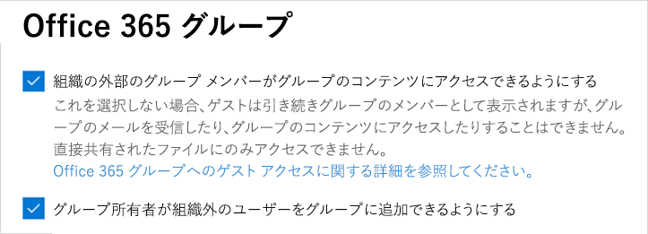
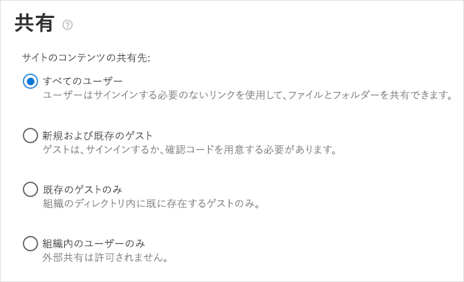
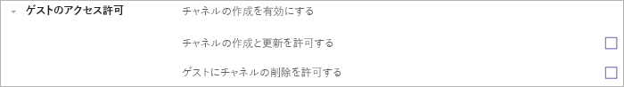

Teams のゲスト アクセスのチェックリストTeams Guest Access checklist
==========================================

このチェックリストを使用すると、自分の組織の基本設定に応じて Microsoft Teams のゲスト アクセス機能を有効にしたり、設定したりすることができるようになります。Use this checklist to help you enable and configure the Guest Access feature in Microsoft Teams according to the preferences of your organization.

## ゲストに対する制限事項を理解するUnderstand the limitations for guests

The guest experience has limitations by design.The guest experience has limitations by design. Make sure you understand the guest experience so you don't try to fix something that isn't a problem.Make sure you understand the guest experience so you don't try to fix something that isn't a problem. For example, here's a list of some of the functionality that isn't available to a guest in Microsoft Teams:For example, here's a list of some of the functionality that isn't available to a guest in Microsoft Teams:

- OneDrive for BusinessOneDrive for Business
- Teams 外部のユーザーの検索People search outside of Teams
- カレンダー、予約済みの会議、会議の詳細Calendar, Scheduled Meetings, or Meeting Details
- PSTNPSTN
- 組織図Organization chart
- チームの作成または修正Create or revise a team
- チームの参照Browse for a team
- 個人対個人のチャットへのファイルのアップロードUpload files to a person-to-person chat

詳細については、「[ゲストのエクスペリエンスについて](guest-experience.md)」および「[Office 365 グループのゲスト アクセス](https://support.office.com/article/guest-access-in-office-365-groups-bfc7a840-868f-4fd6-a390-f347bf51aff6)」をご覧ください。For more details, see [What the guest experience is like](guest-experience.md) and [Guest access in Office 365 groups](https://support.office.com/article/guest-access-in-office-365-groups-bfc7a840-868f-4fd6-a390-f347bf51aff6).

### ゲスト アクセスと外部アクセス (フェデレーション)Guest access vs. external access (federation)

[!INCLUDE [guest-vs-external-access](includes/guest-vs-external-access.md)]

## ゲストに対してライセンスのエラーが表示されている場合If your guests are seeing license errors

Microsoft Teams のゲスト アクセスではAzure Active Directory ビジネス ツー ビジネス (B2B) およびそのライセンス モデルを使用しています。Guest access in Microsoft Teams uses Azure Active Directory Business to Business (B2B) and its licensing model. ライセンスのエラーが表示される場合は、B2B ライセンスのガイダンスを必ず読んで自分の組織でのライセンスの要件を理解して、自分たちのユーザーが自分の組織でゲストを招待することができる状態になるようにしてください。If you’re seeing licensing errors, make sure to read the B2B licensing guidance to understand the licensing requirements your organization has so that your users are able to invite guests to your organization.

次の点にご注意ください。A few things to remember:

- ユーザーに割り当てた有料の Azure AD ライセンスの場合、1 つのライセンスで 5 人までのゲスト ユーザーを外部ユーザー無料利用分として招待することができます。For each paid Azure AD license that you assign to a user, your users can invite up to five guest users under the External User Allowance.
- ゲストとは、自分の組織の外部のユーザーのことです。Guests are users outside your organization. 社内の従業員、オンサイトの請負業者、オンサイトの代理業者などは、ゲストとして追加することはできません。Your employees, onsite contractors, onsite agents, and so on can't be added as guests. これは、関連会社にも提供されます。The same applies to your affiliates.
- ゲスト ライセンスは、招待する組織に対してカウントされます。Guest licenses are counted against the inviting organization. 必要なライセンスの数を算出するときは、このことを考慮に入れます。Consider this when you calculate the number of licenses you need.
- 招待されたゲストが別の Office 365 テナントからのユーザーであろうと、個人のメール アドレスを使用していようと、ライセンスがカウントされる対象は自分の組織になります。Licenses are counted against your organization whether the invited guests come from another Office 365 tenant or are using their personal email addresses.

## □  手順 1: Azure AD ビジネス ツー ビジネスの設定を構成する□  Step 1: Configure settings in Azure AD business-to-business

1. https://portal.azure.com にサインインします。Sign in to https://portal.azure.com.
2. 左ペインで **Azure Active Directory** をクリックします。Click **Azure Active directory** in the left pane.
3. [**管理**] の下で、[**ユーザー設定**] をクリックします。Under **Manage**, click **User settings**.
4. [**外部ユーザー**] の下で、[**外部コラボレーションの設定を管理します**] をクリックします。Under **External users**, click **Manage External collaboration settings**.
5. [**外部コラボレーションの設定**] ページで [**メンバーが招待可能**] が [**はい**] に設定されていることを確認します。On the **External collaboration settings** page make sure **Members can invite** is set to **Yes**.

      

    ゲストをサポートするために、[**メンバーが招待可能**] を [**はい**] に設定する必要があります。To support guests, **Members can invite** must be set to **Yes**. 
   
> [!NOTE] 
> [**メンバーが招待可能**] を [**いいえ**] に設定して、Office 365 グループおよび Microsoft Teams でのゲスト アクセスを有効にすると、自分のディレクトリへのゲストの招待を管理者が制御することができます。If you set **Members can invite** to **No** and then enable guest access in Office 365 Groups and Microsoft Teams, admins can control guest invitations to your directory. ゲストはディレクトリに入った後、管理者ではない、チーム所有者としてのメンバーによってチームに追加されることができます。After guests are in the directory, they can be added to teams by non-admin members who are team owners.

詳細については、「[Microsoft Teams でのゲスト アクセスを承認する](Teams-dependencies.md)」をご覧ください。For more information, see [Authorize guest access in Microsoft Teams](Teams-dependencies.md).

## □ 手順 2: Office 365 グループを構成する□ Step 2: Configure Office 365 Groups

1. Microsoft 365 管理センターで、[**設定**] > [**サービスとアドイン**] > [**Office 365 グループ**] に移動します。In the Microsoft 365 admin center, go to **Settings** > **Services & Add-ins** > **Office 365 Groups**.
2. [**組織外部のグループ メンバーがグループ コンテンツにアクセスすることを許可**] が [**オン**] に設定されていることを確認します。Make sure **Let group members outside the organization access group content** is set to **On**. この設定がオフになっていると、ゲストはどのグループ コンテンツにもアクセスすることはできません。If this setting is turned off, guests won't be able to access any group content.
3. [**グループ所有者が組織外部のユーザーをグループに追加することを許可**] が [**オン**] に設定されていることを確認します。Make sure **Let group owners add people outside the organization to groups** is set to **On**. この設定がオフになっていると、チームの所有者は新しいゲストを追加することができません。If this setting is turned off, Team owners won't be able to add new guests. 少なくとも、ゲスト アクセスをサポートするためにこの設定をオンにする必要があります。At a minimum, this setting must be On to support guest access.

     

これらの設定の構成方法の詳細については、「[Office 365 グループのゲスト アクセスを管理する](https://support.office.com/en-us/article/manage-guest-access-in-office-365-groups-9de497a9-2f5c-43d6-ae18-767f2e6fe6e0?appver=MOE150)」と、「[Microsoft Teams でのゲスト アクセスを承認する](Teams-dependencies.md)」の「Office 365 グループ」セクションをご覧ください。For detailed instructions about configuring these settings, see [Manage guest access in Office 365 groups](https://support.office.com/en-us/article/manage-guest-access-in-office-365-groups-9de497a9-2f5c-43d6-ae18-767f2e6fe6e0?appver=MOE150) and the section "Office 365 Groups" in [Authorize guest access in Microsoft Teams](Teams-dependencies.md).
 

## □ 手順 3: テナント レベルでのゲスト アクセスを有効にする□ Step 3: Enable guest access at the tenant level

最低限には、**マイクロソフトのチーム管理センター**] の [Microsoft チームのゲスト アクセスをオンにする必要があります。At a minimum, you must turn on Guest access for Microsoft Teams under the **Microsoft Teams admin center**. 

1. チーム管理センターで、**組織全体の設定**を選択します > **ゲスト アクセス**します。In the Teams admin center, select **Org-Wide settings** > **Guest access**.
2. [**Microsoft Teams でのゲスト アクセスを許可**] の切り替えスイッチを [**オン**] に設定します。Set the **Allow guest access in Microsoft Teams** switch to **On**.

    

3. この同じページで、必要な他のゲストの設定を構成します。On this same page, configure any other guest settings that you require.
4. [**保存**] をクリックします。Click **Save**.

詳細については、「[Microsoft Teams へのゲスト アクセスをオンまたはオフにする](set-up-guests.md)」をご覧ください。For detailed instructions, see [Turn on or off guest access to Microsoft Teams](set-up-guests.md).

## □  手順 4: Office 365 での共有を構成する□  Step 4: Configure Sharing in Office 365 

ユーザーがゲストを追加できることを確認します。Make sure that users can add guests. 方法は次のとおりです。Here's how:

1. Microsoft 365 管理センターで、[**設定**] > [**セキュリティとプライバシー**] に移動します。In the Microsoft 365 admin center, go to **Settings** > **Security & privacy**.

     

2. [**共有**] で、[**編集**] を選択します。In **Sharing**, select **Edit**.

     
 
3. [**ユーザーがこの組織に新しいゲストを追加できるようにする**] を [**オン**] にしてから、[**保存**] をクリックします。Set **Let users add new guests to this organization** to **On**, and then click **Save**.

     
 
> [!NOTE]
> この設定は、Azure AD の [**ユーザー設定**] > [**外部ユーザー**] の [**メンバーが招待可能**] 設定と同等です。This setting is equivalent to the **Members can invite** setting in  **User settings** > **External users**  in Azure AD.  

## □ 手順 5: SharePoint での共有設定を確認する□ Step 5: Verify sharing setting in SharePoint

1. Office 365 管理センターにサインインします。Sign in to the Office 365 admin center.
2. [**管理センター**] をクリックして [**SharePoint**] を選びます。Click **Admin center**, and then select **SharePoint**.
3. SharePoint 管理センターで、[**共有**] を選択します。In the SharePoint admin center, select **Sharing**.
4. [**組織外との共有を許可しない**] の選択が*解除*されていることを確認します。Make sure the option for **Don’t allow sharing outside your organization** is *not* selected.
 
     

## □ 手順 6: チャネルの特定の設定を有効にする□ Step 6: Enable specific settings for channels 

Teams アプリケーションで、個人のチーム レベルにおいて、ゲストがチャネルを作成、更新、削除することができるようにゲストのアクセス許可を設定します。In the Teams application, at the individual team level, configure guest permissions so that guests can create, update, and delete channels. 管理者に加えて、チーム所有者もこの設定を構成することができます。In addition to admins,  team owners can configure this setting.

詳細については、「[Microsoft Teams でのゲスト アクセス](guest-access.md)」をご覧ください。For more information, including how-to videos, see [Guest access in Microsoft Teams](guest-access.md).

## トラブルシューティングTroubleshooting

Microsoft Teams でのゲストの追加に問題がある場合は、「[ゲスト アクセスのトラブルシューティング ガイド](https://techcommunity.microsoft.com/t5/Microsoft-Teams/Guest-Access-Troubleshooting-Guide/td-p/119797)」を参照してください。If you have problems with adding guests in Microsoft Teams, see the [Guest Access Troubleshooting Guide](https://techcommunity.microsoft.com/t5/Microsoft-Teams/Guest-Access-Troubleshooting-Guide/td-p/119797).

