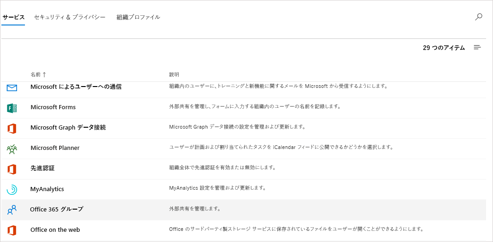
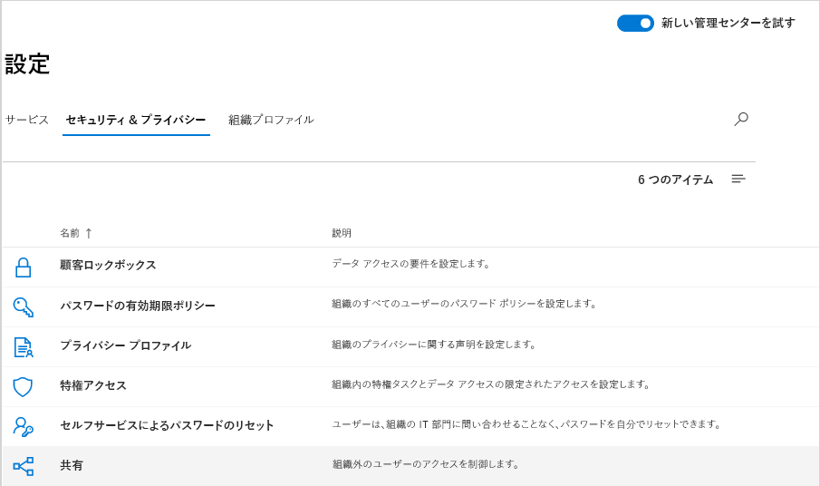
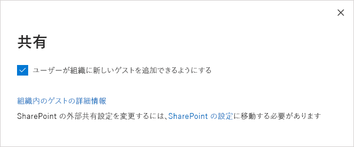
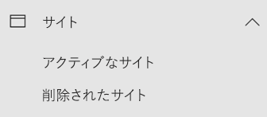

Microsoft Teams のゲスト アクセスのチェックリスト
=========================================

このチェックリストは、Microsoft Teams のゲスト アクセスを有効にして、構成するのに役立ちます。 これらの変更を行うには、グローバル管理者または Teams の管理者である必要があります。

> [!IMPORTANT]
> 変更が反映されるまでに数時間かかる場合があります。 

この短いビデオ (5 分 31 秒) で、Teams を含む、Microsoft 365 全体でゲスト アクセスを有効する方法について説明します。

> [!VIDEO https://www.microsoft.com/videoplayer/embed/RE44NTr?autoplay=false]

## 手順 1: Teams の組織全体レベルでゲスト アクセスを有効にする

ゲストアクセスを有効にするには、の管理センターに移動 <a href="https://go.microsoft.com/fwlink/p/?linkid=2024339" target="_blank">https://admin.microsoft.com</a> します。 

1. Teams 管理センターで、**[組織全体の設定]** > **[ゲスト アクセス]** を選択します。
2. **[Microsoft Teams でのゲスト アクセスを許可]** のスイッチを **[オン]** に設定します。

    

3. このページでは、ゲストの**通話**、**会議**、**メッセージング**を有効または無効にします。
4. **[保存]** をクリックします。

> [!TIP]
> Azure Active Directory、SharePoint Online、および Microsoft 365 グループで既定の設定を使用している場合、ゲストアクセスの構成が完了している可能性があります。 この場合、残りの手順は省略できます。 不明な場合、または AAD、SharePoint Online、または Microsoft 365 グループのカスタム設定を使用している場合は、このチェックリストの残りの手順に進んでください。

## 手順 2: Azure AD ビジネス ツー ビジネスの設定を構成する

これは、Teams のゲスト アクセスをサポートする Azure AD の設定です。 これらの設定を構成すると、Teams でゲストを[追加](add-guests.md)したり、[管理](manage-guests.md)したりできます。

1. テナント管理者として [Azure portal](https://portal.azure.com) にサインインします。
2. **[Azure Active Directory]** > **[ユーザー]** > **[ユーザー設定]** の順に選択します。
3. **[外部ユーザー]** で、**[外部コラボレーション設定の管理]** を選択します。
   > [!NOTE]
   > **外部コラボレーションの設定**は、**[組織の関係]** ページから利用することもできます。 Azure Active Directory の **[管理]** で、**[組織の関係]** > **[設定]** の順に移動します。
4. **[外部コラボレーションの設定]** ページで、有効にするポリシーを選択します。

    - **[ゲスト ユーザーのアクセス許可を制限する]**: このポリシーによって、ディレクトリ内のゲストのアクセス許可を決定します。 **[はい]** を選択すると、ゲストは、特定のディレクトリ タスク (ユーザー、グループ、またはその他のディレクトリ リソースを列挙するなど) を実行できなくなります。 **[いいえ]** を選択すると、ゲストには、ディレクトリ データに対して、ディレクトリ内の通常のユーザーと同じアクセス権が付与されます。
     - **[管理者とゲスト招待元ロールのユーザーは招待ができる]**: 管理者と "ゲスト招待元" ロールのユーザーがゲストを招待できるようにするには、このポリシーを **[はい]** に設定します。
     - [**メンバーが招待可能**]: ディレクトリの管理者以外のメンバーがゲストを招待できるようにするには、このポリシーを [**はい**] に設定します (推奨)。 管理者だけがゲストを追加できるようにする場合は、このポリシーを [**いいえ**] に設定します。 [**いいえ**] に設定すると、管理者以外の Teams 所有者のゲスト エクスペリエンスが制限され、管理者により AAD に追加されたゲストだけを Teams に追加できることに注意してください。
     - **[ゲストは招待ができる]**: ゲストが他のゲストを招待できるようにするには、このポリシー **[はい]** に設定します。
         > [!IMPORTANT]
         > 現在、Teams はゲスト招待者の役割をサポートしていないため、[**ゲストが招待できる**] を [**はい**] に設定しても、ゲストは Teams 内の他のゲストを招待できません。
     - **[ゲストの電子メール ワンタイム パスコードを有効にする (プレビュー)]**: ワンタイム パスコード機能の詳細については、「[電子メール ワンタイム パスコード認証 (プレビュー)](https://docs.microsoft.com/azure/active-directory/b2b/one-time-passcode)」を参照してください。
     - **[コラボレーションの制限]**: 特定のドメインへの招待の許可またはブロックの詳細については、「[B2B ユーザーに対する特定組織からの招待を許可またはブロックする](https://docs.microsoft.com/azure/active-directory/b2b/allow-deny-list)」を参照してください。
        > [!NOTE]
        > コラボレーションの制限については、「[B2B の外部コラボレーションを有効にしてゲストを招待できるユーザー管理する](https://docs.microsoft.com/azure/active-directory/b2b/delegate-invitations)」を参照してください。
      
    ゲストを招待できるユーザーの管理方法の詳細については、「[Azure Active Directory B2B コラボレーションの招待の委任](https://docs.microsoft.com/azure/active-directory/b2b/delegate-invitations)」を参照してください。

## 手順 3: Microsoft 365 グループを構成する

1. Microsoft 365 管理センターで、[**設定**  >  の**組織設定**] に移動し、[**サービス**] をクリックして、[ **microsoft 365 グループ**] を選択します。

     
2. **[組織外のグループ メンバーがグループ コンテンツにアクセスできるようにします]** のチェックボックスがオンになっていることを確認します。 この設定がオフになっていると、ゲストはどのグループ コンテンツにもアクセスすることはできません。

    
3. **[グループの所有者が組織外のユーザーをグループに追加できるようにします]** のチェックボックスがオンになっていることを確認します。 この設定がオフになっていると、チームの所有者は新しいゲストを追加することができません。 少なくとも、ゲスト アクセスをサポートするためにこの設定をオンにする必要があります。

これらの設定を構成する詳細な手順については、「 [microsoft 365 グループでゲストアクセスを管理](https://support.office.com/article/manage-guest-access-in-office-365-groups-9de497a9-2f5c-43d6-ae18-767f2e6fe6e0?appver=MOE150)する」および「 [microsoft 365 グループのゲストアクセスを制御](Teams-dependencies.md#control-guest-access-in-microsoft-365-groups)する」を参照してください。

## 手順 4: Microsoft 365 で共有を構成する 

ユーザーがゲストを追加できることを確認します。 次の操作を実行してください。

1. Microsoft 365 管理センターで、[**設定**  >  ] の [**組織の設定**] に移動し、[ **& セキュリティ**] をクリックして、[**共有**] を選択します。

     
 
2. **[ユーザーがこの組織に新しいゲストを追加できるようにする]** のチェックボックスをオンにし、**[変更の保存]** をクリックします。

     
 
    > [!NOTE]
    > この設定は、Azure AD の **[ユーザー設定]** > **[外部ユーザー]** の **[メンバーは招待ができる]** 設定と同等です。  

## 手順 5: SharePoint での共有設定を確認する

1. Microsoft 365 管理センターにサインインします。
2. **[管理センター]** で **[SharePoint]** を選択します。
3. 新しい SharePoint 管理センターの **[サイト]** で、**[アクティブなサイト]** を選択します。

    

3. サイトを選び、**[共有]** をクリックします。
4. オプションが **[すべてのユーザー]** または **[新規および既存のゲスト]** に設定されていることを確認します。

     

## 手順 6: ゲスト ユーザーのアクセス許可を設定する

Teams アプリケーションで、個人のチーム レベルにおいて、ゲストがチャネルを作成、更新、削除できるようにするかどうかを管理するゲストのアクセス許可を構成します。 Teams の管理者とチームの所有者が、これらの設定を構成できます。

ゲスト アクセスの詳細については、「[Microsoft Teams でのゲスト アクセス](guest-access.md)」、または、「[Microsoft Teams へのゲスト アクセスをオンまたはオフにする](set-up-guests.md)」を参照してください。

## トラブルシューティング

ゲスト アクセスの設定、または Teams へのゲストの追加で問題が発生した場合は、次のリソースを参照してください。

[Microsoft Teams のゲスト アクセスのトラブルシューティング](troubleshoot-guest-access.md)

[Teams のトラブルシューティング](https://docs.microsoft.com/MicrosoftTeams/troubleshoot/)
