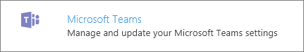
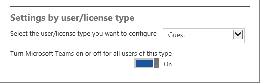
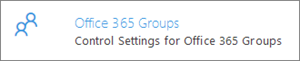

Microsoft Teams でのゲスト アクセスを管理するManage guest access in Microsoft Teams
======================================

# Microsoft Teams でのゲスト アクセスManage guest access in Microsoft Teams

Microsoft Teams でのゲスト アクセスにより、組織内のチームは組織外の人にチームおよびチャネルへのアクセス権を付与することで、それらの人と共同作業することができるようになります。Guest access in Microsoft Teams allows teams in your organization to collaborate with people outside your organization by granting them access to teams and channels. ゲストとは、従業員、学生または組織の一員ではないユーザーを指します。A guest is someone who isn't an employee, student, or member of your organization. ゲストは組織内での学校アカウントまたは職場アカウントを持ちません。They don't have a school or work account with your organization. たとえば、ゲストにはパートナー、製造元、供給元、コンサルタントなどが含まれます。For example, guests may include partners, vendors, suppliers, or consultants.
  
    
    

Microsoft Teams では、企業データを完全に制御して保持しながら、チーム、ドキュメント、リソース、チャット、アプリケーションへの外部アクセスをパートナーに提供できます。Organizations using Microsoft Teams can provide external access to teams, documents in channels, resources, chats, and applications to their partners, while maintaining complete control over their own corporate data.
Microsoft Teams は、Office 365 グループの上に構築されており、Office 365 グループの共有資産への新しいアクセス方法を提供します。Microsoft Teams is built upon Office 365 Groups and provides a new way to access shared assets for an Office 365 group. Microsoft Teams は、グループ/チーム メンバー間の常設チャットに最適なソリューションです。Microsoft Teams is the best solution for persistent chat among group/team members. Office 365 グループは、SharePoint サイトや Power BI ダッシュボードなどの一連の共有チーム資産を利用するために、クロス アプリケーションのメンバーシップを提供し、チームが効果的かつ安全にコラボレーションできるようにするサービスです。Office 365 Groups is a service that provides cross-application membership for a set of shared team assets, like a SharePoint site or a Power BI dashboard, so that the team can collaborate effectively and securely.
  
    
    

### ゲストがチームに参加する方法How a guest joins a team

  
    
    
Microsoft Teams でのチーム所有者は、Web またはデスクトップを介してチームにゲストを追加したり、チームのゲストを管理できます。A team owner in Microsoft Teams can add and manage guests in their teams via the web or desktop. Azure Active Directory に対応する電子メール アドレス、または Office 365 の職場または学校アカウントを持つユーザーのみをゲスト ユーザーとして追加できます。Only users who have an email address corresponding to an Azure Active Directory or Office 365 work or school account can be added as a guest user.
  
    
    

> [!NOTE]
> ゲストがチームに参加するには、管理者が Microsoft Teams でゲスト アクセスを事前に有効にする必要があります。Before guests can join a team, an admin must enable guest access in Microsoft Teams. この操作を行うには、Office 365 グローバル管理アカウントで[サインイン](https://portal.office.com/adminportal/home)します。To do that,  [sign in](https://portal.office.com/adminportal/home) with your Office 365 global admin account. 次に、[**設定**]  >  [**Services &amp; add-ins (サービスとアドイン)**]  >  [**Microsoft Teams**] の順に選択します。Then, choose **Settings** > **Services &amp; add-ins** > **Microsoft Teams**. [**Select the user/license type you want to configure (構成するユーザー/ライセンスの種類を選択する)**] で [**ゲスト**] を選択し、[**Turn Microsoft Teams on or off for all users of this type (この種類のすべてのユーザーについて Microsoft Teams をオンまたはオフにする)**] で [**オン**] を選択します。Select **Guest** in **Select the user/license type you want to configure**, and select **On** in **Turn Microsoft Teams on or off for all users of this type**. 設定が有効になるまで最長で 1 時間かかる場合があります。It can take up to an hour for the settings to take effect. 詳しくは、この記事の管理タブにある「Microsoft Teams のゲスト アクセスをオンまたはオフにする」をご覧ください。For more details, see "Turn on or off guest access for Microsoft Teams" on this article's Manage tab. 
  
    
    

ゲストをチームのメンバーにする方法を次に示します。Here's how a guest becomes a member of a team:
  
    
    

- **手順 1** チーム所有者または Office 365 管理者は[チームにゲストを追加します](https://support.office.com/en-us/article/adds-a-guest-to-a-team-df38ae23-8f85-46d3-b071-cb11b9de5499#bkmk_addingguests)。**Step 1** A team owner or an Office 365 admin [adds a guest to a team](https://support.office.com/en-us/article/adds-a-guest-to-a-team-df38ae23-8f85-46d3-b071-cb11b9de5499#bkmk_addingguests).
    
  
- **手順 2** Office 365 管理者またはチーム所有者は必要に応じてゲストが利用できる操作を管理します。**Step 2** The Office 365 admin or the team owner can manage a guest's capabilities as necessary. たとえば、チャネルの追加または削除、ファイルへのアクセスの無効化といった操作をゲストに許可します。For example, allowing a guest to add or delete channels or disabling access to files.
    
  
- **手順 3** ゲストは、チームへの参加を招待する「ようこそ」メールをチーム所有者から受け取ります。**Step 3** The guest receives a welcome email from the team owner, inviting them to join the team. 招待状を受け取った後、ゲストは[チームやチャネルへの参加](https://support.office.com/en-us/article/participate-in-teams-and-channels-df38ae23-8f85-46d3-b071-cb11b9de5499#bkmk_channels)、メッセージの受信や返答、[チャネル内のファイルへのアクセス](https://support.office.com/en-us/article/access-files-in-channels-c593c78a-27c4-4661-a598-682baa30ca7e)、チャットへの参加を行うことができるようになります。After accepting the invitation, the guest can [participate in teams and channels](https://support.office.com/en-us/article/participate-in-teams-and-channels-df38ae23-8f85-46d3-b071-cb11b9de5499#bkmk_channels), receive and respond to channel messages, [access files in channels](https://support.office.com/en-us/article/access-files-in-channels-c593c78a-27c4-4661-a598-682baa30ca7e), and participate in chat. Microsoft Teams の使用時には、すべてのユーザーがテキストとアイコンの組み合わせにより、チームにゲストが参加していることを知ることができます。While using Microsoft Teams, a combination of text and icons gives all team members clear indication of guest participation in a team. 詳しくは、「[ゲストのエクスペリエンス](#guestexp)」をご覧ください。For more details, see [what the guest experience is like](#guestexp)
    
  
ゲストは Microsoft Teams の Web やデスクトップ クライアントを使っていつでもチームから脱退することができます。Guests can leave the team at any time via Microsoft Teams web and desktop clients. 詳しくは、「[How do I leave a team? (チームから脱退する方法を教えてください。)](https://support.office.com/en-us/article/How-do-I-leave-a-team-df38ae23-8f85-46d3-b071-cb11b9de5499#bkmk_howdoileaveateam)」をご覧ください。For details, see  [How do I leave a team?](https://support.office.com/en-us/article/How-do-I-leave-a-team-df38ae23-8f85-46d3-b071-cb11b9de5499#bkmk_howdoileaveateam)
  
    
    

> [!NOTE]
> パートナーやコンサルタントなど組織外の人のみをゲストとして追加できます。Only people who are outside of your organization, such as partners or consultants, can be added as guests. 組織内のユーザーは通常のチーム メンバーとして参加できます。People from within your organization can join as regular team members. 
  
    
    

### ゲストのエクスペリエンスについてWhat the guest experience is like

ゲストは、チームへの参加を招待されると、チームに関する情報とメンバーとして利用できる内容を記載する「ようこそ」メール メッセージを受け取ります。When a guest is invited to join a team, they receive a welcome email message that includes some information about the team and what to expect now that they're a member. ゲストは、メール メッセージの招待状と引き換えに、チームやそのチャネルにアクセスできるようになります。The guest must redeem the invitation in the email message before they can access the team and its channels.
  
    
    

  
    
    

  
    
    
すべてのチーム メンバーは、チーム所有者がゲストを追加した旨およびそのゲストの名前を知らせるメッセージを確認することができます。All team members see a message in the channel thread announcing that the team owner has added a guest and providing the guest's name. チームのメンバー全員がゲストが誰であるかを簡単に判断できます。Everyone on the team can identify easily who is a guest. 次のサンプル チームのスクリーンショットで示すように、バナーに「This team has guests (チームにゲストが参加しました)」と示され、各ゲストの名前の横に「ゲスト」ラベルが表示されます。As shown in the following screenshot of a sample team, a banner indicates "This team has guests" and a "GUEST" label appears next to each guest's name.
  
    
    

  
    
    

  
    
    
次の表に、組織のチーム メンバーが利用できる Microsoft Teams の機能とチームのゲスト ユーザーが利用できる機能との比較を示します。The following table compares the Microsoft Teams functionality available for an organization's team members to the functionality available for a guest user on the team.
  
    
    

|**Teams の機能****Capability in Teams**|**組織の Teams ユーザー****Teams user in the organization**|**ゲスト ユーザー****Guest user**|
|:-----|:-----|:-----|
||||
|チャネルの作成Create a channel     *この機能はチーム所有者によって制御されます。**Team owners control this setting.*    |||
|プライベート チャットに参加するParticipate in a private chat    |||
|チャネルの会話に参加するParticipate in a channel conversation    |||
|メッセージを投稿、削除、編集するPost, delete, and edit messages    |||
|チャネル ファイルを共有するShare a channel file    |||
|チャット ファイルを共有するShare a chat file    |||
|アプリ (タブ、ボット、コネクタ) を追加するAdd apps (tabs, bots, or connectors)    |||
|テナント全体およびチーム/チャネルのゲスト アクセス ポリシーを作成するCreate tenant-wide and teams/channels guest access policies    |||
|Office 365 テナントのドメイン外のユーザーを招待するInvite a user outside the Office 365 tenant's domain    |||
|チームを作成するCreate a team    |||
|パブリック チームを検出して参加するDiscover and join a public team    |||
|組織図を表示するView organization chart    |||
   

    
> [!NOTE]
> ゲストが利用できる機能は Office 365 の管理者によって制御されます。Office 365 admins control the features available to guests. 
  
    
###ゲストを管理するManage guests

ゲスト アクセスは、Office 365 Business Premium、Office 365 Enterprise、Office 365 Education のすべてのサブスクリプションに含まれています。Guest access is included with all Office 365 Business Premium, Office 365 Enterprise, and Office 365 Education subscriptions. 追加の Office 365 ライセンスは不要です。No additional Office 365 license is necessary.
  
    
    
Microsoft Teams ゲスト アクセスはテナントレベルの設定であり、既定ではオフになっています。Microsoft Teams guest access is a tenant-level setting and is turned off by default. 管理者は Office 365 管理センターでゲスト アクセスを管理できます。Admins can manage guest access via the Office 365 admin center. 詳しくは、「[Microsoft Teams へのゲスト アクセスを管理する](#manageguest)」と「[Control guest access to Microsoft Teams (Microsoft Teams へのゲスト アクセスを制御する)](#controlguest)」をご覧ください。For more details, see [Manage guest access to Microsoft Teams](#manageguest) and [Control guest access to Microsoft Teams](#controlguest).
  
    
    

> [!NOTE]
> Microsoft Teams ゲスト アクセスのテナント設定はゲストのサインインのみを拒否します。The Microsoft Teams guest access tenant setting only prevents guest sign-in. チーム所有者は、所有するチームに新しいゲストを招待したり、既存のディレクトリ ゲスト ユーザーを追加できます。Team owners will be able to invite new guests and add existing directory guest users to their respective teams. Microsoft Teams は、テナントへのゲスト ユーザーの追加の許可または拒否において、常に Azure Active Directory の外部設定を優先します。As a reminder, Microsoft Teams always honor Azure Active Directory external settings to allow or prevent guest user addition to the tenant. 
  
    
    

さらに、Azure Active Directory ポータルを使用して、ゲストの管理、Office 365 や Microsoft Teams のリソースへのゲスト アクセスの管理を行うことができます。In addition, you can use the Azure Active Directory portal to manage guests and their access to Office 365 and Microsoft Teams resources. Microsoft Teams ゲスト アクセスでは、Azure Active Directory ビジネス ツー ビジネス (B2B) コラボレーション機能を基本インフラストラクチャとして活用して、ID プロパティ、メンバーシップ、多要素認証設定といったセキュリティの原則情報を保管します。Microsoft Teams guest access makes use of Azure Active Directory business-to-business (B2B) collaboration capabilities as the underlying infrastructure to store security principles information such as identity properties, memberships, and multi-factor authentication settings. Azure Active Directory B2B について詳しくは、「[Azure AD B2B コラボレーションとは](https://go.microsoft.com/fwlink/p/?linkid=853011)」と「[Azure Active Directory B2B コラボレーションの FAQ](https://go.microsoft.com/fwlink/p/?linkid=853020)」をご覧ください。To learn more about Azure Active Directory B2B, see [What is Azure AD B2B collaboration?](https://go.microsoft.com/fwlink/p/?linkid=853011) and [Azure Active Directory B2B collaboration FAQs](https://go.microsoft.com/fwlink/p/?linkid=853020).
  
    
    

#### 関連する主要なサービスと依存関係Related key services and dependencies

Microsoft Teams は、SharePoint Online と OneDrive for Business を利用して、チャネルとチャット会話のファイルやドキュメントを保管します。Microsoft Teams relies on SharePoint Online and OneDrive for Business to store files and documents for channels and chat conversations. さらに、Microsoft Teams は、Office 365 グループを利用して、チームのメンバーシップやチーム データ分類設定などのその他のプロパティを保管します。In addition, Microsoft Teams relies on Office 365 groups to store teams' memberships and other properties such as team data classification settings.
  
    
    
Microsoft Teams ゲスト アクセスの完全な操作性を有効にするため、Office 365 管理者は次の設定を**オン**にする必要があります。To enable the full Microsoft Teams guest access experience, Office 365 admins need to select **On** for the following settings:
  
    
    

- SharePoint Online: **Only allow sharing with external users already in the directory (ディレクトリに既に存在する外部ユーザーのみとの共有を許可する)**In SharePoint Online: **Only allow sharing with external users already in the directory**
    
    詳しくは、「[SharePoint Online 環境の外部共有を管理する](https://support.office.com/en-us/article/Manage-external-sharing-for-your-SharePoint-Online-environment-c8a462eb-0723-4b0b-8d0a-70feafe4be85)」をご覧ください。For more information, see [Manage external sharing for your SharePoint Online environment](https://support.office.com/en-us/article/Manage-external-sharing-for-your-SharePoint-Online-environment-c8a462eb-0723-4b0b-8d0a-70feafe4be85).
    
  
- Office 365 グループ: **Let group owners add people outside the organization to groups (グループ所有者に組織外のユーザーをグループに追加させる)**In Office 365 groups: **Let group owners add people outside the organization to groups**
    
    詳しくは、「[Control guest access to Microsoft Teams (Microsoft Teams へのゲスト アクセスを制御する)](#controlguest)」をご覧ください。For more information, see [Control guest access to Microsoft Teams](#controlguest).
    
  

#### Microsoft Teams のゲスト アクセスをオンまたはオフにするTurn on or off guest access for Microsoft Teams

1. Office 365 グローバル管理アカウントを使用して、[https://portal.office.com/adminportal/home](https://portal.office.com/adminportal/home) にサインインします。Sign in with your Office 365 global admin account at [https://portal.office.com/adminportal/home](https://portal.office.com/adminportal/home).
    
  
2. ナビゲーション メニューで [**設定**] を選択し、[**Services &amp; add-ins (サービスとアドイン)**] を選択します。In the navigation menu, choose **Settings** and then select **Services &amp; add-ins**.
    
     ![Office 365 にサインインし、Office 365 管理センターに移動して、[設定]、[Services &amp; add-ins (サービスとアドイン)] の順に選択します。](media/99e676d4-5b48-4525-9556-547031fa37d9.png)
  

  

  
3. [**Microsoft Teams**] を選択します。Select **Microsoft Teams**.
    
     
  

  

  
4. [**Select the user/license type you want to configure (構成するユーザー/ライセンスの種類を選択する)**] で [**ゲスト**] を選択します。In **Select the user/license type you want to configure**, select **Guest**.
    
    
  
    
    

  
    
    

  
    
    

  
    
    

    
  
5. [**Turn Microsoft Teams on or off for all users of this type (この種類のすべてのユーザーについて Microsoft Teams をオンまたはオフにする)**] の横にあるトグルをクリックまたはタップして [**オン**] にして組織の Teams とゲスト アクセスをオンにし、[**保存**] を選択します。Click or tap the toggle next to **Turn Microsoft Teams on or off for all users of this type** to **On** to turn on Teams and guest access for your organization, and then choose **Save**. 
    
  

> [!NOTE]
> 設定が有効になるまで最長で 1 時間かかる場合があります。It can take up to an hour for the settings to take effect. 
  
    
    

#### Microsoft Teams や Office 365 グループへのゲスト ユーザーの追加を制御するControl adding guest users to Microsoft Teams and Office 365 groups

1. Office 365 グローバル管理アカウントを使用して、[https://portal.office.com/adminportal/home](https://portal.office.com/adminportal/home) にサインインします。Sign in with your Office 365 global admin account at [https://portal.office.com/adminportal/home](https://portal.office.com/adminportal/home).
    
  
2. ナビゲーション メニューで [**設定**] を選択し、[**Services &amp; add-ins (サービスとアドイン)**] を選択します。In the navigation menu, choose **Settings** and then select **Services &amp; add-ins**.
    
  
3. [**Office 365 グループ**] を選択します。Select **Office 365 Groups**.
    
     
  

  

  
4. 組織外のチーム所有者やグループ所有者に Office 365 へのアクセスを許可するかどうかに応じて、[Office 365 グループ] ページのトグルを [**オン**] または [**オフ**] にします。On the Office 365 Groups page, set the toggle to **On** or **Off**, depending if you want to let team and group owners outside your organization access Office 365 groups. [**Let group owners add people outside the organization to groups (グループ所有者に組織外のユーザーをグループに追加させる)**] の横にあるトグルをクリックまたはタップして [**オン**] にします。Click or tap the toggle to **On** next to **Let group owners add people outside the organization to groups**.
    
    
  
    
    
![次のスクリーンショットは、組織外のグループ メンバーによるグループのコンテンツへのアクセス、グループ所有者による組織外のユーザーのグループへの追加のオプションをオンにした [Office 365 グループ] パネルを示しています。](media/eee77abd-4425-4585-91a8-5541c17ee7b2.png)
  
    
    

  
    
    

  
    
    

    
  

### Office 365 の [共有] オプションをオンまたはオフにするTurn on or off the Sharing option for Office 365

[共有] オプションでは、組織へのゲストの追加を許可します。The Sharing option allows guests to be added to your organization. 既定では、[共有] オプションは有効です。By default, neither option is enabled. [共有] オプションをオフにする方法について詳しくは、「[[共有] オプションをオンまたはオフにする](https://support.office.com/en-us/article/Turn-on-or-off-the-Sharing-option-7c713d74-a144-4eab-92e7-d50df526ff96#bkmk_beforeyoubegin)」をご覧ください。For information about how to turn off the Sharing option, see [Turn on or off the Sharing option](https://support.office.com/en-us/article/Turn-on-or-off-the-Sharing-option-7c713d74-a144-4eab-92e7-d50df526ff96#bkmk_beforeyoubegin).
  
    
    

> [!IMPORTANT]
> [共有] オプションをオフにすると、ゲスト アクセスが利用できなくなります。If you turn off the Sharing option, guest access isn't available. 
  
    
    

#### PowerShell を使用してゲスト アクセスを制御するUse PowerShell to control guest access

Office 365 管理センターと Azure Active Directory ポータルに加え、Windows PowerShell を使用してゲスト アクセスを制御することもできます。In addition to using the Office 365 admin center and the Azure Active Directory portal, you can use Windows PowerShell to control guest access. PowerShell を使用すると、次の操作を行うことができます。With PowerShell, you can do the following:
  
    
    

- すべてのチームおよび Office 365 グループへのゲスト アクセスを許可または拒否するAllow or block guest access to all teams and Office 365 groups
    
  
- すべてのチームおよび Office 365 グループへのゲストの追加を許可するAllow guests to be added to all teams and Office 365 groups
    
  
- 特定のチームまたは Office 365 グループのゲスト ユーザーを許可または拒否するAllow or block guest users from a specific team or Office 365 group
    
  
詳しくは、「[PowerShell を使用してゲスト アクセスを制御する](https://support.office.com/en-us/article/Use-PowerShell-to-control-guest-access-bfc7a840-868f-4fd6-a390-f347bf51aff6#bkmk_usepowershell)」をご覧ください。For more details, see [Use PowerShell to control guest access](https://support.office.com/en-us/article/Use-PowerShell-to-control-guest-access-bfc7a840-868f-4fd6-a390-f347bf51aff6#bkmk_usepowershell).
  
    
    
PowerShell を使用して、ドメインに基づいてゲスト ユーザーの許可と拒否を行うこともできます。You can also use PowerShell to allow or block a guest user based on their domain. たとえば、ある企業 (Contoso) が別の企業 (Fabrikam) とパートナーシップを結んでいると仮定します。For example, let's say your business (Contoso) has a partnership with another business (Fabrikam). Fabrikam 社を [許可] リストに追加すると、Contoso 社のユーザーは Fabrikam のユーザーをゲストとしてグループに追加できるようになります。You can add Fabrikam to your Allow list so your users can add those guests to their groups. 詳しくは、「[Allow/Block guest access to Office 365 groups (Office 365 グループへのゲスト アクセスを許可/拒否する)](https://go.microsoft.com/fwlink/?linkid=854001)」をご覧ください。For more information, see [Allow/Block guest access to Office 365 groups](https://go.microsoft.com/fwlink/?linkid=854001).
  
    
    

### ゲスト ユーザーを表示するView guest users

1. Office 365 グローバル管理アカウントを使用して、[https://portal.office.com/adminportal/home](https://portal.office.com/adminportal/home) にサインインします。Sign in with your Office 365 global admin account at  [https://portal.office.com/adminportal/home](https://portal.office.com/adminportal/home).
    
  
2. [**ユーザー**]  >  [**ゲスト ユーザー**] に移動します。Go to **Users** > **Guest users**.
    
    
  
    
    
![次のスクリーンショットは、Office 365 管理センターの [ユーザー] セクションで選択したゲスト ユーザー オプションを示しています。](media/95b83ff5-72ef-4668-b541-4e25b767620a.png)
  
    

#### ゲスト ユーザーを招待するInvite guest users

チーム所有者や Office 365 管理者は、個別に[ゲストをチームに招待する](https://support.office.com/en-us/article/invite-a-guest-to-a-team-df38ae23-8f85-46d3-b071-cb11b9de5499#bkmk_howdoiaddateammember)ことができます。A team owner or an Office 365 admin can [invite a guest to a team](https://support.office.com/en-us/article/invite-a-guest-to-a-team-df38ae23-8f85-46d3-b071-cb11b9de5499#bkmk_howdoiaddateammember) on an individual basis. ただし、管理者は Office 365 管理センターや Azure Active Directory ポータルを使用して一度の操作で複数のゲストを招待することはできません。However, admins can't use the Office 365 admin center or the Azure Active Directory portal to invite multiple guests in one action. 一元的にゲストを招待する場合に、Azure Active Directory B2B コラボレーション プレビューを使用することができます。To invite guests centrally, consider using the Azure Active Directory B2B collaboration preview. 詳しくは、「[Azure AD B2B コラボレーション プレビューについて](https://go.microsoft.com/fwlink/p/?linkid=853011)」をご覧ください。For more information, see [About the Azure AD B2B collaboration preview](https://go.microsoft.com/fwlink/p/?linkid=853011).
  
    
    

#### ゲスト ユーザー情報を編集するEdit guest user information

現時点では、Office 365 管理センターや Exchange 管理センターからゲスト情報を編集することはできません。Currently, you can't edit guest information from the Office 365 admin center or the Exchange admin center. ゲスト アカウントを編集するには (表示名やプロフィール写真など)、Azure Active Directory ポータルに移動します。To edit guest accounts (such as display name or profile photo), go to your Azure Active Directory portal. 詳しくは、「[Office 365 ID と Azure Active Directory について](https://support.office.com/en-us/article/Understanding-Office-365-Identity-and-Azure-Active-Directory-06a189e7-5ec6-4af2-94bf-a22ea225a7a9)」をご覧ください。For more information, see [Understanding Office 365 identity and Azure Active Directory](https://support.office.com/en-us/article/Understanding-Office-365-Identity-and-Azure-Active-Directory-06a189e7-5ec6-4af2-94bf-a22ea225a7a9).
  
    
    
### 管理についてよく寄せられる質問Frequently asked questions for admins

Microsoft Teams のチームへの参加にゲストを招待することについて、Office 365 管理者が持つ一般的な質問を以下に示します。Here are common questions Office 365 admins have about inviting guests to join a team in Microsoft Teams.
  
    
    

#### ゲストとは何ですか?What is a template?

  
    
    
ゲストとは、従業員、学生または組織の一員ではないユーザーを指します。A guest is not an employee, student, or member of your organization. ゲストは組織内での学校アカウントまたは職場アカウントを持ちません。They don't have a school or work account with your organization.
  
    
    

  
    
    

#### ゲスト ユーザーとして追加できるユーザーを教えてください。Who can be added as a guest user?

Azure Active Directory に対応する電子メール アドレス、または Office 365 の職場または学校アカウントを持つユーザーのみをゲスト ユーザーとして追加できます。Only users who have an email address corresponding to an Azure Active Directory or Office 365 work or school account can be added as a guest user.
  
    
    

#### ユーザーはチームのメンバーでない組織内の人をゲストとして追加できますか?Can users add people within my organization who are not part of the team as a guest?

パートナーやコンサルタントなど組織外の人のみをゲストとして追加できます。Only people who are outside of your organization, such as partners or consultants, can be added as guests. ユーザーは、組織内の人を通常のチーム メンバーまたはサブスクライバーとして参加するように招待できます。Users can invite people from within your organization to join as regular team members or subscribers.
  
    
    

#### ユーザーがチームにゲストを追加しようとすると「Contact your administrator (管理者にお問い合わせください)」というメッセージを受信するのはなぜですか?Why does a user get the message "Contact your administrator" when they try to add a guest to their team?

Office 365 管理者は、組織のユーザー (具体的にはチーム所有者) がゲストを追加できるようにするため事前にゲスト機能を有効にする必要があります。As the Office 365 admin, you must enable the guest feature before you or your organization's users (specifically, team owners) can add guests. ユーザーがこのメッセージを受信する場合は、ゲスト機能が有効になっていない可能性があります。When a user sees that message, it's likely that the guest feature hasn't been enabled.
  
    
    

#### グローバル管理者が組織に新しいゲスト ユーザーを追加する方法を教えてください。How can a global admin add a new guest user to the organization?

グローバル管理者は複数の方法で新しいゲスト ユーザーを組織に追加できます。As a global admin, you can add a new guest user to the organization in a couple ways:
  
    
    

- チームの所有者であるグローバル管理者は、Microsoft Teams デスクトップまたは Web クライアントのいずれかを使用して[チームにゲストを追加](https://support.office.com/en-us/article/add-a-guest-to-a-team-df38ae23-8f85-46d3-b071-cb11b9de5499#bkmk_howdoiaddateammember)できます。Global admins who are owners of a team and owners of a team can [add a guest to a team](https://support.office.com/en-us/article/add-a-guest-to-a-team-df38ae23-8f85-46d3-b071-cb11b9de5499#bkmk_howdoiaddateammember) through either the Microsoft Teams desktop or the web clients.
    
  
- Azure Active Directory B2B コラボレーションを使用して組織にゲストを追加します。Add guests to your organization through Azure Active Directory B2B collaboration. Azure Active Directory B2B コラボレーションを使用すると、グローバル管理者は、2000 行以下のカンマ区切り (CSV) ファイルを B2B コラボレーション ポータルにアップロードすることで、複数の外部ユーザーを招待、承認できます。Azure Active Directory B2B collaboration allows a global admin to invite and authorize a set of external users by uploading a comma-separated values (CSV) file of no more than 2,000 lines to the B2B collaboration portal. 詳しくは、「[Azure Active Directory B2B コラボレーション](https://go.microsoft.com/fwlink/p/?LinkId=826383)」をご覧くださいFor more details, check out [Azure Active Directory B2B collaboration](https://go.microsoft.com/fwlink/p/?LinkId=826383).
    
  

#### 個別にゲスト ユーザーを拒否する方法はありますか?Is there a way to block individual guest users?

いいえ。個別にゲスト ユーザーを拒否することはできません。No, individual guest users can't be blocked.
  
    
    

#### グローバル管理者はチームでのゲストを拒否する一方でゲストによる SharePoint サイトへのアクセスを許可することはできますか?Can global admins block guests in teams and still allow guests to access SharePoint sites?

はい。グローバル管理者は、SharePoint の外部共有をオンに設定している場合に、Azure Active Directory Powershell コマンドレットを使用して Company オブジェクトの _AllowGuestAccessToGroups_ パラメータを無効にすることができます。Yes, global admins can use Azure Active Directory Powershell cmdlets to disable the  _AllowGuestAccessToGroups_ parameter on the Company object, assuming external sharing is turned on for SharePoint sites.
  
    
    

#### IT 管理者が Microsoft Teams でのゲストを管理するために利用できるその他の制御操作を教えてください。What other controls are available to IT admins to manage guests in Microsoft Teams?

IT 管理者は、テナントレベルでのゲストの追加、ゲスト ユーザー ポリシーと権限の設定と管理、ゲストを招待できるユーザーの判別、ゲスト ユーザーのアクティビティに関するレポートの取得を行うことができます。IT admins can add guests at the tenant level, set and manage guest user policies and permissions, determine which users can invite guests, and pull reports on guest user activity. これらの制御は Office 365 管理センターを介して利用できます。These controls are available through the Office 365 admin center. ゲスト ユーザーのコンテンツとアクティビティには、Office 365 の他の部分と同じコンプライアンスと監査保護が適用されます。Guest user content and activities are under the same compliance and auditing protection as the rest of Office 365.
  
    
    

#### ユーザーはチームのメンバーでない外部ユーザーとチーム ファイルを共有することができますか?Can users share a team file with an external user who isn't a member of the team?

いいえ。No. ユーザーは、チームへの参加を招待されたゲストとのみ Microsoft Teams ファイルを共有できます。Users can only share Microsoft Teams files with guests who have been invited to join the team.
  
    
    

#### ゲスト アクセスには追加の Office 365 ライセンスが必要ですか?Is an additional Office 365 license required for guest access?

追加のライセンスは不要です。No additional license is required. ゲスト アクセスは、Office 365 Business Premium、Office 365 Enterprise、Office 365 Education のすべてのサブスクリプションに含まれています。Guest access is included with all Office 365 Business Premium, Office 365 Enterprise, and Office 365 Education subscriptions.
  
    
    

#### Office 365 や Azure Active Directory サービスの制限はゲストに適用されますか?Do Office 365 and Azure Active Directory service limits apply to guests?

はい。ゲストにも [Office 365](https://go.microsoft.com/fwlink/p/?linkid=282347) と [Azure Active Directory](https://go.microsoft.com/fwlink/p/?linkid=853019) のサービスの制限が適用されます。Yes, guests are subject to  [Office 365](https://go.microsoft.com/fwlink/p/?linkid=282347) and [Azure Active Directory](https://go.microsoft.com/fwlink/p/?linkid=853019) service limits.
  
    
    

  
    
    

#### ゲスト ユーザーの設定が Office 365 組織に反映されるまでどのくらいの時間がかかりますか?How long does it take until the guest user settings take effect in the Office 365 organization?

ゲスト設定は Azure Active Directory で設定します。The guest settings are set in Azure Active Directory. その変更が Office 365 組織全体で有効になるまでに 2 時間から 24 時間かかります。It takes 2 hours to 24 hours for the changes to be effective across your Office 365 organization.
  
    
    

#### グローバル管理者は Teams で接続したチーム サイトの SharePoint Online 外部ユーザー設定を管理できますか?Can a global admin manage SharePoint Online external user settings for the Teams connected team site?

はい。Teams で接続したチーム サイトの SharePoint Online 外部ユーザー設定を管理できます。Yes, you can manage SharePoint Online external user settings for the Teams connected team site. 詳しくは、「[SharePoint チーム サイト設定を管理する](https://support.office.com/en-us/article/Manage-your-SharePoint-team-site-settings-8376034d-d0c7-446e-9178-6ab51c58df42)」をご覧ください。For more details, see  [Manage your SharePoint team site settings](https://support.office.com/en-us/article/Manage-your-SharePoint-team-site-settings-8376034d-d0c7-446e-9178-6ab51c58df42).
  
    
    

  
    
    

#### 条件付きアクセスはゲスト アクセスに対してどのように作用しますか?How does conditional access work with guest access?

Azure Active Directory B2B コラボレーションでは、組織は B2B ユーザーに対して条件付きアクセスと多要素認証 (MFA) ポリシーを適用できます。With Azure Active Directory B2B collaboration, organizations can enforce conditional access and multi-factor authentication (MFA) policies for B2B users. このポリシーは、フルタイムの従業員や組織のメンバーに対して有効にするのと同じ方法で、テナント レベル、アプリ レベルまたは個々のユーザー レベルで適用できます。These policies can be enforced at the tenant, app, or individual user level, the same way that they are enabled for full-time employees and members of the organization. こうしたポリシーはリソース組織で実施します。Such policies are enforced at the resource organization. 詳しくは、「[B2B コラボレーション ユーザーの条件付きアクセス](https://go.microsoft.com/fwlink/?linkid=857454)」をご覧ください。For more information, see  [Conditional access for B2B collaboration users](https://go.microsoft.com/fwlink/?linkid=857454).
  
    
    

#### Office 365 グループとのチームを所有している場合に、そのグループにゲストを追加すると、ゲストはチームへのアクセスを自動的に取得しますか?If I have a team with an Office 365 group, and I add a guest to the group, does that user automatically get access to the team?

はい。そのユーザーはチームにアクセスできます。Yes, the guest will get access to the team. Office 365 グループを介してゲストを追加すると、そのゲストへの招待状メールは生成されません。そのため、チームの他のユーザーがそのゲストに通知する必要があります。Adding a guest via the Office 365 group doesn't generate an invitation email to the guest, so someone on the team should notify the guest.
  
    
    

#### 監査ログにおいて、ゲストに招待状が送信されたことを示すイベントを教えてください。What event appears in the audit log to indicate a guest has been sent an invitation?

ゲストの追加は、Azure Active Directory または Office 365 セキュリティ &amp; コンプライアンス センターで追跡できます。You can track guest additions in Azure Active Directory or the Office 365 Security &amp; Compliance Center. Microsoft Teams でのゲストの追加は監査され、「Added member to group (グループにメンバーを追加しました)」という Azure AD グループ管理アクティビティとして記録されます。Adding a guest in Microsoft Teams is audited and logged as an Azure AD group administration activity "Added member to group". 詳しくは、「[B2B コラボレーション ユーザーの監査およびレポート](https://go.microsoft.com/fwlink/p/?linkid=858884)」と「[Office 365 のセキュリティ センターとコンプライアンス センターで監査ログを検索する](https://support.office.com/en-us/article/Search-the-audit-log-in-the-Office-365-Security--Compliance-Center-0d4d0f35-390b-4518-800e-0c7ec95e946c)」をご覧ください。For more details, see  [Auditing and reporting a B2B collaboration user](https://go.microsoft.com/fwlink/p/?linkid=858884) and [Search the audit log in the Office 365 Security &amp; Compliance Center](https://support.office.com/en-us/article/Search-the-audit-log-in-the-Office-365-Security--Compliance-Center-0d4d0f35-390b-4518-800e-0c7ec95e946c).
  
    
    

#### Azure AD B2B、Office 365 グループ、SharePoint Online を介して追加したゲスト ユーザーが存在する場合、そのユーザーのために Microsoft Teams でその他の操作を行う必要はありますか?If I have existing guest users that were added via Azure AD B2B, Office 365 Groups, or SharePoint Online, do I have to do anything else with them for Microsoft Teams?

Azure Active Directory B2B、Office 365 グループまたは SharePoint Online を介してすでに追加しているゲスト ユーザーはすぐに利用できます。Guest users you have already added via Azure Active Directory B2B, Office 365 Groups or SharePoint Online are ready to go. Office 365 管理者またはチーム所有者は所有するチームにこのゲストを追加できます。The Office 365 admin or a team owner can add those guests to their respective teams.
  
    
    

#### 外部アカウントを利用できるということは、外部共有が有効になっていることを意味しますか?If external accounts are available, does that mean external sharing is enabled?

管理者は、外部共有の設定から独立して、Azure Active Directory でゲスト アカウントを作成することができます。Admins can create guest accounts in Azure Active Directory, independent from external sharing settings. 外部共有がオフの場合、管理者のみがゲスト アカウントを作成できます。If external sharing is off, only an admin can create guest accounts.
  
    
    

  
    
    

## 詳細情報More information

 [Microsoft Teams の管理者設定Administrator settings for Microsoft Teams](https://support.office.com/en-us/article/Administrator-settings-for-Microsoft-Teams-3966a3f5-7e0f-4ea9-a402-41888f455ba2)
  
    
    
 [Microsoft Teams についてよく寄せられる質問 - 管理者向けヘルプFrequently asked questions about Microsoft Teams - Admin Help](https://support.office.com/en-us/article/Frequently-asked-questions-about-Microsoft-Teams-–-Admin-Help-05cbe533-2181-4e95-a4b0-52cd7695fafc)
  
    
    
 [チームへのゲストの追加Adding guests to teams](https://support.office.com/en-us/article/Adding-guests-to-teams-df38ae23-8f85-46d3-b071-cb11b9de5499#bkmk_addingguests)
  
    
    
ビデオ: [Deep Dive into Guest Access](https://go.microsoft.com/fwlink/p/?linkid=858791)Video:  [Deep Dive into Guest Access](https://go.microsoft.com/fwlink/p/?linkid=858791)
  
    
    

