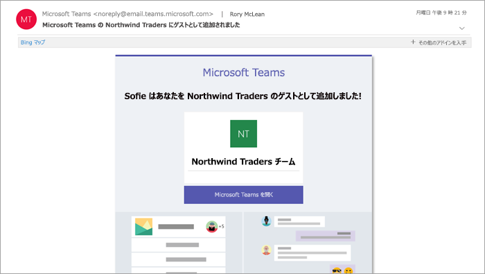

ゲストのエクスペリエンスについてWhat the guest experience is like
=================================

ゲストは、チームへの参加を招待されると、チームに関する情報とメンバーとして利用できる内容を記載する「ようこそ」メール メッセージを受け取ります。When a guest is invited to join a team, they receive a welcome email message that includes some information about the team and what to expect now that they're a member. ゲストは、メール メッセージの招待状と引き換えに、チームやそのチャネルにアクセスできるようになります。The guest must redeem the invitation in the email message before they can access the team and its channels.
    

    
すべてのチーム メンバーは、チーム所有者がゲストを追加した旨およびそのゲストの名前を知らせるメッセージを確認することができます。All team members see a message in the channel thread announcing that the team owner has added a guest and providing the guest's name. チームのメンバー全員がゲストが誰であるかを簡単に判断できます。Everyone on the team can identify easily who is a guest. 次のサンプル チームのスクリーンショットで示すように、バナーに「This team has guests (チームにゲストが参加しました)」と示され、各ゲストの名前の横に「ゲスト」ラベルが表示されます。As shown in the following screenshot of a sample team, a banner indicates "This team has guests" and a "GUEST" label appears next to each guest's name.
    
!バナー通知のゲストユーザーを示すスクリーンショット(メディア/guest-experience-image2 ") スクリーンショットには、ノースウィンドのマーケティングチャネルの一部が表示されています。上のバナーには、" このチームのゲスト "と" ゲスト "という単語が名前の横にある" GUEST "という言葉で識別されていることを示す通知が表示されています。

次の表に、組織のチーム メンバーが利用できる Microsoft Teams の機能とチームのゲスト ユーザーが利用できる機能との比較を示します。The following table compares the Microsoft Teams functionality available for an organization's team members to the functionality available for a guest user on the team.

|**Teams の機能****Capability in Teams**|**組織の Teams ユーザー****Teams user in the organization**|**ゲスト ユーザー****Guest user**|
|:-----|:-----|:-----|
|チャネルの作成Create a channel     *この機能はチーム所有者によって制御されます。**Team owners control this setting.*    |||
|プライベート チャットに参加するParticipate in a private chat    |||
|チャネルの会話に参加するParticipate in a channel conversation    |||
|メッセージを投稿、削除、編集するPost, delete, and edit messages    |||
|チャネル ファイルを共有するShare a channel file    |||
|チャット ファイルを共有するShare a chat file    |||
|アプリ (タブ、ボット、コネクタ) を追加するAdd apps (tabs, bots, or connectors)    |||
|会議または access のスケジュールを作成するCreate meetings or access schedules    |||
|OneDrive for Business の記憶域にアクセスするAccess OneDrive for Business storage    |||
|テナント全体およびチーム/チャネルのゲスト アクセス ポリシーを作成するCreate tenant-wide and teams/channels guest access policies    |||
|Office 365 テナントのドメイン外のユーザーを招待するInvite a user outside the Office 365 tenant's domain    *この機能はチーム所有者によって制御されます。**Team owners control this setting.*      |||
|チームを作成するCreate a team    |||
|パブリック チームを検出して参加するDiscover and join a public team    |||
|組織図を表示するView organization chart    |||
   
次の表は、ゲストが利用できる通話と会議の機能を示しています。The following table shows the calling and meeting features available to guests.

| 通話機能Calling feature | 会員Guest | E1 と E3 ユーザーE1 and E3 user | E5 と EV ユーザーE5 and EV user |
| --------------- | ----- | -------------- | -------------- |
| VOIP 通話VOIP calling | はいYes | 可Yes | 可Yes |
| グループ通話Group calling | はいYes | 可Yes | 可Yes |
| サポートされている主要な通話コントロール (保留、ミュート、ビデオのオン/オフ、画面の共有)Core call controls supported (hold, mute, video on/off, screen sharing) | はいYes | 可Yes | 可Yes |
| ターゲットの転送Transfer target | はいYes | 可Yes | 可Yes |
| 通話を転送できますCan transfer a call | はいYes | 可Yes | 可Yes |
| 提案型移行可能Can consultative transfer | はいYes | 可Yes | 可Yes |
| VOIP 経由で他のユーザーを通話に追加できるCan add other users to a call via VOIP | はいYes | 可Yes | 可Yes |
| 電話番号を使って通話にユーザを追加できますCan add users by phone number to a call | なしNo | いいえNo | はいYes |
| 転送先Forward target | いいえNo | はいYes | 可Yes |
| 通話グループのターゲットCall group target | いいえNo | はいYes | 可Yes |
| 未回答のターゲットUnanswered target | いいえNo | はいYes | 可Yes |
| フェデレーションされた通話のターゲットにすることができるCan be the target of a federated call | いいえNo | はいYes | 可Yes |
| フェデレーション通話を行うことができるCan make a federated call | いいえNo | はいYes | 可Yes |
| 通話を即座に転送できますCan immediately forward their calls | なしNo | いいえNo | はいYes |
| 通話を同時に呼び出してもかまいませんCan simultaneously ring their calls | なしNo | いいえNo | はいYes |
| 不在着信をルーティングできるCan route their unanswered calls | なしNo | いいえNo | はいYes |
| 不在着信はボイスメールに転送できますMissed calls can go to voicemail | いいえNo | いいえ1No1 |はいYes |
| 通話を受けることができる電話番号を持っているHave a phone number that can receive calls | なしNo | いいえNo | はいYes |
| 電話番号をダイヤルできますCan dial phone numbers | なしNo | いいえNo | はいYes |
| 通話設定にアクセス可能Can access call settings | なしNo | いいえNo | はいYes |
| ボイスメールの応答メッセージを変更可能Can change voicemail greeting | いいえNo | いいえ1No1 | はいYes |
| 着信音を変更できるCan change ringtones | なしNo | いいえNo  | はいYes |
| TTYSupports TTY | なしNo | いいえNo | はいYes |
| 代理人を含めることができるCan have delegates | なしNo | いいえNo | はいYes |
|  代理人になることができるCan be a delegate | なしNo | いいえNo | はいYes |

1この機能は間もなく利用可能になります。1 This feature will be available soon.

> [!NOTE]
> ゲストが利用できる機能は Office 365 の管理者によって制御されます。Office 365 admins control the features available to guests. 
 
## ゲスト アクセスと外部アクセス (フェデレーション)Guest access vs. external access (federation)

[!INCLUDE [guest-vs-external-access](includes/guest-vs-external-access.md)]
 
## よく寄せられる質問Frequently asked questions

Q&a.Q. 招待された組織を脱退するにはどうすればよいですか。How do I leave an organization that I've been invited to? 
、.A. 組織に招待されていて、ゲストにしたくない場合は、セルフサービスで組織を脱退できます。If you have been invited to an organization, that you don't want to be a guest of, you can self-service leave the organization. 詳細については、「[組織をゲストユーザーとして脱退](https://docs.microsoft.com/en-us/azure/active-directory/b2b/leave-the-organization)する」を参照してください。For more information, go to [Leave an organization as a guest user](https://docs.microsoft.com/en-us/azure/active-directory/b2b/leave-the-organization). または、組織の管理者にテナントからユーザーを削除するよう依頼することもできます。Alternatively, you can also ask the admin of the organization to remove you from their tenant. どちらの場合も、後で組織にアクセスする場合は、テナントに再招待する必要があることに注意してください。Note that in either case you'll need to be re-invited to the tenant if you want to access the organization in future.

Q&a.Q. ゲストはチームメンバーと同じ機能を備えていますか?Do guests have the same capabilities as team members? 
、.A. いいえ。No. ゲストが実行できる操作とできないことの詳細については、「 [Teams のゲスト機能](https://support.office.com/article/guest-capabilities-in-teams-d03fdf5b-1a6e-48e4-8e07-b13e1350ec7b)」を参照してください。For more information about what a guest can and cannot do, go to [Guest capabilities in Teams](https://support.office.com/article/guest-capabilities-in-teams-d03fdf5b-1a6e-48e4-8e07-b13e1350ec7b).

Q&a.Q. 招待できるゲストの数を教えてください。How many guests can I invite? 
、.A. ライセンス付与されたユーザーあたり、最大5人のゲストを追加できます。You can add up to 5 guests per licensed user.

Q&a.Q. ゲストは OneDrive for Business にアクセスできますか?Do guests have access to OneDrive for Business? 
、.A. いいえ。No.

Q&a.Q. ゲストは SharePoint のファイルにアクセスできますか?Do guests have access to SharePoint files? 
、.A. はい。Yes.

Q&a.Q. ゲストはファイル内を検索できますか?Can guests search within files? 
、.A. いいえ。No.

Q&a.Q. ゲストがファイルを添付することはできますか?Can guests attach files? 
、.A. はい、ゲストは次の2つの方法でファイルを添付することができます。•左側のウィンドウで [ファイル] を選択し、ファイルの場所を参照します。Yes, a guest can attach files in these two ways: •   Select Files in the left pane, and then browse to the file location.
•自分のコンピューターからアップロードします。•   Upload from their computer.

Q&a.Q. ゲストチャットにファイルをダウンロードすることはできますか?Can a guest download a file in a private chat? 
、.A. はい。プライベートチャットでメンバーからファイルを受信し、それをデスクトップにダウンロードすることができます。Yes, they can receive a file from a member in a private chat, and then download it to their desktop.
