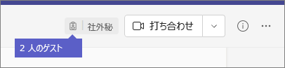

ゲストのエクスペリエンスについてWhat the guest experience is like
=================================

ゲストがチームに参加するように招待されると、「ようこそ」メール メッセージが届きます。When a guest is invited to join a team, they receive a welcome email message. このメッセージには、チームに関するいくつかの情報と、メンバーとして想定されることが記載されています。This message includes some information about the team and what to expect now that they're a member. ゲストは、チームとそのチャネルにアクセスする前に、メール メッセージで **[Microsoft Teams を開く]** を選択して、招待を承諾する必要があります。The guest must accept the invitation by selecting **Open Microsoft Teams** in the email message before they can access the team and its channels.
    

    
すべてのチーム メンバーは、チーム所有者がゲストを追加した旨およびそのゲストの名前を知らせるメッセージを確認することができます。All team members see a message in the channel thread announcing that the team owner has added a guest and providing the guest's name. チームのメンバー全員がゲストが誰であるかを簡単に判断できます。Everyone on the team can identify easily who is a guest. 次のサンプル チームのスクリーンショットで示すように、バナーに「This team has guests (チームにゲストが参加しました)」と示され、各ゲストの名前の横に「**ゲスト**」ラベルが表示されます。As shown in the following screenshot of a sample team, a banner indicates "This team has guests" and a **(Guest)** label appears next to each guest's name.
    

## チーム メンバーとゲスト機能の比較Comparison of team member and guest capabilities

次の表は、組織のチーム メンバーが利用できる Teams の機能と、ゲストが利用できる Teams の機能を比較したものです。The following table compares the Teams functionality available for an organization's team members and its guests.

|**Teams の機能****Capability in Teams**|**組織の Teams ユーザー****Teams user in the organization**|**ゲスト ユーザー****Guest user**|
|:-----|:-----|:-----|
|チャネルの作成Create a channel     *この設定はチーム所有者によって制御されます。**Team owners control this setting.*    |&#x2713;&#x2713;|&#x2713;&#x2713;|
|プライベート チャットに参加するParticipate in a private chat    |&#x2713;&#x2713;|&#x2713;&#x2713;|
|チャネルの会話に参加するParticipate in a channel conversation    |&#x2713;&#x2713;|&#x2713;&#x2713;|
|メッセージを投稿、削除、編集するPost, delete, and edit messages    |&#x2713;&#x2713;|&#x2713;&#x2713;|
|チャネル ファイルを共有するShare a channel file    |&#x2713;&#x2713;|&#x2713;&#x2713;|
|チャット ファイルを共有するShare a chat file    |&#x2713;&#x2713;||
|アプリ (タブ、ボット、コネクタ) を追加するAdd apps (tabs, bots, or connectors)    |&#x2713;&#x2713;||
|会議を作成またはスケジュールにアクセスするCreate meetings or access schedules    |&#x2713;&#x2713;||
|OneDrive for Business ストレージにアクセスするAccess OneDrive for Business storage    |&#x2713;&#x2713;||
|テナント全体およびチーム/チャネルのゲスト アクセス ポリシーを作成するCreate tenant-wide and teams/channels guest access policies    |&#x2713;&#x2713;||
|Office 365 テナントのドメイン外のユーザーを招待するInvite a user outside the Office 365 tenant's domain    *この機能はチーム所有者によって制御されます。**Team owners control this setting.*      |&#x2713;&#x2713;||
|チームを作成するCreate a team    |&#x2713;&#x2713;||
|パブリック チームを検出して参加するDiscover and join a public team    |&#x2713;&#x2713;||
|組織図を表示するView organization chart    |&#x2713;&#x2713;||
|インライン翻訳を使用するUse inline translation    |&#x2713;&#x2713;||
|チーム所有者になるBecome team owner    |&#x2713;&#x2713;||

   
次の表は、ゲストが利用できる通話機能と会議機能を示しており、他の種類のユーザーと比較しています。The following table shows the calling and meeting features available to guests, compared to other types of users.

| 通話機能Calling feature | ゲストGuest | E1 および E3 ユーザーE1 and E3 user | E5 およびエンタープライズ VoIP ユーザーE5 and Enterprise Voice user |
| --------------- | ----- | -------------- | -------------- |
| VOIP 通話VOIP calling | はいYes | はいYes | はいYes |
| グループ通話Group calling | はいYes | はいYes | はいYes |
| 通話の重要なコントロール (保留、ミュート、ビデオのオン/オフ、画面共有) のサポートCore call controls supported (hold, mute, video on/off, screen sharing) | はいYes | はいYes | はいYes |
| 転送先Transfer target | はいYes | はいYes | はいYes |
| 通話を転送するCan transfer a call | はいYes | はいYes | はいYes |
| 取次転送をするCan consultative transfer | はいYes | はいYes | はいYes |
| その他のユーザーを VOIP を介して通話に追加するCan add other users to a call via VOIP | はいYes | はいYes | はいYes |
| 電話番号でユーザーを通話に追加するCan add users by phone number to a call | いいえNo | いいえNo | はいYes |
| 着信転送ターゲットForward target | いいえNo | はいYes | はいYes |
| 通話グループ ターゲットCall group target | いいえNo | はいYes | はいYes |
| 応答しなかったターゲットUnanswered target | いいえNo | はいYes | はいYes |
| フェデレーション通話のターゲットとなるCan be the target of a federated call | いいえNo | はいYes | はいYes |
| フェデレーション通話を発信するCan make a federated call | いいえNo | はいYes | はいYes |
| 通話を即時転送するCan immediately forward their calls | いいえNo | いいえNo | はいYes |
| 複数の通話の呼び出しを同時に行うCan simultaneously ring their calls | いいえNo | いいえNo | はいYes |
| 応答しなかった通話をルーティングするCan route their unanswered calls | いいえNo | いいえNo | はいYes |
| 不在着信をボイスメールに移動するMissed calls can go to voicemail | いいえNo | いいえ1No1 |はいYes |
| 通話を受信できる電話番号を持つHave a phone number that can receive calls | いいえNo | いいえNo | はいYes |
| 電話番号をダイヤルするCan dial phone numbers | いいえNo | いいえNo | はいYes |
| 通話設定にアクセスするCan access call settings | いいえNo | いいえNo | はいYes |
| ボイスメールの挨拶を変更するCan change voicemail greeting | いいえNo | いいえ1No1 | はいYes |
| 着信音を変更するCan change ringtones | いいえNo | いいえNo  | はいYes |
| TTY のサポートSupports TTY | いいえNo | いいえNo | はいYes |
| 代理人を利用するCan have delegates | いいえNo | いいえNo | はいYes |
|  代理人となるCan be a delegate | いいえNo | いいえNo | はいYes |

1 この機能は近日中に利用できるようになります。1 This feature will be available soon.

> [!NOTE]
> Office 365 の管理者は、ゲストが利用できる機能を制御します。Office 365 admins control the features available to guests. 

## よく寄せられる質問Frequently asked questions

### 招待された組織から脱退するにはどうすればよいですか?How do I leave an organization that I've been invited to?
ゲストになりたくない組織から招待されている場合は、その組織から脱退することができます。If you've been invited to an organization that you don't want to be a guest of, you can choose to leave the organization. 詳細については、「[ゲスト ユーザーとして組織を脱退する](https://docs.microsoft.com/azure/active-directory/b2b/leave-the-organization)」を参照してください。For more information, go to [Leave an organization as a guest user](https://docs.microsoft.com/azure/active-directory/b2b/leave-the-organization). あるいは、組織の管理者にテナントから自分を削除するように依頼することもできます。Alternatively, you can ask the admin of the organization to remove you from their tenant. いずれの場合も、今後、組織にアクセスするには、再度テナントに招待してもらう必要があります。Note that in either case you'll need to be re-invited to the tenant if you want to access the organization in the future.

### ゲストはチーム メンバーと同じ機能を利用できますか?Do guests have the same capabilities as team members?
いいえ。No. ゲストが実行できることと実行できないことの詳細については、この記事の「[チーム メンバーとゲスト機能の比較](#comparison-of-team-member-and-guest-capabilities)」を参照してください。For more information about what a guest can and cannot do, go to [Comparison of team member and guest capabilities](#comparison-of-team-member-and-guest-capabilities) in this article.

### ゲストは OneDrive for Business にアクセスできますか?Do guests have access to OneDrive for Business?
いいえ。No.

### ゲストは SharePoint ファイルにアクセスできますか?Do guests have access to SharePoint files?
はい。Yes.

### ゲストがファイル内で検索を行うことができますか?Can guests search within files?
いいえ。No.

### ゲストがファイルを添付することはできますか?Can guests attach files?
はい。ゲストは次の 2 つの方法でファイルを添付することができます。Yes, a guest can attach files in these two ways:

   - 左側のウィンドウの **[ファイル]** を選択し、ファイルの場所を参照する。Select **Files** in the left pane, and then browse to the file location.
   - コンピューターからファイルをアップロードする。Upload files from their computer.

### ゲストはプライベート チャットでファイルをダウンロードできますか?Can a guest download a file in a private chat?
はい、ゲストはプライベート チャットでメンバーからファイルを受け取り、自分のデスクトップにダウンロードすることができます。Yes, they can receive a file from a member in a private chat, and then download it to their desktop.
