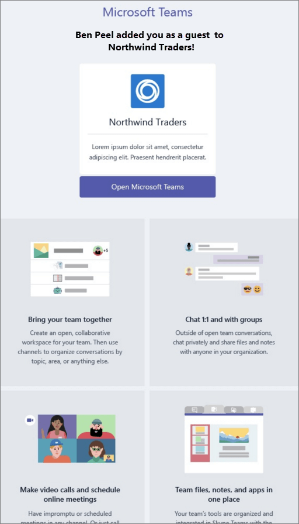
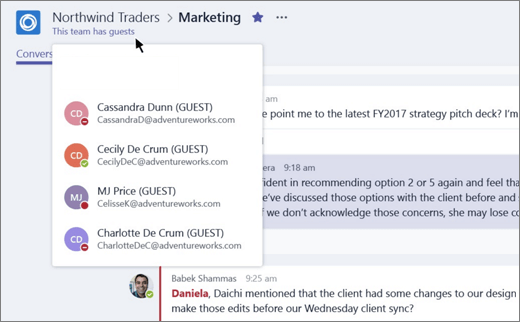

ゲストのエクスペリエンスについてWhat the guest experience is like
=================================

ゲストは、チームへの参加を招待されると、チームに関する情報とメンバーとして利用できる内容を記載する「ようこそ」メール メッセージを受け取ります。When a guest is invited to join a team, they receive a welcome email message that includes some information about the team and what to expect now that they're a member. ゲストは、メール メッセージの招待状と引き換えに、チームやそのチャネルにアクセスできるようになります。The guest must redeem the invitation in the email message before they can access the team and its channels.
  
    
    

  
    
    

  
    
    
すべてのチーム メンバーは、チーム所有者がゲストを追加した旨およびそのゲストの名前を知らせるメッセージを確認することができます。All team members see a message in the channel thread announcing that the team owner has added a guest and providing the guest's name. チームのメンバー全員がゲストが誰であるかを簡単に判断できます。Everyone on the team can identify easily who is a guest. 次のサンプル チームのスクリーンショットで示すように、バナーに「This team has guests (チームにゲストが参加しました)」と示され、各ゲストの名前の横に「ゲスト」ラベルが表示されます。As shown in the following screenshot of a sample team, a banner indicates "This team has guests" and a "GUEST" label appears next to each guest's name.
  
    
    

  
    
    

  
    
    
次の表に、組織のチーム メンバーが利用できる Microsoft Teams の機能とチームのゲスト ユーザーが利用できる機能との比較を示します。The following table compares the Microsoft Teams functionality available for an organization's team members to the functionality available for a guest user on the team.
  
    
    

|**Teams の機能****Capability in Teams**|**組織の Teams ユーザー****Teams user in the organization**|**ゲスト ユーザー****Guest user**|
|:-----|:-----|:-----|
|チャネルの作成Create a channel     *この機能はチーム所有者によって制御されます。**Team owners control this setting.*    |||
|プライベート チャットに参加するParticipate in a private chat    |||
|チャネルの会話に参加するParticipate in a channel conversation    |||
|メッセージを投稿、削除、編集するPost, delete, and edit messages    |||
|チャネル ファイルを共有するShare a channel file    |||
|チャット ファイルを共有するShare a chat file    |||
|アプリ (タブ、ボット、コネクタ) を追加するAdd apps (tabs, bots, or connectors)    |||
|会議を作成またはスケジュールにアクセスCreate meetings or access schedules    |||
|ビジネス ・ ストレージのアクセス OneDriveAccess OneDrive for Business storage    |||
|テナント全体およびチーム/チャネルのゲスト アクセス ポリシーを作成するCreate tenant-wide and teams/channels guest access policies    |||
|Office 365 テナントのドメイン外のユーザーを招待するInvite a user outside the Office 365 tenant's domain    *この機能はチーム所有者によって制御されます。**Team owners control this setting.*      |||
|チームを作成するCreate a team    |||
|パブリック チームを検出して参加するDiscover and join a public team    |||
|組織図を表示するView organization chart    |||
   

    
> [!NOTE]
> ゲストが利用できる機能は Office 365 の管理者によって制御されます。Office 365 admins control the features available to guests. 
  
