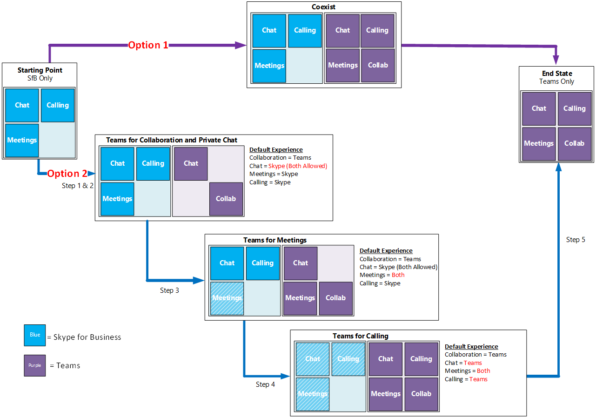
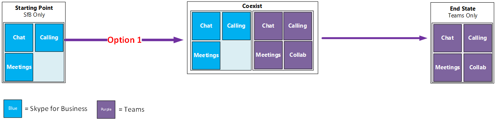
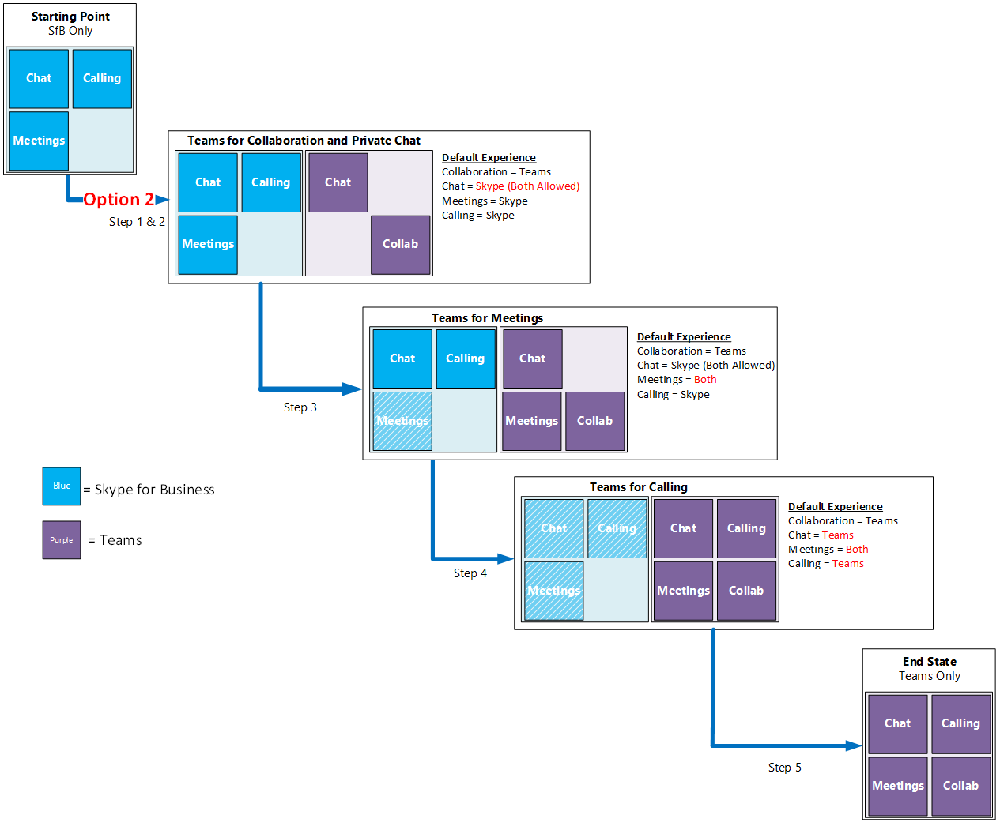

Skype for Business と共存する Microsoft Teams を有効にするEnable Microsoft Teams side-by-side with Skype for Business 
=============================================================

既に Skype for Business Online が展開されている組織にとって、最近発表された Microsoft Teams は単独の通信/コラボレーション ソリューションとしての Teams の潜在力を評価する機会を提供するものです。同時に、組織は 2 つのソリューションのどちらを重視するか、環境においてそれらをどのように共存できるか、ということについて難しい判断をすることになります。For organizations with existing deployments of Skype for Business Online, the recent introduction of Microsoft Teams presents an opportunity to evaluate the potential of Teams as a sole, communications and collaboration solution, and a challenge to tip the scale between the two solutions and how they can coexist in your environment.

Teams が現在のビジネス要件を満たす場合は、組織における単一の通信/コラボレーション ソリューションとして Teams の導入を開始することができます。If Teams can meet your business requirements today, you can start adopting Teams to become your single communications and collaboration solution for your organization.

既定では、Teams は資格あるすべてのテナントで有効になります。Teams is enabled by default, on all eligible tenants. したがって、Skype for Business と共存する形で Teams を管理する方法を決定し、ユーザーの期待に応える取り組みを行う必要があります。Therefore, you need to decide on how to manage Teams side-by-side with Skype for Business, and continue to meet user expectations.

通常、共存の環境ではカスタマーによる 2 つの導入方法があります。In general, there are two major side-by-side customer journeys. 導入方法は次のとおりです。They are:

-   **オプション 1:** 管理下にない共存での導入**Option 1:** Unmanaged side-by-side customer journey.

    IT は共存のエクスペリエンスを積極的に制御しないため、ユーザーは好みのアプリを選択できます。IT does not actively control the side-by-side experience, and users are empowered to make the choice of preferred app.

-   **オプション 2:** 管理下にある共存での導入**Option 2:** Managed side-by-side customer journey.

    IT は、ユーザーに対して Team を段階的に紹介することで共存のエクスペリエンスを制御します。最初に Teams でのプライベート チャット、次に会議のエクスペリエンス、最後に通話のエクスペリエンスというように段階的に新しいチャットベースのコラボレーション ワークスペースを導入します。IT controls the side-by-side experience, taking users through a journey of gradually introducing Teams to first introduce a new chat-based collaboration workspace with private chat, then meeting experiences, and finally the calling experiences in Teams.

共存の利点と考慮事項Side-by-side benefits and considerations
----------------------------------------

それぞれの移行では、組織の概要に基づいて正しい移行パスを決定するために利点と考慮事項を評価する必要があります。Each journey has benefits and considerations to evaluate when determining the right path forward based on your organization's profile. 次の表に、共存の環境におけるカスタマーによる移行について、非管理下と管理下の比較を示します。The table below provides the comparisons between managed and unmanaged side-by-side customer journeys.

<table>
<thead>
<tr class="header">
<th align="left">移行パスMigration Paths</th>
<th align="left">管理下にない共存Unmanaged Side-by-Side</th>
<th align="left">管理下にある共存Managed Side-by-Side</th>
</tr>
</thead>
<tbody>
<tr class="odd">
<td align="left"><strong>組織概要</strong><strong>Organization profile</strong></td>
<td align="left"><ul>
<li>通常、専用の IT リソースのない小規模の組織Typically, smaller organizations with no dedicated IT resources</li>
<li>IT は作業に適したツールの選択をユーザーの裁量にゆだねるIT allows user discretion in selecting right tools for their work</li>
<li>主な Skype for Business の使用法は IM/P と会議Primary Skype for Business usage is IM/P and meetings</li>
</ul></td>
<td align="left"><ul><li>通常、中規模から大規模の組織Typically, mid-size to larger organizations</li>
<li>IT が新しいツールのロールアウトをより積極的に制御することを希望しているIT wants to control roll out of new tools more rigorously</li>
<li>Skype for Business の導入を深めるDeeper adoption of Skype for Business today</li>
<li>ネットワークとインフラストラクチャの複雑性の増加Increased complexity in network and infrastructure</li>
<li>複数の場所Multiple locations

<li>独自の UC 機能を持つ単一アプリの選択Preference for single app with unique UC capabilities</li></ul></td>
</tr>
<tr class="even">
<td align="left"><strong>利点</strong><strong>Benefits</strong></td>
<td align="left"><ul>
<li>Skype for Business で利用できない Teams の機能を活用するLeverage capabilities in Teams that are not available in Skype for Business</li>
<li>Office 365 内で機能強化された最新のワークプレースEnhanced modern workplace within Office 365</li>
<li>ユーザーの柔軟性の向上Increased user flexibility</li>
<li>すべての機能を一度に有効化できるEnable all capabilities at once</li>
</ul></td>
<td align="left"><ul><li>Skype for Business で利用できない Teams の機能を活用するLeverage capabilities in Teams that are not available in Skype for Business</li>
<li>Office 365 内で機能強化された最新のワークプレースEnhanced modern workplace within Office 365</li>
<li>ユーザーの生産性への影響を最小限に抑えるMinimize user productivity impact</li>
<li>機能の重複を削減するReduce capability overlap</li>
<li>UC シナリオにおける最適なツール選択Streamline tool choice for UC scenarios</li>
<li>組織で必要に応じて機能を有効化できるように IT およびビジネスを強化するEmpower IT and business to enable capabilities as appropriate in organization</li>
<li>ユーザーのために変更のペースを制御するControl the pace of change for users</li></ul></td>
</tr>
<tr class="odd">
<td align="left"><strong>考慮事項</strong><strong>Considerations</strong></td>
<td align="left"><ul>
<li>同様の重複する機能を持つ複数のアプリMultiple apps with similar, overlapping capabilities</li>
<li>サポート コールの増加、存在感のない IT、生産性への影響の増大といった問題につながるユーザーの困惑を引き起こす可能性の増加Increased potential for user confusion which can lead to increased support calls, shadow IT, impacted productivity</li>
<li>ネットワーク計画および監視では 2 つのサービスの使用を考慮する必要があるNetwork planning and monitoring must take usage of two services into consideration</li>
<li>即座に行う必要のある変更管理の取り組み (啓発、トレーニング、サポート) の増大Increased and immediate change management efforts required: awareness, training, and support</li>
<li>ユーザーがアプリ間の相互運用に関する制限に直面する可能性Users may experience interoperability limitations between apps</li>
</ul></td>
<td align="left"><ul><li>IT がライセンスからユーザー エクスペリエンスまで細かい制御を行うため、計画と実装において追加のサイクルが必要になるIT has granular control, from licensing to user experiences, requiring additional cycles of planning and implementation</li>
<li>Teams の選択機能を無効にするために必要なユーザーの指導とアクションUser education and action required to disable select capabilities in Teams</li>
<li>Teams の選択機能を無効にするために必要な変更管理の取り組みChange management efforts required to disable select capabilities in Teams</li>
<li>ネットワーク計画および監視では 2 つのサービスの使用を考慮する必要があるNetwork planning and monitoring must take usage of two services into consideration</li>
<li>ユーザーがアプリ間の相互運用に関する制限に直面する可能性Users may experience interoperability limitations between apps</li></ul></td>
</tr>
</tbody>
</table>

管理下にない共存での移行Unmanaged side-by-side customer journey
---------------------------------------

管理下にない共存での移行では、Teams はコラボレーション ソリューション (チャットベースのワークスペース、チャネル、アプリ、その他の Office 365 ワークロードとの統合など) として導入されます。この場合、デスクトップ コンピューター (PC または Mac) やモバイル デバイスでのクライアント ソフトウェアや Web クライアントを使用することになります。In an unmanaged side-by-side customer journey, Teams is introduced as a collaboration solution (chat-based workspace, channels, apps, integration with other Office 365 workloads, etc.) that involves client software and web client on desktop computers (PC or Mac) and mobile devices.

既定では、Teams にはプライベートのチャットと通話、予約済み会議など、Skype for Business と重複する機能も存在します。By default, Teams also presents overlapping capabilities with Skype for Business, these include private chat and calling, and scheduled meetings. これは、Teams が組織に完全な通信/コラボレーション ソリューションを提供するということであると同時に、Skype for Business にも同様な機能が存在することを意味します。This means Teams ends up providing complete communications and collaboration for the organization, while at the same time Skype for Business provides similar capabilities.

Teams は Skype for Business Online ユーザーとの相互運用性をサポートするため、ユーザーは Teams を起動するときに好みのチャット アプリや通話アプリを選択できます。Teams supports interoperability with Skype for Business Online users, and users will be given an opportunity to choose their preferred chat and calling app when they launch Teams. ユーザーが好みのアプリとして Teams を選択し、別のユーザーが Teams をインストールしておらず Skype for Business を好みのチャット/通話 アプリとして選択した場合でも、Teams に搭載される相互運用性を介してお互いにチャットや通話を行うことができます。If one user picks Teams as the preferred app, and another user hasn’t installed Teams or picked Skype for Business as the preferred chat and calling app, they can continue to chat and call each other through the interop capabilities that are part of Teams.

Microsoft は相互運用のエクスペリエンスを継続的に向上させています。Microsoft is continuously improving the interop experiences. 初期の段階では、相互運用のエクスペリエンスがユーザーの期待に応えていないケースが存在した可能性もあります。In the beginning, there may be some cases whereby the interop experiences are not meeting user expectations. ユーザーは現在でも Skype for Business を利用できるため、Skype for Business に切り替えて Teams によって提供されていない機能を補完することができます。Since Skype for Business is still available to users, they can switch to Skype for Business for the capabilities that currently cannot be served by Teams.

重複するもう 1 つの機能に Teams の予約済み会議があります。この機能では、ユーザーは Teams 会議または Skype for Business 会議のいずれかを予約できます。Scheduled meetings in Teams is another overlapping capability that lets users schedule Teams meetings, or Skype for Business meetings. これらのソリューションにはそれぞれの利点がありますが、Teams の会議エクスペリエンスがビジネス要件に適合するもので、Skype for Business 会議の機能を超えるようになると、ユーザーは自然と Teams 会議に移行することが予測されます。Each has its own advantages, and over time, when Teams meeting experience meets business requirements or surpasses the functionalities of Skype for Business meetings, we expect users to naturally switch to Teams meetings.

管理下にない共存での移行では、相互運用の機能に関する問題に直面するユーザーからのサポート コールを処理するため、ヘルプデスク チームを用意する必要があります。In this unmanaged side-by-side customer journey, prepare your helpdesk team to handle support calls from users when facing issues with interop capabilities. または、Teams 会議または Skype for Business 会議のどちらを優先すべきかユーザーにアドバイスを提供します。Or advise users when to choose Teams meetings over Skype for Business meetings, and vice versa.

共存でのこの移行は組織規模で適用可能であり、ユーザーは管理下にない共存のエクスペリエンスの特質を受け入れる立場にあります。したがって、組織はユーザーの要件に合う最適な通信/コラボレーション ツールを選択することを率直に受け入れることになります。This side-by-side customer journey may be applicable to your organization, whereby the users are more receptive to the nature of the unmanaged side-by-side experience, and the organization openly allows the users to pick the best communications and collaboration tools that suit their requirements.

管理下にある共存での移行Managed side-by-side customer journey
-------------------------------------

Teams の導入に対する制御を強めたい組織は、管理下にある共存での移行を開始します。A managed side-by-side customer journey starts with organization wanting more control over how Teams is introduced.

-   この移行の**最初のステップ**では、最新のコラボレーション要件 (チャットベースのワークスペース、チャネル、アプリ、その他の Office 365 ワークロードとの統合など) に範囲を絞った Teams の制限付きパイロットを実施します。The **first step** of this journey is a limited pilot of Teams scoped to modern collaboration requirements (chat-based workspace, channels, apps, integration with other Office 365 workloads, etc.). Teams で臨時のチャネル会議やプライベート チャットも有効にして、パイロット ユーザーに Teams 会議とプライベート チャットのエクスペリエンスを評価する機会を与えます。Ad-hoc channel meetings and private chat in Teams is also enabled to provide a chance for pilot users to evaluate the Teams meetings experience and private chat experiences. この段階では、Teams の予約済み会議とプライベート通話機能は無効にしておきます。Scheduled meetings and private calling capabilities in Teams are disabled at this stage. パイロットを開始するには、「[Pilot Teams with Skype for Business (Skype for Business と共存する Teams のパイロット)](pilot-essentials.md)」をご覧ください。To get started with a pilot, go to [Pilot Teams with Skype for Business](pilot-essentials.md).
    
-   導入の **2 番目のステップ**では、組織全体でプライベート チャットによる最新のコラボレーションに向けて Teams のロールアウトを拡張します。The **second step** of this journey is extending the rollout of Teams for modern collaboration with private chat throughout the organization. Skype for Business 機能との重複を回避するため、Teams で予約済み会議とプライベート通話を継続して無効のままにします。Scheduled meetings, and private calling continue to be disabled in Teams to reduce the overlap  with with Skype for Business capabilities.

    この段階では、組織全体で優先するチャット アプリケーションを Teams または Skype for Business のいずれかに設定するかを考慮しなければならない場合があります。At this stage, you may need to consider whether preferred chat application should be set to Teams or Skype for Business for the entire organization.

    - Teams に設定する場合は、組織内の他の部門や組織全体で通信を行う場合に直面する相互運用の課題に初期の段階で対処できるようユーザーを指導する必要があります。If set to Teams, prepare your users to handle early interoperability challenges when communicating with other parties within and across the organization.
    
    - Skype for Business に設定する場合でも、Teams 内でのプライベート チャットは Teams 内で実行されます。エンドユーザーは Teams 内でそのチャット機能が備えるクロスプラットフォームの特長をすぐに活用できます。同時に、ユーザーは組織内または組織全体の Skype for Business ユーザー同士のプライベート チャットにこれまでどおり Skype for Business を使用できます。If set to Skype for Business, private chats within Teams will remain in Teams, and end users can immediately take advantage of the cross-platform persistent nature of chat capabilities within Teams, and they will continue to use Skype for Business for private chats among Skype for Business users, within the organization and across the organization.

<table>
<thead>
<tr class="header">
<td align="center">

注意Note
</td>
<td align="left">  現時点では、チャット アプリケーションの優先設定はクライアント レベルでのみ利用できます。Currently the preferred chat application setting is available only at the client level. 意図した組織全体にわたる構成を促進するためにユーザー トレーニングや導入キャンペーンを行う必要があります。User training and adoption campaign will be required to drive the intended organization-wide configuration.</td>
</tr>
</thead>
<tbody>
</tbody>
</table>

管理下にある共存での移行の **3 番目のステップ**は、組織が Teams の会議エクスペリエンスと機能が組織のビジネス要件に適合すると判断した時点で開始します。The **third step** of the managed side-by-side customer journey starts when the organization decides that Teams meeting experience and capabilities meet their business requirements. Teams のプライベート会議とチャネル会議を有効にすると、ユーザーは Teams 会議と Skype for Business 会議の両方を予約することができるオプションを利用できます。By enabling private and channel meetings in Teams, users are presented with options to schedule both Teams meetings and Skype for Business meetings. したがって、Teams の継続的な革新性を考慮すれば、時間の経過とともにユーザーは Teams 会議に移行することが予測されます。Therefore, it is expected that over time users will naturally switch to Teams meetings given the continued innovations in Teams. Skype for Business から Teams への使用の切り替えを円滑に促すために、Teams を使い始めるに際しての明瞭なガイダンスを利用して Teams がユーザーに提供する付加価値を説明する、トレーニング、サポート、コミュニケーションを含む強力な変更管理プログラムを実施します。To be successful in steering usage from Skype for Business to Teams, implement a robust change management program inclusive of training, support and communications that explains the value-add that Teams offers to the user, with clear guidance on how to get started with Teams. 啓発キャンペーンの設計に役立つ [User Readiness (ユーザーの準備状況)](http://aka.ms/UserReadiness) リソースをご利用いただけます。Leverage our [User Readiness](http://aka.ms/UserReadiness) resources to help design your awareness campaign.

管理下にある共存での移行の **4 番目のステップ**では Teams の通話機能を有効にします。The **fourth step** of the managed side-by-side customer journey begins with enabling calling in Teams. このステップでは、シームレスな共存エクスペリエンスを確実にするために Teams の相互運用機能を重視します。Teams interoperability capabilities will feature heavily in this step to ensure a seamless side-by-side experience. プライベート通話に Teams を使用することを推進するには、Teams を既定の通信アプリとして設定することが理想的です。Ideally, to enforce the use of Teams for private calling, Teams is set as the default calling app. 

時間の経過とともに、通信およびコラボレーションの要件を満たすために、組織全体で Teams だけに依存するようになり、**5 番目のステップ**に進むことが予測されます。Over time, potentially the whole organization can rely solely on Teams to meet communications and collaboration requirements and take the **fifth step**. Teams に新機能が導入される時期については、「[Office 365 Roadmap (Office 365 ロードマップ)](http://aka.ms/TeamsRoadmap)」をご覧ください。To see when new features are coming in Teams, see the [Office 365 Roadmap](http://aka.ms/TeamsRoadmap). 

共存エクスペリエンスの管理Managing side-by-side experience
--------------------------------

既定では、資格のある Office 365 サブスクリプションを保有している組織では、Microsoft Teams が有効化されます。By default, for organizations with eligible Office 365 subscriptions, Microsoft Teams is enabled. 組織が管理下にない共存での移行の条件に適合する場合は、現状を維持して Microsoft Teams の導入を自然な流れで促すことをお勧めします。If your organization fits the profile for unmanaged side-by-side customer journey, we highly recommend you keep it as-is to foster organic adoption of Microsoft Teams.

Teams は、IT 管理権限が不要な最新の Web ブラウザー デスクトップ クライアント (インストール時。現時点では PC にのみ適用可能) やモバイル クライアントからアクセスできます。Teams is accessible via modern Web browser desktop clients which require no IT administrative privilege (for installation, currently applicable to PC only) and mobile clients.

プライベートなチャットや通話から、臨時会議や予約済み会議、およびアプリまで、Teams のすべての機能は既定で有効になります。そのため、ユーザーはニーズに合わせて機能を試したり使用したりすることができます。All capabilities in Teams, from private chat and calling, ad-hoc and scheduled meetings, and apps are enabled by default, allowing users to experiment and use the capabilities that suit their needs. Teams の初回実行時のエクスペリエンスにより、ユーザーは好みのチャット/通話アプリケーション (Microsoft Teams または Skype for Business) を選ぶことができます。A first-run experience in Teams guides users to pick their preferred chat and calling application (Microsoft Teams or Skype for Business).

Teams などの新しいツールのリリースを組織でより積極的に制御する場合は、管理下の共存での移行について次のオプションを考慮することができます。Should your organization require a more controlled release of new tools such as Teams, the following options can be considered for your managed side-by-side customer journey, they are:

-   コラボレーションに向けた Teams のパイロットおよびロールアウトPilot and rollout of Teams for collaboration. 「[Pilot Teams with Skype for Business (Skype for Business と共存する Teams のパイロット)](pilot-essentials.md)」をご覧ください。See [Pilot Teams with Skype for Business](pilot-essentials.md).

-   会議に向けた Teams のロールアウトRollout of Teams for meetings

-   通話に向けた Teams のロールアウトRollout of Teams for calling

### コラボレーションに向けた Teams のパイロットとロールアウトTeams pilot and rollout for collaboration

Microsoft Teams は、Office 365 グループの機能強化を通して、Office 365 との統合と常設チャットを基礎として構築されています。At its core, Microsoft Teams was built around persistent chat and integration with Office 365 by enhancing Office 365 Groups.

既定では、資格のある Office 365 サブスクリプション ライセンスを有する組織内のユーザーは Teams に対して有効になるため、制限付きの Teams パイロットはパイロット グループ外のすべてのユーザーの Teams ライセンスを無効にすることに関係します。Since by default users in your organization with an eligible Office 365 subscription license are enabled for Teams, a limited Teams pilot will involve disabling the Teams license for all users who are outside of the pilot group.

コラボレーションとプライベート チャットのソリューションとしての Teams のリリースに焦点をあてて、Skype for Business と機能が重複していることによるユーザーの混乱を軽減するには、Office 365 テナント レベルで次の設定を変更することができます。To focus the Teams release as a collaboration and private chat solution, and to reduce user confusion due to overlapping capabilities with Skype for Business, you can change the following settings at the Office 365 tenant level. Office 365 設定を変更するには、「[Office 365 を使用する組織で Microsoft Teams をセットアップする](Office-365-set-up.md)」をご覧ください。To change these Office 365 settings, see [Set up Microsoft Teams in your Office 365 organization](Office-365-set-up.md).

<table>
<thead>
<tr class="header">
<th align="left">セクションSection Heading</th>
<th align="left">設定Setting</th>
<th align="left">説明Description</th>
</tr>
</thead>
<tbody>
<tr class="odd">
<td align="left"><strong> 通話と会議</strong>Calls and meetings</strong></td>
<td align="left">
プライベート会議の予約を許可する: <strong>オフ</strong>Allow scheduling for private meetings: <strong>Off</strong>

チャネル会議の予約を許可する: <strong>オフ</strong>Allow scheduling for channel meetings: <strong>Off</strong>

プライベート通話を許可: <strong>オフ</strong>Allow private calling: <strong>Off</strong>
</td>
<td align="left">
この設定を無効にすると、ユーザーはプライベート会議を予約できなくなります。Disabling this setting prevents users from scheduling private meetings

この設定を無効にすると、ユーザーはチャネル会議を予約できなくなります。Disabling this setting prevents users from scheduling channel meetings

この設定を無効にすると、ユーザーはプライベート通話 (音声およびビデオ) を行うことができなくなります。Disabling this setting prevents users from making private calls (audio and video)
</td>
</tr>
</tbody>
</table>

<table>
<thead>
<tr class="header">
<td align="center">

注意Note
</td>
<td align="left">  Business ユーザーと Enterprise ユーザーの両方でプライベート通話を無効にする必要があります。組織でゲスト アクセスが適用可能な場合はゲスト ユーザーのプライベート通話も無効にする必要があります。You must disable Private Calling to both Business and Enterprise users, and Guest users (if Guest Access is applicable to your organization).</td>
</tr>
</thead>
<tbody>
</tbody>
</table>

この構成では、最新のコラボレーション エクスペリエンスの一部として、臨時のチャネル会議の使用を促進し、音声、ビデオ、画面共有の使用を有効にすることで、Teams の会議の仕組みをユーザーに紹介することができます。With this configuration, users can be introduced to how meetings work in Teams by advocating the use of ad-hoc channel meetup, enabling the use of voice, video, and screen sharing as part of the modern collaboration experience. エンドユーザーは Teams のクロスプラットフォームの常設プライベート チャット機能も利用できます。End users can also benefit from Teams persistent, cross-platform, private chat capabilities.

コラボレーションおよびプライベート チャットに向けた Teams のパイロットが成功したら、その次にすべてのユーザーに対して Teams ライセンスを有効にして組織全体で広範なロールアウトを実施できます。A successful Teams pilot for collaboration and private chat can be followed up with broad rollout throughout the organization by enabling Teams license for all users.

<table>
<thead>
<tr class="header">
<td align="center">

注意Note
</td>
<td align="left">パイロットの実施時、およびプライベート チャットが有効な段階 2 では、Skype for Business ユーザーとの Teams ユーザーのチャットで次の操作を行うことができません。During the pilot, and in phase two when private chat is enabled, a Teams user chatting with a Skype for Business user will not be able to do the following: 
- チャット セッションからビデオ通話を開始する
- Start video call from a chat session 
- ファイルを転送する
- Transfers files  
- チャット セッションから複数パーティ間の通話を開始する
- Initiate a multiparty call from the chat session 
- ユーザーはデスクトップ共有セッションを開始できない
- Users will not be able to start a desktop sharing session 

</td>
</tr>
</thead>
<tbody>
</tbody>
</table>

### 会議に向けた Teams のロールアウトRollout of Teams for meetings

ユーザーが Microsoft Teams を使用したコラボレーションに慣れてきたら、次に有効にする機能として予約済み会議を検討します。As users are getting accustomed to collaborating using Microsoft Teams, scheduled meetings can be considered as the next capability to enable in the organization.

<table>
<thead>
<tr class="header">
<td align="center">

注意Note
</td>
<td align="left">  予約済み会議の開催者には、Exchange Online マルチテナント (または Exchange Online 専用 vNext) でのメールボックスが必要です。The organizers of scheduled meetings must have their mailboxes in Exchange Online multi-tenant (or Exchange Online Dedicated vNext).</td>
</tr>
</thead>
<tbody>
</tbody>
</table>

テナントレベルで次の設定を構成して、Teams で予約済み会議を有効にします。これらの設定は Business および Enterprise ユーザーにのみ適用されます。The following settings can be configured at the tenant level to enable scheduled meetings in Teams, and the settings are applicable to Business and Enterprise users only.

<table>
<thead>
<tr class="header">
<th align="left">セクションSection Heading</th>
<th align="left">設定Setting</th>
<th align="left">説明Description</th>
</tr>
</thead>
<tbody>
<tr class="odd">
<td align="left"><strong> 通話と会議</strong>Calls and meetings</strong></td>
<td align="left">
プライベート会議の予約を許可する: <strong>オン</strong>Allow scheduling for private meetings: <strong>On</strong>

チャネル会議の予約を許可する: <strong>オン</strong>Allow scheduling for channel meetings: <strong>On</strong>
</td>
<td align="left">
この設定を有効にすると、ユーザーはプライベート会議を予約できようになります。Enabling this setting allows users to schedule private meetings

この設定を有効にすると、ユーザーはチャネル会議を予約できるようになります。Enabling this setting allows users to schedule channel meetings
</td>
</tr>
</tbody>
</table>

予約済み会議は、Teams デスクトップ クライアントやブラウザー、または Microsoft Teams の会議アドインを使用した Microsoft Outlook で開催できます。Scheduled meetings can be organized via the Teams desktop client, a browser, or via Microsoft Outlook using the meeting add-in for Microsoft Teams. Teams で予約済み会議を有効にすると同時に、ユーザーに対して新しい Teams 会議の作成、既存の Skype for Business から Teams 会議への更新についての指導を開始することをお勧めします。Once scheduled meetings in Teams is enabled, we recommend you start educating users to create new Teams meetings or update existing Skype for Business meetings to Teams meetings.

### 通話に向けた Teams のロールアウトRollout of Teams for calling

Teams のプライベート通話の機能は、Skype for Business に取って代わる強力な機能として継続して開発されます。Private calling is the Teams capability that will be continuously developed, and over time provide a compelling replacement to Skype for Business. Teams のプライベート通話機能が主要なビジネス要件に適合すると組織が判断した場合は、Teams のプライベート通話を有効にするために次の設定をテナントレベルで構成することができます。When your organization considers that Teams private calling capabilities meet key business requirements, the following settings can be configured at the tenant level to enable private calling in Teams. 

<table>
<thead>
<tr class="header">
<th align="left">セクションSection Heading</th>
<th align="left">設定Setting</th>
<th align="left">説明Description</th>
</tr>
</thead>
<tbody>
<tr class="odd">
<td align="left"><strong> 通話と会議</strong>Calls and meetings</strong></td>
<td align="left">
Allow private calling (プライベート通話を許可): <strong>オン</strong>Allow private calling: <strong>On</strong>
</td>
<td align="left">
この設定を有効にすると、ユーザーはプライベート通話 (音声およびビデオ) を行うことができます。Enabling this setting allows users to place private calls (audio and video)
</td>
</tr>
</tbody>
</table>

<table>
<thead>
<tr class="header">
<td align="center">

注意Note
</td>
<td align="left">  Allow users to chat privately (ユーザーがプライベートでチャットすることを許可する): この設定を有効にすると、ユーザーは他のユーザーとプライベートでチャットすることができるようになります。Allow users to chat privately: Enabling this setting allows users to chat with other users privately.</td>
</tr>
</thead>
<tbody>
</tbody>
</table>

この段階では、優先する通話アプリとして Teams を選択するようにすべてのユーザーに指導します。At this stage, all users must be instructed to choose Teams as the preferred calling app.

プライベート通話を有効にすることで、Skype for Business が提供するすべての機能が Teams で利用可能になり、ユーザーは通信とコラボレーションの要件を完全に満たすソリューションとして Teams の使用を開始できます。With the enablement of private calling, Teams will deliver all capabilities currently provided by Skype for Business, and users can start using Teams to fulfill their communications and collaboration requirements.

<table>
<thead>
<tr class="header">
<td align="left">

</td>
<td align="left">

<strong>次のアクション:</strong> Skype for Business と共存する Teams を稼動状態にしたら、[ユーザーによる Teams の導入を介してその価値を創出](continue-journey.md)すると同時に Skype for Business から Teams への移行を継続的に実施します。<strong>Next Action:</strong> Once Teams is up and running side-by-side with Skype for Business, [Drive Value through user adoption of Teams](continue-journey.md), while continuing your journey from Skype for Business to Teams.</td>
</tr>
</thead>
<tbody>
</tbody>
</table>