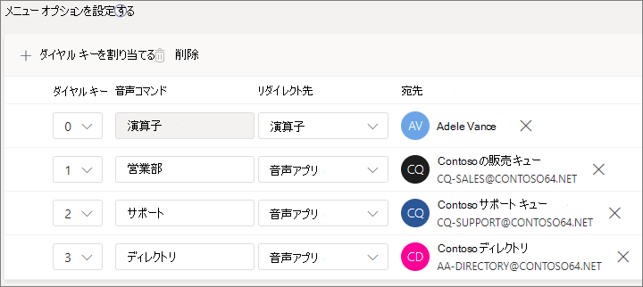
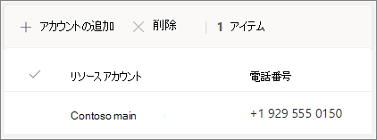

#### はじめにBefore you begin

組織外から直接ダイヤルしてアクセスできる自動応答に必要なサービス番号 (サービス番号は、自動応答で使用される特殊な種類の電話番号) を取得します。Get the service numbers (service numbers are a special type of phone number that are used by auto attendants) that you need for the auto attendants that you want to be accessible by direct dialing from outside your organization. これには、別 [のプロバイダーからの番号の転送](../phone-number-calling-plans/transfer-phone-numbers-to-teams.md) や、新 [しいサービス番号の要求が含まれる場合があります](../getting-service-phone-numbers.md)。This might include [transferring numbers from another provider](../phone-number-calling-plans/transfer-phone-numbers-to-teams.md) or [requesting new service numbers](../getting-service-phone-numbers.md).

各自動応答には、仮想ユーザー ライセンス電話システム割り当てる必要があります。Each auto attendant needs to be assigned a Phone System - Virtual User license. Business Voice を購入した場合は、多数の仮想電話システムライセンスも受け取ったので、それ以上要求する必要はありません。When you purchased Business Voice, you also received a number of Phone System - Virtual User licenses, so you probably don't need to request more. ただし、今後さらに必要な場合は、「仮想ユーザー ライセンス 」 の手順に従電話システム[取得できます](../teams-add-on-licensing/virtual-user.md)。However, if you need more in the future, you can get them by following the instructions in [Phone System - Virtual User license](../teams-add-on-licensing/virtual-user.md).

休日に自動応答ルートの呼び出しを異なる方法で行う場合は、自動応答を作成する前に、使用する祝日を作成します。If you want to have your auto attendant route calls differently on holidays, then [create the holidays that you want to use](../set-up-holidays-in-teams.md) before you create the auto attendant.

#### 自動応答を設定するには、次の手順に従います。Follow these steps to set up your auto attendant

# [手順 1 電話   番号Step 1 Phone number](#tab/phone-number)

> [!NOTE]
> 初めて Business Voice を設定する手順に従っている場合、[手順 **6:** 会社の主要電話番号の自動応答を設定する] をオンにしている場合は、このタブの手順を既に完了しています。次のタブに移動します。 [自動応答の一般的な情報](?tabs=general-info#steps)。If you're following the steps to set up Business Voice for the first time and you're on **Step 6: Set up an auto attendant for your company's main phone number**, you've already finished the steps on this tab. Move to the next tab: [Auto attendant general info](?tabs=general-info#steps).

作成する各自動応答には、リソース アカウントが必要です。Each auto attendant that you create requires a resource account. これは、ユーザー アカウントに似ていますが、アカウントがユーザーではなく自動応答キューまたは通話キューに関連付けられている点を除きます。This is similar to a user account, except the account is associated with an auto attendant or call queue instead of a person. この手順では、アカウントを作成し、仮想ユーザー ライセンスMicrosoft 365 電話システム割り当て、サービス番号を割り当てします。In this step, we'll create the account, assign it a *Microsoft 365 Phone System - Virtual User* license, and then assign a service number.

### リソース アカウントを作成するCreate a resource account

リソース アカウントは、管理センター Teams作成できます。You can create a resource account in the Teams admin center.

1. 管理センター Teams、組織全体の設定 **を** 展開し、[リソース アカウント]**をクリックします**。In the Teams admin center, expand **Org-wide settings**, and then click **Resource accounts**.

2. **[追加]** をクリックします。Click **Add**.

3. [リソース **アカウントの追加]** ウィンドウで、[表示名] 、[ユーザー名]**を入力\*\*\*\*し**、[リソース アカウントの種類] で [**自動** 応答]**を選択します。**In the **Add resource account** pane, fill out **Display name**, **Username**, and choose **Auto attendant** for the **Resource account type**

    

4. **[保存]** をクリックします。Click **Save**.

    新しいアカウントがアカウントの一覧に表示されます。The new account will appear in the list of accounts.

    

### ライセンスを割り当てるAssign a license

リソース アカウントには、Microsoft 365 電話システム *仮想ユーザー ライセンスを割* り当てる必要があります。You must assign a *Microsoft 365 Phone System - Virtual User* license to the resource account.

1. 管理センター Microsoft 365、ライセンスを割り当てるリソース アカウントをクリックします。In the Microsoft 365 admin center, click the resource account to which you want to assign a license.

2. [ライセンスと **アプリ] タブの**[ライセンス **] の下で**、[Microsoft 365 電話システム **- 仮想ユーザー] を選択します**。On the **Licenses and Apps** tab, under **Licenses**, select **Microsoft 365 Phone System - Virtual User**.

3. [変更 **を保存] をクリックします**。Click **Save changes**.

    

### サービス番号を割り当てるAssign a service number

この自動応答を電話番号で到達可能にする必要がある場合は、その番号をリソース アカウントに割り当てる必要があります。If you need this auto attendant to be reachable by a phone number, then assign that number to the resource account.

1. 管理センター Teams [リソース アカウント]ページで、サービス番号を割り当てるリソース アカウントを選択し、[割り当て/割り当て解除] を **クリックします**。In the Teams admin center, on the **Resource accounts** page, select the resource account to which you want to assign a service number, and then click **Assign/unassign**.

2. [数値 **電話] ドロップダウン** で、使用する数値の種類を選択します。In the **Phone number type** dropdown, choose the type of number that you want to use.

3. [割り **当て済み電話番号]** ボックスで、使用する番号を検索し、[追加] を **クリックします**。In the **Assigned phone number** box, search for the number you want to use and click **Add**.

    

4. **[保存]** をクリックします。Click **Save**.

> [!div class="nextstepaction"]
> [手順 2 - 自動応答の一般的な>Step 2 - Auto attendant general info >](?tabs=general-info#steps)

# [手順 2   アテンダントの一般的な情報Step 2 Attendant general info](#tab/general-info)

自動応答を設定するにはTo set up an auto attendant

1. 管理センター Teams[音声] を **展開し**、[**自動** 応答] をクリックし、[追加] を **クリックします**。In the Teams admin center, expand **Voice**, click **Auto attendants**, and then click **Add**.

2. 上部のボックスに自動応答の名前を入力します。Type a name for the auto attendant in the box at the top.

3. 演算子を指定する場合は、オペレーターの呼び出し先を指定します。If you want to designate an operator, specify the destination for calls to the operator. これは省略可能です (ただし、推奨)。This is optional (but recommended). [オペレーター] **オプションを設定** すると、呼び出し元がメニューから抜け出し、指定されたユーザーと話すことができます。You can set the **Operator** option to allow callers to break out of the menus and speak to a designated person.

4. この自動応答のタイム ゾーンを指定します。Specify the time zone for this auto attendant. タイム ゾーンは、時間外に別の通話フローを作成する場合に、営業時間の計算に使用されます。The time zone is used for calculating business hours if you create a separate call flow for after hours.

5. この自動応答の言語を指定します。Specify a language for this auto attendant. これは、システムで生成された音声プロンプトに使用される言語です。This is the language that will be used for system-generated voice prompts.

6. 音声入力を有効にする場合に選択します。Choose if you want to enable voice inputs. 有効にすると、すべてのメニュー オプションの名前が音声認識キーワードになります。When enabled, the name of every menu option becomes a speech-recognition keyword. たとえば、呼び出し元が "One" と言ってキー 1 にマップされたメニュー オプションを選択したり、"Sales" と読み上げ、"Sales" という名前のメニュー オプションを選択することができます。For example, callers can say "One" to select the menu option mapped to key 1, or they can say "Sales" to select the menu option named "Sales."

    

7. **[次へ]** をクリックします。Click **Next**.

> [!div class="nextstepaction"]
> [手順 3 - フローの呼び出し>Step 3 - Call flow >](?tabs=call-flow#steps)

# [手順 3 通話   フローStep 3 Call flow](#tab/call-flow)

通話フローのオプションを選択するChoose your call flow options

1. 自動応答が通話に応答するときに、あいさつを再生する場合に選択します。Choose if you want to play a greeting when the auto attendant answers a call.

    [オーディオ ファイルの **再生] を** 選択した場合は、[アップロード ファイル] ボタンを使用して、オーディオとして保存された録音済みグリーティング メッセージをアップロードできます。WAV、.MP3、または .WMA 形式。If you select **Play an audio file** you can use the **Upload file** button to upload a recorded greeting message saved as audio in .WAV, .MP3, or .WMA format. 記録は 5 MB 以下に設定できます。The recording can be no larger than 5 MB.

    [あいさつメッセージを入力する] を選択すると、自動応答が通話に応答すると、入力したテキスト (最大 1,000 文字) が読み上げされます。If you select **Type a greeting message** the system will read the text you the text that you type (up to 1000 characters) when the auto attendant answers a call.

    

2. 通話のルーティング方法を選択します。Choose how you want to route the call.

    [切断] **を選択** すると、自動応答によって通話がハングします。If you select **Disconnect**, the auto attendant will hang up the call.

    [通話の **リダイレクト] を選択** した場合は、通話ルーティングの宛先のいずれかを選択できます。If you select **Redirect call**, you can choose one of the call routing destinations.

    [再生] メニュー **オプションを選択した** 場合は、[音声ファイルの再生] または [あいさつメッセージに入力] を選択し、メニュー オプションとディレクトリ検索の間で選択できます。If you select **Play menu options**, you can choose to **Play an audio file** or **Type in a greeting message** and then choose between menu options and directory search.

    

3. 呼び出し元がダイヤル キーを使用して移動する場合は、[メニュー オプションの設定] で、発信者がダイヤル キーを押した場合に発生する操作を選択します。If you want callers to use dial keys to navigate, then under **Set menu options**, choose what you want to happen when callers press a dial key. (この自動応答を会社のディレクトリとして作成する場合は、ダイヤル キー オプションを空白のままにします)。(If you're creating this auto attendant as a company directory, leave the dial key options blank.)

    ダイヤル キーは、次の宛先に設定できます。You can set any of the dial keys to the following destinations:

    - **組織内のユーザー** - 音声通話を受信できる組織内のユーザー。**Person in the organization** - a person in your organization who is able to receive voice calls.
    - **音声アプリ** - 別の自動応答または通話キュー。**Voice app** - another auto attendant or a call queue.
    - **外部電話番号** - 任意の電話番号。**External phone number** - any phone number. 次の形式を使用します。+[国コード][地域コード][電話番号]Use this format: +[country code][area code][phone number]
    - **ボイス** メール - 指定したグループに関連Microsoft 365ボイス メールボックス。**Voicemail** - the voice mailbox associated with a Microsoft 365 group that you specify.
    - **Operator** - 自動応答に対して定義された演算子。**Operator** - the operator defined for the auto attendant. 演算子の定義は省略可能です。Defining an operator is optional. 演算子は、この一覧内の他の宛先として定義できます。The operator can be defined as any of the other destinations in this list.

    オペレーターに 0 キーを設定することをお勧めします。We recommend setting 0 key to the operator.

    各メニュー オプションで、次の項目を指定します。For each menu option, specify the following:

    - **ダイヤル キー** - 電話キーパッドのキーを押して、このオプションにアクセスします。**Dial key** - the key on the telephone keypad to access this option.

    - **[音声コマンド** ] - 音声入力が有効になっている場合に、呼び出し元がこのオプションにアクセスするために指定できる音声コマンドを定義します。**Voice command** - defines the voice command that a caller can give to access this option, if voice inputs are enabled. "Customer Service" や "Operations and Grounds" など、複数の単語を含めることができます。It can contain multiple words like "Customer Service" or "Operations and Grounds." 

    - **[リダイレクト先** ] - 呼び出し元がこのオプションを選択するときに呼び出しを行う場所。**Redirect to** - where you want the call to go when callers choose this option. 自動応答または通話キューにリダイレクトする場合は、関連付けられているリソース アカウントを選択します。If you are redirecting to an auto attendant or call queue, choose the resource account associated with it.

    

4. この自動応答を会社のディレクトリとして使用する場合は、[ディレクトリ検索] で [名前でダイヤル]**を選択します**。If you want to use this auto attendant as a company directory, then under **Directory search**, select **Dial by name**. このオプションを有効にすると、発信者はユーザーの名前を言うか、電話のキーパッドに入力できます。When you enable this option, callers can say the user's name or type it on the telephone keypad. ライセンスを持つオンライン ユーザー電話システム資格のあるユーザーであり、名前でダイヤルします。Any online user with a Phone System license is an eligible user and can be found with Dial by name. 

    ([内線番号 **によるダイヤル] を選択することもできます** が、拡張機能は Azure Active Directory)(You can choose **Dial by extension**, however the extension must be configured in Azure Active Directory.)

5. ディレクトリ検索オプションを選択したら、[ **次へ** ] を **クリックします**。Once you have selected a **Directory search** option, click **Next**.

> [!div class="nextstepaction"]
> [手順 4 - 時間外通話フローの>Step 4 - After hours call flow >](?tabs=after-hours#steps)

# [手順 4 時間   後Step 4 After hours](#tab/after-hours)

各自動応答に対して営業時間を設定できます。Business hours can be set for each auto attendant. 営業時間が設定されていない場合、24 時間 365 日のスケジュールが既定で設定されているので、1 日のすべての日とすべての時間が営業時間と見なされます。If business hours aren't set, all days and all hours in the day are considered business hours because a 24/7 schedule is set by default. 営業時間は、日中の時間内の休憩を使用して設定できます。営業時間として設定されていないすべての時間は、時間外と見なされます。Business hours can be set with breaks in time during the day, and all of the hours that are not set as business hours are considered after-hours. 異なる着信呼処理オプションとグリーティングを時間外に設定できます。You can set different incoming call-handling options and greetings for after-hours.

自動応答と通話キューの構成方法によっては、直接の電話番号を持つ自動応答の時間外通話ルーティングのみを指定する必要があります。Depending on how you have configured your auto attendants and call queues, you may only need to specify after-hours call routing for auto attendants with direct phone numbers.

時間外の発信者に対して個別の通話ルーティングが必要な場合は、各日の営業時間を指定します。If you want separate call routing for after-hours callers, then specify your business hours for each day. [ **新しい時刻の追加]** をクリックして、特定の日に複数の時間セットを指定します (たとえば、昼休み時間を指定します)。Click **Add new time** to specify multiple sets of hours for a given day, for example, to specify a lunch break.

営業時間を指定したら、時間外の通話ルーティング オプションを選択します。Once you have specified your business hours, then choose your call routing options for after hours. 手順 3 - 呼び出しフローで指定した営業時間の通話ルーティングと同 **じオプションを使用できます**。The same options are available as for the business hours call routing that you specified in **Step 3 - Call flow**.

完了 **したら、[** 次へ] をクリックします。Click **Next** when you're done.

> [!div class="nextstepaction"]
> [手順 5 - 休日の呼び出しフロー>Step 5 - Holiday call flow >](?tabs=holidays#steps)

# [手順   5 休日Step 5 Holidays](#tab/holidays)

自動応答への呼び出しは、他の日とは異なる方法で休日にルーティングできます。You can have calls to your auto attendant routed differently on holidays than on other days. (休日に別の通話フローを設定したくない場合は、この手順をスキップできます)。(If you don't want to have a different call flow for holidays, you can skip this step.)

自動応答には、設定した休日ごとに通話フローを設定できます。Your auto attendant can have a call flow for each holiday you've set up. 各自動応答には、最大 20 個の決められた休業日を追加できます。You can add up to 20 scheduled holidays to each auto attendant.

1. [休日の通話設定] ページで、[追加] を **クリックします**。On the Holiday call settings page, click **Add**.

2. この休日の設定の名前を入力します。Type a name for this holiday setting.

3. [休日 **] ドロップダウン** から、使用する休日を選択します。From the **Holiday** dropdown, choose the holiday that you want to use.

4. 使用するあいさつの種類を選択します。Choose the type of greeting that you want to use.

    

5. 通話を切断またはリダイレクト **する\*\*\*\*場合に** 選択します。Choose if you want to **Disconnect** or **Redirect** the call.

6. リダイレクトを選択した場合は、通話の通話ルーティング先を選択します。If you chose to redirect, choose the call routing destination for the call.

    

7. **[保存]** をクリックします。Click **Save**.

    追加の休日ごとに、必要に応じて手順を繰り返します。Repeat the procedure as needed for each additional holiday.

    

    すべての休日を追加した場合は、[次へ] を **クリックします**。When you've added all your holidays, click **Next**.

> [!div class="nextstepaction"]
> [手順 6 - ディレクトリ 内のユーザーを選択>Step 6 - Choose who's in the directory >](?tabs=dial-scope#steps)

# [手順 6   ディレクトリ メンバーStep 6 Directory members](#tab/dial-scope)

ダイヤル *スコープは、* 呼び出し元がダイヤルバイネームまたはダイヤルバイエクステンションを使用するときにディレクトリ内で使用できるユーザーを定義します。The *dial scope* defines which users are available in the directory when a caller uses dial-by-name or dial-by-extension. [すべてのオンライン **ユーザー] の既定値には**、組織内のすべてのユーザーが含まれます。このユーザーには、オンライン ライセンス電話システムがあります。The default of **All online users** includes all users in your organization that are Online users with a Phone System license.

[含める] または [除外] で [カスタムユーザー グループ] を選択し、1 つ以上のグループ、配布リスト、またはセキュリティ グループMicrosoft 365選択して、特定のユーザーを含めるか除外することができます。 You can include or exclude specific users by selecting **Custom user group** under **Include** or **Exclude** and choosing one or more Microsoft 365 groups, distribution lists, or security groups. たとえば、組織内のエグゼクティブをダイヤル ディレクトリから除外する場合があります。For example, you might want to exclude executives in your organization from the dialing directory. (ユーザーが両方のリストに含む場合は、ディレクトリから除外されます)。(If a user is in both lists, they will be excluded from the directory.)

> [!NOTE]
> 新しいユーザーがディレクトリに名前を表示するには、最大で 36 時間かかる場合があります。It might take up to 36 hours for a new user to have their name listed in the directory.

ダイヤル スコープの設定が完了したら、[次へ] を **クリックします**。When you're done setting the dial scope, click **Next**.

> [!div class="nextstepaction"]
> [手順 7 - リソース アカウントを割り当>Step 7 - Assign a resource account >](?tabs=resource-accounts#steps)

# [手順 7   リソース アカウントStep 7 Resource accounts](#tab/resource-accounts)

すべての自動応答には、関連付けられているリソース アカウントが必要です。All auto attendants must have an associated resource account.  最初のレベルの自動応答には、サービス番号が関連付けられている少なくとも 1 つのリソース アカウントが必要です。First level auto attendants will need at least one resource account that has an associated service number. 必要な場合は、複数のリソース アカウントを自動応答に割り当て、それぞれに個別のサービス番号を割り当てできます。If you wish, you can assign several resource accounts to an auto attendant, each with a separate service number.

リソース アカウントを追加するにはTo add a resource account

1. [ **追加]** をクリックし、追加するアカウントを検索します。Click **Add** and search for the account that you want to add. [追加 **] を** クリックし、[追加] を **クリックします**。Click **Add**, and then click **Add**.

    ![リソース アカウントの [アカウントの追加] パネルのスクリーンショット](../media/auto-attendant-add-resource-account.png)

2. サービス アカウントの追加が完了したら、[送信] を **クリックします**。When you have finished adding service accounts, click **Submit**.

    

    これで自動応答の構成が完了します。This completes the auto attendant configuration.

---
