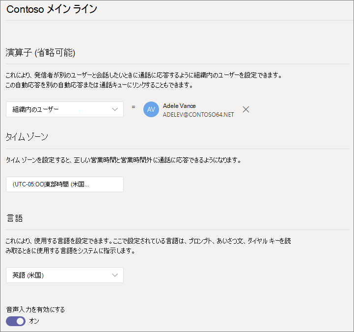

#### はじめに

組織外から直接ダイヤルしてアクセスできる自動応答に必要なサービス番号 (サービス番号は、自動応答で使用される特殊な種類の電話番号) を取得します。 これには、別 [のプロバイダーからの番号の転送](../phone-number-calling-plans/transfer-phone-numbers-to-teams.md) や、新 [しいサービス番号の要求が含まれる場合があります](../getting-service-phone-numbers.md)。

各自動応答には、仮想ユーザー ライセンス電話システム割り当てる必要があります。 Business Voice を購入した場合は、多数の仮想電話システムライセンスも受け取ったので、それ以上要求する必要はありません。 ただし、今後さらに必要な場合は、「仮想ユーザー ライセンス 」 の手順に従電話システム[取得できます](../teams-add-on-licensing/virtual-user.md)。

休日に自動応答ルートの呼び出しを異なる方法で行う場合は、自動応答を作成する前に、使用する祝日を作成します。

#### 自動応答を設定するには、次の手順に従います。

# [手順 1 電話   番号](#tab/phone-number)

> [!NOTE]
> 初めて Business Voice を設定する手順に従っている場合、[手順 **6:** 会社の主要電話番号の自動応答を設定する] をオンにしている場合は、このタブの手順を既に完了しています。次のタブに移動します。 [自動応答の一般的な情報](?tabs=general-info#steps)。

作成する各自動応答には、リソース アカウントが必要です。 これは、ユーザー アカウントに似ていますが、アカウントがユーザーではなく自動応答キューまたは通話キューに関連付けられている点を除きます。 この手順では、アカウントを作成し、仮想ユーザー ライセンスMicrosoft 365 電話システム割り当て、サービス番号を割り当てします。

### リソース アカウントを作成する

リソース アカウントは、管理センター Teams作成できます。

1. 管理センター Teams、組織全体の設定 **を** 展開し、[リソース アカウント]**をクリックします**。

2. **[追加]** をクリックします。

3. [リソース **アカウントの追加]** ウィンドウで、[表示名] 、[ユーザー名]**を入力****し**、[リソース アカウントの種類] で [**自動** 応答]**を選択します。**

    

4. **[保存]** をクリックします。

    新しいアカウントがアカウントの一覧に表示されます。

    

### ライセンスを割り当てる

リソース アカウントには、Microsoft 365 電話システム *仮想ユーザー ライセンスを割* り当てる必要があります。

1. 管理センター Microsoft 365、ライセンスを割り当てるリソース アカウントをクリックします。

2. [ライセンスと **アプリ] タブの**[ライセンス **] の下で**、[Microsoft 365 電話システム **- 仮想ユーザー] を選択します**。

3. [変更 **を保存] をクリックします**。

    

### サービス番号を割り当てる

この自動応答を電話番号で到達可能にする必要がある場合は、その番号をリソース アカウントに割り当てる必要があります。

1. 管理センター Teams [リソース アカウント]ページで、サービス番号を割り当てるリソース アカウントを選択し、[割り当て/割り当て解除] を **クリックします**。

2. [数値 **電話] ドロップダウン** で、使用する数値の種類を選択します。

3. [割り **当て済み電話番号]** ボックスで、使用する番号を検索し、[追加] を **クリックします**。

    

4. **[保存]** をクリックします。

> [!div class="nextstepaction"]
> [手順 2 - 自動応答の一般的な>](?tabs=general-info#steps)

# [手順 2   アテンダントの一般的な情報](#tab/general-info)

自動応答を設定するには

1. 管理センター Teams[音声] を **展開し**、[**自動** 応答] をクリックし、[追加] を **クリックします**。

2. 上部のボックスに自動応答の名前を入力します。

3. 演算子を指定する場合は、オペレーターの呼び出し先を指定します。 これは省略可能です (ただし、推奨)。 [オペレーター] **オプションを設定** すると、呼び出し元がメニューから抜け出し、指定されたユーザーと話すことができます。

4. この自動応答のタイム ゾーンを指定します。 タイム ゾーンは、時間外に別の通話フローを作成する場合に、営業時間の計算に使用されます。

5. この自動応答の言語を指定します。 これは、システムで生成された音声プロンプトに使用される言語です。

6. 音声入力を有効にする場合に選択します。 有効にすると、すべてのメニュー オプションの名前が音声認識キーワードになります。 たとえば、呼び出し元が "One" と言ってキー 1 にマップされたメニュー オプションを選択したり、"Sales" と読み上げ、"Sales" という名前のメニュー オプションを選択することができます。

    

7. **[次へ]** をクリックします。

> [!div class="nextstepaction"]
> [手順 3 - フローの呼び出し>](?tabs=call-flow#steps)

# [手順 3 通話   フロー](#tab/call-flow)

通話フローのオプションを選択する

1. 自動応答が通話に応答するときに、あいさつを再生する場合に選択します。

    [オーディオ ファイルの **再生] を** 選択した場合は、[アップロード ファイル] ボタンを使用して、オーディオとして保存された録音済みグリーティング メッセージをアップロードできます。WAV、.MP3、または .WMA 形式。 記録は 5 MB 以下に設定できます。

    [あいさつメッセージを入力する] を選択すると、自動応答が通話に応答すると、入力したテキスト (最大 1,000 文字) が読み上げされます。

    

2. 通話のルーティング方法を選択します。

    [切断] **を選択** すると、自動応答によって通話がハングします。

    [通話の **リダイレクト] を選択** した場合は、通話ルーティングの宛先のいずれかを選択できます。

    [再生] メニュー **オプションを選択した** 場合は、[音声ファイルの再生] または [あいさつメッセージに入力] を選択し、メニュー オプションとディレクトリ検索の間で選択できます。

    

3. 呼び出し元がダイヤル キーを使用して移動する場合は、[メニュー オプションの設定] で、発信者がダイヤル キーを押した場合に発生する操作を選択します。 (この自動応答を会社のディレクトリとして作成する場合は、ダイヤル キー オプションを空白のままにします)。

    ダイヤル キーは、次の宛先に設定できます。

    - **組織内のユーザー** - 音声通話を受信できる組織内のユーザー。
    - **音声アプリ** - 別の自動応答または通話キュー。
    - **外部電話番号** - 任意の電話番号。 次の形式を使用します。+[国コード][地域コード][電話番号]
    - **ボイス** メール - 指定したグループに関連Microsoft 365ボイス メールボックス。
    - **Operator** - 自動応答に対して定義された演算子。 演算子の定義は省略可能です。 演算子は、この一覧内の他の宛先として定義できます。

    オペレーターに 0 キーを設定することをお勧めします。

    各メニュー オプションで、次の項目を指定します。

    - **ダイヤル キー** - 電話キーパッドのキーを押して、このオプションにアクセスします。

    - **[音声コマンド** ] - 音声入力が有効になっている場合に、呼び出し元がこのオプションにアクセスするために指定できる音声コマンドを定義します。 "Customer Service" や "Operations and Grounds" など、複数の単語を含めることができます。 

    - **[リダイレクト先** ] - 呼び出し元がこのオプションを選択するときに呼び出しを行う場所。 自動応答または通話キューにリダイレクトする場合は、関連付けられているリソース アカウントを選択します。

    

4. この自動応答を会社のディレクトリとして使用する場合は、[ディレクトリ検索] で [名前でダイヤル]**を選択します**。 このオプションを有効にすると、発信者はユーザーの名前を言うか、電話のキーパッドに入力できます。 ライセンスを持つオンライン ユーザー電話システム資格のあるユーザーであり、名前でダイヤルします。 

    ([内線番号 **によるダイヤル] を選択することもできます** が、拡張機能は Azure Active Directory)

5. ディレクトリ検索オプションを選択したら、[ **次へ** ] を **クリックします**。

> [!div class="nextstepaction"]
> [手順 4 - 時間外通話フローの>](?tabs=after-hours#steps)

# [手順 4 時間   後](#tab/after-hours)

各自動応答に対して営業時間を設定できます。 営業時間が設定されていない場合、24 時間 365 日のスケジュールが既定で設定されているので、1 日のすべての日とすべての時間が営業時間と見なされます。 営業時間は、日中の時間内の休憩を使用して設定できます。営業時間として設定されていないすべての時間は、時間外と見なされます。 異なる着信呼処理オプションとグリーティングを時間外に設定できます。

自動応答と通話キューの構成方法によっては、直接の電話番号を持つ自動応答の時間外通話ルーティングのみを指定する必要があります。

時間外の発信者に対して個別の通話ルーティングが必要な場合は、各日の営業時間を指定します。 [ **新しい時刻の追加]** をクリックして、特定の日に複数の時間セットを指定します (たとえば、昼休み時間を指定します)。

営業時間を指定したら、時間外の通話ルーティング オプションを選択します。 手順 3 - 呼び出しフローで指定した営業時間の通話ルーティングと同 **じオプションを使用できます**。

完了 **したら、[** 次へ] をクリックします。

> [!div class="nextstepaction"]
> [手順 5 - 休日の呼び出しフロー>](?tabs=holidays#steps)

# [手順   5 休日](#tab/holidays)

自動応答への呼び出しは、他の日とは異なる方法で休日にルーティングできます。 (休日に別の通話フローを設定したくない場合は、この手順をスキップできます)。

自動応答には、設定した休日ごとに通話フローを設定できます。 各自動応答には、最大 20 個の決められた休業日を追加できます。

1. [休日の通話設定] ページで、[追加] を **クリックします**。

2. この休日の設定の名前を入力します。

3. [休日 **] ドロップダウン** から、使用する休日を選択します。

4. 使用するあいさつの種類を選択します。

    

5. 通話を切断またはリダイレクト **する****場合に** 選択します。

6. リダイレクトを選択した場合は、通話の通話ルーティング先を選択します。

    

7. **[保存]** をクリックします。

    追加の休日ごとに、必要に応じて手順を繰り返します。

    

    すべての休日を追加した場合は、[次へ] を **クリックします**。

> [!div class="nextstepaction"]
> [手順 6 - ディレクトリ 内のユーザーを選択>](?tabs=dial-scope#steps)

# [手順 6   ディレクトリ メンバー](#tab/dial-scope)

ダイヤル *スコープは、* 呼び出し元がダイヤルバイネームまたはダイヤルバイエクステンションを使用するときにディレクトリ内で使用できるユーザーを定義します。 [すべてのオンライン **ユーザー] の既定値には**、組織内のすべてのユーザーが含まれます。このユーザーには、オンライン ライセンス電話システムがあります。

[含める] または [除外] で [カスタムユーザー グループ] を選択し、1 つ以上のグループ、配布リスト、またはセキュリティ グループMicrosoft 365選択して、特定のユーザーを含めるか除外することができます。  たとえば、組織内のエグゼクティブをダイヤル ディレクトリから除外する場合があります。 (ユーザーが両方のリストに含む場合は、ディレクトリから除外されます)。

> [!NOTE]
> 新しいユーザーがディレクトリに名前を表示するには、最大で 36 時間かかる場合があります。

ダイヤル スコープの設定が完了したら、[次へ] を **クリックします**。

> [!div class="nextstepaction"]
> [手順 7 - リソース アカウントを割り当>](?tabs=resource-accounts#steps)

# [手順 7   リソース アカウント](#tab/resource-accounts)

すべての自動応答には、関連付けられているリソース アカウントが必要です。  最初のレベルの自動応答には、サービス番号が関連付けられている少なくとも 1 つのリソース アカウントが必要です。 必要な場合は、複数のリソース アカウントを自動応答に割り当て、それぞれに個別のサービス番号を割り当てできます。

リソース アカウントを追加するには

1. [ **追加]** をクリックし、追加するアカウントを検索します。 [追加 **] を** クリックし、[追加] を **クリックします**。

    ![リソース アカウントの [アカウントの追加] パネルのスクリーンショット](../media/auto-attendant-add-resource-account.png)

2. サービス アカウントの追加が完了したら、[送信] を **クリックします**。

    

    これで自動応答の構成が完了します。

---
