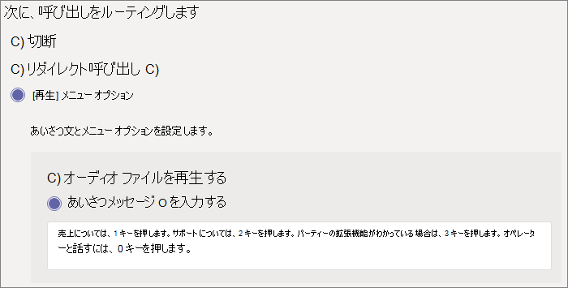

## ビデオデモンストレーション

このビデオでは、Microsoft Teamsで自動応答を作成する方法の基本的な例を示します。

> [!VIDEO https://www.microsoft.com/videoplayer/embed/RWEnCG?autoplay=false]

### 自動応答を設定するには、次の手順に従います

# [手順 1 - 全般情報](#tab/general-info)

## 一般的な情報

1. 上部のボックスに自動応答の名前を入力します。

2. 演算子を指定するには、演算子の呼び出し先を指定します。 この指定は省略可能です (ただし、推奨)。 **[オペレーター]** オプションを設定して、呼び出し元がメニューから抜け出して、指定されたユーザーと話せるようにします。

3. この自動応答のタイム ゾーンを指定します。 タイム ゾーンは、時間 [外に個別の通話フローを作成](?tabs=after-hours)する場合に、営業時間の計算に使用されます。

4. この自動応答で [サポートされている言語](../create-a-phone-system-auto-attendant-languages.md) を指定します。 これは、システムによって生成された音声プロンプトに使用される言語です。

5. 音声入力を有効にするかどうかを選択します。 有効にすると、すべてのメニュー オプションの名前が音声認識キーワードになります。 たとえば、呼び出し元は "One" と言ってキー 1 にマップされたメニュー オプションを選択するか、"Sales" と言って "Sales" という名前のメニュー オプションを選択できます。

   > [!NOTE]
   > 手順 4 で音声入力をサポートしない言語を選択した場合、このオプションは無効になります。

6. [**次へ**] を選択します。

# [手順 2 - 通話フロー](#tab/call-flow)

## 通話フロー

自動応答が通話に応答するときにあいさつ文を再生するかどうかを選択します。

**[オーディオ ファイルの再生**] を選択した場合は、[**アップロード ファイル**] ボタンを使用して、オーディオとして保存された録音済みのあいさつメッセージをアップロードできます。WAV、.MP3、または .WMA 形式。 記録は 5 MB 以下にできます。

**[あいさつメッセージの入力**] を選択すると、自動応答が通話に応答するときに、入力したテキスト (最大 1,000 文字) がシステムによって読み取られます。

通話をルーティングする方法を選択します。

**[切断]** を選択すると、自動応答によって通話がハングします。

**[リダイレクト通話**] を選択した場合は、通話ルーティング先のいずれかを選択できます。

**[再生] メニュー オプション** を選択した場合は、[**オーディオ ファイルの再生**] または [**あいさつメッセージの入力**] を選択し、メニュー オプションとディレクトリ検索を選択できます。

### メニュー オプション

ダイヤル オプションの場合は、電話キーパッドの 0 ~ 9 キーを通話ルーティング先のいずれかに割り当てます。 (キー \* (アスタリスク) と \# (ポンド) はシステムによって予約されており、再割り当てできません。 これらのキーのいずれかを押すと、現在のメニューが繰り返されます)。

> [!NOTE]
> # キーは、最新の自動応答にのみバックアップされます。 境界を新しい自動応答に渡すと、# キーは前の自動応答に移動できなくなります。

キー マッピングを連続する必要はありません。 キー 0、1、および 3 がオプションにマップされたメニューを作成できますが、数値 2 キーは使用されません。

ゼロ キーを構成している場合は、オペレーターにマッピングすることをお勧めします。 オペレーターがキーに設定されていない場合は、音声コマンド "Operator" も無効になります。

メニュー オプションごとに、次の設定を指定します。

- **ダイヤル キー** - このオプションにアクセスするための電話キーパッドのキー。 音声入力を使用できる場合、発信者はこの番号を言ってオプションにアクセスすることもできます。

- **音声コマンド** - 音声入力が有効になっている場合に、このオプションにアクセスするために呼び出し元が提供できる音声コマンドを定義します。 "Customer Service" や "Operations and Durations" などの複数の単語を含めることができます。 たとえば、呼び出し元は 2 キーを押すか、"2" と言うか、"Sales" と言って 2 つのキーにマップされたオプションを選択できます。 また、このテキストは、サービス確認プロンプトのテキスト読み上げによってレンダリングされます。これは、"通話を販売に転送する" などの場合があります。

- **リダイレクト先** - 呼び出し元がこのオプションを選択したときに使用される呼び出しルーティング先。 自動応答または通話キューにリダイレクトする場合は、それに関連付けられているリソース アカウントを選択します。

### ディレクトリ検索

宛先にダイヤル キーを割り当てる場合は、**ディレクトリ検索** に **[なし]** を選択することをお勧めします。 呼び出し元が、特定の宛先に割り当てられたキーを使用して名前または拡張機能をダイヤルしようとすると、名前または拡張機能の入力が完了する前に、予期せず宛先にルーティングされる可能性があります。 ディレクトリ検索用に個別の自動応答を作成し、ダイヤル キーを使用してメインの自動応答をリンクすることをお勧めします。

ダイヤル キーを割り当てなかった場合は、 **ディレクトリ検索** のオプションを選択します。

**名前でダイヤル** する - このオプションを有効にすると、発信者はユーザーの名前を言うか、電話のキーパッドに入力できます。 Skype for Business Serverを使用してオンプレミスでホストされているオンライン ユーザーまたは任意のユーザーは、対象ユーザーであり、名前でダイヤルできます。 ( [ダイヤル スコープ](?tabs=#dial-scope) ページで、ディレクトリに含まれているユーザーと含まれていないユーザーを設定できます)。

**内線番号でダイヤル** する - このオプションを有効にすると、発信者は電話番号の内線番号にダイヤルすることで組織内のユーザーと接続できます。 Skype for Business Serverを使用してオンプレミスでホストされているオンライン ユーザーまたは任意のユーザーは、対象ユーザーであり、**Dial by extension** を使用して確認できます。 ( [ダイヤル スコープ](?tabs=dial-scope) ページで、ディレクトリに含まれているユーザーと含まれていないユーザーを設定できます)。

ダイヤルバイ拡張機能を使用できるようにするユーザーは、Active Directory で定義されている次の電話属性の一部として拡張機能を指定する必要があります (Azure AD Connectを使用して同期)、またはAzure Active Directory。 詳細については、「 [ユーザーを個別または一括で追加](/microsoft-365/admin/add-users/add-users)する」を参照してください。

- OfficePhone/PhoneNumber (AD と Azure AD)
- HomePhone (AD)
- Mobile/MobilePhone (AD と Azure AD)
- OtherTelephone (AD)

ユーザーの電話番号フィールドに内線番号を入力するために必要な形式は、次のいずれかの形式になります。

- *+\<phone number>;ext=\<extension>*
- *+\<phone number>X\<extension>*
- *X\<extension>*

- 例 1: Set-MsolUser -UserPrincipalName usern@domain.com -Phonenumber "+15555555678;ext=5678"
- 例 2: Set-MsolUser -UserPrincipalName usern@domain.com -Phonenumber "+15555555678x5678"
- 例 3: Set-MsolUser -UserPrincipalName usern@domain.com -Phonenumber "x5678"

拡張機能は、[Microsoft 365 管理センター](https://admin.microsoft.com/)または[Azure Active Directory管理センター](https://aad.portal.azure.com)で設定できます。 自動応答と呼び出しキューに変更が使用可能になるまでには、最大で 12 時間かかる場合があります。

> [!NOTE]
> **名前によるダイヤル** 機能と **内線番号によるダイヤル** 機能の両方を使用する場合は、メインの自動応答にダイヤル キーを割り当てて、**名前によるダイヤル** が有効になっている自動応答に到達できます。 その自動応答内で、1 つのキー (関連付けられている文字がない) を割り当てて、 **ダイヤル バイ 拡張機能** の自動応答に到達できます。

詳細については、「 [ダイヤルと音声リファレンス」を参照してください](../dial-voice-reference.md)。

**ディレクトリ検索** オプションを選択したら、[**次へ**] を選択します。

# [手順 3 - 時間外](#tab/after-hours)

## 時間外の通話フロー

自動応答ごとに営業時間を設定できます。 営業時間が設定されていない場合、既定では 24 時間 365 日のスケジュールが設定されているため、1 日のすべての日と 1 日のすべての時間が営業時間と見なされます。 営業時間は、日中の休憩時間で設定でき、営業時間として設定されていないすべての時間は、時間外と見なされます。 時間外は、さまざまな着信通話処理オプションとあいさつ文を設定できます。

自動応答と通話キューの構成方法によっては、直接電話番号を持つ自動応答の時間外通話ルーティングのみを指定する必要があります。

時間外の呼び出し元に個別の通話ルーティングが必要な場合は、毎日の営業時間を指定します。 [ **新しい時刻の追加]** を選択して、特定の日の複数の時間セットを指定します 。たとえば、お昼休みを指定します。

営業時間を指定したら、時間外の通話ルーティング オプションを選択します。 上記で指定した営業時間呼び出しルーティングと同じオプションを使用できます。

完了したら、[ **次へ** ] を選択します。

# [手順 4 - 休日](#tab/holidays)

## 休日中の通話フロー

自動応答には、 [設定した休日](../set-up-holidays-in-teams.md)ごとに通話フローを設定できます。 各自動応答には、最大 20 個の決められた休業日を追加できます。

1. [休日通話の設定] ページで、[ **追加**] を選択します。

2. この休日設定の名前を入力します。

3. [ **休日** ] ドロップダウンから、使用する休日を選択します。

4. 使用するあいさつの種類を選択します。

    

5. 通話を **切断** するか **リダイレクト** するかを選択します。

6. リダイレクトを選択した場合は、通話の通話ルーティング先を選択します。

7. **[保存]** を選択します。

追加の休日ごとに、必要に応じて手順を繰り返します。

すべての休日を追加したら、[ **次へ**] を選択します。

# [手順 5 - ダイヤル スコープ](#tab/dial-scope)

## ダイヤル スコープ

*ダイヤル スコープ* は、呼び出し元がダイヤルバイネームまたはダイヤルバイ拡張子を使用する場合に、ディレクトリで使用できるユーザーを定義します。 **[すべてのオンライン ユーザー**] の既定値には、組織内のすべてのユーザーがオンライン ユーザーであるか、Skype for Business Serverを使用してオンプレミスでホストされているユーザーが含まれます。

[含める **] または [****除外**] で **[カスタム ユーザー グループ**] を選択し、1 つ以上のMicrosoft 365 グループ、配布リスト、またはセキュリティ グループを選択することで、特定のユーザーを含めたり除外したりできます。 たとえば、組織内のエグゼクティブをダイヤル ディレクトリから除外することができます。 (ユーザーが両方のリストに含まれている場合は、ディレクトリから除外されます)。

> [!NOTE]
> 新しいユーザーの名前がディレクトリに一覧表示されるまでには、最大で 36 時間かかる場合があります。

ダイヤル スコープの設定が完了したら、[ **次へ**] を選択します。

# [手順 6 - リソース アカウント](#tab/resource-accounts)

## リソース アカウント

すべての自動応答には、関連付けられたリソース アカウントが必要です。  第 1 レベルの自動応答には、サービス番号が関連付けられている少なくとも 1 つのリソース アカウントが必要です。 必要に応じて、複数のリソース アカウントを自動応答に割り当てることができます。各アカウントに個別のサービス番号を割り当てることができます。

![リソース アカウントの [アカウントの追加] パネルのスクリーンショット。](../media/auto-attendant-add-resource-account.png)

リソース アカウントを追加するには、[ **アカウントの追加]** を選択し、追加するアカウントを検索します。 [ **追加]** を選択し、[ **追加**] を選択します。

リソース アカウントの追加が完了したら、[ **送信]** を選択して自動応答の構成を完了します。

詳細については、「[Teams リソース アカウントの管理](../manage-resource-accounts.md)」を参照してください。

---
