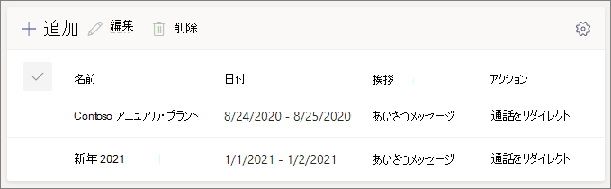

#### ビデオデモ

このビデオでは、自動応答を作成する方法の基本的な例をTeams。

> [!VIDEO https://www.microsoft.com/videoplayer/embed/RWEnCG?autoplay=false]

#### はじめに

組織外から直接ダイヤルしてアクセスする自動応答に必要なサービス番号 (サービス番号は、自動応答で使用される特殊な種類の電話番号) を取得します。 これには、別 [のプロバイダーから番号を転送](../phone-number-calling-plans/transfer-phone-numbers-to-teams.md) したり、新 [しいサービス番号を要求したりする場合があります](../getting-service-phone-numbers.md)。

各自動応答には、仮想ユーザー ライセンス電話システム割り当てる必要があります。 Business Voice を購入した場合、多数の 電話システム - Virtual User ライセンスも受け取ったので、それ以上要求する必要はありません。 ただし、将来さらに必要な場合は、「仮想ユーザー ライセンス」の手順に従[電話システム取得できます](../teams-add-on-licensing/virtual-user.md)。

自動応答のルート呼び出しを休日に異なる方法で行う場合は、自動応答を作成する前に使用する祝日を作成します。

#### 自動応答を設定するには、次の手順に従います。

# [手順 1.   電話番号](#tab/phone-number)

> [!NOTE]
> Business Voice を初めてセットアップする手順に従っている場合は、「手順 **6:** 会社のメイン電話番号の自動応答を設定する」を参照してください。このタブの手順は既に完了しています。次のタブに移動します。 [自動応答の一般的な情報](?tabs=general-info#steps)。

作成する各自動応答には、リソース アカウントが必要です。 これはユーザー アカウントに似ていますが、アカウントがユーザーではなく自動応答または通話キューに関連付けられている点が除きます。 この手順では、アカウントを作成し、仮想ユーザー ライセンスMicrosoft 365 電話システム *割* り当て、サービス番号を割り当てします。

### リソース アカウントを作成する

リソース アカウントは、管理センター Teams作成できます。

1. 管理センター Teams、[組織全体の設定]**を展開し**、[リソース アカウント]**をクリックします**。

2. **[追加]** をクリックします。

3. [リソース **アカウントの追加]** ウィンドウで、[ **表示名]**、[ **ユーザー** 名] に入力し、[リソース アカウントの種類] に [ **自動応答** ] **を選択します。**

    

4. **[保存]** をクリックします。

    新しいアカウントがアカウントの一覧に表示されます。

    

### ライセンスを割り当てる

リソース アカウントに Microsoft 365 電話システム *- 仮想ユーザー ライセンスを* 割り当てる必要があります。

1. 管理センター Microsoft 365、ライセンスを割り当てるリソース アカウントをクリックします。

2. [ライセンスと **アプリ] タブの**[ライセンス]**で**、[仮想Microsoft 365 電話システム **- 仮想ユーザー] を選択します**。

3. [変更の **保存] をクリックします**。

    

### サービス番号を割り当てる

この自動応答に電話番号で到達できる必要がある場合は、その番号をリソース アカウントに割り当てる必要があります。

1. 管理センター Teamsの [リソース アカウント]ページで、サービス番号を割り当てるリソース アカウントを選択し、[割り当て/割り当て解除]**をクリックします**。

2. [数値 **電話] ドロップダウンで**、使用する数値の種類を選択します。

3. [割 **り当てられた電話番号]** ボックスで、使用する番号を検索し、[追加] を **クリックします**。

    

4. **[保存]** をクリックします。

> [!div class="nextstepaction"]
> [手順 2 - 自動応答の一般的な情報>](?tabs=general-info#steps)

# [手順 2   アテンダントの一般的な情報](#tab/general-info)

自動応答を設定するには

1. 管理センター Teams、[音声] を **展開** し、[**自動** 応答] をクリックし、[追加] を **クリックします**。

2. 上部のボックスに自動応答の名前を入力します。

3. 演算子を指定する場合は、演算子の呼び出し先を指定します。 これは省略可能です (ただし、推奨)。 [オペレーター] **オプションを設定** して、発信者がメニューから抜け出し、指定されたユーザーと話し合うのを許可できます。

4. この自動応答のタイム ゾーンを指定します。 時間外の通話フローを個別に作成する場合、タイム ゾーンは営業時間の計算に使用されます。

5. この自動応答の言語を指定します。 これは、システムによって生成される音声プロンプトに使用される言語です。

6. 音声入力を有効にする場合に選択します。 有効にすると、すべてのメニュー オプションの名前が音声認識キーワードになります。 たとえば、発信者が "One" と言ってキー 1 にマップされているメニュー オプションを選択したり、"Sales" と言って "Sales" という名前のメニュー オプションを選択したりします。

    

7. **[次へ]** をクリックします。

> [!div class="nextstepaction"]
> [手順 3 - 呼び出しフロー >](?tabs=call-flow#steps)

# [手順 3 通話   フロー](#tab/call-flow)

通話フローのオプションを選択する

1. 自動応答が通話に応答するときにあいさつメッセージを再生する場合に選択します。

    [オーディオ ファイル **の再生]** を選択した場合は、[アップロード **ファイル**] ボタンを使用して、 にオーディオとして保存された録音されたあいさつメッセージをアップロードできます。WAV、.MP3、または 。WMA 形式。 記録は 5 MB 以下にできます。

    [あいさつ文を入力する] を選択すると、自動応答が通話に応答すると、入力したテキスト (最大 1,000 文字) が読み上げされます。

    

2. 通話のルーティング方法を選択します。

    [切断] **を選択** すると、自動応答によって通話が停止します。

    [通話の **リダイレクト] を選択** した場合は、通話ルーティング先のいずれかを選択できます。

    [再生]**メニュー オプション を選択** した場合は、[音声ファイルの再生] または [あいさつメッセージに入力] を選択し、メニュー オプションとディレクトリ検索から選択できます。

    

3. 発信者がダイヤル キーを使用して移動する場合は、[メニューオプションの設定] で、発信者がダイヤル キーを押した場合に実行する操作を選択します。 (この自動応答を会社のディレクトリとして作成する場合は、ダイヤル キーオプションを空白のままにします)。

    ダイヤル キーは、次の宛先に設定できます。

    - **組織内のユーザー** - 音声通話を受信できる組織内のユーザー。
    - **音声アプリ** - 別の自動応答または通話キュー。
    - **外部電話番号** - 任意の電話番号。 +[国コード][地域コード][電話番号] の形式を使用します。
    - **ボイス** メール - 指定したグループに関連Microsoft 365ボイス メールボックス。
    - **演算子** - 自動応答に対して定義された演算子。 演算子の定義は省略可能です。 演算子は、この一覧の他の任意の宛先として定義できます。

    演算子に 0 キーを設定することをお勧めします。

    メニュー オプションごとに、次を指定します。

    - **[ダイヤル キー** ] - このオプションにアクセスするには、電話のキーパッドのキーを押します。

    - **[音声コマンド** ] - 音声入力が有効になっている場合に、呼び出し元がこのオプションにアクセスするために指定できる音声コマンドを定義します。 "顧客サービス" や "操作と根拠" など、複数の単語を含めることができます。 

    - **[リダイレクト先** ] - 呼び出し元がこのオプションを選択するときに通話を行う場所。 自動応答または通話キューにリダイレクトする場合は、関連付けられているリソース アカウントを選択します。

    

4. この自動応答を会社のディレクトリとして使用する場合は、[ディレクトリ検索] で [名前でダイヤル]**を選択します**。 このオプションを有効にすると、発信者はユーザーの名前を言い、電話のキーパッドに入力できます。 ライセンスを持つオンライン 電話システムは、対象ユーザーであり、名前でダイヤルします。 

    ([内線番号 **でダイヤルする]** を選択できます。ただし、拡張機能は、Azure Active Directory。

5. ディレクトリ検索オプションを選択したら、[ **次へ]** を **クリックします**。

> [!div class="nextstepaction"]
> [手順 4 - 時間後の通話フローの>](?tabs=after-hours#steps)

# [手順 4   時間後](#tab/after-hours)

各自動応答に対して営業時間を設定できます。 営業時間が設定されていない場合、24 時間 365 日のスケジュールが既定で設定されているので、その日のすべての日とすべての時間が営業時間と見なされます。 営業時間は、その日の間の時間内の休憩で設定できます。営業時間として設定されていないすべての時間は、時間外と見なされます。 さまざまな着信通話処理オプションと応答メッセージを時間外に設定できます。

自動応答と通話キューの構成によっては、直接の電話番号を含む自動応答の時間外通話ルーティングのみを指定する必要がある場合があります。

営業時間外の発信者に対して個別の通話ルーティングが必要な場合は、各日の営業時間を指定します。 [ **新しい時刻の追加** ] をクリックして、特定の日に複数の時間のセットを指定します 。たとえば、昼食休憩を指定します。

営業時間を指定したら、時間外の通話ルーティング オプションを選択します。 手順 3 - 通話フロー で指定した営業時間の通話ルーティングと同 **じオプションを使用できます**。

完了 **したら、[** 次へ] をクリックします。

> [!div class="nextstepaction"]
> [手順 5 - 休日の呼び出しフロー>](?tabs=holidays#steps)

# [手順 5   の祝日](#tab/holidays)

自動応答の呼び出しは、他の日とは異なる方法で休日にルーティングできます。 (休日に別のコール フローを設定したくない場合は、この手順をスキップできます)。

自動応答には、設定した各休日の通話フローを設定できます。 各自動応答には、最大 20 個の決められた休業日を追加できます。

1. [休日の通話設定] ページで、[追加] を **クリックします**。

2. この休日設定の名前を入力します。

3. [ **休日] ドロップダウン** から、使用する休日を選択します。

4. 使用するあいさつメッセージの種類を選択します。

    

5. [切断] または [通話の **リダイレクト****] を** 選択します。

6. リダイレクトを選択した場合は、通話の通話ルーティング先を選択します。

    

7. **[保存]** をクリックします。

    追加の祝日ごとに、必要に応じて手順を繰り返します。

    

    すべての祝日を追加した後、[次へ] を **クリックします**。

> [!div class="nextstepaction"]
> [手順 6 - ディレクトリ 内のユーザーを選択>](?tabs=dial-scope#steps)

# [手順 6   ディレクトリ メンバー](#tab/dial-scope)

ダイヤル *スコープは、* 呼び出し元がダイヤル バイ ネームまたはダイヤル バイ 拡張機能を使用する場合にディレクトリ内で使用できるユーザーを定義します。 [すべてのオンライン **ユーザー] の既定値には**、組織内のすべてのユーザーが含まれます。このユーザーは、ライセンスを持つオンライン ユーザー電話システムされます。

[含める] または [除外] で [カスタムユーザー グループ] を選択し、1 つ以上の Microsoft 365 グループ、配布リスト、またはセキュリティ グループを選択することで、特定のユーザーを含めるか除外できます。  たとえば、組織内のエグゼクティブをダイヤル ディレクトリから除外することができます。 (ユーザーが両方のリストにある場合は、ディレクトリから除外されます)。

> [!NOTE]
> 新しいユーザーの名前がディレクトリに表示されるには、最大 36 時間かかる場合があります。

ダイヤル スコープの設定が完了したら、[次へ] を **クリックします**。

> [!div class="nextstepaction"]
> [手順 7 - リソース アカウントを割り当>](?tabs=resource-accounts#steps)

# [手順 7   リソース アカウント](#tab/resource-accounts)

すべての自動応答には、関連付けられているリソース アカウントが必要です。  第 1 レベルの自動応答には、サービス番号が関連付けられている少なくとも 1 つのリソース アカウントが必要です。 必要な場合は、複数のリソース アカウントを自動応答に割り当て、それぞれに個別のサービス番号を割り当てできます。

リソース アカウントを追加するには

1. [ **追加]** をクリックし、追加するアカウントを検索します。 [追加 **] を** クリックし、[追加] を **クリックします**。

    ![リソース アカウントの [アカウントの追加] パネルのスクリーンショット](../media/auto-attendant-add-resource-account.png)

2. サービス アカウントの追加が完了したら、[送信] を **クリックします**。

    

    これで自動応答の構成が完了します。

---
