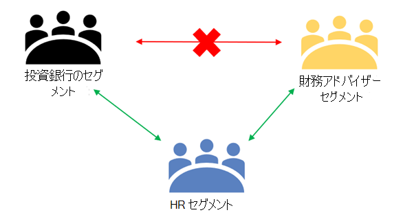
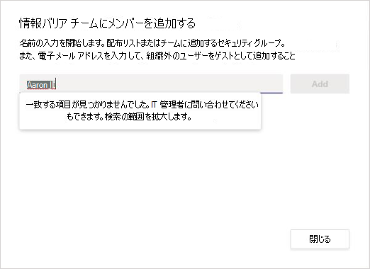
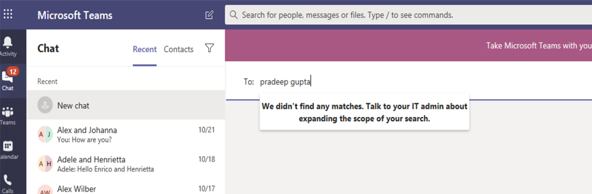
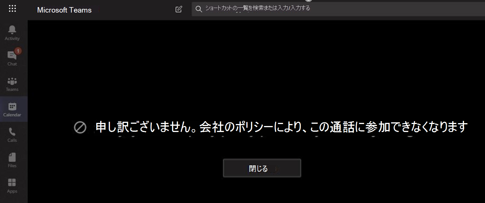
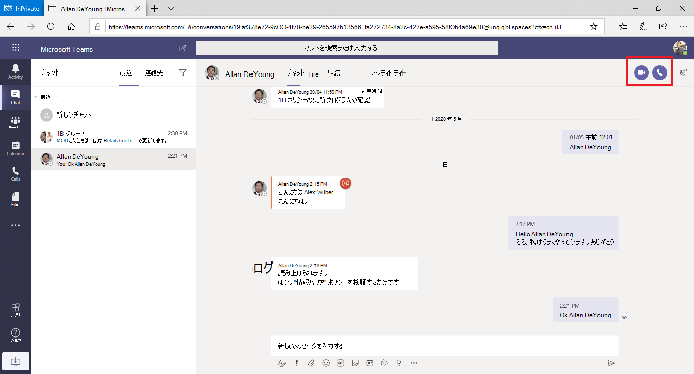
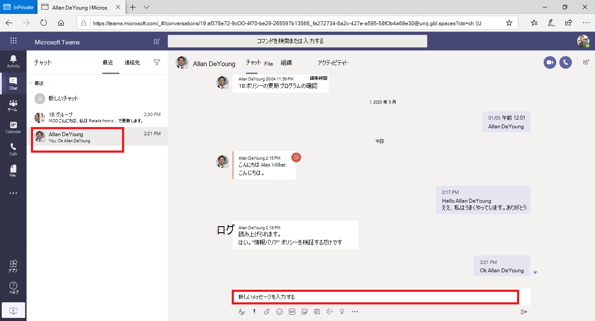
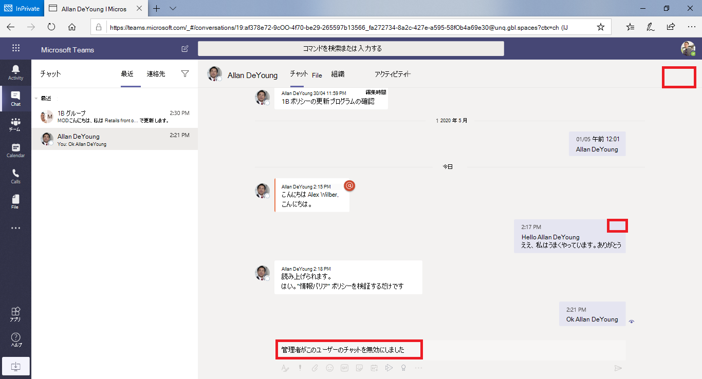

# Microsoft Teams の情報障壁

情報障壁 (IB) は、管理者が互いに連絡することを防止するために構成できるポリシーです。 IB は、たとえば、ある部門が他の部署と共有する必要のない情報を処理している場合や、グループ外の人との通信を禁止または分離する必要がある場合に便利です。

> [!NOTE]
> - 情報バリアグループはテナント全体で作成できません。
> - ボット、AAD アプリ、および一部の Api を使用したユーザーの追加は、バージョン1ではサポートされていません。
> - プライベートチャネルは、構成する情報バリアーポリシーに準拠しています。
> - 新規: Teams に接続された SharePoint サイトの障壁のサポートについて [は、ここ](https://docs.microsoft.com/sharepoint/information-barriers#segments-associated-with-microsoft-teams-sites)をクリックしてください。

情報バリアポリシーによって、検索と検出を防ぐこともできます。 通信しようとしていない相手と通信しようとしても、そのユーザーは [連絡先] 選択画面に表示されません。

## 背景

情報障壁の主要なドライバーは、金融サービス業界から提供されています。 金融業界規制機関 ([finra]( http://www.finra.org)) は、メンバー企業内での重要な情報の障壁と競合を確認し、そのような競合を管理する方法についてのガイダンスを提供します (finra 2241、 [負債調査法通知 15-31](http://www.finra.org/sites/default/files/Regulatory-Notice-15-31_0.pdf)。  

ただし、情報の壁を取り入れるために、他の多くの領域で役に立つものが見つかりました。 その他の一般的なシナリオを以下に示します。

- 教育: ある学校の学生は、他の学校の学生の連絡先情報を検索することはできません。
- 法的: 1 つのクライアントによって得られたデータの機密性を、異なる顧客を表す同じ企業の弁護士によってアクセスされないようにします。
- 行政: 情報のアクセスと制御は、部門とグループで制限されています。
- プロフェッショナルサービス: 社内の複数のユーザーが、顧客契約中にゲストアクセスでクライアントまたは特定の顧客とチャットすることができます。

たとえば、"プエルトリコ" は銀行口座に属し、Pradeep は財務アドバイザーセグメントに属します。 この2つのセグメント間の通信とコラボレーションは、組織の IB ポリシーによってブロックされるため、Pradeep とお互いの通信はできません。 ただし、Pradeep は、秀樹との通信を人事で行うことができます。

## 情報バリアを使用する状況

次のような状況では、情報バリアを使用することができます。

- チームは、特定の他のチームとデータのやり取りや共有を行うことができないようにする必要があります。
- チームは、チームの外部の人とデータをやり取りしたり、共有したりすることはできません。

情報バリアポリシー評価サービスは、通信が情報バリアポリシーに準拠しているかどうかを決定します。

## 情報バリアポリシーの管理

情報バリアポリシーは、PowerShell コマンドレットを使用して Microsoft 365 コンプライアンスセンター (SCC) で管理されます。 詳細については、「 [情報バリアのポリシーを定義](https://docs.microsoft.com/office365/securitycompliance/information-barriers-policies)する」を参照してください。

> [!IMPORTANT]
> ポリシーを設定または定義する前に、 **Microsoft Teams でスコープ指定されたディレクトリ検索を有効にする必要があり** ます。 スコープ指定されたディレクトリ検索を有効にしてから、情報バリアのポリシーを設定または定義する前に、少なくとも数時間待ってください。 詳細に[ついては、「情報の障壁の前提条件」を参照して](https://docs.microsoft.com/office365/securitycompliance/information-barriers-policies#prerequisites)ください。

## 情報障壁管理者の役割

IB コンプライアンス管理の役割は、情報バリアポリシーの管理を担当します。 この役割の詳細については、「 [Microsoft 365 コンプライアンスセンターの権限](https://docs.microsoft.com/office365/securitycompliance/permissions-in-the-security-and-compliance-center)」を参照してください。

## 情報バリアトリガー

以下の Teams イベントが発生すると、情報バリアポリシーが有効になります。

- **メンバーがチームに追加される** -ユーザーをチームに追加するときは、他のチームメンバーの情報バリアポリシーに対してユーザーのポリシーを評価する必要があります。 ユーザーが正常に追加されると、ユーザーはさらにチェックを行わなくても、チーム内のすべての機能を実行できます。 ユーザーのポリシーによってチームに追加されないようにブロックされている場合、ユーザーは検索に表示されません。

    

- **新しいチャットが要求** されました-2 人以上のユーザ間で新しいチャットがリクエストされるたびに、チャットが評価され、情報バリアポリシーに違反していないことが確認されます。 会話が情報バリアポリシーに違反した場合、その会話は開始されません。

    1:1 チャットの例を次に示します。

     

    グループチャットの例を次に示します。

    

- **ユーザーが会議に参加するように招待され** ました-ユーザーが会議に参加するよう招待されたときに、ユーザーのポリシーが他のチームメンバーのポリシーに対して評価され、違反がある場合は、ユーザーが会議に参加することはできません。

    

- 画面は2人以上の **ユーザー間で共有さ** れる-画面を2人以上のユーザーで共有している場合は、画面共有を評価して、他のユーザーの情報バリアポリシーに違反しないようにする必要があります。 情報バリアのポリシーに違反した場合、画面の共有は許可されません。 
 
    ポリシーが適用される前の画面共有の例を次に示します。 

    

    ポリシーが適用された後の画面共有の例を次に示します。 画面共有と通話アイコンは表示されません。

    

- **ユーザーがチームに電話による通話 (VOIP) を** 行う-音声通話が他のユーザーまたはユーザーのグループによって開始されたときは、他のチームメンバーの情報バリアポリシーに違反していないことを確認するために、通話が評価されます。 違反が発生した場合、音声通話はブロックされます。
- **Teams のゲストユーザー** (情報バリアポリシー) は、teams のゲストユーザーにも適用されます。 組織のグローバルアドレス一覧でゲストユーザーを検出できるようにする必要がある場合は、「 [Microsoft 365 グループでゲストアクセスを管理](https://docs.microsoft.com/microsoft-365/admin/create-groups/manage-guest-access-in-groups)する」を参照してください。 ゲストユーザーが検出可能になったら、 [情報バリアポリシーを定義](https://docs.microsoft.com/office365/securitycompliance/information-barriers-policies)できます。

## ポリシーの変更による既存のチャットへの影響

情報バリアポリシー管理者がポリシーに変更を加えた場合、またはユーザーのプロファイルが変更されたため (ジョブの変更や同様の理由で) ポリシーの変更が反映される場合、情報バリアポリシー評価サービスは、メンバーを自動的に検索して、チームのメンバーがポリシーに違反していないことを確認します。

ユーザー間に既存のチャットやその他の通信が存在し、新しいポリシーが設定されている場合、または既存のポリシーが変更されている場合、サービスは既存の通信を評価して、通信が引き続き許可されていることを確認します。 

- **1:1 チャット** -2 人のユーザ間の通信が許可されなくなった場合 (ポリシーをブロックしている場合に、一方または両方のユーザーに対して通信がブロックされている場合)、チャットスレッドは読み取り専用になります。 

    次の例は、チャットが表示されていることを示しています。

    

    次の例は、チャットが無効になっていることを示しています。

    

- **グループチャット** -1 人のユーザーがグループに対して通信することが許可されなくなった場合 (たとえば、ユーザーがジョブを変更した場合など)、そのポリシーに違反した他のユーザーとの間でそのユーザーとの通信がグループチャットから削除される可能性があります。 ユーザーには、以前の会話 (読み取り専用) は引き続き表示されますが、グループとの新しい会話を表示したり、参加したりすることはできません。 新しいポリシーまたは変更されたポリシーによって複数のユーザーに通信が適用されない場合、ポリシーの影響を受けるユーザーはグループチャットから削除されることがあります。 以前の会話は引き続き表示されます。

この例では、Enrico が組織内の別の部門に移動され、グループチャットから削除されます。

  

Enrico は、グループチャットにメッセージを送信することはできなくなりました。

  

- **チーム** -グループから削除されたユーザーはチームから削除され、既存の会話または新規の会話を表示したり、新しい会話に参加したりすることはできなくなります。

## シナリオ: 既存のチャットのユーザーがブロックされる

現時点では、情報バリアポリシーで別のユーザーがブロックされている場合、ユーザーは次のシナリオを体験します。

- [ **連絡先] タブ** -ユーザーは [ **連絡先** ] タブでブロックされたユーザーを表示することはできません。
- **People picker** -ブロックされたユーザーは、people picker に表示されません。

    
    
- **[アクティビティ] タブ** -ユーザーがブロックしたユーザーの [ **アクティビティ** ] タブにアクセスした場合、投稿は表示されません。 ([ **アクティビティ** ] タブには、チャネルの投稿のみが表示され、2人のユーザーに共通のチャネルはありません)。

    ブロックされている [アクティビティ] タブビューの例を次に示します。

    ![ブロックされている [アクティビティ] タブを示すスクリーンショット](media/ib-after-activity-tab-policy.png)

- **組織** 図-ブロックしたユーザーが表示されている組織図にユーザーがアクセスすると、ブロックしたユーザーは組織図に表示されず、代わりにエラーメッセージが表示されます。
- **連絡先カード** -ユーザーが会話に参加している場合、そのユーザーがブロックされたユーザーの名前の上にマウスポインターを置いたときに、他のユーザーには、連絡先カードの代わりにエラーメッセージが表示されます。 カードに記載されているアクション (通話やチャットなど) は利用できなくなります。
- **おすすめの連絡先** -ブロックされたユーザーは、おすすめの連絡先リスト (新規ユーザーに対して表示される最初の連絡先リスト) に表示されません。
- **チャットの連絡先** -ユーザーは、チャットの連絡先リストでブロックしているユーザーを確認できますが、ブロックされたユーザーは特定され、ユーザーが実行できる操作は、それらを削除することだけです。 ユーザーはそれをクリックして、過去の会話を表示することもできます。
- **連絡先** への通話-ユーザーは [着信] の連絡先リストでブロックされたユーザーを確認できますが、ブロックされたユーザーは特定され、ユーザーが実行できる操作は、それらを削除することだけです。

    次の例は、[通話] の連絡先リストでブロックされているユーザーを示しています。

    

    通話コンテンツリストのユーザーに対して無効になっているチャットの例を次に示します。

    

- **Skype から teams** への移行-Skype for Business から teams への移行中、すべてのユーザーは、情報バリアポリシーによってブロックされたユーザーを含めて teams に移行され、その後で説明したように処理されます。

## Teams のポリシーと SharePoint サイト

チームを作成すると、SharePoint サイトがプロビジョニングされ、ファイルエクスペリエンスのために Microsoft Teams と関連付けられます。 既定では、この SharePoint サイトとファイルに関する情報バリアポリシーは無視されます。 情報バリアポリシーを有効にするには、管理者が既にフォームに入力しており、その IB ポリシーが SharePoint と OneDrive で有効になっていることを要求しています (「 [情報バリア](https://docs.microsoft.com/sharepoint/information-barriers#prerequisites)」の *前提条件* セクションを参照してください)。 SharePoint と OneDrive で情報バリアポリシーが有効になっている場合は、Microsoft Teams でチームを作成したときに、そのサービスがプロビジョニングされている SharePoint サイトで、IB ポリシーが機能します。

**チームの SharePoint サイト上の IB ポリシーの例** : Contoso Bank corporation では、ユーザー ' Sesha@contosobank.onmicrosoft.com ' は投資銀行取引セグメントに属し、ユーザー ' Nikita@contosobank.onmicrosoft.com ' はセグメント勧告に属しています。 この2つのセグメント間の通信とコラボレーションは、組織の IB ポリシーによってブロックされます。
ユーザーが、投資銀行取引先のチームを作成すると、そのチームとそれをバックアップした SharePoint サイトにアクセスできるのは、投資銀行セグメントのユーザーのみになります。 ユーザー Nikita は、サイトリンクを持っている場合でも、そのサイトにアクセスすることはできません。

詳細については、 [情報障壁](https://docs.microsoft.com/sharepoint/information-barriers#segments-associated-with-microsoft-teams-sites) の記事を参照してください。

## 必要なライセンスと権限

プランや価格などの詳細については、「 [ライセンスガイダンス](https://docs.microsoft.com/office365/servicedescriptions/microsoft-365-service-descriptions/microsoft-365-tenantlevel-services-licensing-guidance/microsoft-365-security-compliance-licensing-guidance)」を参照してください。

## 既知の問題
- 臨時の **会議に参加でき** ない場合: IB ポリシーが有効になっていると、会議リストのサイズが会議の出席 [制限](limits-specifications-teams.md)を超えている場合、ユーザーは会議に参加できません。 ルートの理由は、IB のチェックによって、ユーザーが会議チャットリストに追加できるかどうかに依存し、ユーザーが会議に参加することを許可することになります。 会議に一度参加すると、そのユーザーがリストに追加されます。そのため、定期的な会議の場合、名簿はすぐにいっぱいになります。 会議の出席 [制限](limits-specifications-teams.md)に達すると、追加のユーザーを会議のチャットリストに追加することはできません。 このテナントで IB が有効になっていて、会議のチャットリストがいっぱいになっている場合、会議に参加することはできません。 ただし、テナントの IB が有効になっておらず、会議のチャットリストがいっぱいになっている場合は、会議に参加することはできません。ただし、会議にはチャットオプションは表示されません。 短期的な解決策として、新しいユーザーのためのスペースを確保するため、会議のチャットリストから非アクティブなメンバーを削除します。 ただし、後日、会議チャットの選手名簿のサイズが大きくなります。

- **ユーザーがチャネル会議に参加でき** ない: IB ポリシーが有効になっている場合、ユーザーはチャネル会議に参加することはできません (チームのメンバーでない場合)。 ルートの理由は、IB のチェックによって、ユーザーが会議チャットリストに追加できるかどうかに依存し、ユーザーが会議に参加することを許可することになります。 チャネル会議のチャットスレッドは、チームまたはチャネルメンバーのみが利用でき、メンバー以外はチャットスレッドの表示/アクセスはできません。 このテナントで IB が有効であり、チーム以外のメンバーがチャネル会議に参加しようとした場合、ユーザーは会議に参加することはできません。 ただし、ユーザーがテナントの IB を有効にしておらず、チーム以外のメンバーがチャネル会議に参加しようとしても、会議に参加することはできますが、会議にはチャットオプションは表示されません。

## 詳細情報

- 情報の障壁の詳細については、「 [情報の障壁](https://docs.microsoft.com/office365/securitycompliance/information-barriers)」を参照してください。

- 情報バリアポリシーを設定する方法については、「 [情報バリアのポリシーを定義](https://docs.microsoft.com/office365/securitycompliance/information-barriers-policies)する」を参照してください。

- 情報バリアポリシーを編集または削除するには、「 [情報バリアポリシーを編集 (または削除)](https://docs.microsoft.com/microsoft-365/compliance/information-barriers-edit-segments-policies)する」を参照してください。
