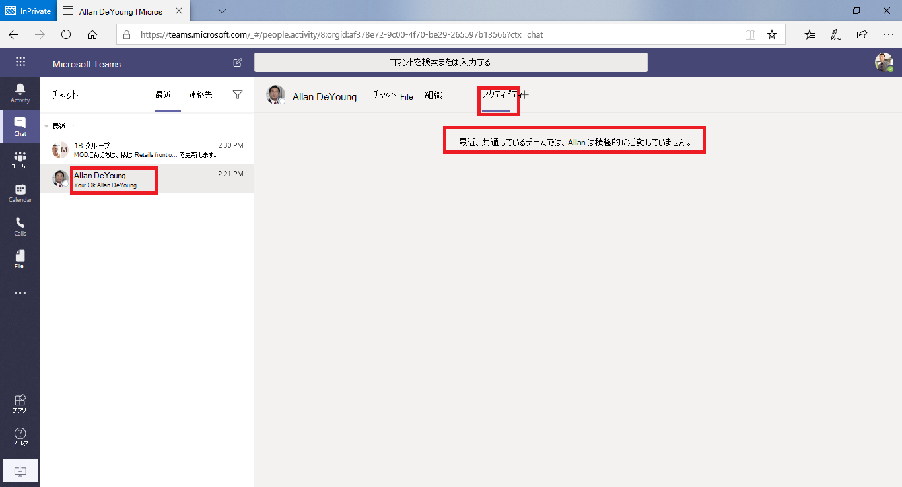

# Microsoft Teams の情報バリア

情報バリア (IB) は、個人またはグループが互いに通信し合うのを防ぐために管理者が構成できるポリシーです。 たとえば、ある部署が他の部署と共有してはならない情報を処理している場合、IB は便利です。 また、グループを分離したり、そのグループ外のユーザーとの通信を妨げる必要がある場合にも便利です。

>[!NOTE]
>- テナント間で情報バリア (IB) グループを作成することはできません。
>- ボット、Azure Active Directory (Azure AD) アプリ、およびユーザーを追加する一部の API の使用は、バージョン 1 ではサポートされていません。
>- プライベート チャネルは、構成する IB ポリシーに準拠しています。
>- 新機能: SharePoint に接続されているサイトのバリアのサポートについては、「Teams サイトに関連付けられているセグメント」[をMicrosoft Teamsしてください](/sharepoint/information-barriers#segments-associated-with-microsoft-teams-sites)。

IB ポリシーは、ルックアップと検出も防止します。 通信してはいけない相手と通信しようとすると、そのユーザーが相手の選択リストに表示されます。

## 背景

IB の主要なドライバーは、金融サービス業界から得たものとなっています。 金融業界規制機関[(FINRA)]( https://www.finra.org)は、メンバー企業内の IBs と利益の競合をレビューし、そのような競合の管理に関するガイダンスを提供します (FINRA 2241、借金調査規制通知[15-31)。](https://www.finra.org/sites/default/files/Regulatory-Notice-15-31_0.pdf)

ただし、IB の導入以降、他の多くの領域で役立つ可能性があります。 その他の一般的なシナリオは次のとおりです。

- 教育: ある学校の学生は、他の学校の学生の連絡先情報を参照できない。

- 法律: あるクライアントの法律家によって取得されたデータの機密性を維持し、別のクライアントを代表する同じ会社の法律家によってアクセスされるのを防ぐ。

- 政府機関: 情報のアクセスと制御は、部門やグループ間で制限されます。

- Professionalサービス: 会社のユーザーのグループは、顧客エンゲージメント中にゲスト アクセスを介してクライアントまたは特定の顧客とのみチャットできます。

たとえば、Enrico は銀行セグメントに属し、Pradeep は財務アドバイザー セグメントに属しています。 Enrico と Pradeep は、組織の IB ポリシーがこれら 2 つのセグメント間の通信とコラボレーションをブロックするために相互に通信できない。 ただし、Enrico と Pradeep は HR で Lee と通信できます。

## 情報バリアを使用する場合

次のような状況で、IB を使用できます。

- チームは、特定の他のチームとデータの通信や共有を行うのを防ぐ必要があります。
- チームは、チーム外のユーザーと通信したり、データを共有したりしなけってはいません。

Information Barrier Policy Evaluation Service は、通信が IB ポリシーに準拠するかどうかを決定します。

## 情報バリア ポリシーの管理

IB ポリシーは、PowerShell コマンドレットMicrosoft 365コンプライアンス センター (SCC) で管理されます。 詳細については、「情報バリアの [ポリシーを定義する」を参照してください](/office365/securitycompliance/information-barriers-policies)。

> [!IMPORTANT]
> ポリシーを設定または定義する前に、スコープを持つディレクトリ検索を有効にする必要Microsoft Teams。 情報バリアのポリシーを設定または定義する前に、範囲指定されたディレクトリ検索を有効にしてから、少なくとも数時間待ちます。 詳細については、「情報バリア ポリシー [を定義する」を参照してください](/office365/securitycompliance/information-barriers-policies#prerequisites)。

## 情報バリア管理者ロール

IB コンプライアンス管理ロールは、IB ポリシーの管理を担当します。 このロールの詳細については、「コンプライアンス センターのアクセス許可[」Microsoft 365参照してください](/office365/securitycompliance/permissions-in-the-security-and-compliance-center)。

## 情報バリア トリガー

IB ポリシーは、次のイベントが発生Teamsアクティブ化されます。

- **メンバーはチームに追加されます** 。ユーザーをチームに追加するたびに、ユーザーのポリシーを他のチーム メンバーの IB ポリシーに対して評価する必要があります。 ユーザーが正常に追加されると、ユーザーは、それ以上のチェックを行わずにチーム内のすべての関数を実行できます。 ユーザーのポリシーによってチームへの追加がブロックされた場合、ユーザーは検索に表示されません。

    

- **新しいチャット** が要求される - ユーザーが 1 人または複数の他のユーザーとの新しいチャットを要求するたび、IB ポリシーに違反しないチャットが評価されます。 会話が IB ポリシーに違反した場合、会話は開始されます。

    1 対 1 のチャットの例を次に示します。

    > [!div class="mx-imgBorder"]
    > 

    グループ チャットの例を次に示します。

    > [!div class="mx-imgBorder"]
    > 

- **ユーザーが** 会議への参加を招待される - ユーザーが会議に参加するために招待された場合、ユーザーに適用される IB ポリシーは、他のチーム メンバーに適用される IB ポリシーに対して評価されます。 違反がある場合、ユーザーは会議への参加を許可されません。

    

- **2** 人または複数のユーザー間で画面を共有する - ユーザーが他のユーザーと画面を共有する場合は、共有が他のユーザーの IB ポリシーに違反していないか確認するために、共有を評価する必要があります。 IB ポリシーに違反した場合、画面共有は許可されません。

    ポリシーを適用する前の画面共有の例を次に示します。

    > [!div class="mx-imgBorder"]
    > 

    ポリシーが適用された後の画面共有の例を次に示します。 画面共有アイコンと通話アイコンは表示されません。

    > [!div class="mx-imgBorder"]
    > 

- **ユーザー** が Teams で通話を行う - ユーザーが別のユーザーまたはユーザー のグループに対して (VOIP を介して) 音声通話を開始するたびに、その通話が評価され、他のチーム メンバーの IB ポリシーに違反していないと判断されます。 違反がある場合、音声通話はブロックされます。

- **ゲストのTeams** - IB ポリシーは、Teamsゲストに適用されます。 組織のグローバル アドレス一覧でゲストを検出できる必要がある場合は、「グループでゲスト アクセスを管理する」[をMicrosoft 365してください](/microsoft-365/admin/create-groups/manage-guest-access-in-groups)。 ゲストが検出可能な場合は [、IB ポリシー を定義できます](/office365/securitycompliance/information-barriers-policies)。

## ポリシーの変更が既存のチャットに与える影響

IB ポリシー管理者がポリシーに変更を加えた場合、またはユーザーのプロファイルの変更 (ジョブの変更など) が理由でポリシーの変更がアクティブ化された場合、Information Barrier Policy Evaluation Service はメンバーを自動的に検索して、チームのメンバーシップがポリシーに違反していないか確認します。

ユーザー間に既存のチャットや他の通信が存在し、新しいポリシーが設定されている場合、または既存のポリシーが変更された場合、サービスは既存の通信を評価して、通信が引き続き許可されるのを確認します。 

- **1:1** チャット - 2 人のユーザー間の通信が許可されなくなった場合 (通信をブロックするポリシーの 1 人または両方のユーザーへのアプリケーションのため)、それ以上の通信がブロックされます。 既存のチャット会話は読み取り専用になります。

    チャットが表示されている例を次に示します。

    > [!div class="mx-imgBorder"]
    > 

    チャットが無効になっている例を次に示します。

    > [!div class="mx-imgBorder"]
    > 

- **グループ** チャット - 1 人のユーザーからグループへの通信が許可されなくなった場合 (たとえば、ユーザーがジョブを変更した場合など)、参加がポリシーに違反している他のユーザーと共に、グループ チャットから削除され、グループとのコミュニケーションは許可されません。 ユーザーは古い会話を表示できますが、グループとの新しい会話を表示したり、参加したりできません。 通信を妨げる新しいポリシーまたは変更されたポリシーが複数のユーザーに適用されている場合、ポリシーの影響を受けるユーザーはグループ チャットから削除される可能性があります。 古い会話は引き続き表示できます。

  この例では、Enrico は組織内の別の部署に移動し、グループ チャットから削除されます。

  

  Enrico は、グループ チャットにメッセージを送信できなくなりました。

  

- **チーム** - グループから削除されたユーザーは、チームから削除され、既存または新しい会話を表示したり、参加したりすることはできません。

## シナリオ: 既存のチャットのユーザーがブロックされる

現在、IB ポリシーによって別のユーザーがブロックされている場合、ユーザーには次のシナリオが発生します。

- **[ユーザー]** タブ - ユーザーが [ユーザー] タブにブロックされたユーザー **を表示** できない。

- **[ユーザー選択]** - ブロックされたユーザーは、ユーザー選択には表示されません。

    

- **[アクティビティ]** タブ - ユーザーがブロックされたユーザーの [アクティビティ] タブにアクセスした場合、投稿は表示されません。 ([ **アクティビティ] タブ** にはチャネルの投稿だけが表示され、2 人のユーザー間に共通のチャネルはありません)。

    ブロックされているアクティビティ タブ ビューの例を次に示します。

    > [!div class="mx-imgBorder"]
    > 

- **組織図** - ブロックされたユーザーが表示される組織図にユーザーがアクセスした場合、ブロックされたユーザーは組織図に表示されません。 代わりに、エラー メッセージが表示されます。

- **ユーザー** カード - ユーザーが会話に参加し、そのユーザーが後でブロックされた場合、他のユーザーは、ブロックされたユーザーの名前にマウス ポインターを合わせると、ユーザー カードの代わりにエラー メッセージが表示されます。 カードに表示されている操作 (通話やチャットなど) は使用できません。

- **連絡先の候補** - ブロックされたユーザーは、候補の連絡先リスト (新しいユーザーに対して表示される最初の連絡先リスト) には表示されません。

- **チャットの連絡先** - ユーザーはチャットの連絡先リストにブロックされたユーザーを表示できますが、ブロックされたユーザーは識別されます。 ブロックされたユーザーに対してユーザーが実行できる唯一のアクションは、ユーザーを削除する操作です。 ユーザーは、ユーザーをクリックして過去の会話を表示できます。

- **連絡先の呼** び出し - ユーザーは通話の連絡先リストにブロックされたユーザーを表示できますが、ブロックされたユーザーは識別されます。 ユーザーがブロック ユーザーに対して実行できる唯一のアクションは、ユーザーを削除する操作です。

    通話連絡先リストのブロックされたユーザーの例を次に示します。

    > [!div class="mx-imgBorder"]
    > 

    通話コンテンツ リストのユーザーに対して無効になっているチャットの例を次に示します。

    > [!div class="mx-imgBorder"]
    > 

- **Skype** 移行へのTeams - Skype for Business から Teams への移行中は、IB ポリシーによってブロックされているユーザーも含め、すべてのユーザーが Teams に移行されます。 これらのユーザーは、上記のように処理されます。

## TeamsポリシーとSharePointサイト

チームが作成されると、SharePointサイトがプロビジョニングされ、ファイル エクスペリエンスMicrosoft Teamsに関連付けられる。 情報バリア ポリシーは、既定では、このSharePointポリシーには適用されません。 SharePoint および OneDrive で情報バリアを有効にするには、「情報バリアを使用する」トピックのガイダンスと[手順SharePoint](/sharepoint/information-barriers#enable-sharepoint-and-onedrive-information-barriers-in-your-organization)してください。

## 必要なライセンスとアクセス許可

プランや価格など、ライセンスとアクセス許可の詳細については、「セキュリティとコンプライアンスに関するMicrosoft 365ライセンス ガイダンス[」を&してください](/office365/servicedescriptions/microsoft-365-service-descriptions/microsoft-365-tenantlevel-services-licensing-guidance/microsoft-365-security-compliance-licensing-guidance)。

## 既知の問題

- **ユーザーはアドホック** 会議に参加できません: IB ポリシーが有効になっている場合、会議リストのサイズが会議出席制限 を超える場合、ユーザーは会議に参加 [できません。](limits-specifications-teams.md) 根本的な原因は、IB チェックは、ユーザーを会議チャットリストに追加できるかどうかに依存し、ユーザーをリストに追加できる場合にのみ、会議に参加できます。 会議に参加したユーザーは、そのユーザーをリストに追加します。そのため、定期的な会議では、名簿が速くいっぱいになじむ可能性があります。 チャットリストが会議出席制限に達すると、会議に追加のユーザーは追加されません。 テナントに対して IB が有効で、チャット リストが会議に対していっぱいになっている場合、新しいユーザー (まだリストに参加していないユーザー) は会議に参加できません。 ただし、テナントに対して IB が有効になっていない場合、会議のチャット リストがいっぱいの場合、新しいユーザー (まだリストに参加していないユーザー) は会議に参加できますが、会議にはチャット オプションは表示されません。 短期的な解決策は、会議チャットリストから非アクティブなメンバーを削除して、新しいユーザーのためのスペースを作る方法です。 ただし、後日、会議チャットのリストのサイズを増やす予定です。
- **ユーザーはチャネル** 会議に参加できません: IB ポリシーが有効になっている場合、ユーザーがチームのメンバーでない場合、チャネル会議に参加することはできません。 根本的な原因は、IB チェックは、ユーザーを会議チャットリストに追加できるかどうかに依存し、ユーザーをリストに追加できる場合にのみ、会議に参加できます。 チャネル会議のチャット スレッドは、Team/Channel メンバーだけが使用できます。また、メンバー以外のメンバーはチャット スレッドを表示したり、チャット スレッドにアクセスしたりできません。 テナントに対して IB が有効で、チーム 以外のメンバーがチャネル会議への参加を試みる場合、そのユーザーは会議に参加できません。 ただし、テナントに対して IB が有効になっていない場合、チーム 以外のメンバーがチャネル会議に参加しようとすると、ユーザーは会議に参加できますが、会議にはチャット オプションは表示されません。
- **チーム** 所有者が削除されない: 新しい IB ポリシーが適用され、2 つ以上の競合するセグメントが Teams チャネルに存在する場合、チーム所有者を含むセグメントの方が優先され、他のセグメント ユーザーは削除されます。 また、現時点では、他の所有者/ユーザーと競合している場合でも、チーム所有者は削除されません。 テナント管理者と他のチャネル所有者は、競合する所有者を手動で削除する必要があります。
- **テナントで許可される** セグメントの最大数: IB ポリシーを構成するときに、各テナントは最大 100 セグメントを設定できます。 構成できるポリシーの数に制限はありません。

- **IB ポリシーは** フェデレーション ユーザーには機能しません: 外部テナントとのフェデレーションを許可する場合、それらのテナントのユーザーは IB ポリシーによって制限されません。 組織のユーザーが外部のフェデレーション ユーザーによって開催されたチャットまたは会議に参加する場合、IB ポリシーは組織のユーザー間の通信も制限されません。

## 詳細情報

- IB の詳細については、「情報バリア [」を参照してください](/office365/securitycompliance/information-barriers)。

- IB ポリシーを設定するには、「情報バリアのポリシー [を定義する」を参照してください](/office365/securitycompliance/information-barriers-policies)。

- IB ポリシーを編集または削除するには、「情報バリア ポリシーを編集 [(または削除) する」を参照してください](/microsoft-365/compliance/information-barriers-edit-segments-policies)。

## 使用するための条件

- この機能は、パブリック クラウドで利用できます。2021 年 1 月に、新しいクラウドに Information Barriers GCCしました。
- この機能は、GCCH クラウドと DOD クラウドではまだ使用できません。