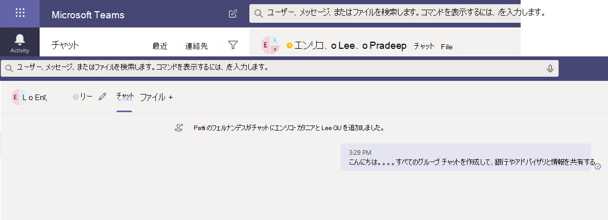

# Microsoft Teams の情報バリアInformation barriers in Microsoft Teams

情報バリア (IB) は、個人またはグループが互いに通信し合うのを防ぐために管理者が構成できるポリシーです。Information barriers (IBs) are policies that an admin can configure to prevent individuals or groups from communicating with each other. たとえば、1 つの部署が他の部門と共有してはいけない情報を処理している場合、IB は便利です。IBs are useful if, for example, one department is handling information that shouldn't be shared with other departments. また、グループを分離したり、そのグループ外のユーザーとの通信を妨げる必要がある場合にも便利です。IBs are also useful when a group needs to be isolated or prevented from communicating with anyone outside of that group.

>[!NOTE]
>- 情報バリア (IB) グループはテナント間で作成できません。Information barrier (IB) groups cannot be created across tenants.
>- ボット、Azure Active Directory (Azure AD) アプリ、およびユーザーを追加する一部の API は、バージョン 1 ではサポートされていません。Using bots, Azure Active Directory (Azure AD) apps, and some APIs to add users is not supported in version 1.
>- プライベート チャネルは、構成する IB ポリシーに準拠します。Private channels are compliant to IB policies that you configure.
>- 新機能: Teams に接続されている SharePoint サイトのバリアのサポートについては、「Microsoft Teams サイトに関連付けられているセグメント [」を参照してください](/sharepoint/information-barriers#segments-associated-with-microsoft-teams-sites)。New: For information about support for barriers for SharePoint sites that are connected to Teams, see [Segments associated with Microsoft Teams sites](/sharepoint/information-barriers#segments-associated-with-microsoft-teams-sites).

また、IB ポリシーは、ルックアップや検出を防止します。IB policies also prevent lookups and discovery. 通信しない相手と通信しようとすると、そのユーザーはユーザー選択で見つからなされます。If you attempt to communicate with someone you shouldn't be communicating with, you won't find that user in the people picker.

## 背景Background

IB の主要なドライバーは、金融サービス業界から提供されます。The primary driver for IBs comes from the financial services industry. 金融業界規制機関[(FINRA)]( https://www.finra.org)は、メンバー企業内の IB と関心の競合をレビューし、そのような競合の管理に関するガイダンスを提供します (FINRA 2241、債務調査規制に関する通知[15-31)。](https://www.finra.org/sites/default/files/Regulatory-Notice-15-31_0.pdf)The Financial Industry Regulatory Authority ([FINRA]( https://www.finra.org)) reviews IBs and conflicts of interest within member firms and provides guidance about managing such conflicts (FINRA 2241, [Debt Research Regulatory Notice 15-31](https://www.finra.org/sites/default/files/Regulatory-Notice-15-31_0.pdf).

ただし、IB の導入以降、他の多くの領域で役立つ分野が見つかっています。However, since introducing IBs, many other areas have found them to be useful. その他の一般的なシナリオは次のとおりです。Other common scenarios include:

- 教育: 1 つの学校の学生は、他の学校の学生の連絡先情報を参照できない。Education: Students in one school aren't able to look up contact details for students of other schools.

- 法的: ある顧客の法律家によって取得されたデータの機密性を維持し、別の顧客を代表する同じ会社の法律家によってデータにアクセスされるのを防ぐ。Legal: Maintaining the confidentiality of data that is obtained by the lawyer of one client and preventing it from being accessed by a lawyer for the same firm who represents a different client.

- 政府機関: 情報へのアクセスと制御は、部門やグループによって制限されます。Government: Information access and control are limited across departments and groups.

- プロフェッショナル サービス: 会社内のユーザーのグループは、顧客との契約中にゲスト アクセスを介してクライアントまたは特定の顧客とのみチャットできます。Professional services: A group of people in a company is only able to chat with a client or a specific customer via guest access during a customer engagement.

たとえば、Enrico は銀行セグメントに属し、Pradeep は財務アドバイザー セグメントに属しています。For example, Enrico belongs to the Banking segment and Pradeep belongs to the Financial advisor segment. Enrico と Pradeep は、組織の IB ポリシーがこれら 2 つのセグメント間のコミュニケーションとコラボレーションをブロックする理由で、互いに通信できない。Enrico and Pradeep can't communicate with each other because the organization's IB policy blocks communication and collaboration between these two segments. ただし、Enrico と Pradeep は HR で Lee と通信できます。However, Enrico and Pradeep can communicate with Lee in HR.

## 情報バリアを使用する場合When to use information barriers

次のような状況で、IB を使用できます。You might want to use IBs in situations like these:

- チームは、特定の他のチームとのデータ通信や共有を防止する必要があります。A team must be prevented from communicating or sharing data with a specific other team.
- チームは、チーム外の誰とでも通信したり、データを共有したりしな。A team must not communicate or share data with anyone outside of the team.

情報バリア ポリシー評価サービスは、通信が IB ポリシーに準拠するかどうかを決定します。The Information Barrier Policy Evaluation Service determines whether a communication complies with IB policies.

## 情報バリア ポリシーの管理Managing information barrier policies

IB ポリシーは、PowerShell コマンドレットを使用して Microsoft 365 コンプライアンス センター (SCC) で管理されます。IB policies are managed in the Microsoft 365 Compliance Center (SCC) using PowerShell cmdlets. 詳細については、「情報バリア [のポリシーを定義する」を参照してください](/office365/securitycompliance/information-barriers-policies)。For more information, see [Define policies for information barriers](/office365/securitycompliance/information-barriers-policies).

> [!IMPORTANT]
> ポリシーを設定または定義する前に、Microsoft Teams で範囲指定ディレクトリ検索を有効にする必要があります。Before you set up or define policies, you must enable scoped directory search in Microsoft Teams. 情報バリアのポリシーを設定または定義する前に、範囲指定されたディレクトリ検索を有効にしてから、少なくとも数時間待ちます。Wait at least a few hours after enabling scoped directory search before you set up or define policies for information barriers. 詳細については、「情報バリア [ポリシーを定義する」を参照してください](/office365/securitycompliance/information-barriers-policies#prerequisites)。For more information, see [Define information barrier policies](/office365/securitycompliance/information-barriers-policies#prerequisites).

## 情報バリア管理者の役割Information barriers administrator role

IB コンプライアンス管理の役割は、IB ポリシーの管理を担当します。The IB Compliance Management role is responsible for managing IB policies. この役割の詳細については [、「Microsoft 365](/office365/securitycompliance/permissions-in-the-security-and-compliance-center)コンプライアンス センターのアクセス許可」を参照してください。For more information about this role, see [Permissions in the Microsoft 365 Compliance Center](/office365/securitycompliance/permissions-in-the-security-and-compliance-center).

## 情報バリア トリガーInformation barrier triggers

IB ポリシーは、次の Teams イベントが発生するとアクティブ化されます。IB policies are activated when the following Teams events take place:

- **メンバーがチーム** に追加される - ユーザーをチームに追加するたびに、ユーザーのポリシーを他のチーム メンバーの IB ポリシーに対して評価する必要があります。**Members are added to a team** - Whenever you add a user to a team, the user's policy must be evaluated against the IB policies of other team members. ユーザーが正常に追加されると、ユーザーはそれ以上チェックを行わずにチーム内のすべての関数を実行できます。After the user is successfully added, the user can perform all functions in the team without further checks. ユーザーのポリシーによってチームへの追加がブロックされている場合、そのユーザーは検索に表示されません。If the user's policy blocks them from being added to the team, the user won't show up in search.

    

- **新** しいチャットが要求される - ユーザーが 1 人または複数の他のユーザーとの新しいチャットを要求するたび、チャットが評価され、IB ポリシーに違反しなさなかったりします。**A new chat is requested** - Each time that a user requests a new chat with one or more other users, the chat is evaluated to make sure that it isn't violating any IB policies. 会話が IB ポリシーに違反した場合、会話は開始されていない。If the conversation violates an IB policy, then the conversation isn't started.

    1 対 1 のチャットの例を次に示します。Here's an example of a 1:1 chat.

    > [!div class="mx-imgBorder"]
    > 

    グループ チャットの例を次に示します。Here's an example of a group chat.

    > [!div class="mx-imgBorder"]
    > 

- **ユーザーが** 会議への参加に招待される - ユーザーが会議への参加に招待された場合、ユーザーに適用される IB ポリシーは、他のチーム メンバーに適用される IB ポリシーに対して評価されます。**A user is invited to join a meeting** - When a user is invited to join a meeting, the IB policy that applies to the user is evaluated against the IB policies that apply to the other team members. 違反がある場合、ユーザーは会議への参加を許可されません。If there's a violation, the user won't be allowed to join the meeting.

    

- **2** 人または複数のユーザー間で画面を共有する - ユーザーが他のユーザーと画面を共有する場合、共有が他のユーザーの IB ポリシーに違反しない場合は、共有を評価する必要があります。**A screen is shared between two or more users** - When a user shares a screen with other users, the sharing must be evaluated to make sure that it doesn't violate the IB policies of other users. IB ポリシーに違反した場合、画面共有は許可されません。If an IB policy is violated, the screen share won't be allowed.

    次に、ポリシーを適用する前の画面共有の例を示します。Here's an example of screen share before the policy is applied.

    > [!div class="mx-imgBorder"]
    > 

    ポリシーが適用された後の画面共有の例を次に示します。Here's an example of screen share after the policy is applied. 画面共有と通話アイコンは表示されません。The screen share and call icons aren't visible.

    > [!div class="mx-imgBorder"]
    > 

- **ユーザーが Teams** で通話を行う - ユーザーが別のユーザーまたはユーザー グループに音声通話 (VOIP 経由) を開始すると、その通話が評価され、他のチーム メンバーの IB ポリシーに違反していないと判断されます。**A user places a phone call in Teams** - Whenever a user initiates a voice call (via VOIP) to another user or group of users, the call is evaluated to make sure that it doesn't violate the IB policies of other team members. 違反がある場合、音声通話はブロックされます。If there's any violation, the voice call is blocked.

- **Teams のゲスト** - IB ポリシーは Teams のゲストに適用されます。**Guests in Teams** - IB policies apply to guests in Teams, too. 組織のグローバル アドレス一覧でゲストを検出できる必要がある場合は [、「Microsoft 365](/microsoft-365/admin/create-groups/manage-guest-access-in-groups)グループでゲスト アクセスを管理する」を参照してください。If guests need to be discoverable in your organization's global address list, see [Manage guest access in Microsoft 365 Groups](/microsoft-365/admin/create-groups/manage-guest-access-in-groups). ゲストが検出可能な場合は [、IB ポリシーを定義できます](/office365/securitycompliance/information-barriers-policies)。Once guests are discoverable, you can [define IB policies](/office365/securitycompliance/information-barriers-policies).

## ポリシーの変更が既存のチャットに与える影響How policy changes impact existing chats

IB ポリシー管理者がポリシーを変更した場合、またはユーザーのプロファイルの変更 (ジョブ変更など) のためにポリシー変更がアクティブ化された場合、Information Barrier Policy Evaluation Service はメンバーを自動的に検索して、チームのメンバーシップがポリシーに違反していないか確認します。When the IB policy administrator makes changes to a policy, or when a policy change is activated because of a change to a user's profile (such as for a job change), the Information Barrier Policy Evaluation Service automatically searches the members to ensure that their membership in the team doesn't violate any policies.

ユーザー間にチャットなどの通信が存在し、新しいポリシーが設定されている場合、または既存のポリシーが変更された場合、サービスは既存の通信を評価して、通信が引き続き許可されている必要があります。If there's an existing chat or other communication between users, and a new policy is set or an existing policy is changed, the service evaluates existing communications to make sure that the communications are still allowed to occur. 

- **1:1** チャット - 2 人のユーザー間の通信が許可されなくなった場合 (通信をブロックするポリシーの 1 人または両方のユーザーへのアプリケーションのため)、それ以上の通信がブロックされます。**1:1 chat** - If communication between two users is no longer allowed (because of application to one or both users of a policy that blocks communication), further communication is blocked. 既存のチャット会話は読み取り専用になります。Their existing chat conversations become read-only.

    チャットが表示される例を次に示します。Here's an example that shows the chat is visible.

    > [!div class="mx-imgBorder"]
    > 

    チャットが無効になっている例を次に示します。Here's an example that shows the chat is disabled.

    > [!div class="mx-imgBorder"]
    > 

- **グループ** チャット - 1 人のユーザーからグループへの通信が許可されなくなった場合 (たとえば、ユーザーがジョブを変更した場合など)、ユーザー (参加がポリシーに違反している他のユーザーと共に) はグループ チャットから削除され、グループとの今後の通信は許可されません。**Group chat** - If communication from one user to a group is no longer allowed (for example, because a user changed jobs), the user—along with the other users whose participation violates the policy—may be removed from group chat, and further communication with the group won't be allowed. ユーザーは古い会話を表示できますが、グループとの新しい会話を表示したり、グループに参加したりできません。The user can still see old conversations, but won't be able to see or participate in any new conversations with the group. 通信を妨げる新しいポリシーまたは変更されたポリシーが複数のユーザーに適用されている場合、ポリシーの影響を受けるユーザーはグループ チャットから削除される可能性があります。If the new or changed policy that prevents communication is applied to more than one user, the users who are affected by the policy may be removed from group chat. 古い会話は引き続き表示できます。They can still see old conversations.

  この例では、Enrico は組織内の別の部署に移動し、グループ チャットから削除されています。In this example, Enrico moved to a different department within the organization and is removed from the group chat.

  

  Enrico はグループ チャットにメッセージを送信できなくなりました。Enrico can no longer send messages to the group chat.

  

- **チーム** - グループから削除されたユーザーはチームから削除され、既存の会話または新しい会話を表示したり、参加したりすることはできません。**Team** - Any users who have been removed from the group are removed from the team and won't be able to see or participate in existing or new conversations.

## シナリオ: 既存のチャットのユーザーがブロックされるScenario: A user in an existing chat becomes blocked

現時点では、IB ポリシーによって別のユーザーがブロックされる場合、ユーザーには次のシナリオが発生します。Currently, users experience the following scenarios if an IB policy blocks another user:

- **[ユーザー]** タブ - ユーザーが [ユーザー] タブにブロックされたユーザー **を表示** できない。**People tab** - A user can't see blocked users on the **People** tab.

- **ユーザー選択 -** ブロックされたユーザーは、ユーザー選択に表示されません。**People Picker** - Blocked users won't be visible in the people picker.

    

- **[アクティビティ]** タブ - ユーザーがブロックされたユーザーの [アクティビティ] タブにアクセスした場合、投稿は表示されません。**Activity tab** - If a user visits the **Activity** tab of a blocked user, no posts will appear. ([ **アクティビティ]** タブにはチャネルの投稿だけが表示され、2 人のユーザー間に共通のチャネルはありません)。(The **Activity** tab displays channel posts only, and there would be no common channels between the two users.)

    ブロックされているアクティビティ タブ ビューの例を次に示します。Here's an example of the activity tab view that is blocked.

    > [!div class="mx-imgBorder"]
    > ![ブロックされている [アクティビティ] タブを示すスクリーンショット](media/ib-after-activity-tab-policy.png)

- **組織図** - ブロックされたユーザーが表示される組織図にユーザーがアクセスした場合、ブロックされたユーザーは組織図に表示されません。**Org charts** - If a user accesses an org chart on which a blocked user appears, the blocked user won't appear on the org chart. 代わりに、エラー メッセージが表示されます。Instead, an error message will appear.

- **People カード** - ユーザーが会話に参加し、そのユーザーが後でブロックされた場合、他のユーザーは、ブロックされたユーザーの名前をポイントすると、ユーザー カードの代わりにエラー メッセージが表示されます。**People card** - If a user participates in a conversation and the user is later blocked, other users will see an error message instead of the people card when they hover over the blocked user's name. カードに一覧表示されている操作 (通話やチャットなど) は使用できません。Actions listed on the card (such as calling and chat) will be unavailable.

- **連絡先候補** - ブロックされたユーザーは、候補の連絡先リスト (新しいユーザーに対して表示される最初の連絡先リスト) には表示されません。**Suggested contacts** - Blocked users don't appear on the suggested contacts list (the initial contact list that appears for new users).

- **チャットの** 連絡先 - ユーザーはチャットの連絡先リストでブロックされたユーザーを表示できますが、ブロックされたユーザーは識別されます。**Chat contacts** - A user can see blocked users on the chats contact list, but the blocked users will be identified. ブロックされたユーザーに対してユーザーが実行できる操作は、ユーザーを削除するのみです。The only action that the user can perform on the blocked users is to delete them. また、ユーザーをクリックして過去の会話を表示できます。The user can also click on them to view their past conversation.

- **連絡先の呼** び出し - ユーザーは通話の連絡先リストでブロックされたユーザーを表示できますが、ブロックされたユーザーは識別されます。**Calls contacts** - A user can see blocked users on the calls contact list, but the blocked users will be identified. ブロックするユーザーに対してユーザーが実行できる唯一の操作は、ユーザーを削除する操作です。The only action that the user can perform on the block users is to delete them.

    通話の連絡先リストでブロックされたユーザーの例を次に示します。Here's an example of a blocked user in the calls contact list.

    > [!div class="mx-imgBorder"]
    > 

    通話コンテンツ リストのユーザーに対して無効になっているチャットの例を次に示します。Here's an example of the chat being disabled for a user on the calls content list.

    > [!div class="mx-imgBorder"]
    > 

- **Skype から Teams** への移行 - Skype for Business から Teams への移行中に、すべてのユーザー (IB ポリシーによってブロックされているユーザーも含む) は Teams に移行されます。**Skype to Teams migration** - During a migration from Skype for Business to Teams, all users—even those users who are blocked by IB policies—will be migrated to Teams. これらのユーザーは、上記のように処理されます。Those users are then handled as described above.

## Teams ポリシーと SharePoint サイトTeams policies and SharePoint sites

チームが作成されると、SharePoint サイトがプロビジョニングされ、ファイルエクスペリエンスのために Microsoft Teams に関連付けされます。When a team is created, a SharePoint site is provisioned and associated with Microsoft Teams for the files experience. 既定では、この SharePoint サイトとファイルに対する IB ポリシーは適用されません。IB policies aren't honored on this SharePoint site and files by default. IB ポリシーを有効にするには、管理者が既にフォームに入力し、SHAREPoint と OneDrive で IB ポリシーを有効にしていることを要求しています (「情報バリア」の「前提条件」セクションを参照[してください)。](/sharepoint/information-barriers#prerequisites)To enable IB policies, the administrator has already filled out a form, requesting that IB policies be enabled on SharePoint and OneDrive (see the *Prerequisites* section in [Information barriers](/sharepoint/information-barriers#prerequisites)). SharePoint と OneDrive で IB ポリシーが有効になっている場合、IB ポリシーは、Microsoft Teams でチームを作成するときにプロビジョニングされる SharePoint サイトで機能します。If the IB policy is turned on in SharePoint and OneDrive, then the IB policies will work on SharePoint sites that are provisioned when a team is created with Microsoft Teams.

チームの **SharePoint** サイト上の IB ポリシーの例: Contoso Bank corporation では、ユーザー 'Sesha@contosobank.onmicrosoft.com' は投資銀行セグメントに属し、ユーザー 'Nikita@contosobank.onmicrosoft.com' はアドバイザリ セグメントに属しています。**Example of IB policies on SharePoint site of a team**: In Contoso Bank corporation, user 'Sesha@contosobank.onmicrosoft.com' belongs to the Investment Banking segment and user 'Nikita@contosobank.onmicrosoft.com' belongs to the Advisory segment. 組織の IB ポリシーは、これら 2 つのセグメント間のコミュニケーションとコラボレーションをブロックします。The organization's IB policy blocks communication and collaboration between these two segments.
ユーザー Sesha が投資銀行セグメントのチームを作成すると、それをバックするチームと SharePoint サイトには、インベストメント バンキング ユーザーだけがアクセスできます。When user Sesha creates a team for the Investment Banking segment, the team and the SharePoint site that backs it will be accessible only to Investment Banking users. ユーザーニジェロは、サイトリンクを持っている場合でも、そのサイトにアクセスできない。User Nikita can't access that site even if she has the site link.

詳細については [、「SharePoint で情報バリアを使用する」を参照してください](/sharepoint/information-barriers#segments-associated-with-microsoft-teams-sites)。For more information, see [Use information barriers with SharePoint](/sharepoint/information-barriers#segments-associated-with-microsoft-teams-sites).

## 必要なライセンスとアクセス許可Required licenses and permissions

プランや価格など、ライセンスとアクセス許可の詳細については、セキュリティとコンプライアンスに関する [Microsoft 365 &参照してください](/office365/servicedescriptions/microsoft-365-service-descriptions/microsoft-365-tenantlevel-services-licensing-guidance/microsoft-365-security-compliance-licensing-guidance)。For more information on licenses and permissions, including plans and pricing, see [Microsoft 365 licensing guidance for security & compliance](/office365/servicedescriptions/microsoft-365-service-descriptions/microsoft-365-tenantlevel-services-licensing-guidance/microsoft-365-security-compliance-licensing-guidance).

## 既知の問題Known Issues

- **ユーザーが** 臨時の会議に参加できない : IB ポリシーが有効になっている場合、会議リストのサイズが会議出席の制限を超える場合、ユーザーは会議に参加 [できません。](limits-specifications-teams.md)**Users can't join ad-hoc meetings**: If IB policies are enabled, users aren't allowed to join meetings if the size of the meeting roster is greater than the [meeting attendance limits](limits-specifications-teams.md). 根本的な原因は、IB チェックはユーザーを会議チャットリストに追加できるかどうかに依存し、ユーザーをリストに追加できる場合にのみ、ユーザーが会議に参加できるかどうかに依存します。The root cause is that IB checks rely on whether users can be added to a meeting chat roster, and only when they can be added to the roster are they allowed to join the meeting. 会議に参加したユーザーは、一度そのユーザーをリストに追加します。そのため、定期的な会議の場合、名簿は速くいっぱいになじむ可能性があります。A user joining a meeting once adds that user to the roster; hence for recurring meetings, the roster can fill up fast. チャットリストが会議出席の制限に達すると、その他のユーザーを会議に追加できます。Once the chat roster reaches the [meeting attendance limits](limits-specifications-teams.md), no additional users are allowed to be added to the meeting. テナントに対して IB が有効で、会議のチャットリストがいっぱいの場合、新しいユーザー (まだリストに参加していないユーザー) は会議への参加を許可されません。If IB is enabled for the tenant and the chat roster is full for a meeting, new users (those users who aren't already on the roster) aren't allowed to join the meeting. ただし、テナントに対して IB が有効ではなく、会議チャットリストがいっぱいの場合、新しいユーザー (まだリストに入っているユーザー) は会議に参加できますが、会議にはチャット オプションは表示されません。But if IB isn't enabled for the tenant and the meeting chat roster is full, new users (those users who aren't already on the roster) are allowed to join the meeting, though they won't see the chat option in the meeting. 短期間の解決策は、会議チャットリストから非アクティブなメンバーを削除して、新しいユーザーのためのスペースを作るという方法です。A short-term solution is to remove inactive members from the meeting chat roster to make space for new users. ただし、後日、会議チャットリストのサイズを増やす予定です。We will, however, be increasing the size of meeting chat rosters at a later date.
- **ユーザーがチャネル** 会議に参加できない : IB ポリシーが有効になっている場合、ユーザーはチームのメンバーではない場合、チャネル会議に参加できません。**Users can't join channel meetings**: If IB policies are enabled, users aren't allowed to join channel meetings if they're not a member of the team. 根本的な原因は、IB チェックはユーザーを会議チャットリストに追加できるかどうかに依存し、ユーザーをリストに追加できる場合にのみ、ユーザーが会議に参加できるかどうかに依存します。The root cause is that IB checks rely on whether users can be added to a meeting chat roster, and only when they can be added to the roster are they allowed to join the meeting. チャネル会議のチャット スレッドは、チーム/チャネル メンバーだけが利用できます。また、メンバー以外のメンバーはチャット スレッドを表示したり、アクセスしたりできません。The chat thread in a channel meeting is available to Team/Channel members only, and non-members can't see or access the chat thread. テナントに対して IB が有効であり、チーム以外のメンバーがチャネル会議に参加しようとすると、そのユーザーは会議に参加できません。If IB is enabled for the tenant and a non-team member attempts to join a channel meeting, that user isn't allowed to join the meeting. ただし、テナントに対して IB が有効になっていない場合、チーム以外のメンバーがチャネル会議に参加しようとすると、ユーザーは会議に参加できますが、会議にはチャット オプションは表示されません。However, if IB is *not* enabled for the tenant and a non-team member attempts to join a channel meeting, the user is allowed to join the meeting—but they won't see the chat option in the meeting.
- **チーム** 所有者が削除されない: 新しい IB ポリシーが適用され、その結果、Teams チャネルに 2 つ以上の競合するセグメントが存在する場合、チーム所有者とのセグメントの優先設定が高く、その他のセグメント ユーザーは削除されます。**Team owners are not removed**: If a new IB policy is applied that results in two or more conflicting segments present in a Teams channel, the segments with team owners are given higher preference and other segment users are removed. また、現時点では、チーム所有者は、他の所有者/ユーザーと競合している場合でも削除されません。Also, at this time, team owners are not getting removed, even if they are in conflict with other owners/users. テナント管理者と他のチャネル所有者は、競合する所有者を手動で削除する必要があります。Tenant admins and other channel owners will have to remove conflicting owners manually.
- **テナントで許可** されるセグメントの最大数: 各テナントは、IB ポリシーを構成するときに最大 100 セグメントを設定できます。**Maximum number of segments allowed in a tenant**: Each tenant can set up to 100 segments when configuring IB policies. 構成できるポリシーの数に制限はありません。There is no limit on the number of policies that can be configured.

## 詳細情報More information

- IB の詳細については、「情報バリア [」を参照してください](/office365/securitycompliance/information-barriers)。To learn more about IBs, see [Information barriers](/office365/securitycompliance/information-barriers).

- IB ポリシーを設定するには、「情報バリアのポリシーを定義 [する」を参照してください](/office365/securitycompliance/information-barriers-policies)。To set up IB policies, see [Define policies for information barriers](/office365/securitycompliance/information-barriers-policies).

- IB ポリシーを編集または削除するには、情報バリア ポリシーの編集 [(または削除) を参照してください](/microsoft-365/compliance/information-barriers-edit-segments-policies)。To edit or remove IB policies, see [Edit (or remove) information barrier policies](/microsoft-365/compliance/information-barriers-edit-segments-policies).

## 使用するための条件Availability

- この機能はパブリック クラウドで利用できます。2021 年 1 月に、GCC クラウドに Information Barriers を展開しました。The feature is available in our public cloud; in January 2021, we rolled out Information Barriers in the GCC cloud.
- この機能は、GCCH クラウドと DOD クラウドではまだ利用できません。The feature is not yet available in the GCCH and DOD clouds.