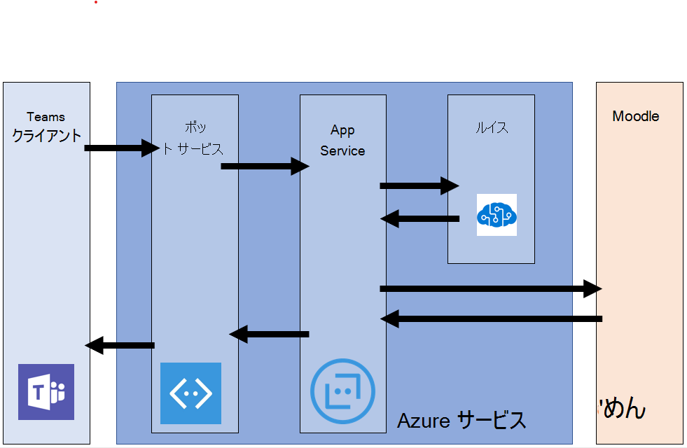

# Microsoft Teams との Moodle 統合をインストールする

> [!VIDEO https://www.youtube.com/embed/OHlPt22nKoE]

[Moodle](https://moodle.org/)、世界中で最も人気の高いオープンソースのラーニングマネジメントシステム (LMS) は、Microsoft Teams と統合されました。 この統合により、教師や教師が Moodle のコースで共同作業したり、成績や課題について質問したり、チーム内で通知を受け取ったりすることができます。

IT 管理者がこの統合を簡単に設定できるように、次の機能を使用して、オープンソースの Office 365 Moodle プラグインを更新しました。

* Azure AD での Moodle server の自動登録。
* Azure に Moodle Assistant ボットを1回クリックして展開します。
* Teams の自動プロビジョニングと、すべての Moodle コースのチーム登録の自動同期。
* 同期された各チームへの Moodle タブと Moodle Assistant のボットの自動インストール。 (近日公開予定)
* Moodle アプリをプライベート Teams App Store にワンクリックで公開します。 (近日公開予定)

この統合によって提供される機能の詳細については、[こちら](https://education.microsoft.com/courses-and-resources/resources/microsoft-teams-moodle)を参照してください。

## 前提条件

このアプリケーションをインストールして構成するには、次のものが必要です。

1. Moodle 管理者の資格情報
2. Azure AD 管理者の資格情報
3. Azure サブスクリプションでは、新しいリソースを作成することができます。

## 手順 1: Office 365 Moodle プラグインをインストールする

> [!VIDEO https://www.youtube.com/embed/SETEC5nzMgk]

Microsoft Teams の Moodle との統合は、オープンソースの[Office 365 Moodle プラグインセット](https://github.com/Microsoft/o365-moodle)によって実現されています。 Moodle サーバーにプラグインをインストールするには、次の操作を行います。

1. まず、 [Office 365 プラグインセット](https://moodle.org/plugins/pluginversions.php?plugin=local_o365)をダウンロードして、ローカルコンピューターに保存します。 バージョン3.5 以降を使用する必要があります。
    * Local_o365 プラグインをインストールすると、 [auth_oidc](https://moodle.org/plugins/auth_oidc)と[boost_o365Teams](https://moodle.org/plugins/pluginversions.php?plugin=theme_boost_o365teams)プラグインもインストールされます。
1. 管理者として Moodle サーバーにログインし、左側のナビゲーションパネルで [**サイトの管理**] を選択します。
1. [**プラグイン**] タブを選択し、[**プラグインのインストール**] をクリックします。
1. [ **ZIP ファイルからプラグインをインストール**する] セクションで、[**ファイルの選択**] ボタンをクリックします。
1. 左側のナビゲーションから [**ファイルのアップロード**] オプションを選択し、上でダウンロードしたファイルを参照して、[**このファイルをアップロード**] をクリックします。
1. 左側のナビゲーションパネルで [**サイトの管理**] オプションをもう一度選択して、管理者のダッシュボードに戻ります。 [**ローカルプラグイン**] まで下にスクロールし、[ **Microsoft Office 365 統合**] リンクをクリックします。 この構成ページは、このプロセスの残りの部分全体で使用するのと同じように、別のブラウザータブで開いたままにしておきます。

Moodle プラグインをインストールする方法の詳細については、 [Moodle のドキュメント](https://docs.moodle.org/34/en/Installing_plugins)を参照してください。

**重要な注意事項:** このプロセス全体を通してこの一連のページに戻ることができるため、Office 365 Moodle プラグインの構成ページは、別のブラウザータブで開いたままにしておきます。

*Moodle サイトをまだお持ちでない場合* Azure[リポジトリ](https://github.com/azure/moodle)で Moodle インスタンスをすばやく展開し、ニーズに合わせてカスタマイズできる Moodle を確認することをお勧めします。

## 手順 2: Office 365 プラグインと Azure Active Directory の間の接続を構成する

> [!VIDEO https://www.youtube.com/embed/FpGEezaJ3SA]

次に、Moodle を Azure Active Directory にアプリケーションとして登録する必要があります。 この処理を実行するのに役立つ PowerShell スクリプトを提供しました。 PowerShell スクリプトでは、office 365 Moodle プラグインによって使用される、Office 365 テナント用の新しい Azure AD アプリケーションをプロビジョニングします。 このスクリプトは、O365 テナント用にアプリをプロビジョニングし、プロビジョニングされたアプリに必要なすべての返信 Url と権限を設定し、AppID とキーを返します。 O365 Moodle プラグインのセットアップページで生成された AppID とキーを使用して、Azure AD で Moodle サーバーを構成することができます。 PowerShell スクリプトで自動化されている詳細な手動手順を確認する必要がある場合は、[プラグインの](https://docs.moodle.org/34/en/Office365#Register_your_Moodle_instance_as_an_Application)完全なドキュメントで確認できます。

### Microsoft Teams の情報フローの [Moodle] タブ

1. Microsoft Office 365 統合プラグインページから [**セットアップ**] タブを選びます。
1. [ **PowerShell スクリプトのダウンロード**] ボタンをクリックして、ローカルコンピューターに保存します。
1. ZIP ファイルから PowerShell スクリプトを準備する必要があります。 その手順は、次のとおりです。
    * ファイルを`Moodle-AzureAD-Powershell.zip`ダウンロードして抽出します。
    * 抽出したフォルダーを開きます。
    * `Moodle-AzureAD-Script.ps1`ファイルを右クリックし、[**プロパティ**] を選択します。
    * [プロパティ] ウィンドウの [**全般**] タブで、 `Unblock`下部にある [ **Security** ] 属性の横にあるチェックボックスをオンにします。
    * **[OK]** をクリックします。
    * 抽出したフォルダーのディレクトリパスをコピーします。
1. 次に、管理者として PowerShell を実行します。
    * [スタート] をクリックします。
    * 「PowerShell」と入力します。
    * [Windows PowerShell] を右クリックします。
    * [管理者として実行] をクリックします。
1. ディレクトリへのパスを入力`cd ...\...\Moodle-AzureAD-Powershell`して`...\...` 、解凍されたディレクトリに移動します。
1. 次の方法で PowerShell スクリプトを実行します。
    * Enter `Set-ExecutionPolicy -ExecutionPolicy RemoteSigned -Scope CurrentUser`キーを押す。
    * Enter `.\Moodle-AzureAD-Script.ps1`キーを押す。
    * ポップアップウィンドウで O365 管理者アカウントにログインします。
    * Azure AD アプリケーションの名前を入力します (例)。 Moodle/Moodle プラグイン)。
    * Moodle サーバーの URL を入力します。
    * スクリプトによって生成された**アプリケーション ID**と**アプリケーションキー**をコピーして保存します。
1. 次に、Id とキーを Office 365 Moodle プラグインに追加する必要があります。 [プラグインの管理] ページに戻ります ([サイトの管理 > Microsoft Office 365 との統合 > ます)。
1. [**設定**] タブで、以前にコピーした**アプリケーション Id**と**アプリケーションキー**を追加し、[**変更の保存**] をクリックします。
1. ページが更新されると、新しいセクションが表示されます。 **[接続方法] を選び**ます。 [**既定**] のチェックボックスをオンにしてから、[ **Save changes** ] をもう一度クリックします。
1. ページが更新されると、他の新しいセクションとして [**管理者の同意] & 追加情報**が表示されます。
    * [**管理者の同意を与える**] リンクをクリックして、Office3 365 グローバル管理者の資格情報を入力し、[**承諾**] をクリックして、アクセス許可を付与します。
    * [ **AZURE AD テナント**] フィールドの横にある [**検出**] ボタンをクリックします。
    * **OneDrive For business の URL**の横にある [**検出**] ボタンをクリックします。
    * フィールドを設定したら、もう一度 [ **Save changes** ] をクリックします。
1. [**更新**] ボタンをクリックして、インストールを確認してから、**変更を保存**します。
1. 次に、Moodle server と Azure Active Directory の間でユーザーを同期する必要があります。 環境によっては、この段階でさまざまなオプションを選ぶことができます。 ここで設定した構成は、各 Moodle cron run (通常は1日に1回) で実行され、すべての同期を維持します。はじめに:
    * [同期の**設定] タブ**に切り替える
    * [**ユーザーと AZURE AD との同期**] セクションで、使用している環境に該当するチェックボックスをオンにします。 通常は、少なくとも以下を選択します。
        * Azure AD のユーザー用に Moodle でアカウントを作成する
        * Azure AD でユーザーのために Moodle のすべてのアカウントを更新する
    * [**ユーザーの作成制限**] セクションでは、フィルターを設定して、Moodle と同期することによって Azure AD ユーザーを制限することができます。
    * [**ユーザーフィールドマッピング**] セクションでは、Azure AD を Moodle user Profile フィールドマッピングにカスタマイズすることができます。
    * [ **Teams の同期**] セクションで、既存の Moodle コースの一部またはすべてに対して、グループ (Teams) を自動的に作成することができます。
1. Cron ジョブを検証する (初めて実行する場合は、手動で実行する) には、[ **AZURE AD とユーザーを同期**] セクションの [スケジュールされている**タスク管理] ページ**のリンクをクリックします。 [スケジュールされた**タスク**] ページに移動します。
    * 下にスクロールして、[ **AZURE AD ジョブとの同期ユーザー** ] を見つけ、[**今すぐ実行**] をクリックします。
    * 既存のコースに基づいてグループを作成することを選んだ場合、 **Office 365 ジョブで [ユーザーグループの作成**] を実行することもできます。
1. [プラグイン管理] ページ ([サイト管理 > プラグイン > Microsoft Office 365 統合) に戻り、[**チーム設定**] ページを選択します。 Teams アプリの統合を有効にするには、いくつかのセキュリティ設定を構成する必要があります。
    * OpenID Connect を有効にするには、[**認証の管理**] リンクをクリックし、[ **OpenID connect** ] 行の目のアイコンが灰色表示されている場合はそれをクリックします。
    * 次に、フレームの埋め込みを有効にする必要があります。 [ **HTTP セキュリティ**] リンクをクリックし、[フレームの**埋め込みを許可**] の横にあるチェックボックスをオンにします。
    * 次の手順では、Moodle API 機能を有効にする web サービスを有効にします。 **「詳細機能**」リンクをクリックして、「 **Web サービスを有効**にする」の横のチェックボックスがオンになっていることを確認します。
    * 最後に、Office 365 の外部サービスを有効にする必要があります。 [**外部サービス**] リンクをクリックします。
        * **Moodle Office 365 の [Office** ] 行で [**編集**] をクリックします。
        * [**有効**] の横にあるチェックボックスをオンにし、[**変更の保存**] をクリックします。
    * 次に、認証されたユーザー権限を編集して、web サービストークンを作成できるようにする必要があります。 [**ロールの認証済みユーザーの編集**] リンクをクリックします。 下にスクロールして、[ **web サービストークンの作成**] 機能を探し、[**許可**] チェックボックスをオンにします。

## 手順 3: Moodle Assistant ボットを Azure に展開する

> [!VIDEO https://www.youtube.com/embed/gbkJxf8FlfY]

Microsoft Teams の無料の Moodle アシスタントボットは、教師や学生が、Moodle のコース、課題、成績、その他の情報についての質問に答えるのに役立ちます。 また、Moodle の通知は、Teams 内の学生や教師にも送信されます。 このボットは、Microsoft によって管理されるオープンソースプロジェクトであり、 [GitHub で入手でき](https://github.com/microsoft/Moodle-Teams-Bot)ます。

> [!NOTE]
> このセクションでは、Azure サブスクリプションにリソースを展開し、すべてのリソースが**free**階層を使って構成されるようにします。 ボットの使用状況によっては、これらのリソースのスケールが必要になることがあります。
> Bot を使わずに Moodle タブのみを使用する場合は、[手順 4](#step-4-deploy-your-microsoft-teams-app)に進みます。

### Moodle ボットの情報フロー

ボットをインストールするには、まず[Microsoft Identity Platform](https://identity.microsoft.com/Landing)にアプリを登録する必要があります。 これにより、ボットが Microsoft エンドポイントを認証することができます。 ボットを登録するには:

1. [プラグイン管理] ページ ([サイト管理 > プラグイン > Microsoft Office 365 統合) に戻り、[**チームの設定**] タブを選択します。
1. [ **Microsoft アプリケーション登録ポータル**] リンクをクリックして、microsoft Id でログインします。
1. アプリの名前を入力します (例: MoodleBot) をクリックし、[**作成**] ボタンをクリックします。
1. **アプリケーション id**をコピーして、チームの [**設定**] ページの**ボットアプリケーション id**フィールドに貼り付けます。
1. [**新しいパスワードの生成**] ボタンをクリックします。 生成されたパスワードをコピーして、[**チーム設定**] ページの**ボットアプリケーションパスワード**フィールドに貼り付けます。
1. フォームの下部までスクロールし、[ **Save Changes**] をクリックします。

アプリケーション Id とパスワードを生成したので、ここではボットを Azure に展開します。 [ **Azure に展開**] ボタンをクリックして、必要な情報を含むフォームに入力します (ボットアプリケーション Id、ボットアプリケーションパスワード、Moodle Secret は [**チーム設定**] ページにあり、Azure 情報は [**セットアップ**] ページにあります)。 入力したフォームが表示されたら、チェックボックスをクリックして、条件に同意し、[**購入**] ボタンをクリックします (すべての Azure リソースは free tier に展開されます)。

Azure へのリソースの展開が完了したら、Office 365 Moodle プラグインにそのメッセージングエンドポイントを設定する必要があります。 最初に、Azure でボットからエンドポイントを取得する必要があります。 目的:

1. まだ登録していない場合は、 [Azure ポータル](https://portal.azure.com)にログインします。
2. 左側のウィンドウで、[**リソースグループ**] を選択します。
3. ボットの展開中に使用した (または作成した) リソースグループを一覧から選びます。
4. グループ内のリソースの一覧から、[ **WebApp ボット**] リソースを選択します。
5. メッセージの**エンドポイント**を [**概要**] セクションからコピーします。
6. Moodle で、Office 365 Moodle プラグインの [**チーム設定**] ページを開きます。
7. **ボット Endpoint**フィールドに、コピーした URL を貼り付けて、word*メッセージ*を [ *webhook*] に変更します。 URL が次のように表示されるようになりました`https://botname.azurewebsites.net/api/webhook`
8. [ **Save Changes** ] をクリックします。
9. 変更を保存したら、[**チーム設定**] タブに戻り、[**マニフェストファイルのダウンロード**] ボタンをクリックして、マニフェストパッケージをコンピューターに保存します (次のセクションで使用します)。

## 手順 4: Microsoft Teams アプリを展開する

> [!VIDEO https://www.youtube.com/embed/2rMb7gtM_ZM]

Bot が Azure に展開され、Moodle サーバーと通信できるように構成されたら、Microsoft Teams アプリを展開します。 これを行うには、前の手順の Office 365 Moodle プラグインチーム設定ページからダウンロードしたマニフェストファイルを読み込みます。

アプリをインストールするには、アプリの外部アプリとサイドローディングが有効になっていることを確認する必要があります。 そのためには、次[の手順](https://docs.microsoft.com/en-us/MicrosoftTeams/admin-settings)を実行します。 外部アプリが有効になっていることを確認したら、次の手順に従ってアプリを展開できます。

1. Microsoft Teams を開きます。
2. ナビゲーションバーの左下にある [**ストア**] アイコンをクリックします。
3. オプションの一覧から [**カスタムアプリのアップロード**] リンクをクリックします。 *注:* グローバル管理としてログインしている場合は、組織のアプリストアにアプリをアップロードするオプションが表示されます。そうしないと、チームの一部 ("サイドローディング") でアプリを読み込むことができます。
4. 以前に`manifest.zip`ダウンロードしたパッケージを選択し、[**保存**] をクリックします。 マニフェストパッケージをまだダウンロードしていない場合は、Moodle の [プラグインの構成] ページの [**チームの設定**] タブで行うことができます。

これで、アプリをインストールしたので、アクセス権のあるチャネルにタブを追加できます。 そのためには、チャネルに移動し、 **+** シンボルをクリックして、一覧からアプリを選びます。 指示に従って、Moodle コースタブをチャネルに追加します。

それです！ 自分と自分のチームが、Microsoft Teams から直接 Moodle コースで作業を開始できるようになりました。

機能のリクエストやフィードバックを skype で共有するには、[ユーザの声のページ](https://microsoftteams.uservoice.com/forums/916759-moodle)をご覧ください。