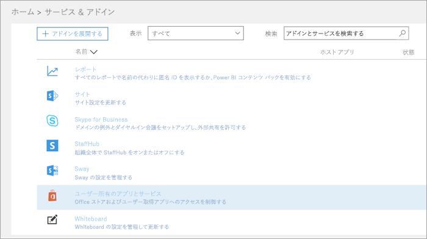
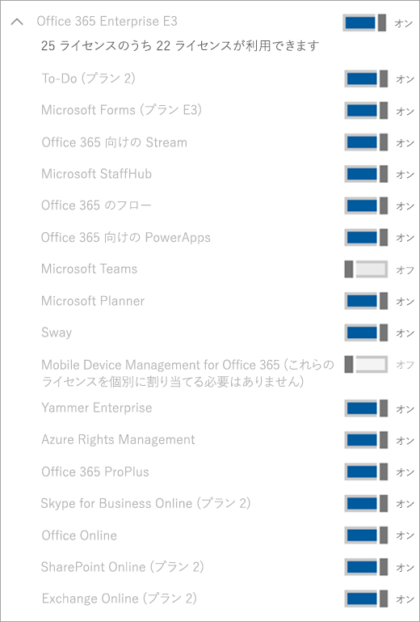

マイクロソフト チームの IW のトライアルをご利用を管理します。Manage the IW trial offer for Microsoft Teams
=============================================

マイクロソフト チームは、組織の優れた共同作業ツールです。Microsoft Teams is a great collaborative tool for your organization. 説明、技術革新、および Office 365 の機能を使用してアイデアを共有するには、人やチームを支援します。It empowers people and teams to discuss, innovate, and share ideas using the power of Office 365. マイクロソフト チームの IW のトライアルをご利用には、製品の 1 年間の試用版を開始するのには、マイクロソフトのチームに許可されていないユーザー、組織内の既存の Office 365 ユーザーが提供しています。The IW trial offer for Microsoft Teams offers existing Office 365 users in your organization who are not licensed for Microsoft Teams to initiate a 1-year trial of the product. 管理者には、上または、テナント内のユーザーに対してこの機能をオフに切り替える機能があります。Admins have the ability to switch on or off this feature for users within their tenant.

## オファーではWhat's in the offer

このパッケージに含まれているサービス プランは次のとおりです。The service plans included in this offer are:

- Exchange の基礎Exchange Foundation
- Office 365 のプラン 1 のフローFlow for Office 365 Plan 1
- マイクロソフトの計画Microsoft Planner
- マイクロソフトのチーム (Teams1、IW のチーム)Microsoft Teams (Teams1, Teams IW)
- Office OnlineOffice Online
- Office 365 の PowerApps 1 を計画します。PowerApps for Office 365 Plan 1
- SharePoint オンライン プラン 1SharePoint Online Plan 1
- 影響を与えるSway
- Yammer エンタープライズYammer Enterprise

## ユーザーが対象となります。Who is eligible

チームを含む Office 365 のライセンスを持たないユーザーには、IW のトライアルをご利用を開始できます。Users who do not have an Office 365 license that includes Teams can initiate the IW trial offer. たとえば、ユーザーが Office 365 ビジネスの有料 (これは、チームが含まれています) を持っている、チームのサービス プランが無効になっている場合は、試用版の対象となります。For example, if a user has Office 365 Business Premium (which includes Teams), and the Teams service plan is disabled, they are not eligible for the trial.

テナント レベルでは、サービスとしてのチームは、チーム管理センター) の「有効にする必要があります。At the tenant level, Teams as a service needs to be enabled (in the Teams admin center). (詳細については、 [Office 365 の組織での Microsoft チームの管理機能](enable-features-office-365.md)を参照してください。(For more information, see [Manage Microsoft Teams features in your Office 365 organization](enable-features-office-365.md). また、アプリケーションとで、Office 365 管理者センター) の試用版にサインアップするユーザーを有効にする必要があります。Also, users must be enabled to sign up for apps and trials (in the Office 365 admin center). 詳細については、この資料の[管理 IW の試用版](#manage-the-iw-trial)を参照してください。For more information, see [Manage the IW trial](#manage-the-iw-trial) later in this article.

GOV と EDU のテナントが IW の試用版の対象ではありません。GOV and EDU tenants are not eligible for the IW trial.

## ユーザーが試用版にサインアップする方法How users sign up for the trial

対象となるユーザーは、チーム ([teams.microsoft.com](https://teams.microsoft.com)) にログインして、IW の試用版にサインアップできます。Eligible users can sign up for the IW trial by logging into Teams ([teams.microsoft.com](https://teams.microsoft.com)). 、条件を満たす場合、試用版を起動するのには次の画面が表示されます。If eligible, they will see the following screen to start the trial. 

IW 試用版には、組織全体に 1 年間の試用期間が与えられます。The IW trial grants a 1-year trial to your entire organization. 組織内の他の対象となるユーザーは、同じプロセスを経由して IW の試用版にサインアップできます。Additional eligible users within your organization can sign up for the IW trial by going through the same process.
 
組織内のすべての試用版は、同じ開始日と終了日は、日付を共有する最初のユーザーが試用版の署名します。All trials within your organization share the same start and end dates, which is the date that first user signed for the trial. などのユーザー A が、2018 年 4 月 25 日の最初の試用版を起動し、ユーザー B が、2018 年 6 月 3日の試用版を起動する場合両方のユーザーの試用期限が切れます、2019 年 4 月 25 日に。For example, if user A starts the first trial on April 25, 2018 and user B starts a trial on June 3, 2018, both users' trial will expire on April 25, 2019.

## IW 試用版を管理します。Manage the IW trial

管理者は、試用版のアプリとそのテナント内のサービスを要求するエンドユーザー向けの機能を無効にできます。Admins can disable the ability for end users to claim trial apps and services within their tenant. 現時点では、チームの IW の試用版は、このカテゴリにのみ試用版ですがこれに該当のような他のプログラムに、将来的にします。Currently, the Teams IW trial is the only trial in this category, but this might apply to other similar programs in the future. 

1\。1\. [Office 365 管理センター](https://portal.office.com/adminportal/home)では、**サービスおよびアドイン**にアクセス > **ユーザーには、アプリケーションとサービスが所有しています**。From the [Office 365 admin center](https://portal.office.com/adminportal/home), go to **Services & add-ins** > **User owned Apps and Services**.

2\。2\. **ユーザーが試用版のアプリケーションとサービスをインストールできるように**オフにします。Turn off **Let users install trial apps and services**.

3\。3\. チームの管理ポータルに移動して、テナントのチームをオフにできます。You can turn off Teams for the tenant by going to the Teams admin portal. これを無効にすると、ユーザーはチームの IW の試用版を要求できません。When this is disabled, users cannot claim the Teams IW trial.

4\。4\. 対象となるライセンスを持っている個々 のユーザーのチームのサービス プランを無効にした場合は、そのユーザーは試用版のライセンスを要求する資格ではありません。If you have disabled the Teams service plan for an individual user who has an eligible license, that user is not eligible to claim a trial license.

5\。5\. ユーザーは、チームの試用版のライセンスを要求したが場合、は、ライセンスまたはサービスのプランを削除することによって削除できます。If a user has claimed a Teams trial license, you can remove it by removing the license or service plan. 

### 試用版のライセンスからユーザーをアップグレードします。Upgrade users from the trial license

試用版のライセンスからユーザーをアップグレードするには、次の操作を行います。To upgrade users from the trial license, do the following:

1. チームを含む SKU を購入します。Purchase a SKU that includes Teams.
2. チームの試用版 SKU は、ユーザーから削除します。Remove the Teams trial SKU from the user.
3. 新規に購入したライセンスを割り当てます。Then assign the newly purchased license.

詳細については、「[Microsoft Teams 用の Office 365 ライセンス](Office-365-licensing.md)」をご覧ください。For more information, see [Office 365 licensing for Microsoft Teams](Office-365-licensing.md).