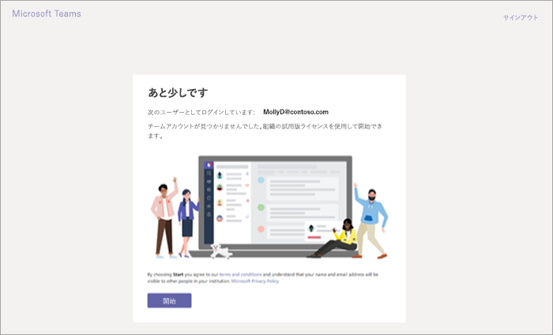

Microsoft Teams の商用クラウドの試用提供を管理するManage the Microsoft Teams Commercial Cloud Trial offer
=======================================================

Microsoft Teams は、組織に最適な共同作業ツールです。Microsoft Teams is a great collaborative tool for your organization. Office 365 の機能を使用して、ユーザーやチームがアイデアのディスカッション、導入、共有を行うことができます。It empowers people and teams to discuss, innovate, and share ideas using the power of Office 365. Microsoft Teams の商用クラウド試用版は、製品の 1 年間試用版を開始するための Microsoft Teams ライセンスを所有していない、組織内の既存の Office 365 ユーザーを対象にしています。The Microsoft Teams Commercial Cloud Trial offers existing Office 365 users in your organization who are not licensed for Microsoft Teams to initiate a 1-year trial of the product. 管理者は組織内のユーザーに対して、この機能をオンまたはオフに切り替えることができます。Admins can switch this feature on or off for users in their organization.

## オファーの内容What's in the offer

このオファーに含まれるサービス プランは次のとおりです。The service plans included in this offer are:

- Exchange の基礎Exchange Foundation
- Office 365 プラン 1 のフローFlow for Office 365 Plan 1
- Microsoft PlannerMicrosoft Planner
- Microsoft Teams (Teams1、Teams IW)Microsoft Teams (Teams1, Teams IW)
- Office OnlineOffice Online
- PowerApps for Office 365 プラン 1PowerApps for Office 365 Plan 1
- SharePoint Online KioskSharePoint Online Kiosk
- SwaySway
- Yammer EnterpriseYammer Enterprise

試用版では、組織全体に 1 年間の試用版サブスクリプションを付与します。The trial grants a one-year trial subscription to your entire organization. 試用版では、500,000 ライセンスが割り当て可能になります。The trial makes 500,000 licenses available for assignment. 割り当てられたライセンスごとに、試用版では 2 GB の SharePoint Online 記憶域が割り当てられます。For each license assigned, the trial allocates 2 GB of SharePoint Online storage. 

## 対象者Who is eligible

ユーザーがアプリや試用版にサインアップできるようにする必要があります (Office 365 管理センターで)。Users must be enabled to sign up for apps and trials (in the Office 365 admin center). 詳細については、この記事で後述する「[試用版を管理する](#manage-the-trial)」を参照してください。For more information, see [Manage the trial](#manage-the-trial) later in this article. 

Teams を含む Office 365 ライセンスを所有していないユーザーは、Microsoft Teams 商用クラウド試用版のオファーを開始できます。Users who do not have an Office 365 license that includes Teams can initiate the Microsoft Teams Commercial Cloud Trial offer. たとえば、ユーザーが Office 365 Business (Teams を含まない) を所有している場合、ユーザーは試用版の対象になります。For example, if a user has Office 365 Business (which doesn't include Teams), they are eligible for the trial.

## 対象外Who is not eligible

次の場合、組織は試用版の対象外になります。Your organization is not eligible for the trial if: 

- シンジケーション パートナーのお客様You are a Syndication Partner Customer
- 再販業者パートナーのお客様You are a Reseller Partner Customer
- 政府機関または教育機関のお客様You are a Government or EDU customer

組織が Microsoft Teams 商用クラウド試用版オファーの対象外の場合は、**[ユーザーに試用版アプリとサービスのインストールを許可する]** スイッチは表示されません。If your organization is ineligible for the Microsoft Teams Commercial Cloud Trial offer, you will not see the **Let users install trial apps and services** switch.

## ユーザーが試用版にサインアップする方法How users sign up for the trial

対象となるユーザーは、Teams ([teams.microsoft.com](https://teams.microsoft.com)) にログインして試用版オファーにサインアップできます。Eligible users can sign up for the trial offer by logging into Teams ([teams.microsoft.com](https://teams.microsoft.com)). 試用版を開始するために、次の画面が表示されます。They will see the following screen to start the trial. 

組織内のすべての試用版は、最初のユーザーが試用版にサインアップした日付と同じ開始日と終了日を共有します。All trials within your organization share the same start and end dates, which is the date the first user signed up for the trial. たとえば、ユーザー A が 2019 年 1 月 25 日に最初の試用を開始し、ユーザー B が 2019 年 6 月 3 日に試用を開始した場合は、2020 年 1 月 25 日にどちらのユーザーの試用も期限が切れます。For example, if user A starts the first trial on January 25, 2019 and user B starts a trial on June 3, 2019, both users' trial will expire on January 25, 2020.

## 試用版の管理Manage the trial

管理者は、サインアップしたユーザーのライセンスを管理できます。Admins can manage the licenses for users who have signed up. 

さらに、管理者はエンド ユーザーが組織内で試用版アプリおよびサービスを要求できないようにすることも可能です。In addition, admins can disable the ability for end users to claim trial apps and services within their organization. 現時点では、この記事で説明している試用版が、このカテゴリの唯一の試用版ですが、将来、別の同様のプログラムに適用される可能性があります。Currently, the trial described in this article is the only trial in this category, but it might apply to other similar programs in the future. 

### ユーザーが試用版アプリおよびサービスをインストールできないようにするPrevent users from installing trial apps and services

試用版のアプリとサービスをユーザーがインストールする機能をオフにできます。You can turn off a user’s ability to install trial apps and services.

1. [[Microsoft 365 管理センター]](https://portal.office.com/adminportal/home) から、**[設定]** > **[サービスとアドイン]** > **[ユーザーが所有するアプリとサービス]** に移動します。From the [Microsoft 365 admin center](https://portal.office.com/adminportal/home), go to **Settings** > **Services & add-ins** > **User owned Apps and Services**.

    ![Office 365 管理センターの [サービスとアドイン] ページのスクリーンショット。](media/iw-trial-enable-1.png)

2. **[ユーザーに試用版アプリとサービスのインストールを許可する]** をオフにします。Turn off **Let users install trial apps and services**.

    ![Office 365 管理センターの [ユーザーが所有するアプリとサービス] ページのスクリーンショット。](media/iw-trial-enable-2.png)

### Teams が含まれているライセンスを持つユーザーの試用版利用可能性を管理するManage trial availability for a user with a license that includes Teams

Teams が含まれているライセンスの割り当てられたユーザーは、試用版の対象になりません。A user who is assigned a license that includes Teams is not eligible for the trial. Teams のサービス プランが有効なときには、そのユーザーは Teams にログインして Teams を使用できます。When the Teams service plan is enabled, the user can log in and use Teams. サービス プランが無効な場合、そのユーザーはログインすることも、試用版のオプションが表示されることもありません。If the service plan is disabled, the user cannot log in and is not presented with the trial option either.

Teams へのアクセスをオフにするには:To turn off access to Teams:

1. Microsoft 365 管理センターで、**[ユーザー]** > **[アクティブ ユーザー]** を選択します。In the Microsoft 365 admin center, select **Users** > **Active users**.

2. ユーザーの名前の横にあるボックスを選択します。Select the box next to the name of the user.

3. 右側の **[製品ライセンス]** 行で、**[編集]** を選択します。On the right, in the **Product licenses** row, choose **Edit**.

4. **[製品ライセンス]** ウィンドウで、**[オフ]** に切り替えます。In the **Product licenses** pane, switch the toggle to **Off**.

    ![Office 365 管理センターの [製品ライセンス] ページのスクリーンショット。](media/iw-trial-enable-3.png)

### 既に試用版を要求しているユーザーの Teams の利用可能性を管理するManage Teams availability for users who already claimed the trial

ユーザーが Teams 試用版のライセンスを要求していた場合は、そのライセンスまたはサービス プランを削除することで試用版ライセンスを削除できます。If a user has claimed a Teams trial license, you can remove it by removing the license or service plan.

試用版ライセンスをオフにするには:To turn off the trial license:

1. Microsoft 365 管理センターで、**[ユーザー]** > **[アクティブ ユーザー]** を選択します。In the Microsoft 365 admin center, select **Users** > **Active users**.

2. ユーザーの名前の横にあるボックスを選択します。Select the box next to the name of the user.

3. 右側の **[製品ライセンス]** 行で、**[編集]** を選択します。On the right, in the **Product licenses** row, choose **Edit**.

4. **[製品ライセンス]** ウィンドウで、**[オフ]** に切り替えます。In the **Product licenses** pane, switch the toggle to **Off**.

    ![[製品ライセンス] ウィンドウの Teams 試用版ライセンスの設定を示すスクリーンショット](media/iW-trial-enable-4.png)
    
>[!Note]
>Microsoft Teams Trial の切り替えスイッチは、組織内で最初のユーザーが試用版にサインアップした後に表示されます。The Microsoft Teams Trial toggle switch will appear once the first user signed up for the trial in the organization.

### 試用版ライセンスを持つユーザーの Teams を管理するManage Teams for users who have the trial license

試用版ライセンスを持っているユーザーは、通常の有料ライセンスを持っているユーザーと同じように管理できます。You can manage users who have a trial license just like you manage users who have a regular paid license. 詳細については、「[Office 365 組織内での Microsoft Teams の機能を管理する](enable-features-office-365.md)」を参照してください。[Manage Microsoft Teams features in your Office 365 organization](enable-features-office-365.md)

### 試用版ライセンスからユーザーをアップグレードするUpgrade users from the trial license

試用版ライセンスからユーザーをアップグレードするには、次の手順を実行します。To upgrade users from the trial license, do the following:

1. Teams が含まれているサブスクリプションを購入します。Purchase a subscription that includes Teams.

2. ユーザーから Teams 試用版のサブスクリプションを削除します。Remove the Teams trial subscription from the user.

3. 新しく購入したライセンスを割り当てます。Assign the newly purchased license.

詳細については、「[Microsoft Teams 用の Office 365 ライセンス](Office-365-licensing.md)」を参照してください。For more information, see [Office 365 licensing for Microsoft Teams](Office-365-licensing.md).
