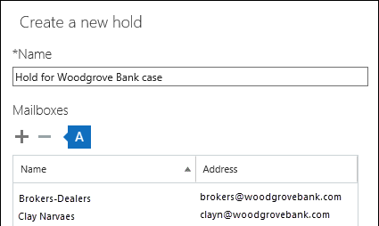

Microsoft Teams ユーザーまたはチームに訴訟ホールドを適用するPlace a Microsoft Teams user or team on legal hold
==================================================

ユーザーまたはチームに訴訟ホールドを適用するには、[セキュリティとコンプライアンス ポータル](https://go.microsoft.com/fwlink/?linkid=854628)に移動します。新しいケースを作成すると、メールボックスまたはサイトのいずれかをホールドするオプションが提示されます。To put a user or a team on Legal Hold, navigate to the [Security and Compliance Portal](https://go.microsoft.com/fwlink/?linkid=854628). When you create a new case, you are presented with the option to place mailboxes or sites on hold.

|||
|---------|---------|
|   注意Note     |ユーザーをホールドしてもグループは自動的にホールドされません。その逆も同様です。Placing a user on hold does not automatically place a group on hold or vice-versa.         |
|   重要Important     |ユーザーまたはグループにホールドを適用すると、すべてのメッセージのコピーが保持されます。When a user or group is placed on hold, all message copies will be retained. たとえば、Clay さんがチャネルにメッセージを投稿し、そのメッセージを変更したとします。Example: Clay posted a message in a channel and then modified the message. ホールドのシナリオでは、これら両方のメッセージのコピーが保持されます。In a hold scenario, both copies of the message are retained. 訴訟ホールドなしでは、最新のメッセージのみが保持されます。Without Legal Hold, only the latest message is retained.         |

次の図は Clay さんに関する調査を示しています。In the figure below, there is an investigation involving Clay. Clay さんは Brokers-Dealers チームのメンバーです。Clay is a member of the Brokers-Dealers team.

Clay さんがブローカー業務の計画について話したと考えられるすべての場所に対して訴訟ホールドを適用する必要がある場合は、チームの SharePoint サイト、Clay さんの OneDrive for Business サイトを訴訟ホールド対象サイトのリストに追加する必要があります。If we needed to Legal Hold all the places Bob could have discussed Manufacturing plans, ensure that the team’s SharePoint site is added to the Legal Hold site list, as well as Bob’s OneDrive for Business site.

データ要件に応じて訴訟ホールドを適用する必要のある項目を理解するには、次の表を使用してください。To recap, use the table below to understand what needs to be placed on Legal Hold based on data requirements:

|シナリオScenario  |ホールドを適用する項目What to place on hold  |
|---------|---------|
|**Microsoft Teams プライベート チャット****Microsoft Teams Private Chats**     |ユーザーのメールボックスUser mailbox         |
|**Microsoft Teams チャネル チャット****Microsoft Teams Channel Chats**    |チームで使用するグループ メールボックスGroup mailbox used for the team         |
|**Microsoft Teams コンテンツ (例: Wiki、ファイル)****Microsoft Teams Content (e.g. Wiki, Files)**     |チームが使用する SharePoint サイトSharePoint site used by the team         |
|**プライベートなコンテンツ****Private Content**     |ユーザーの OneDrive for Business サイトOneDrive for Business site of the user         |
