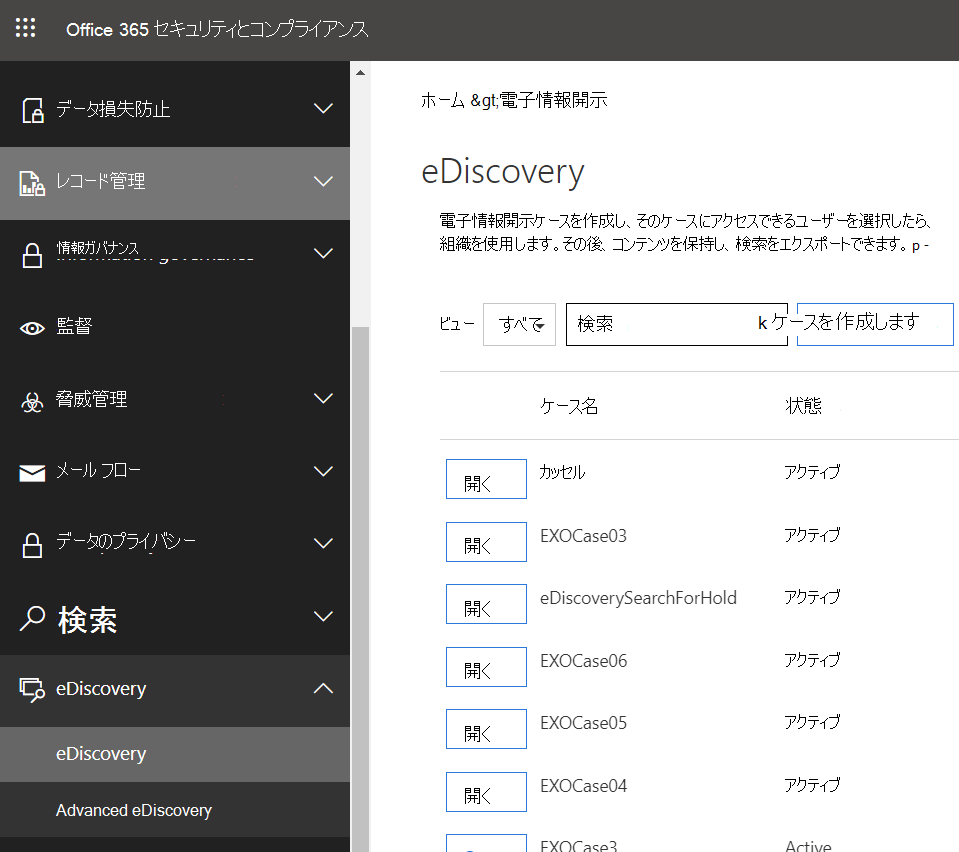
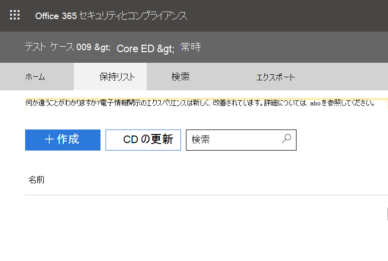
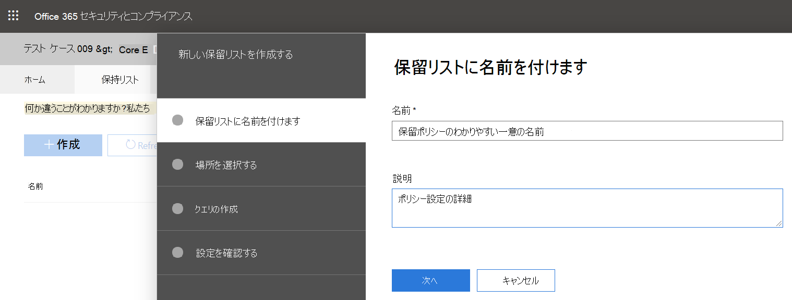
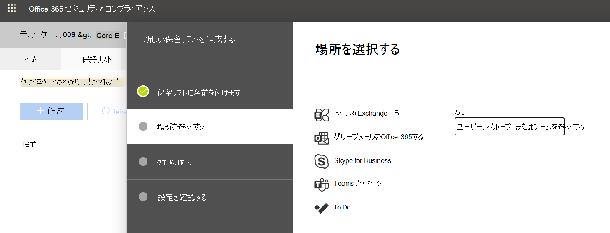

Microsoft Teams ユーザーまたはチームに訴訟ホールドを適用するPlace a Microsoft Teams user or team on legal hold
==================================================

訴訟が妥当であると予想される場合、組織は、ケースに関連するチームチャットメッセージなど、電子的に保存された情報 (ESI) を保持する必要があります。When a reasonable expectation of litigation exists, organizations are required to preserve electronically stored information (ESI), including Teams chat messages that are relevant to the case. 組織によっては、特定のトピックまたは特定の個人に関連するすべてのメッセージを保持する必要がある場合があります。Organizations may need to preserve all messages related to a specific topic or for certain individuals. この記事では、Microsoft Teams で法的な保留をカバーします (M365 スペースでの保留実装に対処するには、 [「電子情報開示ケースの管理](https://docs.microsoft.com/microsoft-365/compliance/ediscovery-cases#step-4-place-content-locations-on-hold)」を参照してください。コンテンツの場所を保留にする)。This article will cover legal hold in Microsoft Teams (To address hold implementation across the M365 space, please review [Manage eDiscovery cases: Place content locations on hold](https://docs.microsoft.com/microsoft-365/compliance/ediscovery-cases#step-4-place-content-locations-on-hold).).

> [!NOTE]
> 2020年2月に、法的保存機能を有効にしました (プライベートチャネルチャットはユーザーのメールボックスに保存されています。標準チャネルチャットは、そのチームのグループメールボックスに保存されています)。In Feb 2020, we turned on legal hold or case hold on private channels (private channel chats are stored in user mailboxes, normal channel chats are stored in that Teams’ group mailboxes). ユーザーのメールボックスに対して既に法的保持が有効になっている場合は、保留ポリシーがそのメールボックスに保存されているプライベートチャネルメッセージに自動的に適用されます。If there is already a legal hold in place for a user mailbox, the hold policy will now automatically apply to private channel messages stored in that mailbox. 管理者がこれを有効にするために必要な操作はありません。There is no further action needed for an admin to turn this on. プライベートチャネルで共有されているファイルの法的ホールドもサポートされます。Legal hold of files shared in private channels is also supported.

Microsoft Teams では、チーム全体または [ユーザーの選択] を保留または法的保持に入れることができます。Within Microsoft Teams, an entire team or select users can be put on hold or legal hold. この操作を行うと、それらのチームで交換されたすべてのメッセージ (プライベートチャネルを含む)、またはそれらのユーザーが交換したメッセージは、組織のコンプライアンスマネージャーまたは Teams の管理者によって検出可能になります。Doing that will make sure that all messages that were exchanged in those teams (including private channels) or messages exchanged by those individuals are discoverable by the organization’s compliance managers or Teams Admins.

> [!NOTE]
> ユーザーをホールドしてもグループは自動的にホールドされません。その逆も同様です。Placing a user on hold does not automatically place a group on hold or vice-versa.

ユーザーまたはチームに法的保持を設定するには、次の操作を行います。To put a user or a team on Legal Hold:

1. [セキュリティ & コンプライアンスセンター](https://go.microsoft.com/fwlink/?linkid=854628)に移動します。Navigate to the [Security & Compliance Center](https://go.microsoft.com/fwlink/?linkid=854628). 新しいケースを作成すると、メールボックスまたはサイトを保留にするオプションが表示されます。When you create a new case, you are presented with the option to place mailboxes or sites on hold.

2. 電子情報開示またはアドバンスト eDiscovery に移動し、[ケースの作成] をクリックしてケースを作成します。Go to eDiscovery or Advanced eDiscovery and create a case by clicking "Create a case". ケースが作成されたら、それを開きます。Once the case is created, open it.

   > [!div class="mx-imgBorder"]
   > ![[ケースの作成] ボタンが表示された、Microsoft Teams の [電子情報開示] タブが選択されています。](media/LegalHold1.png)

3. 上部のメニューから「保留」セクションに移動し、「+ 作成」をクリックして保留リストを作成します。Go to the "Holds" section from the top menu and click "+ Create" to create a hold. ユーザーまたはチームを保留にすると、それらのユーザーまたはメッセージによって交換されるすべてのメッセージが保存されます。Putting a user or a team on hold saves all the messages exchanged by those users or messages. 新しいケースを作成すると、メールボックスまたはサイトを保留にするオプションが表示されます。When you create a new case, you are presented with the option to place mailboxes or sites on hold.

   > [!div class="mx-imgBorder"]
   > ![選択された [保留] タブとその下の [作成] ボタンを示す画像。](media/LegalHold2.png)

   1. **保留リストに名前** を指定します。**Name your hold**. 作成する保留リストのわかりやすい一意の名前を選択します。Select a descriptive and unique name for the hold you are going to create.

      > [!div class="mx-imgBorder"]
      > ![このスクリーンショットは [保留] タブの名前を示します。ここでは、作成している保留の名前と説明を入力できます。](media/LegalHold3.png)

    2. **[場所] を選び** ます。**Choose location**. 保留をユーザーまたはチーム全体のどちらに適用するかを選択します (保留は、現時点では個々のチャネルに適用できません)。Choose whether you want the hold to be applied on a user or on an entire Team (hold cannot be applied on individual channels for now). 注: ユーザーが保留になっている場合は、1:1 チャットで送信されたすべてのメッセージが保留になります。 1: 多またはグループチャット、またはチャネルの会話 (プライベートチャネルを含む) が含まれます。Note: if a user is on hold, all their messages would be on hold, including whatever they sent in a 1:1 chat, 1:many or group chat, or a channel conversation (including private channels).
  
       > [!div class="mx-imgBorder"]
       > ![ここでは、[新しい保留を作成する] の [場所の選択] セクションがあります。ここでは、Microsoft Teams など、保留を適用する M365 オプションを決定することができます。](media/LegalHold4.png)

    3. **クエリを作成** します。**Create Query**. 保留ポリシーのより細かい設定が必要な場合は、保留をカスタマイズできます。You can customize the hold if you want more granularity in the hold policy. たとえば、検索するキーワードを指定したり、保留を有効にするために満たす必要がある条件を追加したりすることができます。For example, you can specify keywords to look for, or you can add more conditions, that would need to be satisfied for the hold to take effect.
    
    4. 組織に公開する前に **、設定を確認** します。**Review your settings** before publishing it to your organization.

法的保持が設定された後、 [Teams の電子情報開示](eDiscovery-investigation.md) の記事に従って、保留ポリシーによって保持されているすべてのコンテンツを見つけることができます。After the legal hold has been set, you can discover all the content retained by any hold policy following the [Teams eDiscovery](eDiscovery-investigation.md) article.

> [!IMPORTANT]
> ユーザーまたはグループを保留にすると、すべてのメッセージのコピーが保持されます。When a user or group is placed on hold, all message copies will be retained. たとえば、ユーザーがチャネルでメッセージを投稿した後にそのメッセージを変更した場合、保留シナリオでは、メッセージの両方のコピーが保持されます。For example, if a user posted a message in a channel and then modified the message, in a hold scenario, both copies of the message are retained. インプレースの法的保持がない場合は、最新のメッセージのみが保持されます。Without the legal hold in-place, only the latest message is retained.

役に立つガイドとして、次の表を使用して、データ要件に基づいて法的保持に含める必要があるものを理解することができます。As a helpful guide, you can use the table below to understand what needs to be placed on Legal Hold based on data requirements:

|シナリオScenario  |ホールドを適用する項目What to place on hold  |
|---------|---------|
|**Microsoft Teams のチャットコンテンツ (1:1 のチャット、1: 複数またはグループチャット、プライベートチャネルの会話など)****Microsoft Teams chat content by a user (on 1:1 chats, 1:many or group chats, private channel conversations, etc.)**     |ユーザーのメールボックスUser mailbox         |
|**Microsoft Teams チャネルチャット (プライベートチャネルを除く)****Microsoft Teams Channel chats (excluding private channels)**    |チームで使用するグループ メールボックスGroup mailbox used for the team         |
|**Microsoft Teams のコンテンツ (Wiki、Files など)****Microsoft Teams content (for example, Wiki, Files)**     |チームが使用する SharePoint サイトSharePoint site used by the team         |
|**Microsoft Teams のプライベートチャネルファイル****Microsoft Teams Private Channel files**     |個人用専用の SharePoint サイトDedicated SharePoint site for private     |
|**ユーザーのプライベートコンテンツ****User's private content**     |ユーザーの OneDrive for Business サイトOneDrive for Business site of the user         |
||||

> [!NOTE]
> プライベートチャネルでの通信を維持するには、ユーザーのメールボックスを保留にしておく必要があります。また、電子情報開示ツールを使用して検索する場合は、そのユーザーのメールボックスを検索する必要があります。To retain communication in private channels, you need to put the user mailboxes ( Private channel users) on hold and when using eDiscovery tool to search, you should search in that user’s mailbox. 前に説明したように、プライベートチャネルチャットは、チームのグループメールボックスではなく、ユーザーのメールボックスに保存されます。As was stated earlier, private channel chats are stored in user mailboxes, not in group mailbox of a Team.

M365 のチーム以外の領域に関するこのトピックについて詳しくは、「電子情報開示ケースを管理する」を参照してください。 [コンテンツの場所を保留に](https://docs.microsoft.com/microsoft-365/compliance/ediscovery-cases#step-4-place-content-locations-on-hold)する必要があります。If you want to read further on this topic for non-Teams areas in M365, you should review [Manage eDiscovery cases: Place content locations on hold](https://docs.microsoft.com/microsoft-365/compliance/ediscovery-cases#step-4-place-content-locations-on-hold).
