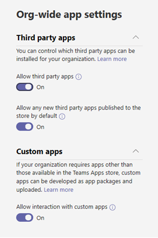
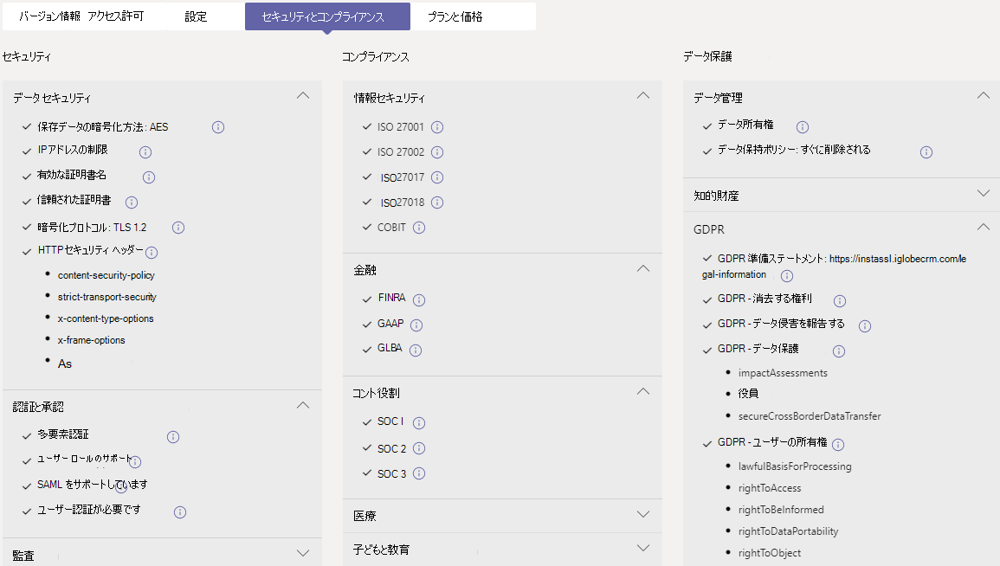

# 管理センターでアプリMicrosoft Teams管理するManage your apps in the Microsoft Teams admin center

管理者は、Microsoft Teams 管理センターの [アプリの管理] ページで、組織のすべての Teams アプリを表示および管理します。As an admin, the Manage apps page in the Microsoft Teams admin center is where you view and manage all Teams apps for your organization. ここでは、アプリの組織レベルの状態とプロパティの表示、組織のアプリ ストアへの新しいカスタム アプリの承認またはアップロード、組織レベルでのアプリのブロックまたは許可、チームへのアプリの追加、サード パーティ製アプリのサービスの購入、アプリから要求されたアクセス許可の表示、アプリに対する管理者の同意の付与、組織全体のアプリ設定の管理を行います。Here, you can see the org-level status and properties of apps, approve or upload new custom apps to your organization's app store, block or allow apps at the org level, add apps to teams, purchase services for third-party apps, view permissions requested by apps, grant admin consent to apps, and manage org-wide app settings.

[アプリの管理] ページには、利用可能なすべてのアプリが表示され、組織全体で許可またはブロックするアプリを決定するために必要な情報が表示されます。The Manage apps page gives you a view into all available apps, providing you with the information you need to decide which apps to allow or block across your organization. また、[アプリのアクセス許可ポリシー](teams-app-permission-policies.md)、[アプリのセットアップ ポリシー](teams-app-setup-policies.md)、[カスタム アプリ ポリシーと設定](teams-custom-app-policies-and-settings.md)を使って、組織内の特定のユーザーに対してアプリ エクスペリエンスの構成を行うことができます。You can then use [app permission policies](teams-app-permission-policies.md), [app setup policies](teams-app-setup-policies.md), and [custom app policies and settings](teams-custom-app-policies-and-settings.md) to configure the app experience for specific users in your organization.

Microsoft Teams 管理センターの左側のナビゲーションで、**[Teams アプリ]** > **[アプリを管理]** の順に移動します。In the left navigation of the Microsoft Teams admin center, go to **Teams apps** > **Manage apps**. ページにアクセスするには、グローバル管理者Teamsサービス管理者である必要があります。You must be a global admin or Teams service admin to access the page.

> [!NOTE]
> [アプリの管理] ページは、Microsoft 365 Government Community Cloud High (GCCH) または国防総省 (DoD) のデプロイではTeams。The Manage apps page isn't available yet in Microsoft 365 Government Community Cloud High (GCCH) or Department of Defense (DoD) deployments of Teams.

## アプリを表示するView apps

各アプリに関する次の情報を含むすべてのアプリを表示できます。You can view every app including the following information about each app.

![[マネージド アプリ] ページのスクリーンショット](media/manage-apps.png)

- **[名前**]: アプリ名。**Name**: The app name. アプリ名を選択してアプリの詳細ページに移動し、アプリの詳細を表示します。Select the app name to go to the app details page to see more information about the app. これには、許可またはブロックされるアプリ、バージョン、プライバシー ポリシー、使用条件、アプリに適用されるカテゴリ、認定状態、サポートされている機能、アプリ ID など、アプリの説明が含まれます。This includes a description of the app, whether it's allowed or blocked, version, privacy policy, terms of use, categories that apply to the app, certification status, supported capabilities, and app ID. 以下は、実行例です。Here's an example:

  
  
- **認定**: アプリが認定を通過した場合は、認証済みMicrosoft 365またはPublisher **表示されます**。**Certification**: If the app has gone through certification, you'll see either **Microsoft 365 certified** or **Publisher attestation**. リンクを選択すると、アプリの認定の詳細が表示されます。Select the link to view certification details for the app. "" と **--** 表示される場合は、アプリの認定情報が表示されます。If you see "**--**", we don't have certification information for the app. 認定アプリの詳細については、「Teams 認定プログラム[」Microsoft 365を参照してください](/teams-app-certification/all-apps)。To learn more about certified apps in Teams, read [Microsoft 365 App Certification program](/teams-app-certification/all-apps).  
- **Publisher:** 発行元の名前。**Publisher**: Name of the publisher.
- **発行状態**: カスタム アプリの発行状態。**Publishing status**: Publishing status of custom apps.
- **状態**: 組織レベルでのアプリの状態。次のいずれかの状態です。**Status**: Status of the app at the org level, which can be one of the following:
- **許可:** アプリは、組織内のすべてのユーザーが使用できます。**Allowed**: The app is available for all users in your organization.
- **ブロック:** アプリはブロックされ、組織内のユーザーは使用できません。**Blocked**: The app is blocked and not available for any users in your organization.
  - **ブロックされる組織全体**: アプリは、組織全体のアプリ設定でブロックされます。**Blocked org-wide**: The app is blocked in org-wide app settings.
      この列は、以前は [組織全体の設定] ウィンドウに表示されたアプリの許可とブロックの状態を表します。It's important to know that this column represents the allowed and blocked status of apps that were formerly on the **Org-wide settings** pane. [アプリの管理] ページで、組織全体でアプリを表示、ブロック、 **および許可** できるようになりました。You now view, block, and allow apps at the org-wide on the **Manage apps** page.
- **ライセンス**: アプリがサービスとしてのソフトウェア (SaaS) サブスクリプションを提供するかどうかを示します。**Licenses**: Indicates whether an app offers a Software as a Service (SaaS) subscription for purchase. この列は、サード パーティ製アプリにのみ適用されます。This column applies only to third-party apps. 各サード パーティ製アプリには、次のいずれかの値があります。Each third-party app will have one of the following values:
- **今すぐ購入**: アプリは SaaS サブスクリプションを提供し、購入できます。**Purchase now**: The app offers a SaaS subscription and is available to purchase.  
- **購入:** アプリは SaaS サブスクリプションを提供し、そのライセンスを購入しました。**Purchased**: The app offers a SaaS subscription and you've purchased licenses for it.
- **- :** アプリは SaaS サブスクリプションを提供しない。**- -**: The app doesn't offer a SaaS subscription.
- **カスタム アプリ**: アプリがカスタム アプリかどうか。**Custom app**: Whether the app is a custom app.
- **アクセス許可**: Azure Active Directory (Azure AD) に登録されているサード パーティまたはカスタム アプリに、同意が必要なアクセス許可が付与されているかどうかを示します。**Permissions**: Indicates whether a third-party or custom app that's registered in Azure Active Directory (Azure AD) has permissions that need consent. 次のいずれかの値が表示されます。You'll see one of the following values:
- **詳細の表示**: アプリは、アプリがデータにアクセスする前に同意を必要とするアクセス許可を持っています。**View details**: The app has permissions that require consent before the app can access data.
- **- -** アプリには、同意を必要とするアクセス許可が付与されています。**- -**: The app doesn't have permissions that need consent.
- **カテゴリ**: アプリに適用されるカテゴリ。**Categories**: Categories that apply to the app.
- **バージョン**: アプリのバージョン。**Version**: App version.

テーブルに必要な情報を表示するには、右上隅の[列の編集] を選択して、テーブルに列を追加または削除します。To see the information that you want in the table, select **Edit Column** in the upper-right corner to add or remove columns to the table.

## カスタム アプリを組織のアプリ ストアに発行するPublish a custom app to your organization's app store

[アプリの管理] ページを使用して、組織専用に構築されたアプリを発行します。Use the Manage apps page to publish apps that are built specifically for your organization. カスタム アプリを発行すると、組織のアプリ ストア内のユーザーが使用できます。After you publish a custom app, it's available to users in your organization's app store. カスタム アプリを組織のアプリ ストアに発行する方法は 2 通りあります。There are two ways to publish a custom app to your organization's app store. 使用する方法は、アプリの取得方法によって異なります。The way that you use depends on how you get the app.

- [カスタム アプリの承認](#approve-a-custom-app): 開発者がアプリ送信 API を使用してアプリの管理ページに直接アプリを送信する場合Teams使用します。[Approve a custom app](#approve-a-custom-app): Use this method if the developer submits the app directly to the Manage apps page using the Teams App Submission API. その後、アプリの詳細ページから直接アプリを確認および発行 (または拒否) できます。You can then review and publish (or reject) the app directly from the app details page.
- [アップロードパッケージの作成](#upload-an-app-package): 開発者がアプリ パッケージをアプリ パッケージの形式で送信する場合は、この.zipします。[Upload an app package](#upload-an-app-package): Use this method if the developer sends you the app package in .zip format. アプリ パッケージをアップロードして、アプリを発行します。You publish the app by uploading the app package.

### カスタム アプリを承認するApprove a custom app

[**アプリの管理]** ページの [保留中の承認] ウィジェットでは、開発者がアプリ提出 API を使用してアプリを送信Teams通知されます。The **Pending approvals** widget on the Manage apps page notifies you when a developer submits an app by using the Teams App Submission API. 新しく送信されたアプリは、[発行]**状態が** **[送信** 済み]、状態が **[ブロック] の一\*\*\*\*覧に表示されます**。A newly submitted app is listed with a **Publishing status** of **Submitted** and an **Status** of **Blocked**. アプリの詳細ページに移動してアプリの詳細を表示し、発行するには、[発行の状態] を [発行]**に\*\*\*\*設定します**。Go to the app details page to see more information about the app, and then to publish it, set **Publishing status** to **Publish**.

また、開発者がカスタム アプリに更新を送信したときにも通知されます。You're also notified when a developer submits an update to a custom app. その後、アプリの詳細ページで更新プログラムを確認して発行 (または拒否) できます。You can then review and publish (or reject) the update on the app details page. すべてのアプリアクセス許可ポリシーとアプリ設定ポリシーは、更新されたアプリに適用されたままです。All app permission policies and app setup policies remain enforced for the updated app.

詳細については、「Teams App Submission API を使用して送信されたカスタム[アプリを発行する」を参照してください](submit-approve-custom-apps.md)。To learn more, see [Publish a custom app submitted through the Teams App Submission API](submit-approve-custom-apps.md).

### アップロード パッケージを作成するUpload an app package

開発者は、Teams [App Studio](/microsoftteams/platform/get-started/get-started-app-studio)を使用して Teams アプリ パッケージを作成し、そのアプリ パッケージを次の形式.zipします。The developer creates a Teams app package using [Teams App Studio](/microsoftteams/platform/get-started/get-started-app-studio), and then sends it to you in .zip format. アプリ パッケージを持っている場合は、組織のアプリ ストアにアップロードできます。When you have the app package, you can upload it to your organization's app store.

新しいカスタム アプリをアップロードするには **、[アップロード]** を選択してアプリ パッケージをアップロードします。To upload a new custom app, select **Upload** to upload the app package. アプリはアップロード後に強調表示されません。アプリを見つけるには、[アプリの管理] ページでアプリの一覧を検索する必要があります。The app isn't highlighted after it's uploaded so you'll need to search the list of apps on the Manage apps page to find it.

アップロード後にアプリを更新するには、[アプリの管理] ページのアプリの一覧でアプリ名を選択し、[更新] を選択 **します**。To update an app after it's uploaded, in the list of apps on the Manage apps page, select the app name, and then select **Update**. これにより、既存のアプリが置き換わるので、すべてのアプリのアクセス許可ポリシーとアプリセットアップ ポリシーは、更新されたアプリに適用されたままです。Doing this replaces the existing app and all app permission policies and app setup policies remain enforced for the updated app.

詳細については、「アプリ パッケージを [アップロードしてカスタム アプリを発行する」を参照してください](upload-custom-apps.md)。To learn more, see [Publish a custom app by uploading an app package](upload-custom-apps.md).

## アプリを許可およびブロックするAllow and block apps

[アプリの管理] ページでは、組織レベルで個々のアプリを許可またはブロックできます。The Manage apps page is where you allow or block individual apps at the org level. 利用可能なアプリとその現在の組織レベルのアプリの状態が表示されます。It shows every available app and its current org-level app status. (組織レベルでのアプリのブロックと許可は、組織全体 **のアプリ** 設定ウィンドウからこちらに移動しました)。(Blocking and allowing apps at the org level has moved from the **Org-wide app settings** pane to here.)

アプリを許可またはブロックするには、アプリを選択し、[許可] または [ブロック]**を\*\*\*\*選択します**。To allow or block an app, select it, and then select **Allow** or **Block**. アプリをブロックすると、そのアプリとのやり取りはすべて無効になり、組織内のユーザーの Teams には表示されません。When you block an app, all interactions with that app are disabled and the app doesn't appear in Teams for any users in your organization.

[アプリの管理] ページでアプリをブロックまたは許可すると、そのアプリは組織内のすべてのユーザーに対してブロックまたは許可されます。When you block or allow an app on the Manage apps page, that app is blocked or allowed for all users in your organization.  Teams アプリのアクセス許可ポリシーでアプリをブロックまたは許可すると、そのポリシーが割り当てられているユーザーに対してブロックまたは許可されます。When you block or allow an app in a Teams app permission policy, it's blocked or allowed for users who are assigned that policy. ユーザーが任意のアプリをインストールして操作するには、[アプリの管理] ページおよびユーザーに割り当てられているアプリのアクセス許可ポリシーで、組織レベルでアプリを許可する必要があります。For a user to be able to install and interact with any app, you must allow the app at the org level on the Manage apps page and in the app permission policy that's assigned to the user.

 > [!NOTE]
 > アプリをアンインストールするには、アプリを右クリックし、[アンインストール]をクリックするか、左側の [その他のアプリ]**メニューを** 使用します。To uninstall an app, right-click the app, and then click **Uninstall** or use the **More apps** menu on the left side.

## アプリをチームに追加するAdd an app to a team

[チームに **追加] ボタンを使用** して、アプリをチームにインストールします。You use the **Add to team** button to install an app to a team. これは、チーム スコープにインストールできるアプリに対する場合のみ行うので、ご安心ください。Keep in mind that this is only for apps that can be installed in a team scope. [ **チームに追加** ] ボタンは、個人用スコープでのみインストールできるアプリでは使用できません。The **Add to team** button isn't available for apps that can only be installed in the personal scope.

![[チームに追加] ボタンのスクリーンショット](media/manage-apps-add-app-team.png)

1. 目的のアプリを検索し、アプリ名の左側をクリックしてアプリを選択します。Search for the app you want, and then select the app by clicking to the left of the app name.
2. [チーム **に追加] を選択します**。Select **Add to team**.
3. [ **チームに追加]** ウィンドウで、アプリを追加するチームを検索し、チームを選択して、[適用] を **選択します**。In the **Add to team** pane, search for the team you want to add the app to, select the team, and then select **Apply**.

## アプリをカスタマイズするCustomize an app

組織のニーズに応じて特定の外観を含めるアプリをカスタマイズできます。You can now customize an app to include a specific look and feel according to your organization needs. 「Teams[でアプリをカスタマイズする」を参照してください](customize-apps.md)。See [Customize apps in Teams](customize-apps.md).

## サード パーティ製アプリのサービスを購入するPurchase services for third-party apps

[アプリの管理] ページから、組織内のユーザー向けサード パーティ製アプリによって提供されるサービスのライセンスを直接検索して購入できます。You can search for and purchase licenses for services offered by third-party apps for users in your organization directly from the Manage apps page. 表 **の [** ライセンス] 列は、アプリが有料の SaaS サブスクリプションを提供するかどうかを示しています。The **Licenses** column in the table indicates whether an app offers a paid SaaS subscription. [今 **すぐ購入]** を選択して、プランと価格情報を表示し、ユーザーのライセンスを購入します。Select **Purchase now** to view plans and pricing information and buy licenses for your users. 詳細については、「管理センターでサード パーティ製[アプリTeamsサービスを購入するMicrosoft Teams参照してください](purchase-third-party-apps.md)。To learn more, see [Purchase services for Teams third-party apps in the Microsoft Teams admin center](purchase-third-party-apps.md).

## アプリに管理者の同意を付与するGrant admin consent to apps

組織内のすべてのユーザーに代わってアクセス許可を要求するアプリを確認し、同意を付与できます。You can review and grant consent to apps that request permissions on behalf of all users in your organization. ユーザーがアプリの起動時にアプリから要求されたアクセス許可を確認して受け入れる必要が生じないので、この操作を行います。You do this so that users don't have to review and accept the permissions requested by the app when they start the app. [ **アクセス許可]** 列は、アプリに同意が必要なアクセス許可を持っているかどうかを示します。The **Permissions** column indicates whether an app has permissions that need consent. 同意が必要な **アクセス許可を** 持つ Azure ADに登録されている各アプリの [詳細の表示] リンクが表示されます。You'll see a **View details** link for each app registered in Azure AD that has permissions that need consent. 詳細については、「アプリのアクセス許可[を表示し、](app-permissions-admin-center.md)管理センターで管理者の同意を与Microsoft Teams参照してください。To learn more, see [View app permissions and grant admin consent in the Microsoft Teams admin center](app-permissions-admin-center.md).

## リソース固有の同意アクセス許可を表示するView resource-specific consent permissions

リソース固有の同意 (RSC) アクセス許可を使用すると、チーム所有者は、アプリがチームのデータにアクセスして変更する同意を付与できます。Resource-specific consent (RSC) permissions let team owners grant consent for an app to access and modify a team's data. RSC のアクセス許可は、アプリTeamsチームで実行できる操作を定義する、詳細で詳細なアクセス許可です。RSC permissions are granular, Teams-specific permissions that define what an app can do in a specific team. RSC のアクセス許可は、アプリのアプリの詳細 **ページの** [アクセス許可] タブで確認できます。You can view RSC permissions on the **Permissions** tab of the app details page for an app. 詳細については、「アプリのアクセス許可[を表示し、](app-permissions-admin-center.md)管理センターで管理者の同意を与Microsoft Teams参照してください。To learn more, see [View app permissions and grant admin consent in the Microsoft Teams admin center](app-permissions-admin-center.md).

## 組織全体のアプリ設定を管理するManage org-wide app settings

組織全体のアプリ設定を使用して、ユーザーがサードパーティ製アプリをインストールできるかどうか、およびユーザーが組織内のカスタム アプリをアップロードまたは操作できるかどうかを制御します。Use org-wide app settings to control whether users can install third-party apps and whether users can upload or interact with custom  apps in your organization. 組織全体のアプリ設定は、すべてのユーザーの動作を管理し、ユーザーに割り当てられた他のアプリ権限ポリシーを上書きします。Org-wide app settings govern the behavior for all users and override any other app permission policies assigned to users. それらを使用して、悪意のあるアプリや問題のあるアプリを制御できます。You can use them to control malicious or problematic apps.

> [!NOTE]
> Teams の Microsoft 365 Government - Government Community Cloud High GCCH および国防総省 (DoD) デプロイで組織全体のアプリ設定を使用する方法については、「Teams でアプリのアクセス許可ポリシーを管理する」[を参照](teams-app-permission-policies.md)してください。To learn how to use org-wide app settings in Microsoft 365 Government - Government Community Cloud High GCCH and Department of Defense (DoD) deployments of Teams, see [Manage app permission policies in Teams](teams-app-permission-policies.md).

1. [アプリの管理] ページで、[組織全体の **アプリ設定] を選択します**。On the Manage apps page, select **Org-wide app settings**. 次に、パネルで必要な設定を構成できます。You can then configure the settings you want in the panel.

    

2. **[サードパーティ アプリ]** で、次の設定をオフまたはオンにして、サードパーティ アプリへのアクセスを制御します。Under **Third-party apps**, turn off or turn on these settings to control access to third-party apps:

    - **[サードパーティ アプリを許可する]**: ここで、ユーザーがサードパーティ アプリを使用できるかどうかを制御します。**Allow third-party apps**: This controls whether users can use third-party apps. この設定をオフにすると、ユーザーはサードパーティ製のアプリをインストールまたは使用できません。これらのアプリのアプリの状態は、ブロックされた組織全体として表に表示されます。If you turn off this setting, your users won't be able to install or use any third-party apps and the app status of these apps is displayed as **Blocked org-wide** in the table.

        > [!NOTE]
        > [ **サード パーティ製アプリを** 許可する] がオフの場合、送信 [Webhook](/microsoftteams/platform/webhooks-and-connectors/what-are-webhooks-and-connectors) は無効になります。つまり、ユーザーは作成できません。When **Allow third-party apps** is off, [outgoing webhooks](/microsoftteams/platform/webhooks-and-connectors/what-are-webhooks-and-connectors) are disabled, which means that users can't create them. この設定をオンにすると、すべてのユーザーに対して送信 Webhook が有効になります。また、アプリのアクセス許可ポリシー を使用して送信 Webhook アプリを許可またはブロックすることで、ユーザー レベルで制御[できます。](teams-app-permission-policies.md)When this setting is on, outgoing webhooks are enabled for all users and you can control them at the user level by allowing or blocking the Outgoing Webhook app through [app permission policies](teams-app-permission-policies.md).   [特定のアプリを許可し 、他のすべてのアプリをブロックする] 設定を使用する **Microsoft** アプリの既存のアプリアクセス許可ポリシーがある場合、ユーザーの送信 Webhook を有効にする場合は、送信 Webhook アプリを一覧に追加します。Note that if you have existing [app permission policies](teams-app-permission-policies.md) for **Microsoft apps** that use the **Allow specific apps and block all others** setting, and you want to enable outgoing webhooks for users, add the Outgoing Webhook app to the list.

        > [!NOTE]
        > Teams ユーザーは、他の組織のユーザーとの会議やチャットをホストするときにアプリを追加できます。Teams users can add apps when they host meetings or chats with people from other organizations. 他の組織がホストする会議やチャットに参加するときに、他の組織のユーザーが共有するアプリを使用することもできます。They can also use apps shared by people in other organizations when they join meetings or chats hosted by those organizations. ホストしているユーザーの組織のデータ ポリシーと、そのユーザーの組織が共有するサードパーティ アプリのデータ共有の慣行が適用されます。The data policies of the hosting user's organization, as well as the data sharing practices of any third-party apps shared by that user's organization, are applied.

    - **ストアに公開された新しいサードパーティ アプリを既定で許可する**: ここでは、Teams アプリ ストアに公開された新しいサードパーティ アプリを Teams で自動的に利用可能にするかどうかを制御します。**Allow any new third-party apps published to the store by default**: This controls whether new third-party apps that are published to the Teams app store become automatically available in Teams. このオプションは、サードパーティのアプリを許可する場合にのみ設定できます。You can only set this option if you allow third-party apps.

3. [ **カスタム アプリ] で**、カスタム アプリとの対話を許可 **するをオフまたはオンにします**。Under **Custom apps**, turn off or turn on **Allow interaction with custom apps**. この設定は、ユーザーがカスタム アプリを操作できるかどうかを制御します。This setting controls whether users can interact with custom apps. 詳細については、「[Teams のカスタム アプリのポリシーと設定を管理する](teams-custom-app-policies-and-settings.md)」をご覧ください。To learn more, see [Manage custom app policies and settings in Teams](teams-custom-app-policies-and-settings.md).
4. 組織全体 **のアプリ** 設定を有効にするには、[保存] を選択します。Select **Save** for org-wide app settings to take effect.

## 認定アプリのセキュリティとコンプライアンスに関Microsoft 365表示するView security and compliance information for Microsoft 365 Certified apps

管理者は、組織のアプリを評価するときに、Microsoft Cloud App Security (MCAS) などの独立した Cloud Access Security Brokers (CASB) を使用して、アプリのセキュリティと動作に関する情報を検索できます。When evaluating an app for their organization, admins can use independent Cloud Access Security Brokers (CASB), such as Microsoft Cloud App Security (MCAS), to find information about security and behaviors of an app. Teams 管理センターには、Microsoft 365 認定アプリの MCAS のセキュリティとコンプライアンスに関する情報が含まれるので、アプリがニーズを満たしたかどうかに関する詳細が表示されます。The Teams admin center includes security and compliance information from MCAS for Microsoft 365 Certified apps so you'll have more information on whether or not the app meets your needs.

> [!NOTE]
> この機能は、組織が MCAS をサポートするライセンスを持っているかどうかに関係ない場合でも、すべての管理者が使用できます。This feature is available to all admins, whether or not your organization has a license that supports MCAS.

MCAS 情報にアクセスするには、次の手順に従います。To access MCAS information, follow these steps:

1. [Teams 管理センターで、[アプリの管理]**の [アプリの** 管理 **Teams選択します**。In the Teams admin center, select **Manage apps** under **Teams apps**.
1. **[Certification]** を選択してアプリを並べ替え、Microsoft 365アプリをテーブルの一番上にプッシュします。Select **Certification** to sort apps and push all Microsoft 365 Certified apps to the top of the table.
1. 認定アプリMicrosoft 365選択します。Choose a Microsoft 365 Certified app.
1. [セキュリティと **コンプライアンス] タブを選択** します。Select the **Security and compliance** tab.

このタブには、セキュリティ、コンプライアンス、およびデータ保護に関する情報が表示されます。On this tab, you'll find information on security, compliance, and data protection. 各ドロップダウン リストを展開して、選択したアプリケーションでサポートされる機能の詳細を取得することもできます。You can also expand each dropdown list to get more details about which capabilities are supported for the selected application.

## 関連項目Related topics

- [Teams でのアプリの管理設定Admin settings for apps in Teams](admin-settings.md)
