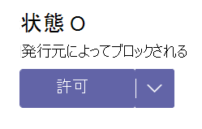

# Microsoft Teams管理センターでTeams アプリを管理する

管理センターの **Teams アプリ** で、組織のアプリを管理します。 [[アプリの管理]](https://admin.teams.microsoft.com/policies/manage-apps) ページを使用して、組織のアプリ カタログにあるすべての Teams アプリを表示および管理できます。 [アプリの管理] ページでは、テナント カタログ内の使用可能なすべてのアプリを確認することができます。また、組織全体で許可またはブロックするアプリを決定するために必要な情報を提供します。 アプリの組織レベルでの状態とプロパティの確認、組織レベルでのアプリのブロックまたは許可、テナント カタログへの新しいカスタム アプリのアップロード、組織全体のアプリ設定の管理を行うことができます。

![[アプリの管理] ページのスクリーンショット。](media/manage-apps.png)

管理センター Teams使用するには、グローバル管理者またはサービス管理者Teams必要があります。詳細については、「[Teams管理者ロール](./using-admin-roles.md)」を参照してください。

アプリを管理するには、ポリシーを使用して、ユーザーのアクセス許可、アプリのインストール、組織内に作成されたカスタム アプリのアップロードを制御します。 ポリシーについては、「 [アプリ ポリシーの概要](app-policies.md)」を参照してください。

> [!NOTE]
> [!INCLUDE [new-teams-sfb-admin-center-notice](includes/new-teams-sfb-admin-center-notice.md)]

> [!NOTE]
> [アプリの管理] ページは、Teamsの Microsoft 365 Government Community Cloud High (GCCH) または国防総省 (DoD) のデプロイでは使用できません。

<!--- TBD: This info belongs in the app policy overview article. Title it as mentioned in the spreadsheet.

* **App permission policy**: With it, you can control what apps are available to specific users in your organization. You can allow or block all apps or specific apps published by Microsoft, third-parties, and your organization. See [Manage app permission policies in Teams](teams-app-permission-policies.md).
* **App setup policies**: It lets you customize the app experience for your users. You choose the apps that you want to pin to the app bar in the Teams clients and the order in which they appear, on web, desktop, and mobile clients. See [Manage app setup policies in Teams](teams-app-setup-policies.md).
* **Custom app policies and settings**: Teams allows developers in your organization to build, test, and deploy custom apps to other users. Custom apps can be added to Teams by uploading an app package in a .zip file directly to a team or in the personal context. You can use app setup policies to control who in your organization can upload custom apps. You can also set org-wide settings to control whether users can interact with specific custom apps. See [Manage custom app policies and settings in Teams](teams-custom-app-policies-and-settings).

The following are the important use cases you can accomplish via the the Manage apps page:

* [Allow or block apps at the org level](#allow-and-block-apps)
* [Apps blocked by publishers](#apps-blocked-by-publishers)
* [Add apps to teams](#add-an-app-to-a-team)
* [Approve or upload new custom apps to your organization's app store](#publish-a-custom-app-to-your-organizations-app-store)
* [View permissions requested by apps](#view-resource-specific-consent-permissions)
* [Grant consent to apps](#grant-admin-consent-to-apps)
* [Purchase service for third-party apps](#purchase-services-for-third-party-apps)
* [See org-level status and properties of apps](#view-apps)
* [Manage org-wide app settings](#manage-org-wide-app-settings)
* [View security and compliance information for Microsoft 365 Certified apps](#view-security-and-compliance-information-for-microsoft-365-certified-apps)

<!--- TBD: Commenting for now in favor of the definition list above: 

The Manage apps page gives you a view into all available apps, providing you with the information you need to decide which apps to allow or block across your organization. You can then use [app permission policies](teams-app-permission-policies.md), [app setup policies](teams-app-setup-policies.md), and [custom app policies and settings](teams-custom-app-policies-and-settings.md) to configure the app experience for specific users in your organization.

In the left navigation of the Microsoft Teams admin center, go to **Teams apps** > **Manage apps**. You must be a global admin or Teams service admin to access the page.

--->

<!--- TBD: Move this view apps section to a new article about navigating and understanding TAC. It is yet to be created.

## View apps

You can view every app including the following information about each app.

- **Name**: The app name. Select the app name to go to the app details page to see more information about the app. This includes a description of the app, whether it's allowed or blocked, version, privacy policy, terms of use, categories that apply to the app, certification status, supported capabilities, and app ID.
- **Certification**: If the app has gone through certification, you'll see either **Microsoft 365 certified** or **Publisher attestation**. Select the link to view certification details for the app. If you see `--`, we don't have certification information for the app. To learn more about certified apps in Teams, read [Microsoft 365 App Certification program](/microsoft-365-app-certification/overview).
- **Publisher**: Name of the publisher.
- **Publishing status**: Publishing status of custom apps.
- **Status**: Status of the app at the org level, which can be one of the following:
  - **Allowed**: The app is available for all users in your organization.
  - **Blocked**: The app is blocked and not available for any users in your organization.
  - **Blocked by publisher**: The app is blocked by the publisher and is hidden from end-users by default. After you set up the app using the publisher's guidance, you can allow or block the app to make it available to end-users.
  - **Blocked org-wide**: The app is blocked in org-wide app settings.
      It's important to know that this column represents the allowed and blocked status of apps that were formerly on the **Org-wide settings** pane. You now view, block, and allow apps at the org-wide on the **Manage apps** page.
- **Licenses**: Indicates whether an app offers a Software as a Service (SaaS) subscription for purchase. This column applies only to third-party apps. Each third-party app will have one of the following values:
  - **Purchase**: The app offers a SaaS subscription and is available to purchase.  
  - **Purchased**: The app offers a SaaS subscription and you've purchased licenses for it.
  - **- -**: The app doesn't offer a SaaS subscription.
- **Custom app**: Whether the app is a custom app.
- **Permissions**: Indicates whether a third-party or custom app that's registered in Azure Active Directory (Azure AD) has permissions that need consent. You'll see one of the following values:
  - **View details**: The app has permissions that require consent before the app can access data.
  - **- -**: The app doesn't have permissions that need consent.
- **Categories**: Categories that apply to the app.
- **Version**: App version.
- **Admin can install in meetings**: Indicates whether an app can be installed by admins in Team meetings. [Learn more](teams-app-setup-policies.md#install-apps)

To see the information that you want in the table, select **Edit Column** in the upper-right corner to add or remove columns to the table.
--->

## カスタム アプリを組織のアプリ ストアに発行します。

[アプリの管理] ページを使用して、組織専用に構築されたアプリを発行します。 カスタム アプリを発行すると、組織のアプリ ストア内のユーザーがそれを使用できるようになります。 カスタム アプリを組織のアプリ ストアに発行するには 2 通りの方法があります。 いずれの方法を使うかは、アプリの取得方法によって決まります。

* [カスタム アプリの承認](#approve-a-custom-app): 開発者が Teams アプリ申請 API を使用してアプリを [アプリの管理] ページに直接送信する場合は、この方法を使用します。 その後、アプリの詳細ページから直接アプリを確認して発行 (または拒否) できます。
* [アプリ パッケージをアップロード](#upload-an-app-package): 開発者がアプリ パッケージを .zip 形式で送信する場合は、この方法を使用します。 アプリ パッケージをアップロードして、アプリを発行します。

### カスタム アプリの承認

[アプリの管理] ページの **保留中の承認** ウィジェットは、開発者が Teams アプリ申請 API を使用してアプリを提出したときに通知を受け取ります。 新しく提出されたアプリには、"**送信済み**" の **公開状態** と、"**ブロックされた**" **状態** が表示されます。 アプリの詳細ページに移動してアプリの詳細を表示し、発行するには、**[発行の状態]** を **[発行]** に設定します。

また、開発者がカスタム アプリに更新プログラムを提出したときにも通知されます。 その後、アプリの詳細ページでアプリを確認して発行 (または拒否) できます。 すべてのアプリのアクセス許可ポリシーとアプリのセットアップ ポリシーは、更新されたアプリに適用されたままです。

賞については、「[Teams アプリ 申請 API を使用して送信されたカスタム アプリを発行する](submit-approve-custom-apps.md)」をご覧ください。

### アプリ パッケージのアップロード

開発者は、[Teams App Studio](/microsoftteams/platform/get-started/get-started-app-studio) を使用して Teams アプリ パッケージを作成し、.zip 形式で送信します。 アプリ パッケージがある場合は、それを組織のアプリ ストアにアップロードできます。

新しいカスタム アプリをアップロードするには、**[アップロード]** を選択してアプリ パッケージをアップロードします。 アップロード後、アプリは強調表示されないため、[アプリの管理] ページでアプリの一覧を検索して見つける必要があります。

アップロード後にアプリを更新するには、[アプリの管理] ページのアプリの一覧でアプリ名を選択し、**[更新]** を選択します。 これにより、アプリ カタログ内の既存のアプリが置き換えられ、更新されたアプリには、アプリのアクセス許可ポリシーとアプリの設定アップポリシーがすべて適用されたままになります。

詳細については、「[アプリ パッケージをアップロードしてカスタム アプリを発行する](upload-custom-apps.md)」を参照してください。

## アプリの許可とブロック

[アプリの管理] ページは、組織レベルで個々のアプリを許可またはブロックする場所です。 利用可能なすべてのアプリと、現在の組織レベルのアプリの状態が表示されます。 (組織レベルでのアプリのブロックと許可は、**[組織全体のアプリ設定]** ウィンドウからここに移動されました。)

アプリを許可またはブロックするには、アプリを選択し、**[許可]** または **[ブロック]** を選択します。 アプリをブロックすると、アプリとのすべての通信が無効になり、組織内のすべてユーザーに対してそのアプリが Teams に表示されなくなります。

[アプリの管理] ページでアプリをブロックまたは許可すると、そのアプリは組織内のすべてのユーザーに対してブロックまたは許可されます。  Teams アプリのアクセス許可ポリシーでアプリをブロックまたは許可すると、そのポリシーが割り当てられているユーザーに対してブロックまたは許可されます。 ユーザーが任意のアプリをインストールして操作できるようにするには、[アプリの管理] ページからアプリを組織レベルで許可し、ユーザーに割り当てられているアプリのアクセス許可ポリシーを許可する必要があります。

 > [!NOTE]
 > アプリをアンインストールするには、アプリを右クリックし、**[アンインストール]** をクリックするか、左側の **[その他のアプリ]** メニューを使用します。

## 発行元にブロックされているアプリ

ISV がグローバル アプリ ストアにアプリを発行する場合、アプリ エクスペリエンスを構成またはカスタマイズするために管理者が必要になる場合があります。 管理者は、アプリが完全に設定されている場合にエンド ユーザーが使用できるようにします。

たとえば、Contoso Electronics は、Microsoft Teams 用のヘルプ デスク アプリを構築した ISV です。 Contoso Electronics は、その顧客がアプリを操作するときに期待どおりに機能するように、顧客がアプリの特定のプロパティを設定することを望んでいます。 管理者がアプリケーションを許可またはブロックする前に、Teams 管理センターで "**発行元 によってブロック済み**" として表示され、既定ではエンド ユーザーから非表示になっています。 発行元のガイダンスに従ってアプリを設定した後、状態を **[許可]** に変更してユーザーが利用できるようにしたり、状態を **[ブロック]** に変更してユーザーがアプリを使用できないようにしたりできます。

## チームにアプリを追加する

**[チームに追加]** ボタンを使用して、チームにアプリをインストールします。 チームの範囲でインストールできるアプリのみをインストールできることに注意してください。 **[チームに追加]** ボタンは、個人用スコープでのみインストールできるアプリでは使用できません。

![[チームに追加] ボタンを示すスクリーンショット。](media/manage-apps-add-app-team.png)

1. 目的のアプリを検索し、アプリ名の左側を選択してアプリを選択します。
1. **[チームに追加]** を選択します。
1. **[チームに追加]** ウィンドウで、アプリを追加するチームを検索し、チームを選択して、**[適用]** 選択します。

## アプリのカスタマイズ

アプリをカスタマイズして、組織のニーズに応じた特定の外観を含めることができるようになりました。 「[Teams でアプリをカスタマイズする](customize-apps.md)」を参照してください。

## サードパーティ アプリのサービスを購入

[アプリの管理] ページから、組織内のユーザーに対してサード パーティ製アプリによって提供されるサービスのライセンスを直接検索して購入できます。 表の "**ライセンス**" 列は、アプリで有料 SaaS サブスクリプションを提供されているかどうかを示します。 **[今すぐ購入]** を選択して、プランと価格情報を表示し、ユーザーのライセンスを購入します。 詳細については、「[Microsoft Teams 管理センターで Teams サードパーティ製アプリのサービスを購入する](purchase-third-party-apps.md)」を参照してください。

## アプリに管理者の同意を付与する

組織内のすべてのユーザーに代わってアクセス許可を要求するアプリを確認し、同意を付与することができます。 こうすることで、ユーザーがアプリの起動時にアプリから要求されたアクセス許可を確認して受け入れる必要はなくなります。 "**アクセス許可**" 列は、アプリに同意が必要なアクセス許可があるかどうかを示します。 同意が必要なアクセス許可を持つAzure ADに登録されている各アプリの **[詳細の表示]** リンクが表示されます。 詳細については、「[Microsoft Teams 管理センターでアプリのアクセス許可を表示し、管理者の同意を付与する](app-permissions-admin-center.md)」を参照してください。

## リソース固有の同意のアクセス許可を表示する

リソース固有の同意 (RSC) アクセス許可を使用すると、チームの所有者は、アプリがチームのデータにアクセスして変更するための同意を付与できます。 RSC のアクセス許可は、アプリが特定のチームで何を実行できるかを定義する、粒度の細かい Teams 固有のアクセス許可です。 RSC のアクセス許可は、アプリの [アプリの詳細] ページの **[アクセス許可]** タブで表示できます。 詳細については、「[Microsoft Teams 管理センターでアプリのアクセス許可を表示し、管理者の同意を付与する](app-permissions-admin-center.md)」を参照してください。

## 組織全体のアプリ設定の管理

組織全体のアプリ設定を使用して、 [F ライセンス](https://www.microsoft.com/microsoft-365/enterprise/frontline#office-SKUChooser-0dbn8nt) を持つユーザーがカスタマイズされた最前線のアプリ エクスペリエンスを利用できるかどうか、ユーザーがサード パーティのアプリをインストールできるかどうか、およびユーザーが組織内のカスタム アプリをアップロードまたは操作できるかどうかを制御します。 組織全体のアプリ設定は、すべてのユーザーの動作を管理し、ユーザーに割り当てられた他のアプリ権限ポリシーを上書きします。 それらを使用して、悪意のあるアプリや問題のあるアプリを制御できます。

> [!NOTE]
> Microsoft 365 Government - Government Community Cloud High GCCH および国防総省 (DoD) の Teams のデプロイで組織全体のアプリ設定を使用する方法については、「[Teams でアプリのアクセス許可ポリシーを管理する](teams-app-permission-policies.md)」を参照してください。

1. [アプリの管理] ページで、**[組織全体のアプリ設定]** を選択します。 次に、パネルで必要な設定を構成できます。

    :::image type="content" source="media/manage-apps-org-wide-app-settings.png" alt-text="[アプリの管理] ページの [組織全体のアプリ設定] ウィンドウを示すスクリーンショット":::

1. [ **カスタマイズされたアプリ**] で、[ **カスタマイズした** アプリの表示] をオフまたはオンにします。 この設定をオンにすると、 [F ライセンスを持つユーザー](https://www.microsoft.com/microsoft-365/enterprise/frontline#office-SKUChooser-0dbn8nt)は、カスタマイズされた現場アプリのエクスペリエンスを利用できます。 このエクスペリエンスにより、現場担当者にとって Teams で最も関連性の高いアプリがピン留めされます。 詳細については、「[現場担当者向けに Teams アプリを調整する](pin-teams-apps-based-on-license.md)」を参照してください。

    この機能は F ライセンスで使用できます。 その他のライセンスの種類は、今後サポートされる予定です。
1. **[サードパーティ アプリ]** で、次の設定をオフまたはオンにして、サードパーティ アプリへのアクセスを制御します。

    - **[サードパーティ アプリを許可する]**: ここで、ユーザーがサードパーティ アプリを使用できるかどうかを制御します。 この設定をオフにした場合、ユーザーはサードパーティ製アプリをインストールまたは使用できず、これらのアプリのアプリ状態は、"**組織全体でブロック**" としてテーブルに表示されます。

        > [!NOTE]
        > **[サードパーティ製アプリのを許可]** がオフの場合、[送信 Webhook](/microsoftteams/platform/webhooks-and-connectors/what-are-webhooks-and-connectors) は引き続きすべてのユーザーに対して有効になりますが、[[アプリのアクセス許可ポリシー]](teams-app-permission-policies.md) を使用して送信 Webhook アプリを許可またはブロックすることで、ユーザー レベルの制御ができます。 **[特定のアプリを許可し、他のすべてをブロックする]** 設定を使用する **Microsoft アプリ** に対して既存の [アプリアクセス許可ポリシー](teams-app-permission-policies.md)があり、ユーザーに対して送信 Webhook を有効にする場合は、送信 Webhook アプリを一覧に追加します。

        > [!NOTE]
        > Teams ユーザーは、他の組織のユーザーとの会議やチャットをホストするときにアプリを追加できます。 他の組織がホストする会議やチャットに参加するときに、他の組織のユーザーが共有するアプリを使用することもできます。 ホストしているユーザーの組織のデータ ポリシーと、そのユーザーの組織が共有するサードパーティ アプリのデータ共有の慣行が適用されます。

    - **ストアに公開された新しいサードパーティ アプリを既定で許可する**: ここでは、Teams アプリ ストアに公開された新しいサードパーティ アプリを Teams で自動的に利用可能にするかどうかを制御します。このオプションは、サードパーティのアプリを許可する場合にのみ設定できます。

1. **[カスタム アプリ]** で、**[カスタム アプリとの対話を許可する]** をオフまたはオンにします。 この設定は、ユーザーがカスタム アプリを操作できるかどうかを制御します。 詳細については、「[Teams のカスタム アプリのポリシーと設定を管理する](teams-custom-app-policies-and-settings.md)」をご覧ください。
1. 組織全体のアプリ設定を有効にするには、**[保存]** を選択します。
