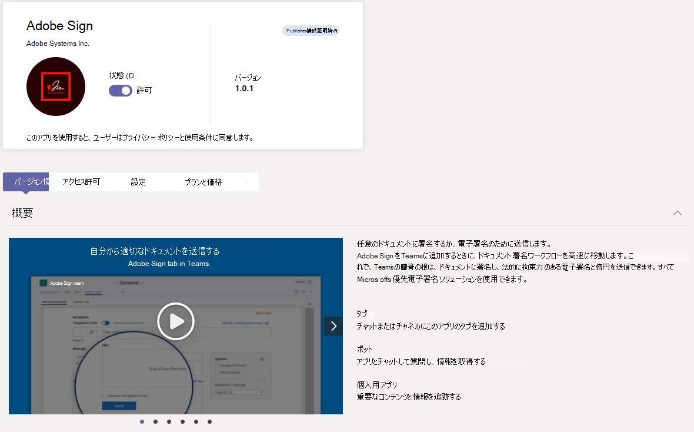

# Microsoft Teams 管理センターで、Teams アプリの組織向けアプリを管理します。

管理者は、組織のすべての Teams アプリを表示および管理できます。 Teams 管理センターの [アプリの管理] ページでは、次のことができます:

- [組織レベルでアプリを許可またはブロック](#allow-and-block-apps)
- [発行元にブロックされているアプリ](#apps-blocked-by-publishers)
- [Teams にアプリを追加](#add-an-app-to-a-team)
- [新しいカスタム アプリを承認するか、組織のアプリ ストアにアップロード](#publish-a-custom-app-to-your-organizations-app-store)
- [アプリが要求したアクセス許可を表示](#view-resource-specific-consent-permissions)
- [アプリに同意を付与](#grant-admin-consent-to-apps)
- [サードパーティ アプリのサービスを購入](#purchase-services-for-third-party-apps)
- [アプリの組織レベルの状態とプロパティを表示](#view-apps)
- [組織全体のアプリ設定の管理](#manage-org-wide-app-settings)
- [Microsoft 365 認定アプリのセキュリティとコンプライアンスの情報を表示](#view-security-and-compliance-information-for-microsoft-365-certified-apps)

[アプリの管理] ページでは、テナント カタログ内の使用可能なすべてのアプリを確認することができます。また、組織全体で許可またはブロックするアプリを決定するために必要な情報を提供します。 また、[アプリのアクセス許可ポリシー](teams-app-permission-policies.md)、[アプリのセットアップ ポリシー](teams-app-setup-policies.md)、[カスタム アプリ ポリシーと設定](teams-custom-app-policies-and-settings.md)を使って、組織内の特定のユーザーに対してアプリ エクスペリエンスの構成を行うことができます。

Microsoft Teams 管理センターの左側のナビゲーションで、**[Teams アプリ]** > **[アプリを管理]** の順に移動します。 これらのポリシーを管理するには、グローバル管理者または Teams サービス管理者である必要があります。

![[アプリの管理] ページのスクリーンショット。](media/manage-apps.png)

> [!NOTE]
> Teams の Microsoft 365 Government Community Cloud High (GCCH) または国防総省 (DoD) のデプロイでは、[アプリの管理] ページはまだ利用できません。

## アプリの表示

各アプリに関して次の情報を含む、すべてのアプリを表示できます。

- **名前**: アプリ名。 アプリ名を選択してアプリの詳細ページに移動し、アプリの詳細を表示します。 これには、アプリの説明、アプリが許可されているかブロックされているか、バージョン、アプリに適用されるカテゴリ、認定の状態、サポートされている機能、アプリ ID が含まれます。
- **認定**: アプリが認定を受けた場合は、**Microsoft 365 認定** または **発行元の構成証明** が表示されます。 アプリの認定の詳細を表示するには、リンクを選択します。 `--` と表示された場合、アプリの認定情報がありません。 Teams の認定アプリの詳細については、「[Microsoft 365 アプリ認定プログラム](/microsoft-365-app-certification/overview)」をお読みください。
- **発行元**: 発行元の名前。
- **発行の状態**: カスタム アプリの発行の状態。
- **状態**: 組織レベルでのアプリの状態。以下のオプションのいずれかになります:
  - **許可**: このアプリは、組織のすべてのユーザーが利用できます。
  - **ブロック**: このアプリはブロックされ、組織のユーザーは使用できません。
  - **発行元によってブロック**: アプリは発行元によってブロックされ、既定ではエンド ユーザーには非表示になっています。 発行元のガイダンスを使用してアプリを設定したら、エンド ユーザーがアプリを使用できるようにアプリを許可またはブロックできます。
  - **組織全体でブロック**: 組織全体のアプリ設定でアプリがブロックされます。
      この列は、アプリの許可、またはブロック状態を表す列で、以前は **[組織全体の設定]** ウィンドウに表示されていたということを知っておいてください。 **[アプリの管理]** ページで、組織全体でアプリ を表示、ブロック、許可できるようになりました。
- **ライセンス**: サービスとしてのソフトウェア (SaaS) サブスクリプションの購入用としてアプリを提供するかどうかを示します。 この列は、サード パーティ製アプリにのみ適用されます。 各サードパーティ アプリには、次のいずれかの値が設定されます:
  - **今すぐ購入**: このアプリは SaaS サブスクリプションを提供しており、購入が可能です。  
  - **購入済み**: このアプリは SaaS サブスクリプションを提供しており、そのライセンスを購入済みです。
  - **- -**: このアプリは SaaS サブスクリプションを提供していません。
- **カスタム アプリ**: このアプリがカスタム アプリかどうか。
- **アクセス許可**: Azure Active Directory (Azure AD) に登録されているサード パーティ製アプリまたはカスタム アプリに、同意が必要なアクセス許可があるかどうかを示します。 次のいずれかの値が表示されます。
  - **詳細の表示**: このアプリには、アプリがデータにアクセスする前に同意が必要なアクセス許可があります。
  - **- -**: このアプリには、同意が必要なアクセス許可がありません。
- **カテゴリ**: このアプリに適用されるカテゴリ。
- **バージョン**: アプリのバージョン。
- **管理者は会議にインストール可能**: チーム会議で管理者がアプリをインストールできるかどうかを示します。 [詳細情報](teams-app-setup-policies.md#install-apps)

テーブルに必要な情報を表示するには、右上隅にある **[列の編集]** を選択して、テーブルに列を追加または削除します。

## カスタム アプリを組織のアプリ ストアに発行します。

[アプリの管理] ページを使用して、組織専用に構築されたアプリを発行します。 カスタム アプリを発行すると、組織のアプリ ストア内のユーザーがそれを使用できるようになります。 カスタム アプリを組織のアプリ ストアに発行するには 2 通りの方法があります。 いずれの方法を使うかは、アプリの取得方法によって決まります。

- [カスタム アプリの承認](#approve-a-custom-app): 開発者が Teams アプリ申請 API を使用してアプリを [アプリの管理] ページに直接送信する場合は、この方法を使用します。 その後、アプリの詳細ページから直接アプリを確認して発行 (または拒否) できます。
- [アプリ パッケージをアップロード](#upload-an-app-package): 開発者がアプリ パッケージを .zip 形式で送信する場合は、この方法を使用します。 アプリ パッケージをアップロードして、アプリを発行します。

### カスタム アプリの承認

[アプリの管理] ページの **保留中の承認** ウィジェットは、開発者が Teams アプリ申請 API を使用してアプリを提出したときに通知を受け取ります。 新しく提出されたアプリには、"**送信済み**" の **公開状態** と、"**ブロックされた**" **状態** が表示されます。 アプリの詳細ページに移動してアプリの詳細を表示し、発行するには、**[発行の状態]** を **[発行]** に設定します。

また、開発者がカスタム アプリに更新プログラムを提出したときにも通知されます。 その後、アプリの詳細ページでアプリを確認して発行 (または拒否) できます。 すべてのアプリのアクセス許可ポリシーとアプリのセットアップ ポリシーは、更新されたアプリに適用されたままです。

賞については、「[Teams アプリ 申請 API を使用して送信されたカスタム アプリを発行する](submit-approve-custom-apps.md)」をご覧ください。

### アプリ パッケージのアップロード

開発者は、[Teams App Studio](/microsoftteams/platform/get-started/get-started-app-studio) を使用して Teams アプリ パッケージを作成し、.zip 形式で送信します。 アプリ パッケージがある場合は、それを組織のアプリ ストアにアップロードできます。

新しいカスタム アプリをアップロードするには、**[アップロード]** を選択してアプリ パッケージをアップロードします。 アップロード後、アプリは強調表示されないため、[アプリの管理] ページでアプリの一覧を検索して見つける必要があります。

アップロード後にアプリを更新するには、[アプリの管理] ページのアプリの一覧でアプリ名を選択し、**[更新]** を選択します。 これにより、アプリ カタログ内の既存のアプリが置き換えられ、更新されたアプリには、アプリのアクセス許可ポリシーとアプリの設定アップポリシーがすべて適用されたままになります。

詳細については、「[アプリ パッケージをアップロードしてカスタム アプリを発行する](upload-custom-apps.md)」を参照してください。

## アプリの許可とブロック

[アプリの管理] ページは、組織レベルで個々のアプリを許可またはブロックする場所です。 利用可能なすべてのアプリと、現在の組織レベルのアプリの状態が表示されます。 (組織レベルでのアプリのブロックと許可は、**[組織全体のアプリ設定]** ウィンドウからここに移動されました。)

アプリを許可またはブロックするには、アプリを選択し、**[許可]** または **[ブロック]** を選択します。 アプリをブロックすると、アプリとのすべての通信が無効になり、組織内のすべてユーザーに対してそのアプリが Teams に表示されなくなります。

[アプリの管理] ページでアプリをブロックまたは許可すると、そのアプリは組織内のすべてのユーザーに対してブロックまたは許可されます。  Teams アプリのアクセス許可ポリシーでアプリをブロックまたは許可すると、そのポリシーが割り当てられているユーザーに対してブロックまたは許可されます。 ユーザーが任意のアプリをインストールして操作できるようにするには、[アプリの管理] ページからアプリを組織レベルで許可し、ユーザーに割り当てられているアプリのアクセス許可ポリシーを許可する必要があります。

 > [!NOTE]
 > アプリをアンインストールするには、アプリを右クリックし、**[アンインストール]** をクリックするか、左側の **[その他のアプリ]** メニューを使用します。

## 発行元にブロックされているアプリ

ISV がグローバル アプリ ストアにアプリを発行する場合、アプリ エクスペリエンスを構成またはカスタマイズするために管理者が必要になる場合があります。 管理者は、アプリが完全に設定されている場合にエンド ユーザーが使用できるようにします。

たとえば、Contoso Electronics は、Microsoft Teams 用のヘルプ デスク アプリを構築した ISV です。 Contoso Electronics は、その顧客がアプリを操作するときに期待どおりに機能するように、顧客がアプリの特定のプロパティを設定することを望んでいます。 管理者がアプリケーションを許可またはブロックする前に、Teams 管理センターで "**発行元 によってブロック済み**" として表示され、既定ではエンド ユーザーから非表示になっています。 発行元のガイダンスに従ってアプリを設定した後、状態を **[許可]** に変更してユーザーが利用できるようにしたり、状態を **[ブロック]** に変更してユーザーがアプリを使用できないようにしたりできます。

## チームにアプリを追加する

**[チームに追加]** ボタンを使用して、チームにアプリをインストールします。 チームの範囲でインストールできるアプリのみをインストールできることに注意してください。 **[チームに追加]** ボタンは、個人用スコープでのみインストールできるアプリでは使用できません。

![[チームに追加] ボタンを示すスクリーンショット。](media/manage-apps-add-app-team.png)

1. 目的のアプリを検索し、アプリ名の左側を選択してアプリを選択します。
2. **[チームに追加]** を選択します。
3. **[チームに追加]** ウィンドウで、アプリを追加するチームを検索し、チームを選択して、**[適用]** 選択します。

## アプリのカスタマイズ

アプリをカスタマイズして、組織のニーズに応じた特定の外観を含めることができるようになりました。 「[Teams でアプリをカスタマイズする](customize-apps.md)」を参照してください。

## サードパーティ アプリのサービスを購入

[アプリの管理] ページから、組織内のユーザーに対してサード パーティ製アプリによって提供されるサービスのライセンスを直接検索して購入できます。 表の "**ライセンス**" 列は、アプリで有料 SaaS サブスクリプションを提供されているかどうかを示します。 **[今すぐ購入]** を選択して、プランと価格情報を表示し、ユーザーのライセンスを購入します。 詳細については、「[Microsoft Teams 管理センターで Teams サードパーティ製アプリのサービスを購入する](purchase-third-party-apps.md)」を参照してください。

## アプリに管理者の同意を付与する

組織内のすべてのユーザーに代わってアクセス許可を要求するアプリを確認し、同意を付与することができます。 こうすることで、ユーザーがアプリの起動時にアプリから要求されたアクセス許可を確認して受け入れる必要はなくなります。 "**アクセス許可**" 列は、アプリに同意が必要なアクセス許可があるかどうかを示します。 同意が必要なアクセス許可を持つAzure ADに登録されている各アプリの **[詳細の表示]** リンクが表示されます。 詳細については、「[Microsoft Teams 管理センターでアプリのアクセス許可を表示し、管理者の同意を付与する](app-permissions-admin-center.md)」を参照してください。

## リソース固有の同意のアクセス許可を表示する

リソース固有の同意 (RSC) アクセス許可を使用すると、チームの所有者は、アプリがチームのデータにアクセスして変更するための同意を付与できます。 RSC のアクセス許可は、アプリが特定のチームで何を実行できるかを定義する、粒度の細かい Teams 固有のアクセス許可です。 RSC のアクセス許可は、アプリの [アプリの詳細] ページの **[アクセス許可]** タブで表示できます。 詳細については、「[Microsoft Teams 管理センターでアプリのアクセス許可を表示し、管理者の同意を付与する](app-permissions-admin-center.md)」を参照してください。

## 組織全体のアプリ設定の管理

組織全体のアプリ設定を使用して、[F ライセンス](https://www.microsoft.com/microsoft-365/enterprise/frontline#office-SKUChooser-0dbn8nt)を持つユーザーがカスタマイズされた現場アプリ エクスペリエンス (近日公開予定) を取得するかどうか、ユーザーがサードパーティ製アプリをインストールできるかどうか、ユーザーが組織内のカスタム アプリをアップロードまたは操作できるかどうかを制御します。 組織全体のアプリ設定は、すべてのユーザーの動作を管理し、ユーザーに割り当てられた他のアプリ権限ポリシーを上書きします。 それらを使用して、悪意のあるアプリや問題のあるアプリを制御できます。

> [!NOTE]
> Microsoft 365 Government - Government Community Cloud High GCCH および国防総省 (DoD) の Teams のデプロイで組織全体のアプリ設定を使用する方法については、「[Teams でアプリのアクセス許可ポリシーを管理する](teams-app-permission-policies.md)」を参照してください。

1. [アプリの管理] ページで、**[組織全体のアプリ設定]** を選択します。 次に、パネルで必要な設定を構成できます。

    :::image type="content" source="media/manage-apps-org-wide-app-settings.png" alt-text="[アプリの管理] ページの [組織全体のアプリ設定] ウィンドウを示すスクリーンショット":::

1. (近日公開予定) **[カスタマイズされたアプリ]** で、[**カスタマイズしたアプリを表示]** をオンまたはオフにします。 この設定をオンにすると、 [F ライセンスを持つユーザー](https://www.microsoft.com/microsoft-365/enterprise/frontline#office-SKUChooser-0dbn8nt)は、カスタマイズされた現場アプリのエクスペリエンスを利用できます。 このエクスペリエンスにより、現場担当者にとって Teams で最も関連性の高いアプリがピン留めされます。 詳細については、「[現場担当者向けに Teams アプリを調整する](pin-teams-apps-based-on-license.md)」を参照してください。

    この機能は F ライセンスで使用できます。 その他のライセンスの種類は、今後サポートされる予定です。
1. **[サードパーティ アプリ]** で、次の設定をオフまたはオンにして、サードパーティ アプリへのアクセスを制御します。

    - **[サードパーティ アプリを許可する]**: ここで、ユーザーがサードパーティ アプリを使用できるかどうかを制御します。 この設定をオフにした場合、ユーザーはサードパーティ製アプリをインストールまたは使用できず、これらのアプリのアプリ状態は、"**組織全体でブロック**" としてテーブルに表示されます。

        > [!NOTE]
        > **[サードパーティ製アプリのを許可]** がオフの場合、[送信 Webhook](/microsoftteams/platform/webhooks-and-connectors/what-are-webhooks-and-connectors) は引き続きすべてのユーザーに対して有効になりますが、[[アプリのアクセス許可ポリシー]](teams-app-permission-policies.md) を使用して送信 Webhook アプリを許可またはブロックすることで、ユーザー レベルの制御ができます。 **[特定のアプリを許可し、他のすべてをブロックする]** 設定を使用する **Microsoft アプリ** に対して既存の[アプリアクセス許可ポリシー](teams-app-permission-policies.md)があり、ユーザーに対して送信 Webhook を有効にする場合は、送信 Webhook アプリを一覧に追加します。

        > [!NOTE]
        > Teams ユーザーは、他の組織のユーザーとの会議やチャットをホストするときにアプリを追加できます。 他の組織がホストする会議やチャットに参加するときに、他の組織のユーザーが共有するアプリを使用することもできます。 ホストしているユーザーの組織のデータ ポリシーと、そのユーザーの組織が共有するサードパーティ アプリのデータ共有の慣行が適用されます。

    - **ストアに公開された新しいサードパーティ アプリを既定で許可する**: ここでは、Teams アプリ ストアに公開された新しいサードパーティ アプリを Teams で自動的に利用可能にするかどうかを制御します。このオプションは、サードパーティのアプリを許可する場合にのみ設定できます。

1. **[カスタム アプリ]** で、**[カスタム アプリとの対話を許可する]** をオフまたはオンにします。 この設定は、ユーザーがカスタム アプリを操作できるかどうかを制御します。 詳細については、「[Teams のカスタム アプリのポリシーと設定を管理する](teams-custom-app-policies-and-settings.md)」をご覧ください。
1. 組織全体のアプリ設定を有効にするには、**[保存]** を選択します。

## Microsoft 365 認定アプリのセキュリティとコンプライアンスの情報を表示

組織のアプリを評価するときに、管理者は Microsoft Cloud App Security (MCAS) などの独立したCloud Access Security Brokers (CASB) を使用して、アプリのセキュリティと動作に関する情報を見つけることができます。 Teams 管理センターには、Microsoft 365 認定アプリの MCAS からのセキュリティとコンプライアンスの情報が含まれているため、アプリがニーズを満たしているかどうかの詳細がわかります。

> [!NOTE]
> この機能は、組織が MCAS をサポートするライセンスを持っているかどうかにかかわらず、すべての管理者が利用できます。

MCAS 情報にアクセスするには、次の手順に従います:

1. Teams 管理センターで、**[Teams アプリ]** の **[アプリの管理]** を選択します。
1. **[認定]** を選択してアプリを並べ替え、すべての Microsoft 365 認定アプリをテーブルの一番上にプッシュします。
1. Microsoft 365 認定アプリを選択します。
1. **[セキュリティとコンプライアンス]** タブを選択します。

![Teams 管理センターの [セキュリティとコンプライアンス] タブを示すスクリーンショット。](media/mcas.png)

このタブには、セキュリティ、コンプライアンス、およびデータ保護に関する情報が表示されます。 また、各ドロップダウン リストを展開して、選択したアプリケーションでサポートされている機能の詳細を取得することもできます。

## 関連トピック

- [Teams でのアプリの管理設定](admin-settings.md)
