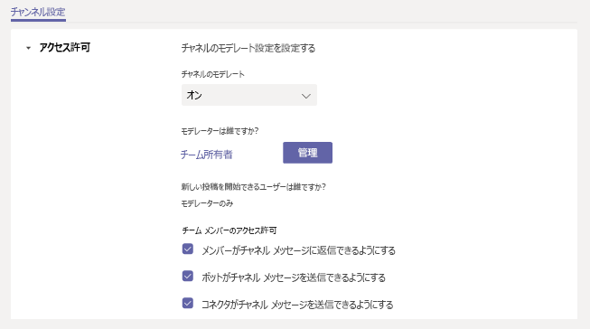

# Microsoft Teams でチャネルのモデレーションを設定および管理する

このMicrosoft Teams、チーム所有者は標準チャネルのモデレーションを有効にし、新しい投稿を開始し、そのチャネルの投稿に返信できるユーザーを制御できます。

チーム所有者は、チーム メンバーをモデレーターとして追加することもできます。 チーム所有者が、チャネルのモデレーションを最大限にサポートするためのチャネル レベルにおける領域の専門知識を持っていない場合もあります。 特定のチーム メンバーがチャネルをモデレートすることを許可することにより、チャネル内のコンテンツとコンテキストを管理する責任を、チーム所有者とチャネル モデレーターで共有できます。 たとえば、チーム所有者はモデレーターとしてビジネス オーナーまたはコンテンツ所有者を追加できます。これにより、対象チャネルで共有する情報を制御できます。

> [!NOTE]
> チャネル モデレーションは、標準チャネルで使用できます。 一般チャネルまたはプライベート チャネルでは使用できません。

## チャネル モデレーターが行えること

チャネル モデレーターは次のことができます。

- チャネルで新しい投稿を開始します。 チャネルでモデレーションを有効にすると、モデレーターのみがそのチャネルで新しい投稿を開始できます。
- チーム メンバーをモデレーターとしてチャネルに追加したり、削除したりします。 既定では、チーム所有者はチャネル モデレーターであり、チーム所有者を削除することはできません。
- チーム メンバーが既存のチャネル メッセージに返信できるかどうか、また、ボットとコネクタがチャネル メッセージを送信できるかどうかを制御します。

## シナリオ

組織が Teams でチャネルのモデレーションを使用する方法の例を次に示します。

### チャネルをお知らせチャネルとして使用する

マーケティング チームは、特定のチャネルを使用して、主要なプロジェクトのお知らせと成果物を共有します。 チーム メンバーがチャネルに投稿したコンテンツが、他のチャネルに属するほうがより適切であることがあります。 チーム所有者は、このチャネルで共有する情報をお知らせのみに制限し、チーム メンバーがそのチャネルを使用して重要な情報をいつでも把握できるようにすることができます。

このシナリオでは、チーム所有者がモデレーターとしてマーケティング リーダーを追加して、チャネルにお知らせを投稿し、チーム メンバーがそのチャネルのメッセージに返信できないようにすることができます。

### Teams for Education におけるクラス ディスカッション用にチャネルを使用する

Teamsでは、サイエンス教師はチャネルを使用して、特定の教室のトピックに焦点を当てたディスカッションに学生を参加したいと考えました。

このシナリオでは、教師は、補助教員がチャネルをモデレートすることを許可します。 次に、補助教員は、新しい投稿を作成し、学生とのディスカッションを開始して促進できます。

## チャネルのモデレーションを管理する

Teams でチャネルに移動し、**[その他のオプション...]** > **[チャネルを管理]** とクリックします。 ここでは、モデレーションを有効または無効にしたり、チーム メンバーをモデレーターとして追加したり、設定を行ったりすることができます。

チャネルのモデレーションは、チャネルごとの設定です。 チャネルのモデレーションのテナント レベルの設定はありません。 テナント レベルのチャネルのモデレーション設定を追加する場合は、[Teams UserVoice](https://microsoftteams.uservoice.com/) で要求します。

[!INCLUDE [uservoice-disclaimer-note](includes/uservoice-disclaimer-note.md)]

### チャンルのモデレーションを有効または無効にする

既定では、モデレーションは無効になっています。これは、通常のチャネル設定がチーム所有者とチーム メンバーに適用されることを意味します。 たとえば、新しい投稿をチーム メンバーのみに制限したり、ゲストを含むすべてのユーザーに新しい投稿の開始を許可したりできます。

チャネルのモデレーションを有効にするには、**[チャネルのモデレーション]** の **[有効 (On)]** をクリックします。 チャネルのモデレーションが有効になっている場合、モデレーターのみが新しい投稿を開始できます。 

### チャネル モデレーターを追加または削除する

**[モデレーター一覧]** で **[管理]** をクリックし、チーム メンバーをモデレーターとして追加または削除します。 チーム所有者とモデレーターは、他のモデレーターを追加および削除できます。  

### チーム メンバーのアクセス許可を設定する

**[チーム メンバーのアクセス許可]** で、許可するアクティビティの隣にあるチェックボックスを選択します。

## 関連項目

- [Teams でのチームとチャネルの概要](teams-channels-overview.md)
