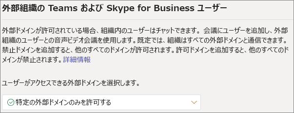
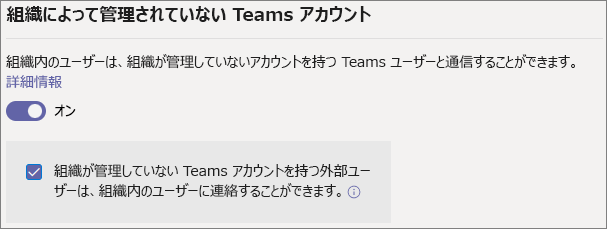
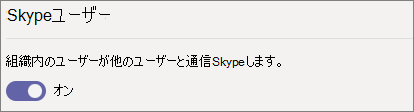

# <a name="manage-external-access-in-microsoft-teams"></a>Microsoft Teams での外部アクセスの管理

外部アクセスとは、組織外の Teams ユーザーが Teams で会議の検索、呼び出し、チャット、設定を行うための手段です。 外部アクセスを使用して、Skype for Business (オンラインおよびオンプレミス) および Skype を引き続き使用している他の組織のユーザーと通信することもできます。

他の組織のユーザーにチームやチャネルへのアクセスを許可する場合は、代わりにゲスト アクセスを使用してください。 外部アクセスとゲスト アクセスの違いの詳細については、「[外部アクセスとゲスト アクセスの比較](communicate-with-users-from-other-organizations.md#compare-external-and-guest-access)」を参照してください。 

以下のような場合に外部アクセスを使用します。
  
- チャットをする必要がある外部ドメインのユーザーがいる場合。たとえば、Rob@contoso.com と Ann@northwindtraders.com が、contoso.com ドメインおよび northwindtraders.com ドメインの他のユーザーと一緒にプロジェクトの共同作業を行う場合です。

- 組織内のユーザーが、Teams を使用して組織外の特定の会社のユーザーに連絡する必要場ある場合。

- ユーザーのメール アドレスを使用して、世界中の Teams のユーザーは誰でもそのユーザーを検索して連絡を取れるようにする場合。 

## <a name="plan-for-external-access"></a>外部アクセスの計画

外部アクセス ポリシーには、組織レベルとユーザー レベルの両方におけるフェデレーションの各種類に対する制御が含まれます。 ポリシーを組織レベルでオフにすると、ユーザー レベルの設定に関係なく、すべてのユーザーに対してオフになります。 既定では、すべての外部アクセス設定が有効になっています。

Teams 管理センターは、組織レベルで外部アクセスを制御します。 ほとんどのオプション (ドメイン制限を除く) は、PowerShell を使用してユーザー レベルで使用できます。 詳細については、以下の「[PowerShell の使用](#using-powershell)」を参照してください。

> [!NOTE]
> 組織で外部アクセスをオフにしても、組織外のユーザーは匿名参加で会議に参加できます。 詳細については、「[Teams での会議設定を管理する](meeting-settings-in-teams.md)」を参照してください。

> [!NOTE]
> Teams ユーザーは、他の組織のユーザーとの会議やチャットをホストするときにアプリを追加できます。 他の組織がホストする会議やチャットに参加するときに、他の組織のユーザーが共有するアプリを使用することもできます。 ホストしているユーザーの組織のデータ ポリシーと、そのユーザーの組織が共有するサードパーティ アプリのデータ共有の慣行が適用されます。

## <a name="allow-or-block-domains"></a>ドメインの許可または禁止

禁止ドメインを追加すると、他のすべてのドメインが許可され、許可ドメインを追加すると、他のすべてのドメインが禁止されます。 この規則の例外は、匿名の参加者が会議に参加できる場合です。 Teams 管理センターで外部アクセスを設定するには、次の 4 つのシナリオがあります (**[ユーザー]** > **[外部アクセス]**):

- **すべての外部ドメインを許可する**: これは Teams の既定の設定です。組織内のユーザーが任意のドメインの組織外ユーザーとの会議の検索、呼び出し、チャット、設定を行えるようにします。

    このシナリオでは、別のテナントでも外部通信がサポートされている場合に限り、ユーザーは Teams または Skype for Business を実行しているすべての外部ドメインと通信することができます。
    
- **特定の外部ドメインのみを許可する**: **[許可]** リストにドメインを追加して、外部アクセスを許可ドメインのみに制限します。 許可ドメインのリストを設定すると、他のすべてのドメインが禁止されます。 

- **特定のドメインを禁止する** - **[禁止]** リストにドメインを追加すると、禁止したもの *以外の* すべての外部ドメインと通信することができます。  禁止ドメインのリストを設定すると、他のすべてのドメインが許可されます。

- **すべての外部ドメインをブロックする** - 組織内のユーザーが、組織の外部のユーザーと任意のドメインで、会議を検索、通話、チャット、設定できないようにします。

> [!NOTE]
> 許可またはブロックされたドメインは、会議への匿名アクセスが「オフ」の場合にのみ会議に適用されます。



**Microsoft Teams 管理センターの使用**

特定のドメインを許可するには

1. Teams 管理センターで、**[ユーザー]** > **[外部アクセス]** の順に移動します。

2. **[ユーザーがアクセスできるドメインの選択]** で、**[特定の外部ドメインのみを許可する]** を選択します。

3. **[ドメインを許可]** を選択します。

4. **[ドメイン]** ボックスに、許可するドメインを入力し、**[完了]** をクリックします。

5. 別のドメインを許可する場合は、**[ドメインの追加]** をクリックします。

6. **[保存]** をクリックします。

特定のドメインをブロックするには

1. Teams 管理センターで、**[ユーザー]** > **[外部アクセス]** の順に移動します。

2. **[ユーザーがアクセスできるドメインの選択]** で、**[特定の外部ドメインのみをブロックする]** を選択します。

3. **[ドメインのブロック]** を選択します。

4. **[ドメイン]** ボックスに、許可するドメインを入力し、**[完了]** をクリックします。

5. 別のドメインをブロックする場合は、**[ドメインの追加]** をクリックします。

6. **[保存]** をクリックします。

別のテナントと通信するには、**[すべての外部ドメインを許可する]** を有効にするか、上記と同じ手順に従って、許可されたドメインのリストにテナントを追加する必要があります。  

## <a name="manage-contact-with-external-teams-users-not-managed-by-an-organization"></a>組織が管理していない外部の Teams ユーザーとの連絡先を管理する

管理者は、組織が管理していない ("管理されていない”) 外部の Teams ユーザーとの通信を有効にするか無効にするかを選択できます。 有効にした場合は、管理されていないアカウントを持つユーザーが連絡を開始できるかどうかを制御することもできます (次の図を参照してください)。 **[組織が管理していない Teams アカウントを持つ外部ユーザーは、組織内のユーザーに連絡できる]** がオフになっている場合、管理されていない Teams ユーザーは、完全なメール アドレスを検索して組織の連絡先を見つけることができません。また、管理されていない Teams ユーザーとのすべての通信は組織ユーザーが開始する必要があります。

Teams 管理センターで、**[ユーザー]** > **[外部アクセス]** の順に移動します。



組織内の Teams ユーザーと、組織が管理していないアカウントを持つ外部の Teams ユーザーの通信をブロックするには、次の操作を実行します。
1. **[組織内のユーザーは、組織が管理していないアカウントを持つ Teams ユーザーと通信できる]** 設定をオフにします。
2. **[組織が管理していない Teams アカウントを持つ外部ユーザーは、組織内のユーザーに連絡できる]** チェックボックスをオフにします。

組織内の Teams ユーザーが連絡を開始した場合、組織が管理していないアカウントを持つ外部の Teams ユーザーと連絡できるようにするには、次の操作を実行します。
1. **[組織内のユーザーは、組織が管理していないアカウントを持つ Teams ユーザーと通信できる]** 設定をオンにします。
2. **[組織が管理していない Teams アカウントを持つ外部ユーザーは、組織内のユーザーに連絡できる]** チェックボックスをオフにします。

組織内の Teams ユーザーが、組織が管理していないアカウントを持つ外部の Teams ユーザーと連絡できるようにし、それらの外部 Teams ユーザーと連絡する要求を受信できるようにするには、次の操作を実行します。
1. **[組織内のユーザーは、組織が管理していないアカウントを持つ Teams ユーザーと通信できる]** 設定をオンにします。
2. **[組織が管理していない Teams アカウントを持つ外部ユーザーは、組織内のユーザーに連絡できる]** チェックボックスを選択します。

## <a name="communicate-with-skype-users"></a>Skype ユーザーとの通信

組織内の Teams ユーザーが Skype ユーザーとチャットや通話をできるようにするには、次の手順を実行します。 この手順を実行すると、Teams ユーザーと Skype ユーザーとが、互いを検索したり、1 対 1 のテキストのみの会話や音声/ビデオ通話を開始したりできるようになります。



**Microsoft Teams 管理センターの使用**

1. 左側のナビゲーションで、**[ユーザー]** > **[外部アクセス]** の順に移動します。

2. **[組織内のユーザーに Skype ユーザーとの通信を許可する]** 設定をオンにします。

Teams ユーザーと Skype ユーザーが通信できるようにする方法、および適用される制限事項の詳細については、「[Teams と Skype の相互運用性](teams-skype-interop.md)」を参照してください。

## <a name="using-powershell"></a>PowerShell の使用

組織レベルの設定は、[Set-CSTenantFederationConfiguration](/powershell/module/skype/set-cstenantfederationconfiguration) を使用して構成できます。ユーザー レベルの設定は、[Set-CsExternalAccessPolicy](/powershell/module/skype/set-csexternalaccesspolicy) を使用して構成できます。

次の表に、フェデレーションの構成に使用されるコマンドレット パラメーターを示します。

|構成|組織レベル (Set-CSTenantFederationConfiguration)|ユーザー レベル (Set-CsExternalAccessPolicy)|
|:-------|:--------|:------------------|
|他の Teams 組織と Skype for Business とのフェデレーションの有効化/無効化|`-AllowFederatedUsers`|`-EnableFederationAccess`|
|特定のドメインとのフェデレーションの有効化|`-AllowedDomains`|該当なし|
|特定のドメインとのフェデレーションの無効化|`-Blocked Domains`|該当なし|
|組織が管理していない Teams ユーザーとのフェデレーションをの有効化/無効化|`-AllowTeamsConsumer`|`-EnableTeamsConsumerAccess`|
|組織が管理していない Teams ユーザーによる会話の開始の有効化/無効化|`-AllowTeamsConsumerInbound`|`-EnableTeamsConsumerInbound`|
|Skype とのフェデレーションの有効化/無効化|`-AllowPublicUsers`|`-EnablePublicCloudAccess`|

重要な点として、ポリシーを無効にすると、テナントからユーザーに "細分化" されます。 次に例を示します。

```PowerShell
Set-CsTenantFederationConfiguration -AllowFederatedUsers $false
Set-CsExternalAccessPolicy -EnableFederationAccess $true
```

この例では、ユーザー レベルのポリシーは有効になっていますが、この種類のフェデレーションが組織レベルではオフになっているため、ユーザーが管理されている Teams ユーザーまたは Skype for Business ユーザーと通信することはできません。 そのため、ユーザーのサブセットに対してこれらの制御を有効にする場合、組織レベルで制御をオンにし、2 つのグループ ポリシー (制御をオフにする必要があるユーザーに適用されるポリシーと、制御をオンにする必要があるユーザーに適用されるポリシー) を作成する必要があります。

## <a name="limit-external-access-to-specific-people"></a>外部アクセスを特定のユーザーに制限する

組織レベルで有効にした外部アクセス制御がある場合、PowerShell を使用して、外部アクセスを特定のユーザーに制限できます。

次のサンプル スクリプトを使用できます。*Control* は変更するコントロール、*PolicyName* はポリシーに与える名前、*UserName* は外部アクセスを有効または無効にするユーザーに置き換えます。

スクリプトを実行する前に、[Microsoft Teams PowerShell モジュール](/microsoftteams/teams-powershell-install)がインストールされていることを確認してください。

```PowerShell
Connect-MicrosoftTeams

# Disable external access globally
Set-CsExternalAccessPolicy -<Control> $false

# Create a new external access policy
New-CsExternalAccessPolicy -Identity <PolicyName> -<Control> $true

# Assign users to the policy
$users_ids = @("<UserName1>", "<UserName2>")
New-CsBatchPolicyAssignmentOperation -PolicyType ExternalAccessPolicy -PolicyName "<PolicyName>" -Identity $users_ids

```

たとえば、組織が管理していない外部の Teams ユーザーとの通信を有効にします。

```PowerShell
Connect-MicrosoftTeams

Set-CsExternalAccessPolicy -EnableTeamsConsumerAccess $false

New-CsExternalAccessPolicy -Identity ContosoExternalAccess -EnableTeamsConsumerAccess $true

$users_ids = @("MeganB@contoso.com", "AlexW@contoso.com")
New-CsBatchPolicyAssignmentOperation -PolicyType ExternalAccessPolicy -PolicyName "ContosoExternalAccess" -Identity $users_ids

```

ユーザー リストをコンパイルする方法の追加の例については、[New-CsBatchPolicyAssignmentOperation](/powershell/module/teams/new-csbatchpolicyassignmentoperation) を参照してください。

`Get-CsExternalAccessPolicy` を実行すると、新しいポリシーを確認できます。

[New-CsExternalAccessPolicy](/powershell/module/skype/new-csexternalaccesspolicy) および [Set-CsExternalAccessPolicy](/powershell/module/skype/set-csexternalaccesspolicy) も参照してください。

## <a name="common-external-access-scenarios"></a>一般的な外部アクセスのシナリオ

次のセクションでは、一般的な外部アクセスシナリオでフェデレーションを有効にする方法と、Teams Upgrade Policy が着信チャットと通話の配信を決定する方法について説明します。

### <a name="enable-federation-between-users-in-your-organization-and-other-organizations"></a>組織内のユーザーと他の組織のユーザーとの間のフェデレーションを有効にする

組織内のユーザーが別の組織のユーザーと通信できるようにするには、両方の組織でフェデレーションを有効にする必要があります。 特定の組織とのフェデレーションを有効にする手順は、組織が純粋なオンライン、ハイブリッド、または純粋なオンプレミスのうちどれかによって異なります。

| もしあなたの組織が | 次のようにフェデレーションを有効にします |
|:---------|:-----------------------|
|オンプレミスに Skype for Business がないオンライン。 これには、TeamsOnly ユーザーや Skype for Business Online ユーザーがいる組織が含まれます。| Teams 管理センターを使用している場合： <br>- 通信するドメインが外部アクセスで許可されていることを確認します。<br><br>PowerShell を使用している場合:<br>- テナントがフェデレーションに対して有効になっていることを確認します: `Get-CsTenantFederationConfiguration` が `AllowFederatedUsers=true` を表示する必要があります。 <br>- `CsExternalAccessPolicy` のユーザーの実効値が `EnableFederationAccess=true` を持っていることを確認します。<br>- オープン フェデレーションを使用していない場合は、ターゲット ドメインが`AllowedDomains`の`CsTenantFederationConfiguration`にリストされていることを確認してください。 |
|オンプレミスのみ| オンプレミス ツールの場合: <br>- `CsAccessEdgeConfiguration` でフェデレーションが有効になっていることを確認します。<br>- ユーザーのフェデレーションが `ExternalAccessPolicy` を介して (グローバルポリシー、サイトポリシー、またはユーザー割り当てポリシーのいずれかを介して) 有効になっていることを確認します。 <br> - オープン フェデレーションを使用していない場合は、ターゲット ドメインが`AllowedDomains`にリストされていることを確認してください。|
|オンライン (Skype for Business または Teams のいずれか) の一部のユーザーと、オンプレミスの一部のユーザーとのハイブリッド。 | オンライン組織とオンプレミス組織の両方について、上記の手順に従ってください。 |

### <a name="delivery-of-incoming-chats-and-calls"></a>着信チャットと通話の配信 

フェデレーション組織からの着信チャットと通話は、TeamsUpgradePolicy の受信者ユーザーのモードに応じて、ユーザーの Teams または Skype for Business クライアントに送信されます。

| 目的 | 操作 |
|:---------|:-----------------------|
|着信するフェデレーション チャットと通話がユーザーの Teams クライアントに確実に届くようにする|ユーザーを TeamsOnly に構成します。
|着信するフェデレーション チャットと通話がユーザーの Skype fo Business クライアントに確実に届くようにする|ユーザーを TeamsOnly 以外のモードになるように構成します。|

### <a name="enable-federation-between-users-in-your-organization-and-unmanaged-teams-users"></a>組織内のユーザーと管理されていない Teams ユーザーとの間のフェデレーションを有効にする

組織内のユーザーと管理されていない Teams ユーザーとの間のフェデレーションを有効にするには、次の操作を実行します。

| もしあなたの組織が | 次のようにフェデレーションを有効にします |
|:---------|:-----------------------|
|オンプレミスに Skype for Business がないオンライン。 これには、Teams のみユーザーや Skype for Business Online ユーザーがいる組織が含まれます。| Teams 管理センターを使用している場合:<br>- **[外部アクセス]** で **[組織内のユーザーは、組織が管理していないアカウントを持つ Teams ユーザーと通信できる]** が有効になっていることを確認します。<br>- 管理されていない Teams アカウントがチャットを開始できるようにするには、**[組織が管理していない Teams アカウントを持つ外部ユーザーは、組織内のユーザーに連絡できる]** チェックボックスをオンにします。<br><br>PowerShell を使用している場合:<br>- テナントがフェデレーションに対して有効になっていることを確認します: `Get-CsTenantFederationConfiguration` には `AllowTeamsConsumer=true` 表示する必要があります。<br>- `CsExternalAccessPolicy` のユーザーの実効値が `EnableTeamsConsumerAccess=true` を持っていることを確認します。<br>- テナントが管理されていないユーザーによるチャットの開始に対して有効になっていることを確認します。`Get-CsTenantFederationConfiguration` で `AllowTeamsConsumerInbound=true` が表示される必要があります。<br>- `CsExternalAccessPolicy` のユーザーの実効値が `EnableTeamsConsumerInbound=true` を持っていることを確認します。|
|オンプレミスのみ| 管理されていない Teams ユーザーとのチャットはオンプレミスのみの組織ではサポートされていません。|
|オンライン (Skype for Business または Teams のいずれか) の一部のユーザーと、オンプレミスの一部のユーザーとのハイブリッド。 | オンラインの組織について前述した手順に従います。 管理されていない Teams ユーザーとのチャットは、オンプレミスのユーザーに対してはサポートされていないことに注意してください。|

> [!IMPORTANT]
> Teams ユーザーが組織外の管理されていない Teams ユーザーと通信できるようにする際、**Teams ドメイン** を許可ドメインとして追加する必要はありません。すべての **管理されていない Teams ドメイン** が許可されます。

### <a name="enable-federation-between-users-in-your-organization-and-consumer-users-of-skype"></a>組織内のユーザーと Skype のコンシューマー ユーザーとの間のフェデレーションを有効にする

組織内のユーザーと Skype のコンシューマー ユーザー間のフェデレーションを有効にするには:

| もしあなたの組織が | 次のようにコンシューマーのフェデレーションを有効にします |
|:---------|:-----------------------|
|オンプレミスに Skype for Business がないオンラインのみ。 これには、TeamsOnly ユーザーや Skype for Business Online ユーザーがいる組織が含まれます。 | Teams 管理センターを使用している場合： <br>- **[組織内のユーザーに Skype ユーザーとの通信を許可する]** が外部アクセスで有効になっていることを確認します。<br><br>PowerShell を使用している場合: <br>- テナントがフェデレーションに対して有効になっていることを確認します: `Get-CsTenantFederationConfiguration` には `AllowPublicUsers=true` 表示する必要があります。 <br> - `CsExternalAccessPolicy` のユーザーの実効値が `EnablePublicCloudAccess=true` を持っていることを確認します。 |
|オンプレミスのみ| オンプレミス ツールの場合: <br> - Skype がフェデレーション パートナーとして有効になっていることを確認します。 <br> - `ExternalAccessPolicy` を介して (グローバルポリシー、サイトポリシー、またはユーザーが割り当てたポリシーを介して) ユーザーの`EnablePublicCloudAccess=true`を確認します。|
| オンライン (Skype for Business または Teams のいずれか) の一部のユーザーと、オンプレミスの一部のユーザーとのハイブリッド。| オンライン組織とオンプレミス組織の両方について、上記の手順に従ってください。

> [!IMPORTANT]
> Teams または Skype for Business Online ユーザーが組織内外の Skype ユーザーと通信できるようにする際、**Skype ドメイン** を許可ドメインとして追加する必要はありません。すべての **Skype ドメイン** が許可されます。

## <a name="federation-diagnostic-tool"></a>フェデレーション診断ツール

管理者である場合は、次の診断ツールを使用して、Teams ユーザーがフェデレーション ユーザーと 通信できることを検証することができます。

1. 以下の **[テストの実行]** を選択すると、診断が Microsoft 365 管理センターに表示されます。 

   > [!div class="nextstepaction"]
   > [テストの実行: Teams フェデレーション](https://aka.ms/TeamsFederationDiag)

2. [診断の実行] ウィンドウで、**[セッション開始プロトコル (SIP) アドレス]** と **[フェデレーション テナントのドメイン名]** を入力してから、**[テストの実行]** を選択します。

3. テストでは、フェデレーション ユーザーとの通信を妨げているテナントまたはポリシー構成に対処するための最適な次の手順が返されます。


## <a name="related-topics"></a>関連項目

[外部 (フェデレーション) ユーザー向けのネイティブ チャット機能](native-chat-for-external-users.md)
