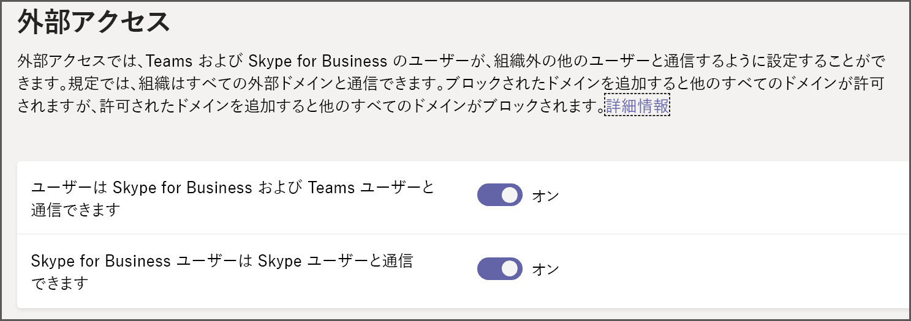

Microsoft Teams での外部アクセス (フェデレーション) の管理Manage external access (federation) in Microsoft Teams
======================================================

Microsoft Teams の外部アクセスを使用すると、他のドメインのユーザーがチャットや通話に参加することができます。With Microsoft Teams external access, users from other domains can participate in your chats and calls. さらに、Skype for Business Online または Skype for Business オンプレミスを使用している外部ユーザーに参加を許可することもできます。You can also allow external users who are still using Skype for Business Online or Skype for Business on-prem to participate.

次の場合、この記事で説明する手順をご利用ください。Use the steps in this article when:
  
- 組織内のさまざまなドメインにユーザーがいる場合: たとえば、Rob@ContosoEast.com と Ann@ContosoWest.com。You have users in different domains in your business: for example, Rob@ContosoEast.com and Ann@ContosoWest.com.

- 組織内のユーザーが特定の組織外の会社のユーザーと連絡する際に、Teams を使用させたい場合。You want the people in your organization to use Teams to contact people in specific businesses outside of your organization.

- ユーザーのメール アドレスを使用して、世界中の Teams のユーザーは誰でもそのユーザーを検索して連絡を取れるようにする場合。You want anyone else in the world who uses Teams to be able to find and contact you, using your email address. 自分と他のユーザーが両方とも外部アクセスを有効にし、互いのドメインを許可している場合は、これが機能します。If you and another user both enable external access and allow each other's domains, this will work. 正常に動作しない場合は、もう 1 人のユーザーの構成でユーザーのドメインがブロックされていないかを確認してもらいます。If it doesn't work, the other user should make sure his or her configuration isn't blocking your domain.

外部アクセスでは、外部ユーザーがインスタントメッセージを検索、発信、送信したり、会議を設定したりできます。External access allows external users to find, call, and send you instant messages, as well as set up meetings with you. ただし、外部ユーザーがチームとチャネルにアクセスできるようにしたい場合は、ゲストアクセスの方が適している可能性があります。However, if you want external users to have access to teams and channels, guest access might be a better way to go. 外部アクセスとゲストアクセスの違いの詳細については、下記の「[外部アクセスとゲストアクセス](#external-access-vs-guest-access)」を参照してください。For more information about the differences between external access and guest access, see [External access vs. guest access](#external-access-vs-guest-access)), below. ゲストアクセスを有効にするには、「[ゲストアクセスを有効](set-up-guests.md)にして、ユーザーが通信できるようにする」を参照してください。To turn on guest access, see [turn on guest access](set-up-guests.md) so that users can communicate.

> [!IMPORTANT]
> 現時点では、Microsoft Teams クライアント内で、現在 Azure Active Directory (Azure AD) またはテナントのゲストとして設定されていない外部ユーザーとのフェデレーションを行うには、ハイブリッドに適切に設定して、Skype for Business Online に移行する必要があります。Currently, to federate within the Microsoft Teams client to an external user outside of your organization who's not currently a guest of your Azure Active Directory (Azure AD) or tenant, you must be correctly set up for hybrid and moved to Skype for Business Online. 2/25/2019 の場合、チームは、Skype for Business Online をホームにしている SIP プロフィールのユーザーを除いて、ネイティブフェデレーションをサポートしていません。As of 2/25/2019, Teams doesn't support native federation without the user of the SIP profile being homed in Skype for Business Online. ハイブリッド用にアカウントを設定し、Teams に移行する方法については、「 [Skype For business のハイブリッド展開を teams にアップグレードする](https://docs.microsoft.com/en-us/microsoftteams/upgrade-to-teams-execute-skypeforbusinesshybrid)」を参照してください。For more on setting up your account for hybrid and then moving to Teams, see [Upgrade Skype for Business hybrid deployment to Teams](https://docs.microsoft.com/en-us/microsoftteams/upgrade-to-teams-execute-skypeforbusinesshybrid).

## 外部アクセスとゲストアクセスExternal access vs. guest access

外部アクセス (フェデレーション) とゲストアクセスの違いは次のとおりです。External access (federation) and guest access are different:

- ゲストアクセスは、個々のユーザーにアクセス許可を付与します。Guest access gives access permission to an individual. 外部アクセスは、ドメイン全体へのアクセス許可を付与します。External access gives access permission to an entire domain.

- ゲストアクセスはチーム所有者によって付与されると、ゲストは特定のチームのためのリソース (チャネルディスカッションやファイルなど) に[アクセス](guest-experience.md)し、招待されたチーム内の他のユーザーとチャットすることができます。Guest access, once granted by a team owner, allows a guest to [access resources](guest-experience.md), such as channel discussions and files, for a specific team, and chat with other users in the team they have been invited to. 外部アクセス (フェデレーションチャット) を使用している場合、外部チャット参加者は招待組織のチームまたはチームリソースにアクセスすることはできません。With external access (federated chat), the external chat participants have no access to the inviting organization’s teams or team resources. 1対1のフェデレーションチャットにのみ参加できます。They can only participate in one-on-one federated chat. テナント管理者は、外部関係者に適したコラボレーションのレベルに応じて、2つの通信オプションのいずれかを選ぶことができます。Tenant admins can choose between the two communication options depending on which level of collaboration is desirable with the external party. 管理者は、組織のニーズに応じて、いずれか一方または両方の方法を選ぶことができますが、すべてのチームでの共同作業にゲストアクセスを有効にすることをお勧めします。Admins can choose either approaches or both, depending on their organizational needs, but we recommend enabling guest access for a fuller, collaborative Teams experience. 

外部とゲストのアクセス機能の比較については、次の表を参照してください。See the following table for a comparison of external and guest access features.

| 機能Feature | 外部アクセスユーザーExternal access users | ゲストアクセスユーザーGuest access users |
|---------|-----------------------|--------------------|
| ユーザーは別の会社の他のユーザーとチャットすることができますUser can chat with someone in another company | はいYes |可Yes |
| ユーザーが別の会社のユーザーに電話をかけることができるUser can call someone in another company | はいYes | 可Yes |
| 他の会社のユーザーが通話またはチャットできるかどうかを確認できるUser can see if someone from another company is available for call or chat | はいYes | Yes1Yes1 |
| ユーザーは外部テナント全体でユーザーを検索できますUser can search for users across external tenants | Yes2Yes2 | いいえNo |
| ユーザーはファイルを共有できますUser can share files | いいえNo | はいYes |
| ユーザーはチームリソースにアクセスできますUser can access Teams resources | いいえNo | はいYes |
| ユーザをグループチャットに追加できますUser can be added to a group chat | いいえNo | はいYes |
| ユーザーを会議に追加できるUser can be added to a meeting | はいYes | 可Yes |
| 外部ユーザーとのチャットに追加のユーザーを追加できるAdditional users can be added to a chat with an external user | なし3No3 | N/AN/A |
| ユーザーは外部関係者として識別されるUser is identified as an external party | はいYes | 可Yes |
| プレゼンスが表示されるPresence is displayed | はいYes | 可Yes |
| 不在時のメッセージが表示されるOut of office message is shown | いいえNo | はいYes |
| 個々のユーザーをブロックすることができますIndividual user can be blocked | いいえNo | はいYes |
| @mentions はサポートされています@mentions are supported | いいえNo | はいYes |
| プライベート通話を行うMake private calls | はいYes | 可Yes |
| IP ビデオを許可するAllow IP video | はいYes | 可Yes |
| 画面共有モードScreen sharing mode | いいえNo | はいYes |
| 今すぐ会議を許可するAllow meet now | いいえNo | はいYes |
| 送信済みメッセージを編集するEdit sent messages | いいえNo | はいYes |
| 送信したメッセージを削除できますCan delete sent messages | いいえNo | はいYes |
| 会話で Giphy を使うUse Giphy in conversation | いいえNo | はいYes |
| スレッドでミームを使うUse memes in conversation | いいえNo | はいYes |
| 会話でステッカーを使用するUse stickers in conversation | いいえNo | はいYes |
||||

1ユーザーがゲストとして追加され、ゲストテナントにゲストとしてサインインしていることを示します。1 Provided that the user has been added as a guest and is signed in as a guest to the guest tenant. 
2メールまたはセッションの開始プロトコル (SIP) アドレスのみ。2 Only by email or Session Initiation Protocol (SIP) address. 
3外部 (フェデレーション) チャットは1:1 のみです。3 External (federated) chat is 1:1 only.

> [!NOTE]
> ゲスト機能とゲストエクスペリエンスの詳細については、「 [Microsoft Teams へのゲストアクセスを有効または無効にする](https://docs.microsoft.com/microsoftteams/set-up-guests)」および「[ゲストエクスペリエンスの概要](https://docs.microsoft.com/microsoftteams/guest-experience)」を参照してください。For more information on guest features and the guest experience, see [Turn on or off guest access to Microsoft Teams](https://docs.microsoft.com/microsoftteams/set-up-guests) and [What the guest experience is like](https://docs.microsoft.com/microsoftteams/guest-experience).

## チームユーザーが別の組織のユーザーとチャットして通信できるようにするLet your Teams users chat and communicate with users in another organization

外部アクセスを利用すると、チームと Skype for Business のユーザーは組織外の他のユーザーと通信できます。External access lets your Teams and Skype for Business users communicate with other users who are outside of your organization. 既定では、組織はすべての外部ドメインと通信できます。By default, your organization can communicate with all external domains. ブロックされたドメインを追加した場合、その他のすべてのドメインは許可されますが、許可されたドメインを追加すると、他のすべてのドメインはブロックされます。If you add blocked domains, all other domains will be allowed but if you add allowed domains, all other domains will be blocked. 組織の外部アクセスを簡単に設定できます。You can easily set up external access for your organization. 次の3つのシナリオを設定することができます。There are three scenarios for setting it up:

- **シナリオ 1** -**オープンフェデレーション**を使用できます。**Scenario 1** - You can use **OPEN FEDERATION**. これは既定の設定であり、組織内のユーザーがインスタントメッセージを検索、発信、送信したり、組織外のユーザーとの会議を設定したりできるようにします。This is the default setting and it lets people in your organization find, call, and send instant messages, as well as set up meetings with people external to your organization.

    この設定を使用すると、ユーザーは、チームを実行していても、ドメインまたは組織がドメインを許可するようにセットアップしているすべての外部ドメインと通信できます。When you use this set up, your users can communicate with ALL external domains that are running Teams but have set up their domain/organization to allow your domain.

- **シナリオ 2** -**許可**リストにドメインを追加することができます。**Scenario 2** - You can add a domain or domains to the **ALLOW** list. これを行うには、[**ドメインの追加**] をクリックし、ドメイン名を追加して、[**このドメインで実行するアクション**] をクリックしてから [**許可**] を選びます。To do this, click **Add a domain**, add the domain name, click **Action to take on this domain**, and then select **Allowed**. この操作を行うと、他のすべてのドメインが**ブロック**されることを知っておくことが重要です。It's important to know that if you do this it will **BLOCK** all other domains.

- **シナリオ 3** -**ブロック**リストにドメインを追加することができます。**Scenario 3** - You can add a domain or domains to the **BLOCK** list. これを行うには、[**ドメインの追加**] をクリックし、ドメイン名を追加して、[**このドメインで実行するアクション**] をクリックし、[**ブロック**] を選択します。To do this, click **Add a domain**, add the domain name, click **Action to take on this domain**, and then select **Blocked**. この操作を行うと、他のすべてのドメインが**許可**されることを知っておくことが重要です。It's important to know that if you do this it will **ALLOW** all other domains.

ドメインを許可またはブロックするには、次の手順を実行します。Follow these steps to allow or block domains.

### 手順 1-組織が別のチーム組織と通信できるようにするStep 1 - Enable your organization to communicate with another Teams organization

 **管理センターを使用し**た microsoft teams ロゴを示すアイコン **Using the Microsoft Teams admin center**

1. 左側のナビゲーションで、[**組織全体の設定**]  >  [**外部アクセス**] に移動します。In the left navigation, go to **Org-wide settings** > **External access**.

2. ユーザーが**Skype For business および Teams ユーザーと通信できる**ように切り替え\*\*\*\* ます。Toggle the **Users can communicate with Skype for Business and Teams users** switch to **On**.

     .

3. すべての Teams の組織に対して、組織内のユーザーとの通信を許可する場合は、手順 5 に進みます。If you want to allow all Teams organizations to communicate with users in your organization, skip to step 5.

4. 組織内のユーザーと通信できる組織を制限する場合は、一部のドメインを除くすべてのドメインを許可するか、特定のドメインのみを許可することができます。If you want to limit the organizations that can communicate with users in your organization, you can either allow all except some domains, or you can allow only specific domains. 

    - 一部のドメインを除くすべてのドメインを許可するには、[**ドメインの追加**] をクリックして、ブロックするドメインを追加します。To allow all except some domains, add the domains you want to block by clicking **Add domain**. [**ドメインの追加**] ウィンドウで、ドメイン名を入力し、[**禁止**] をクリックして、[clik **Done**] をクリックします。In the **Add a domain** pane, type the domain name, click **Blocked**, and then clik **Done**. 
    - 特定の組織への通信を制限するには、[**許可**] の状態でそれらのドメインをリストに追加します。To limit communications to specific organizations, add those domains to the list with a status of **Allowed**. 許可リストにドメインを追加した後、他の組織との通信は、ドメインが許可リストに含まれる組織に限定されます。Once you have added any domain to the Allow list, communications with other organizations will be limited to only those organizations whose domains are in the Allow list. 

5. [**保存**] をクリックします。Click **Save**.

6. 他のチーム組織の管理者がこれらの手順を完了していることを確認します。Make sure the admin in the other Teams organization completes these same steps. たとえば、**許可ドメイン**リストでは、ユーザーとの通信を可能にする組織が制限されている場合は、管理者が自社のドメインに入力する必要があります。For example, in their **allowed domains** list, their admin needs to enter the domain for your business if they limit the organizations that can communicate with their users.

### 手順 2-テストするStep 2 - Test it

設定をテストするには、組織のファイアウォールの外側にいる Teams ユーザーが必要です。To test your setup, you need a Teams user who's not behind your firewall.
  
1. お客様ともう 1 つの組織の管理者が [**外部アクセス**] 設定の変更をそれぞれ完了すると、テストを開始できます。After you and the admin from the organization have changed the **External access** settings, you should be good to go.

2. Teams アプリで、メール アドレスを使用してユーザーを検索し、チャットの要求を送信します。In the Teams app, search for the person by email address, and send a request to chat.

3. お客様宛にチャットの要求を送信するよう、Teams の連絡先に依頼します。Ask your Teams contact to send you a request to chat. 相手からの要求を受信できない場合は、お客様のファイアウォールの設定に問題があります (相手のファイアウォールの設定が正しいことが確認済みであることが前提)。If you don't receive their request, the problem is your firewall settings (assuming they've already confirmed their firewall settings are correct).

4. ファイアウォールで問題があるかどうかをテストして、ファイアウォールの背後にない wifi の場所に移動することもできます。Another way to test whether the problem is your firewall is to go to a wifi location not behind your firewall. また、コーヒーショップなど、チームを使ってコンタクトにリクエストを送信して、チャットをすることができます。such as a coffee shop, and use Teams to send a request to your contact to chat. メッセージは wifi の場所で行われているが、仕事の途中ではない場合は、ファイアウォールに問題があることがわかります。If the message goes through at the wifi location, but does not when you're at work, then you know the problem is your firewall.

## Skype for Business Online の組織のユーザーとの通信Communicate with users in a Skype for Business Online organization

外部アクセスを設定して、チームユーザーが Skype for Business 組織内のユーザーを検索して、ユーザーに連絡できるユーザーを制限する場合は、次の手順に従って、自分のドメインから別の組織のドメインに外部アクセスを設定します。If you are setting up external access to let your Teams users find and contact users who are in a Skype for Business organization that limits who can contact their users, follow the steps to set up external access from your domain to the other organization's domain. 次に、他の組織の管理者に連絡して、Skype for Business Online の外部アクセスを構成するための手順を実行します。Then ask the admin in the other organization to follow the steps below to configure external access for Skype for Business Online.

 **Skype for business 管理センターを使用し**た skype for business ロゴを示すアイコン **Using the Skype for Business admin center**

その組織の管理者に、次の手順を実行するよう依頼します。Have the admin in that organization do these steps:

1. Microsoft 365 管理センターで、[**管理センター** > **Teams & Skype** > **従来のポータル**] に移動します。In the Microsoft 365 admin center, go to **Admin Centers** > **Teams & Skype** > **Legacy portal**.
  
2. **Skype for Business 管理センター**で、[**組織**]  >  [**外部通信**] の順に選択します。In the **Skype for Business admin center**, choose **Organization** > **External communications**.

3. 特定の会社や別のドメインのユーザーとの通信を設定するには、ドロップダウン ボックスで [**許可したドメインに対してのみオンにする**] を選択します。To set up communication with a specific business or with users in another domain, in the drop-down box, choose **On only for allowed domains**.

    または、Skype for Business のオープン ポリシーを使用する世界中の誰とでもユーザーが通信できるようにするには、[**禁止したドメインを除いてオンにする**] を選択します。OR, if they want to enable communication with everyone else in the world who has open Skype for Business policies, choose **On except for blocked domains**. これは、既定の設定です。This is the default setting.

4. [**禁止したドメインまたは許可**したドメイン] でを選ん**+** で、許可するドメインの名前を追加します。Under **Blocked or allowed domains**, choose **+**, and then add the name of the domain you want to allow.

## 詳細情報More information

Microsoft Teams のゲストアクセスの詳細については、「 [Microsoft teams でゲストアクセスを管理](manage-guests.md)する」を参照してください。For information about guest access in Microsoft Teams, see [Manage guest access in Microsoft Teams](manage-guests.md).
