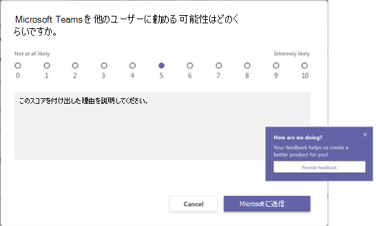

# <a name="manage-feedback-policies-in-microsoft-teams"></a>Microsoft Teams でフィードバックポリシーを管理する

[!INCLUDE [preview-feature](includes/preview-feature.md)]

組織内のユーザーは、teams に関するフィードバックを Microsoft に送信することができます。これは、チームのデスクトップと web クライアントの中から直接行っていることです。 チームのエクスペリエンスを継続的に改善しており、このフィードバックを使用してチームの改善に取り組んでいます。

**フィードバックの提供機能**

ユーザーは、チームで**フィードバック**を送信する**ために、** > チームに関するコメントや提案をお送りします。 **フィードバック**を送信して送信されるデータは、"顧客データ" または "個人データ" と見なされる情報など、Office 365 契約の下で "サポートデータ" と見なされます。

![Teams の [フィードバックの提供] オプションのスクリーンショット](media/manage-feedback-policies-in-teams-give-feedback.png)

**調査**

また、ユーザーはチームとのエクスペリエンスを評価し、その評価についての詳細を送信することもできます。 このポップアップアンケートは、チームのユーザーに対して表示されます。 ユーザーが通知の [**フィードバック**の送信] をクリックすると、アンケートが表示されます。



## <a name="set-whether-users-can-send-feedback-about-teams-to-microsoft"></a>ユーザーがチームに関するフィードバックを Microsoft に送信できるようにするかどうかを設定する

管理者として、組織内のユーザーが**フィードバック**を送信し、アンケートを受けるかどうかを制御できます。 既定では、組織内のすべてのユーザーにグローバル (組織全体の既定) ポリシーが自動的に割り当てられ、ポリシーで**フィードバックの提供**機能とアンケートが有効になります。 この例外は、学生に対して機能が有効になっており、学生に対して無効になっている、教育機関向けの Teams です。

グローバルポリシーを編集するか、カスタムポリシーを作成して割り当てることができます。 ユーザーにカスタムポリシーが割り当てられている場合は、そのポリシーがユーザーに適用されます。 ユーザーにカスタムポリシーが割り当てられていない場合は、グローバルポリシーがユーザーに適用されます。 グローバルポリシーを編集するか、ポリシーを割り当てると、変更が有効になるまで最大24時間かかることがあります。

たとえば、組織内のすべてのユーザーが**フィードバック**を送信してフィードバックを受け取り、トレーニングの新入団体以外のアンケートを受けることができるようにします。 このシナリオでは、ユーザー設定のポリシーを作成して、両方の機能を無効にし、新しい採用者に割り当てることができます。 組織内の他のすべてのユーザーは、この機能を有効にしたグローバルポリシーを取得します。  

カスタムポリシーを作成するには、 *[次](https://docs.microsoft.com/office365/enterprise/powershell/manage-skype-for-business-online-with-office-365-powershell)* のコマンドレットを使用します。これは、カスタムポリシーを作成するために、1人以上のユーザーまたはユーザーのグループ (セキュリティグループ、配布グループなど) に割り当てるための、**許可-Csteamsフィードバックポリシー** **コマンドレットを**使用します。

機能を無効にして有効にするには、次のパラメーターを設定します。

 - **フィードバック**を送信: ポリシーを割り当てられたユーザーがフィードバックを提供できるように、 **Userinitiatedmode**パラメーターを**enabled**に設定します。 パラメーターを [**無効**] に設定すると、この機能は無効になり、ポリシーを割り当てられたユーザーにはフィードバックを送信するオプションが表示されなくなります。
 - **アンケート**: ポリシーを割り当てられたユーザーがアンケートを受けることができるように、 **receiveSurveysMode**パラメーターを**enabled**に設定します。 ユーザーにアンケートを受け取り、オプトインすることを許可するには、パラメーターを**Enableduseroverride**に設定します。 Teams では、ユーザーは [**設定** > の**プライバシー** ] に移動して、アンケートに参加するかどうかを選ぶことができます。 パラメーターを [**無効**] に設定すると、この機能は無効になり、ポリシーを割り当てられたユーザーはアンケートを受けることができなくなります。

## <a name="create-a-custom-feedback-policy"></a>ユーザー設定のフィードバックポリシーを作成する

この例では、新入社員フィードバックポリシーというフィードバックポリシーを作成し **、フィードバックとアンケートを通じて**フィードバックを提供する機能を無効にします。

```
New-CsTeamsFeedbackPolicy -identity "New Hire Feedback Policy" -userInitiatedMode disabled -receiveSurveysMode disabled
```

## <a name="assign-a-custom-feedback-policy"></a>ユーザー設定のフィードバックポリシーを割り当てる

### <a name="assign-a-custom-feedback-policy-to-a-user"></a>ユーザーにカスタムフィードバックポリシーを割り当てる

この例では、新入社員フィードバックポリシーという名前のカスタムポリシーを user1 という名前のユーザーに割り当てています。

```
Grant-CsTeamsFeedbackPolicy -Identity user1@contoso.com -PolicyName "New Hire Feedback Policy"
```
### <a name="assign-a-custom-feedback-policy-to-users-in-a-group"></a>ユーザー設定のフィードバックポリシーをグループ内のユーザーに割り当てる

ユーザー設定のフィードバックポリシーは、既に指定されている複数のユーザーに割り当てることができます。 たとえば、セキュリティグループ内のすべてのユーザーにポリシーを割り当てることができます。

この例では、新入社員フィードバックポリシーというカスタムフィードバックポリシーを、Contoso の新入社員グループのすべてのユーザーに割り当てます。  

特定のグループの GroupObjectId を取得します。
```
$group = Get-AzureADGroup -SearchString "Contoso New Hires"
```
指定したグループのメンバーを取得します。
```
$members = Get-AzureADGroupMember -ObjectId $group.ObjectId -All $true | Where-Object {$_.ObjectType -eq "User"}
```
グループ内のすべてのユーザーを特定のフィードバックポリシーに割り当てます。 この例では、新入社員フィードバックポリシーが追加されています。
```
$members | ForEach-Object {Grant-CsTeamsFeedbackPolicy -PolicyName "New Hire Feedback Policy" -Identity $_.UserPrincipalName}
``` 
グループ内のメンバー数によっては、このコマンドの実行に数分かかる場合があります。

## <a name="related-topics"></a>関連項目

- [Teams での PowerShell の概要](teams-powershell-overview.md)
