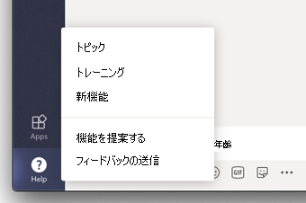
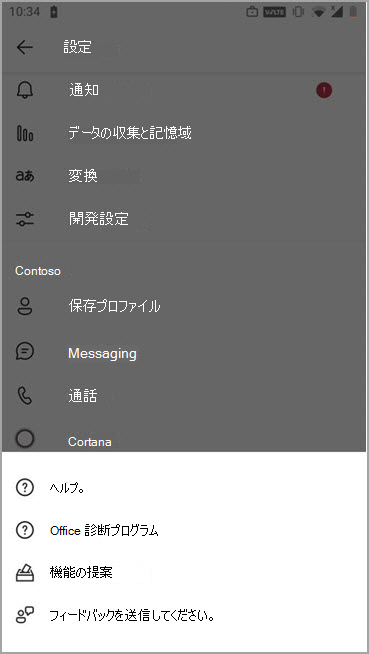

# <a name="manage-feedback-policies-in-microsoft-teams"></a>Microsoft Teams でフィードバック ポリシーを管理する

組織内のユーザーは、Microsoft Teams に関するフィードバックを送信して、Teams デスクトップ、Web クライアント、モバイル内から直接実行している方法を知らせることができます。 Microsoft は、Teams エクスペリエンスを継続的に向上しており、このフィードバックを使用して Teams を改善しています。

> [!NOTE]
> フィードバック ポリシーは、GCC、GCC High、DOD の展開では使用できません。

****フィードバックの提供** 機能**

ユーザーは、Teams デスクトップと Web での **フィードバックの提供** に関する **ヘルプ** > にアクセスして、Teams に関するコメントや提案を送信できます。




**設定** > ヘルプを使用してモバイルでフィードバック **にアクセス&フィードバック** > **を送信します**。



 **フィードバックの送信** と **フィードバックの送信** を通じて送信されたデータは、Microsoft 365 またはOffice 365契約に基づく "サポート データ" と見なされます。これには、それ以外の場合は "顧客データ" または "個人データ" と見なされる情報が含まれます。


**アンケート**

ユーザーはまた、Teams でのエクスペリエンスを評価し、評価に関する詳細を送信することもできます。 このポップアップ アンケートは、[Teams] に随時表示されます。 ユーザーが通知で **[フィードバックの提供** ] を選択すると、アンケートが表示されて完了します。


## <a name="set-whether-users-can-send-feedback-about-teams-to-microsoft"></a>ユーザーが Teams に関するフィードバックを Microsoft に送信できるかどうかを設定する

管理者は、組織内のユーザーが Teams に関するフィードバックを Microsoft に送信できるかどうか、およびアンケートを受け取るかどうかを制御できます。 既定では、組織内のすべてのユーザーにグローバル (組織全体の既定) ポリシーが自動的に割り当てられ、フィードバック機能とアンケートがポリシーで有効になります。 例外は、Teams for Education で、この機能は教師に対しては有効になっていますが、生徒に対しては無効になっています。

グローバル ポリシーを編集するか、カスタム ポリシーを作成して割り当てることもできます。 グローバル ポリシーを編集するか、カスタム ポリシーを割り当てた後、変更が反映されるまでに数時間かかる場合があります。

たとえば、組織内のすべてのユーザーが、トレーニングの新入社員を除くフィードバックを送信し、アンケートを受け取ることができるようにしたいとします。 このシナリオでは、両方の機能をオフにして新入社員に割り当てるカスタム ポリシーを作成します。 組織内の他のすべてのユーザーは、機能をオンにした状態でグローバル ポリシーを取得します。  

フィードバック ポリシーは、PowerShell を使用して管理します。 [**New-CsTeamsFeedbackPolicy** コマンドレット](/powershell/module/skype/new-csteamsfeedbackpolicy)を使用して、カスタム ポリシーを作成します。 **Grant-CsTeamsFeedbackPolicy** コマンドレットを使用して、セキュリティ グループや配布グループなどの 1 つ以上のユーザーまたはユーザー グループに割り当てます。 **Set-CsTeamsFeedbackPolicy** を使用して、特定のフラグを設定します。

機能をオフまたはオンにするには、次のパラメーターを設定します。

 - **フィードバックの送信**: **userInitiatedMode** パラメーターを **[有効]** に設定して、ポリシーが割り当てられているユーザーがフィードバックを送信できるようにします。 パラメーターを **[無効]** に設定すると、機能がオフになり、ポリシーが割り当てられているユーザーにはフィードバックを送信するオプションが表示されません。

 - **アンケート**: **receiveSurveysMode** パラメーターを **[有効]** に設定して、ポリシーが割り当てられているユーザーがアンケートを受信できるようにします。 ユーザーがアンケートを受信して受け取らないことができるようにするには、パラメーターを **enabledUserOverride** に設定します。 Teams では、**[設定]** > **[プライバシー]** の順に移動し、アンケートに参加するかどうかを選択できます。 パラメーターを **[無効]** に設定すると、機能がオフになり、ポリシーが割り当てられているユーザーはアンケートを受信できません。

 - **スクリーンショット**: **AllowScreenshotCollection** フラグを使用して、ユーザーのスクリーンショット コレクションオプトインを追加します。
 - **Email**: **AllowEmailCollection** フラグを使用して、電子メール フィールドを追加します。
 - **ログ 収集**: **AllowLogCollection** フラグを使用して、ユーザーのログ コレクションオプトインを追加します。 現在、ログ収集はモバイルでのみ有効になっています。 ログを使用して共有されるデータの詳細については、 [詳細を参照してください](https://go.microsoft.com/fwlink/?linkid=2168178)。
 - **機能を提案** する: **EnableFeatureSuggestions** パラメーターを True に設定して、ポリシーを割り当てられたユーザーが機能を提案できるようにします。 パラメーターを [無効] に設定すると、機能がオフになり、ポリシーが割り当てられているユーザーにはフィードバックを送信するオプションが表示されません。 既定の設定は、Microsoft 365 オプションの接続エクスペリエンス ポリシー設定から取得されます。 この設定の詳細については、「 [Office でのオプションの接続エクスペリエンスの概要](/deployoffice/privacy/optional-connected-experiences)」を参照してください。

## <a name="create-a-custom-feedback-policy"></a>カスタム フィードバック ポリシーを作成する

この例では、[新入社員向けフィードバック ポリシー] というフィードバック ポリシーを作成し、**[フィードバックの送信]** およびアンケートでフィードバックを送信する機能をオフにします。

```PowerShell
New-CsTeamsFeedbackPolicy -identity "New Hire Feedback Policy" -userInitiatedMode disabled -receiveSurveysMode disabled
```

## <a name="assign-a-custom-feedback-policy-to-users"></a>ユーザーにカスタムのフィードバック ポリシーを割り当てる

[!INCLUDE [assign-policy](includes/assign-policy.md)]

この例では、user1 という名前のユーザーに [新入社員向けフィードバック ポリシー] という名前のカスタム ポリシーを割り当てます。

```PowerShell
Grant-CsTeamsFeedbackPolicy -Identity user1@contoso.com -PolicyName "New Hire Feedback Policy"
```

## <a name="related-topics"></a>関連トピック

- [Teams PowerShell の概要](teams-powershell-overview.md)
- [ Teams でユーザーにポリシーを割り当てる](policy-assignment-overview.md)
