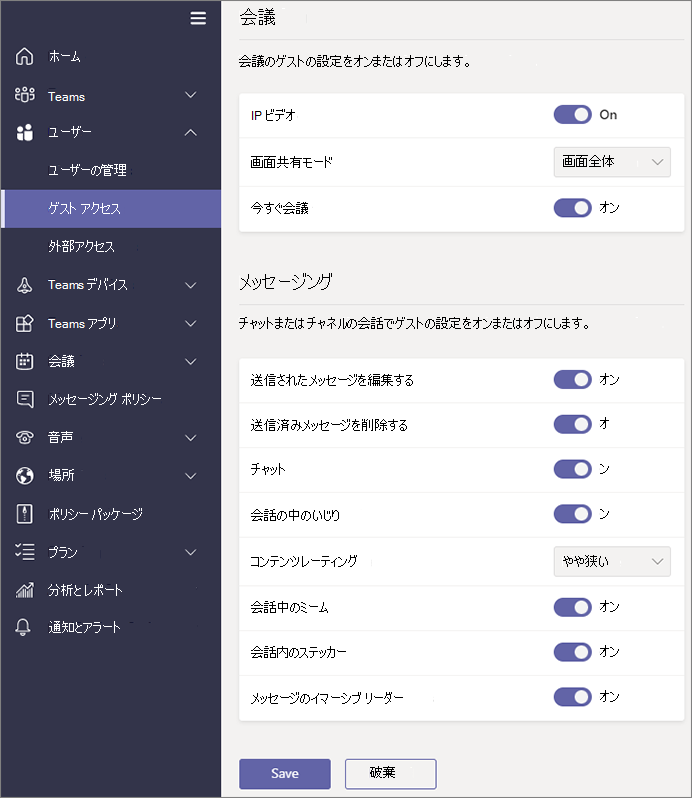

Microsoft Teams でのゲスト アクセスを管理するManage guest access in Microsoft Teams
======================================

**ゲスト**は Microsoft Teams のユーザー/ライセンスの種類の 1 つで、すべての Office 365 Business Premium、Office 365 Enterprise、および Office 365 Education サブスクリプションに含まれています。**Guest** is a user/license type in Microsoft Teams that is included with all Office 365 Business Premium, Office 365 Enterprise, and Office 365 Education subscriptions. 追加の Office 365 ライセンスは不要です。No additional Office 365 license is necessary. Teams のゲスト アクセスはテナントレベルの設定であり、既定ではオフになっています。Teams guest access is a tenant-level setting and is turned off by default. ゲスト アクセスを有効にする方法の詳細については、「[Microsoft Teams へのゲスト アクセスをオンまたはオフにする](set-up-guests.md)」をご覧ください。For details about how to enable guest access, see [Turn on or off guest access to Microsoft Teams](set-up-guests.md).

**ゲスト**のユーザー/ライセンスの種類をオンにした後、「[Office 365 を使用する組織で Microsoft Teams の機能を管理する](enable-features-office-365.md)」および「[新しい Microsoft Teams および Skype for Business の管理センターへの移行中に Teams を管理する](manage-teams-skypeforbusiness-admin-center.md)」に記載されている制御を介してゲストの設定を構成することができます。After the **Guest** user/license type is turned on, you can configure settings for guests via the controls described in [Manage Microsoft Teams features in your Office 365 organization](enable-features-office-365.md) and [Manage Teams during the transition to the new Microsoft Teams and Skype for Business Admin Center](manage-teams-skypeforbusiness-admin-center.md).     
    
IT 管理者は、テナント レベルでのゲストの追加、ゲスト ユーザー ポリシーと権限の設定と管理、およびゲスト ユーザーのアクティビティに関するレポートの取得を行うことができます。IT admins can add guests at the tenant level, set and manage guest user policies and permissions, determine which users can invite guests, and pull reports on guest user activity. これらの制御は、Microsoft Teams と Skype for Business の管理センターを介して利用することができます。These controls are available through the Microsoft Teams & Skype for Business Admin Center. ゲスト ユーザーのコンテンツとアクティビティには、Office 365 の他の部分と同じコンプライアンスと監査保護が適用されます。Guest user content and activities are under the same compliance and auditing protection as the rest of Office 365.

チーム所有者は、所有するチームに新しいゲストを招待したり、既存のディレクトリ ゲスト ユーザーを追加したりすることができます。Team owners will be able to invite new guests and add existing directory guest users to their respective teams. チーム所有者は、ゲスト ユーザーを [**Teams**] > [**Manage teams (チームの管理)**] で識別して、そのゲストに対するチャネル関連の機能の設定を [**Org-wide settings (組織全体の設定)**] > [**Guest access (ゲスト アクセス)**] で行うことができます。この設定には、次のスクリーンショットで示されるようにチャネルの作成、更新、削除を許可することも含まれます。Team owners can identify guest users via **Teams** > **Manage teams**, and set channel-related capabilities for guests via **Org-wide settings** > **Guest access**, including allowing guests to create, update, and delete channels, as shown in the following screenshot.

  
Azure Active Directory ポータルを使用して、ゲストの管理、および Office 365 や Teams のリソースへのゲスト アクセスの管理を行うことができます。In addition, you can use the Azure Active Directory portal to manage guests and their access to Office 365 and Teams resources. Teams のゲスト アクセスでは、Azure Active Directory ビジネス ツー ビジネス (B2B) コラボレーション機能を基本インフラストラクチャとして活用して、ID プロパティ、メンバーシップ、多要素認証設定といったセキュリティの原則情報を保管します。Teams guest access makes use of Azure Active Directory business-to-business (B2B) collaboration capabilities as the underlying infrastructure to store security principles information such as identity properties, memberships, and multi-factor authentication settings. Azure Active Directory B2B の詳細については、「[Azure AD B2B コラボレーションとは](https://go.microsoft.com/fwlink/p/?linkid=853011)」と「[Azure Active Directory B2B コラボレーションの FAQ](https://go.microsoft.com/fwlink/p/?linkid=853020)」をご覧ください。To learn more about Azure Active Directory B2B, see [What is Azure AD B2B collaboration?](https://go.microsoft.com/fwlink/p/?linkid=853011) and [Azure Active Directory B2B collaboration FAQs](https://go.microsoft.com/fwlink/p/?linkid=853020).

> [!NOTE]
> Microsoft Teams は、テナントへのゲスト ユーザーの追加の許可または拒否において、常に Azure Active Directory の外部設定を優先します。As a reminder, Teams always honors Azure Active Directory external settings to allow or prevent guest user addition to the tenant. 詳細については、「[Microsoft Teams でのゲスト アクセスを承認する](Teams-dependencies.md)」をご覧ください。For more information, see [Authorize guest access in Microsoft Teams](Teams-dependencies.md).
  
## ゲスト アクセスを定期的にレビューするReview guest access periodically

Teams では、ライセンスを持っている各ユーザーごとに 5 人のゲストを追加することができます。In Teams, you can add 5 guests for each licensed user. この制限のため、またはテナントを最新の状態に維持する必要があるため、ゲスト アクセスを定期的にレビューして、アクセスする必要がなくなったユーザーを識別する必要があります。Because of this limitation, or because you want to keep your tenant up to date, you should review guest access periodically to identify users who have access that they don't need anymore. Azure Active Directory (Azure AD) を使用してアプリケーションに割り当てられたグループ メンバーまたはユーザーに対するアクセス レビューを作成することができます。You can use Azure Active Directory (Azure AD) to create an access review for group members or users assigned to an application. 反復的なアクセス レビューを作成することで、時間を節約できます。Creating recurring access reviews can save you time. アプリケーションにアクセスできるユーザー、またはメンバーのグループであるユーザーを定期的にレビューする必要がある場合は、それらのレビューの頻度を定義することができます。If you need to routinely review users who have access to an application or are members of a group, you can define the frequency of those reviews. 

ゲスト アクセスのレビューを自分自身で実行したり、ゲストにメンバーシップのレビューを求めたり、アプリケーション所有者またはビジネス意思決定者に対してアクセス レビューを実行するよう求めたりすることができます。You can perform a guest access review yourself, ask guests to review their own membership, or ask an application owner or business decision maker to perform the access review. ゲスト アクセス レビューを実行するために、Azure ポータルを使用します。You use the Azure portal to perform guest access reviews. 詳細については、「[Azure AD アクセス レビューでゲスト アクセスを管理する](https://docs.microsoft.com/en-us/azure/active-directory/governance/manage-guest-access-with-access-reviews)」をご覧ください。For more information, see [Manage guest access with Azure AD access reviews](https://docs.microsoft.com/en-us/azure/active-directory/governance/manage-guest-access-with-access-reviews).

###  前提条件Prerequisites

アクセス レビューは、Microsoft Enterprise Mobility + Security E5 に含まれている Azure AD の Premium P2 エディションで利用することができます。Access reviews are available with the Premium P2 edition of Azure AD, which is included in Microsoft Enterprise Mobility + Security, E5. 詳細については、「[Azure Active Directory editions (Azure Active Directory のエディション)](https://docs.microsoft.com/en-us/azure/active-directory/fundamentals/active-directory-whatis)」の「Choose an edition (エディションの選択)」を参照してください。For more information, see "Choose an edition" in [Azure Active Directory editions](https://docs.microsoft.com/en-us/azure/active-directory/fundamentals/active-directory-whatis). レビューを作成したり、レビューを記入したり、アクセスを承認したりすることでこの機能とやり取りを行う各ユーザーには、ライセンスが必要です。Each user who interacts with this feature by creating a review, filling out a review, or confirming their access, must have a license. 

Teams では追加することができるゲストの数に制限はありません。Teams doesn't restrict the number of guests you can add. ただし、テナントに追加することができるゲストの合計数は、ご利用の AAD ライセンスによって許可されるものに基づきます。However, the total number of guests that can be added to your tenant is based on what your AAD licensing allows. 詳しくは、「[Azure Active Directory B2B コラボレーションのライセンスに関するガイダンス](https://docs.microsoft.com/en-us/azure/active-directory/b2b/licensing-guidance)」をご覧ください。For more information, see [About the Azure AD B2B collaboration preview](https://docs.microsoft.com/en-us/azure/active-directory/b2b/licensing-guidance).

## ゲスト アクセスの遅延Guest access latencies

ゲスト設定は Azure Active Directory で設定します。The guest settings are set in Azure Active Directory. その変更が Office 365 組織全体で有効になるまでに 2 時間から 24 時間かかります。It takes 2 hours to 24 hours for the changes to be effective across your Office 365 organization. ユーザーがチームにゲストを追加しようとするときに「Contact your administrator (管理者にお問い合わせください)」というメッセージが表示される場合、ゲスト機能が使用できる状態になっていないか、設定が有効になっていないかのいずれかの可能性があります。If a user sees the message "Contact your administrator" when they try to add a guest to their team, it's likely that either the guest feature hasn't been enabled or the settings haven’t become effective yet.

## 詳細情報More information

ゲスト アクセスを管理するために PowerShell を使用する方法の詳細については、「[PowerShell を使用してチームへのゲスト アクセスを制御する](guest-access-powershell.md)」をご覧ください。For information about using PowerShell to manage guest access, see [Use PowerShell to control guest access to a team](guest-access-powershell.md).

