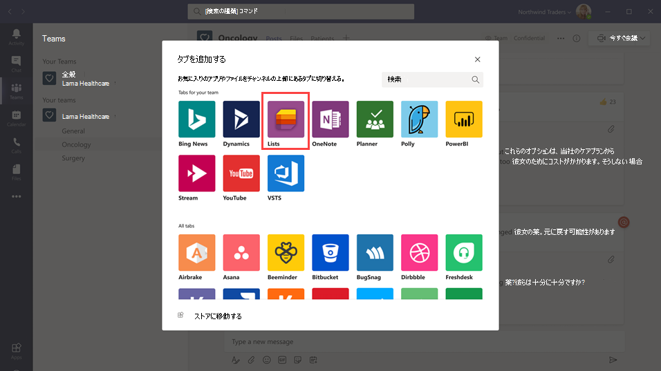
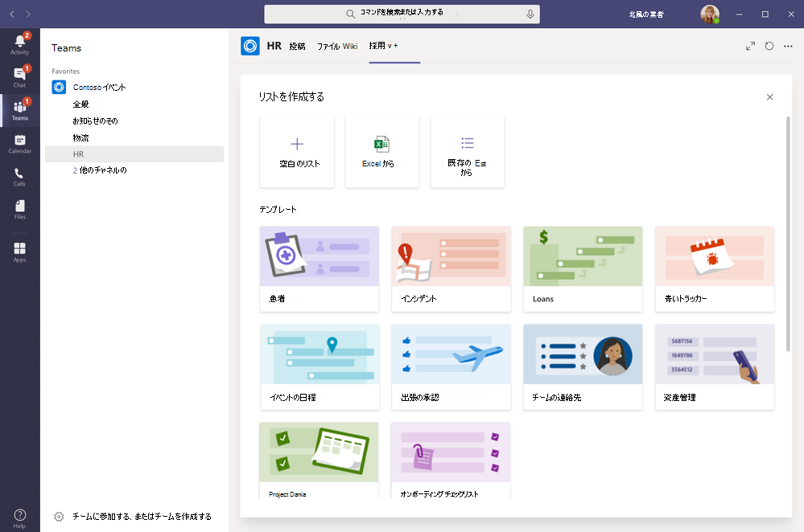

# Microsoft Teams で組織のシフト アプリを管理するManage the Lists app for your organization in Microsoft Teams

## リストの概要Overview of Lists

Microsoft Teams のリスト アプリは、組織内のユーザーが情報を追跡し、仕事を整理し、ワークフローを管理するのに役立ちます。The Lists app in Microsoft Teams helps users in your organization track information, organize work, and manage workflows. リストを使用すると、ユーザーはカスタマイズ可能なビュー、ルール、アラートを使用して、問題、資産、ルーチン、連絡先、インベントリ、インシデント、ローン、患者などのデータを追跡し、チーム内のすべてのユーザーが同期を保つことができるようになります。With Lists, users can track data such as issues, assets, routines, contacts, inventory, incidents, loans, patients, and more using customizable views, rules, and alerts to keep everyone on the team in sync.

Teams では、ユーザーはチャネル内のタブとしてリストにアクセスします。In Teams, users access Lists as a tab in a channel. **[+]** をクリックしてタブ ギャラリーを開き、開始するチャネルに新しいリスト アプリのタブ インスタンスを追加します。Click **+** to open the tab gallery and add a new Lists app tab instance to a channel to get started.

ユーザーは、新しいリストを作成したり、同じチーム内またはアクセス権のある別の SharePoint サイトから既存のリストをピン留めしたりすることができます。Users can create new lists or pin existing lists from within the same team or from a different SharePoint site that they have access to. 新しいリストは、既存のリストの構造をベースにして、または Excel ワークブックからデータをインポートして、組み込みのテンプレートを基に一から作成することができます。New lists can be created from scratch, from built-in templates, based on the structure of an existing list, or by importing data from an Excel workbook. リスト アプリは Teams のデスクトップ、Web、モバイル クライアントで利用できます。The Lists app is available in Teams desktop, web, and mobile clients.

## テンプレートTemplates

リストのテンプレートは、ユーザーにとって一般的な情報追跡シナリオに合わせてカスタマイズされています。Templates in Lists are tailored to common information tracking scenarios for users. 各テンプレートには、定義済みのリスト構造、フォームのレイアウト、リスト ビューと詳細ビューの両方のレベルでの書式設定オプションが付属しており、ユーザーがすぐに使用を始められるようになっています。Each template comes with a predefined list structure, form layouts, and formatting options at both a list view and a details view level to help users get started quickly. テンプレートを選択すると、ユーザーはいくつかのサンプル データとともにリストがどのように表示されるかをプレビューすることができます。After selecting a template, users get a preview of what the list will look like, along with some sample data. 以下に、組織内のチームがリストの定義済みのテンプレートを使用する方法についての例を示します。Here's some examples of how teams in your organization can use the predefined templates in Lists:

- 問題の追跡テンプレートを使用して問題を追跡し、解決に導きましょう。Track issues and bring them to closure using the Issue tracker template.
- イベントの日程表テンプレートを使用して、すべてのイベントの詳細情報を整理しましょう。Organize all your event details with the Event itinerary template.
- 患者テンプレートを使用して、医療関係組織の医療チームの患者のニーズや状態を記録し、ケアの監視や調整を行いましょう。Use the Patients template to record the needs and status of patients for health teams in your healthcare organization to monitor and coordinate care.
- ローン テンプレートを使用してローンの申請状況を追跡しましょう。Track the status of loan applications with the Loans template.

## シナリオ例Example scenario

地元の郵便局は、その地区の郵便物を仕分けして配達する役割を担っています。A local post office is responsible for sorting and delivering mail in their district. 毎朝、郵便局にはチーム メンバーが集まり、その日の目標を確認したり、情報を共有したり、既知のインシデントについて話し合ったりしています。Each morning, the post office has a team huddle to review daily goals, share announcements, and discuss known incidents.

打ち合わせ後、郵便配達員が郵便物を受け取り、配達ルートへの移動を開始します。After the huddle, mail carriers pick up their mail and start their delivery route. インシデントはルート上で発生する可能性があります。たとえば、車両事故、犬に関連する問題、社会問題に対する抗議運動などです。Incidents can occur along a route, for example, a vehicle accident, dog-related issue, or social unrest protest. 配達員がインシデントに遭遇した場合、モバイル デバイス上の Teams を使用してインシデントの詳細を記録します。そしてそのインシデントは、チーム チャネル内のリストで追跡されます。When mail carriers encounter an incident, they use Teams on their mobile devices to record the incident details, which are tracked in a list in the team channel. 現場の郵便配達員を含むチームの全員がこの情報を確認しながら、常に情報を得ることができます。Everyone on the team, including mail carriers in the field, can see this information and stay informed.

Teams に移行する前であれば、郵便配達員は郵便局に戻り、Excel のスプレッドシートに入力するための印刷用紙にインシデントに関する報告を記入しなければなりませんでした。Before moving to Teams, mail carriers had to go back to the post office to complete a hard-copy form to report an incident which was entered in an Excel spreadsheet. Teams は、リストを使用して現場で発生したインシデントを報告したり、インシデントの詳細をチーム メンバーと共有したり、チャネル上で会話したり、インシデントを解決したりすることができるモバイル ファーストな使用体験を郵便配達員に提供します。Teams gives mail carriers a mobile first, experience where they can use Lists to report incidents in the field as they happen, share incident details with team members, have conversations about them on the channel, and drive incidents to resolution.

## リストについて知っておくべきことWhat you need to know about Lists

### リストは、すべてのチームおよびチャネルで使用できます。Lists is available in every team and channel

リストはすべての Teams ユーザーにプリインストールされており、すべてのチームとチャネルのタブ ギャラリーから直接利用できます。Lists is pre-installed for all Teams users and is available directly in the tab gallery of every team and channel. これは、ユーザーが Teams アプリ ストアに行かなくてもインストールできることを意味しています。This means that users don't have to go to the Teams app store to install it.

### リストと SharePointLists and SharePoint

リストのデータは SharePoint Online のチーム サイトに保存されます。Lists data is stored in the SharePoint Online team site. SharePoint Online と Teams の相互作用については、「[Teams との SharePoint Online と OneDrive for Business の相互作用](SharePoint-OneDrive-interact.md)」を参照してください。To learn more about how SharePoint Online interacts with Teams, see [How SharePoint Online and OneDrive for Business interact with Teams](SharePoint-OneDrive-interact.md).

SharePoint で設定したアクセス許可は、リスト アプリで作成したリストに適用されます。Permissions set in SharePoint apply to lists created in the Lists app. 既定では、リストは、ユーザーが所属するサイトから権限を継承します。By default, lists inherit permissions from the site to which they belong. これらのアクセス許可は、ユーザーがリストの作成や編集をできるかどうかなど、ユーザーが実行可能なアクションの種類を管理します。These permissions govern the types of actions that users can do, such as whether they can create or edit lists. 詳細については、「[SharePoint でのアクセス許可レベル](/sharepoint/understanding-permission-levels)」と「[SharePoint Server でのユーザー アクセス許可とアクセス許可レベル](/sharepoint/sites/user-permissions-and-permission-levels)」を参照してください。To learn more, see [Permission levels in SharePoint](/sharepoint/understanding-permission-levels) and [User permissions and permission levels in SharePoint Server](/sharepoint/sites/user-permissions-and-permission-levels).

特定のシナリオでは、ユーザーがリストで実行可能なアクションを制限する必要がある場合があります。In certain scenarios, you may want restrict what actions users can do in lists. たとえば、あるチーム内のユーザーがすべてのチーム メンバーに変更が適用されるリスト ビューの編集を行う場合や、チームの所有者や特定のチーム メンバーにのみリスト ビューの編集を許可する必要がある場合などです。For example, a person on a team edits a list view, which changes it for all team members, and you want to allow only the team owner or certain team members to edit list views. 詳細については、「[SharePoint リストまたはライブラリのアクセス許可をカスタマイズする方法](https://support.microsoft.com/office/customize-permissions-for-a-sharepoint-list-or-library-02d770f3-59eb-4910-a608-5f84cc297782#ID0EAACAAA=Online,_2019,_2016,_2013)」を参照してください。To learn more, see [Customize permissions for a SharePoint list or library](https://support.microsoft.com/office/customize-permissions-for-a-sharepoint-list-or-library-02d770f3-59eb-4910-a608-5f84cc297782#ID0EAACAAA=Online,_2019,_2016,_2013).

> [!NOTE]
> 現時点では、チーム内の所有者やメンバーのアクセス許可は、リストやリスト アプリの動作を管理するチーム サイトのアクセス許可とは一切リンクしていません。At this point, owner and member permissions in a team aren't linked in any way to permissions in the team site that govern the behavior of lists or the Lists App. ただし、これについては、お客様からのフィードバックやご利用状況を元に今後のイテレーションで検討していきます。However, based on customer feedback and usage, this will be considered for a future iteration of the product.  

### 制限事項Limitations

リストを使用すると、ユーザーはデスクトップ、Web、モバイルでの利用環境を得ることができます。With Lists, users get a desktop, web, and mobile experience. 重要な点として、Teams モバイル クライアントではリストを使用した新しいリストの作成や、既存のリストのピン留めができないという点が挙げられます。It's important to know that users can't create new lists or pin existing lists using Lists on the Teams mobile client. Teams モバイル クライアントでリストを表示または編集するには、最初に Teams デスクトップ クライアントまたは Web クライアントでリストを使用して作成または追加を行う必要があります。To view or edit a list on the Teams mobile client, a list must first be created or added using Lists on the Teams desktop or web client.

ゲストがリストを作成したり、削除したりすることはできません。既存のリストにリスト アイテムを追加したり、リスト アイテムに関する新しい会話を開始したり、リスト アイテムに関する既存の会話に返信したりすることができます。Guests can't create or delete a list. They can add list items to existing lists, start new conversations about list items, and reply to existing conversations about list items.

### リストと SharePoint アプリLists and the SharePoint app

組織内のユーザーが SharePoint アプリを使用してリストを作成した場合、そのリストはユーザーが操作を行わなくても自動的にリストに移動されます。If users in your organization created lists using the SharePoint app, those lists will be automatically moved to Lists without any action needed from the user. Teams でリッチなリストの統合エクスペリエンスを得るには、リスト アプリを使用して既存のリストをピン留めします。To get the best and richest lists integration experience in Teams, use the Lists app and pin your existing lists.

## リストのセットアップSet up Lists

### 組織のリストを有効または無効にするEnable or disable Lists in your organization

リストは、組織内のすべての Teams ユーザーに対して既定で有効になっています。Lists is enabled by default for all Teams users in your organization. 組織レベルでアプリをオフまたはオンにするには、Microsoft Teams 管理センターの [[アプリの管理]](manage-apps.md) ページで行います。You can turn off or turn on the app at the org level on the [Manage apps](manage-apps.md) page in the Microsoft Teams admin center.

1. Microsoft Teams 管理センターの左側のナビゲーションで、**[Teams アプリ]** > **[アプリの管理]** の順に移動します。In the left navigation of the Microsoft Teams admin center, go to **Teams apps** > **Manage apps** .
2. 次のいずれかの操作を行います。Do one of the following:

    - 組織のリストをオフにするには、リスト アプリを検索して選択し、**[ブロック]** をクリックします。To turn off Lists for your organization, search for the Lists app, select it, and then click **Block**.
    - 組織のリストをオンにするには、リスト アプリを検索して選択し、**[許可]** をクリックします。To turn on Lists for your organization, search for the Lists app, select it, and then click **Allow**.

### 組織内の特定のユーザーのリストを有効または無効にするEnable or disable Lists for specific users in your organization

組織内の特定のユーザーによるリストの使用を許可またはブロックするには、[[アプリの管理]](manage-apps.md) ページで組織のリストがオンになっていることを確認してからカスタムのアプリのアクセス許可ポリシーを作成し、それらのユーザーに割り当てます。To allow or block specific users in your organization from using Lists, make sure Lists is turned on for your organization on the [Manage apps](manage-apps.md) page, and then create a custom app permission policy and assign it to those users. 詳細については、「[Teams のアプリのアクセス許可ポリシーを管理する](teams-app-permission-policies.md)」を参照してください。To learn more, see [Manage app permission policies in Teams](teams-app-permission-policies.md).

## Teams でリスト イベントの監査ログを検索するSearch the audit log for list events

リストは、企業レベルの監査で有効になっているので、セキュリティ/コンプライアンス センターの監査ログでリストやリスト アイテムのイベントを検索できます。Lists are enabled with enterprise-level auditing so you can search for lists and list item events in the audit log in the Security & Compliance Center. 詳細については、「[セキュリティ/コンプライアンス センターで監査ログを検索する](/microsoft-365/compliance/search-the-audit-log-in-security-and-compliance)」を参照してください。To learn more, see [Search the audit log in the Security & Compliance Center](/microsoft-365/compliance/search-the-audit-log-in-security-and-compliance).

Teams のリスト アプリに関連する監査イベントの一覧については、「[SharePoint リスト アクティビティ](/microsoft-365/compliance/search-the-audit-log-in-security-and-compliance#sharepoint-list-activities)」を参照してください。For a list of audit events that are relevant to the Lists app in Teams, see [SharePoint list activities](/microsoft-365/compliance/search-the-audit-log-in-security-and-compliance#sharepoint-list-activities).

監査ログを検索できるようになるには、最初に[セキュリティ/コンプライアンス センター](https://protection.office.com) で監査をオンにする必要があります。Before you can search the audit log, you have to first turn on auditing in the [Security & Compliance Center](https://protection.office.com). 利用できる監査データは、監査を有効にした時点以降のデータのみであることにご注意ください。Keep in mind that audit data is only available from the point at which you turned on auditing.

## Power Automate、Power Apps、Graph APIPower Automate, Power Apps, and Graph API

リストはワークフローについては [Power Automate](/power-automate/flow-types) を、リスト フォームについては [Power Apps](/powerapps/maker/canvas-apps/customize-list-form) をサポートしています。Lists supports [Power Automate](/power-automate/flow-types) for workflows and [Power Apps](/powerapps/maker/canvas-apps/customize-list-form) for list forms. 開発者は[リスト API](/sharepoint/dev/sp-add-ins/working-with-lists-and-list-items-with-rest) を使用して、Microsoft Graph を介してリストのデータにソースとして接続することができます。Developers can use the [Lists API](/sharepoint/dev/sp-add-ins/working-with-lists-and-list-items-with-rest) to connect list data as a source through Microsoft Graph.

## フィードバックの提供/問題の報告Give feedback or report an issue
  
フィードバックを送信したり、問題を報告したりするには、Teams の左側のナビゲーションの下部にある **[ヘルプ]** をクリックしてから、**[問題の報告]** を選択します。To send us feedback or report an issue, click **Help** near the bottom of the left navigation in Teams, and then select **Report a problem**. **[リスト]** を選択し、フィードバックや発生している問題についての詳細情報を入力します。Select **Lists**, and then enter your feedback or details about the issue you're experiencing.

## 関連項目Related topics

- [リストのヘルプ ドキュメントLists help documentation](https://support.microsoft.com/office/apps-and-services-cc1fba57-9900-4634-8306-2360a40c665b#PickTab=Lists)