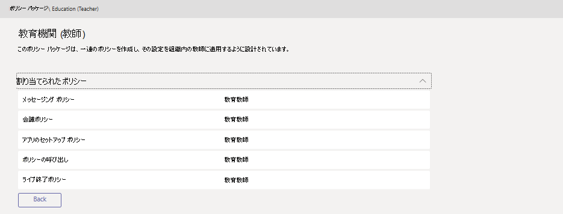

# Microsoft Teams でポリシー パッケージを管理するManage policy packages in Microsoft Teams

Microsoft Teams のポリシー パッケージは、組織内で類似の役割を持つユーザーに割り当てることができる定義済みのポリシーおよびポリシー設定のコレクションです。A policy package in Microsoft Teams is a collection of predefined policies and policy settings that you can assign to users who have similar roles in your organization. 組織全体のユーザー グループのポリシーを管理する際に、簡素化、合理化、一貫性を確保するために、ポリシー パッケージを構築しました。We built policy packages to simplify, streamline, and help provide consistency when managing policies for groups of users across your organization.  

Teams に含まれる[ポリシー パッケージを使用するか、独自](#policy-packages-included-in-teams)[のカスタム ポリシー パッケージを作成できます](#custom-policy-packages)。You can use the [policy packages included in Teams](#policy-packages-included-in-teams) or [create your own custom policy packages](#custom-policy-packages).

:::image type="content" source="media/policy-packages-admin-center.png" alt-text="管理センターの [ポリシー パッケージ] ページのスクリーンショット":::

ユーザーのニーズに合わせて、ポリシー パッケージ内のポリシーの設定をカスタマイズできます。You can customize the settings of the policies in a policy package to suit the needs of your users. パッケージ内のポリシーの設定を変更すると、そのパッケージに割り当てられているすべてのユーザーが更新された設定を取得します。When you change the settings of policies in a package, all users who are assigned to that package get the updated settings. ポリシー パッケージを管理するには、Microsoft Teams 管理センターまたは PowerShell を使用します。You manage policy packages by using the Microsoft Teams admin center or PowerShell.

## ポリシー パッケージとはWhat is a policy package?

ポリシー パッケージを使用すると、組織全体の特定のユーザー セットに対して許可または制限する Teams の機能を制御できます。Policy packages let you control Teams features that you want to allow or restrict for specific sets of people across your organization. Teams の各ポリシー パッケージは、ユーザー ロールを中心に設計され、その役割に一般的なコラボレーションおよびコミュニケーション アクティビティをサポートする定義済みのポリシーとポリシー設定が含まれています。Each policy package in Teams is designed around a user role and includes predefined policies and policy settings that support the collaboration and communication activities that are typical for that role.

ポリシー パッケージは、次の Teams ポリシーの種類をサポートします。Policy packages support the following Teams policy types:

- メッセージング ポリシーMessaging policy
- 会議ポリシーMeeting policy
- アプリセットアップ ポリシーApp setup policy
- 通話ポリシーCalling policy
- ライブ イベント ポリシーLive events policy

## Teams に含まれるポリシー パッケージPolicy packages included in Teams

Teams には現在、次のポリシー パッケージが含まれています。Teams currently includes the following policy packages.

| パッケージ名Package name | 説明Description |
|---------|---------|
|教育 (高等教育学生)Education (Higher education student)    |高等教育の学生に適用されるポリシーとポリシー設定のセットを作成します。Creates a set of policies and policy settings that apply to higher education students.|
|Education (小学校の学生)Education (Primary school student)   |プライマリ 学生に適用されるポリシーとポリシー設定のセットを作成します。Creates a set of policies and policy settings that apply to primary students.|
|Education (中等学生)Education (Secondary school student)    |第 2 学生に適用されるポリシーとポリシー設定のセットを作成します。Creates a set of policies and policy settings that apply to secondary students.         |
|Education (教師)Education (Teacher)    |教師に適用されるポリシーとポリシー設定のセットを作成します。Creates a set of policies and policy settings that apply to teachers.      |
|Education (リモート学習を使用する小学校教師)Education (Primary school teacher using remote learning)    |小学校教師に適用する一連のポリシーを作成して、学生が最大限に安心して共同でリモート学習に集中できる環境づくりを行います。Creates a set of policies that apply to primary teachers to maximize student safety and collaboration when using remote learning.      |
|Education (リモート学習を使用する主な学生)Education (Primary school student using remote learning)    |小学生に適用する一連のポリシーを作成して、学生が最大限に安心して共同でリモート学習に集中できる環境づくりを行います。Creates a set of policies that apply to primary students to maximize student safety and collaboration when using remote learning.      |
|Frontline ManagerFrontline manager |一連のポリシーを作成し、それらの設定を組織内の Frontline マネージャーに適用します。Creates a set of policies and applies those settings to Frontline managers in your organization. |
|最前線の従業員Frontline worker |一連のポリシーを作成し、それらの設定を組織内の Frontline ワーカーに適用します。Creates a set of policies and applies those settings to Frontline workers in your organization. |
|医療施設の職員Healthcare clinical worker  |一連のポリシーとポリシー設定を作成して、登録済看護師、担当看護師、医師、およびソーシャル ワーカーに対して、チャット、通話、シフト管理、会議へのフル アクセスを提供します。Creates a set of policies and policy settings that give clinical workers such as registered nurses, charge nurses, physicians, and social workers full access to chat, calling, shift management, and meetings. |
|医療情報提供者Healthcare information worker  |一連のポリシーとポリシー設定を作成して、IT 担当者、情報スタッフ、財務担当者、法令遵守責任者に対して、チャット、通話、会議へのフル アクセスを提供します。Creates a set of policies and policy settings that give information workers such as IT personnel, informatics staff, finance personnel, and compliance officers, full access to chat, calling, and meetings.|
|医療患者室Healthcare patient room  |貴社の医療組織の患者室に適用される一連のポリシーとポリシー設定を作成します。Creates a set of policies and policy settings that apply to patient rooms in your healthcare organization.|
|中小企業ユーザー (Business Voice)Small and medium business user (Business Voice) |ビジネス ボイス エクスペリエンス用のアプリを含むアプリ セットアップ ポリシーを作成します。Creates an app setup policy that includes the apps for a business voice experience.|
|中小規模ビジネス ユーザー (Business Voice を使用しない)Small and medium business user (without Business Voice) |中小規模のビジネス Teams ユーザーに関連するアプリセットアップ ポリシーを作成します (ビジネスボイス以外のエクスペリエンス)。Creates an app setup policy relevant for a small and medium sized business Teams users (non-Business Voice experience).
|公安責任者Public safety officer   |組織の公安責任者に適用される一連のポリシーとポリシー設定を作成します。Creates a set of policies and policy settings that apply to public safety officers in your organization.|

> [!NOTE]
> Teams の今後のリリースでポリシー パッケージを追加する予定なので、最新の情報を確認してください。We'll be adding more policy packages in future releases of Teams, so check back for the most up-to-date information.  

ポリシー パッケージにリンクされているポリシーを容易に識別できるように、個々のポリシーにはポリシー パッケージ名が付けられます。Each individual policy is given the name of the policy package so you can easily identify the policies that are linked to a policy package.
たとえば、教育 (教師) ポリシー パッケージを学校の教師に割り当てると、パッケージ内のポリシーごとに Education_Teacher という名前のポリシーが作成されます。For example, when you assign the Education (Teacher) policy package to teachers in your school, a policy that's named Education_Teacher is created for each policy in the package.

## カスタム ポリシー パッケージCustom policy packages

**カスタム ポリシー パッケージは、Government Community Cloud (GCC) ではまだ利用できません****Custom policy packages is not yet available for the Government Community Cloud (GCC)**

カスタム ポリシー パッケージを使用すると、組織内で同様の役割を持つユーザーに独自のポリシー セットをバンドルできます。Custom policy packages let you bundle your own set of policies for users with similar roles in you organization. 必要なポリシーの種類とポリシーを追加して、独自のポリシー パッケージを作成します。Create your own policy packages by adding the policy types and policies that you need.

新しいカスタム ポリシー パッケージを作成するには、To create a new custom policy package:

1. Microsoft Teams 管理センターの左側のナビゲーションで、[ポリシー **パッケージ]** を選択し、[追加] をクリック **します**。In the left navigation of the Microsoft Teams admin center,  select **Policy packages**, and then click **Add**.

    :::image type="content" source="media/policy-packages-add.png" alt-text="管理センターの [ポリシー パッケージ] ページの [追加] ボタンのスクリーンショット":::

2. パッケージの名前と説明を入力します。Enter a name and description for your package.

    :::image type="content" source="media/policy-packages-add-custom.png" alt-text="新しいカスタム ポリシー パッケージの追加のスクリーンショット":::

3. パッケージに含めるポリシーの種類とポリシー名を選択します。Select the policy types and policy names to include in the package.

4. **[保存]** をクリックします。Click **Save**.

## ポリシー パッケージの使い方How to use policy packages

組織でポリシー パッケージを使用する方法の概要を次に示します。The following outlines how to use policy packages in your organization.

- **[表示](#view-the-settings-of-a-policy-in-a-policy-package)**: ポリシー パッケージ内のポリシーを表示します。**[View](#view-the-settings-of-a-policy-in-a-policy-package)**: View the policies in a policy package. 次に、パッケージを割り当てる前に、パッケージ内の各ポリシーの設定を表示します。Then, view the settings of each policy in a package before you assign the package. 各設定を理解している必要があります。Make sure that you understand each setting. 定義済みの値が組織に適しているのか、または組織のニーズに基づいて制限を厳しくするか、適切に変更する必要があるのかを決定します。Decide whether the predefined values are appropriate for your organization or whether you need to change them to be more restrictive or lenient based on your organization's needs.

    ポリシーが削除された場合でも、設定は表示できますが、設定は変更されません。If a policy is deleted, you can still view the settings but you won't be able to change any settings. ポリシー パッケージを割り当てると、定義済みの設定で削除されたポリシーが再び作成されます。A deleted policy is re-created with the predefined settings when you assign the policy package.

- **[カスタマイズ](#customize-policies-in-a-policy-package)**: 組織のニーズに合わせてポリシー パッケージ内のポリシーの設定をカスタマイズします。**[Customize](#customize-policies-in-a-policy-package)**: Customize the settings of policies in the policy package to fit the needs of your organization.

- **[割り](#assign-a-policy-package)** 当て: ポリシー パッケージをユーザーに割り当てる。**[Assign](#assign-a-policy-package)**: Assign the policy package to users.  

> [!NOTE]
> また、パッケージを割り当て後にポリシー パッケージ内のポリシーの設定を変更することもできます。You can also change the settings of policies in a policy package after you assign a package. ポリシー設定の変更は、パッケージが割り当てられているユーザーに自動的に適用されます。Any changes you make to policy settings are automatically applied to users who are assigned the package.

Microsoft Teams 管理センターでポリシー パッケージを表示、割り当て、カスタマイズする手順は次のとおりです。Here are the steps for how to view, assign, and customize policy packages in the Microsoft Teams admin center.

### ポリシー パッケージ内のポリシーの設定を表示するView the settings of a policy in a policy package

1. Microsoft Teams 管理センターの左側のナビゲーションで、[ポリシー パッケージ] を選択し、パッケージ名の左側をクリックしてポリシー パッケージを選択します。In the left navigation of the Microsoft Teams admin center, select **Policy packages**, and then select a policy package by clicking to the left of the package name.

2. 表示するポリシーをクリックします。Click the policy you want to view.

### ポリシー パッケージ内のポリシーをカスタマイズするCustomize policies in a policy package

ポリシーの設定は、[ポリシー パッケージ]ページから、または Microsoft Teams 管理センターのポリシー ページに直接移動して編集できます。You can edit the settings of a policy through the **Policy packages** page or by going directly to the policy page in the Microsoft Teams admin center.

1. Microsoft Teams 管理センターの左側のナビゲーションで、次のいずれかの操作を行います。In the left navigation of the Microsoft Teams admin center, do one of the following:
    - [ **ポリシー パッケージ]** をクリックし、パッケージ名の左側をクリックしてポリシー パッケージを選択します。Click **Policy packages**, and then select the policy package by clicking to the left of the package name.
    - ポリシーの種類をクリックします。Click the policy type.  たとえば、[メッセージング ポリシー **] をクリックします**。For example, click **Messaging policies**.

2. 編集するポリシーを選択します。Select the policy you want to edit. ポリシー パッケージにリンクされているポリシーは、ポリシー パッケージと同じ名前です。Policies that are linked to a policy package have the same name as the policy package.

3. 必要な変更を行い、[保存] をクリック **します**。Make the changes that you want, and then click **Save**.

### ポリシー パッケージを割り当てるAssign a policy package

ポリシー パッケージは、個々のユーザー、グループ、またはユーザーのバッチに割り当てできます。You can assign a policy package to an individual user, a group, or a batch of users. ポリシー パッケージを割り当てる方法の詳細については、「ユーザーとグループにポリシー パッケージを割り当 [てる」を参照してください](assign-policy-packages.md)。For more information on how to assign policy packages, see [Assign policy packages to users and groups](assign-policy-packages.md).

## 関連項目Related topics

- [ポリシー パッケージを割り当てるAssign policy packages](assign-policy-packages.md)
- [EDU 管理者向け Teams ポリシー パッケージTeams policy packages for EDU admins](policy-packages-edu.md)
- [ヘルスケア向けの Teams ポリシー パッケージTeams policy packages for healthcare](policy-packages-healthcare.md)
- [政府機関向け Teams ポリシー パッケージTeams policy packages for government](policy-packages-gov.md)
