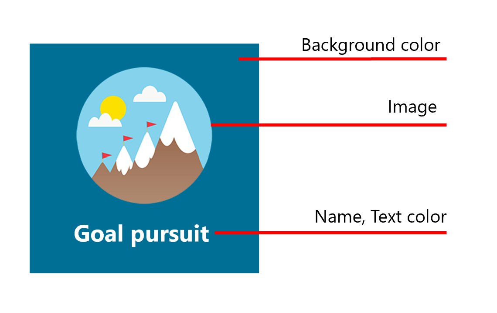

# Microsoft Teams 管理センターで評価アプリを管理する

> [!NOTE]
> この機能にアクセスするには、管理者に Teams ライセンスが必要です。 Teams ライセンスなしでこの機能にアクセスしようとすると、エラー メッセージが表示されます。

Microsoft Teams の評価アプリは、ユーザーが自分の組織または教室のメンバーに感謝の気持ちを示すのに役立ちます。 選ぶバッジ セットの選択と独自のバッジを作成するオプションを使用して、評価は、Teams ユーザーが行う作業の広い範囲 (教育者から Frontline Workers まで) を認識するのに役立つ設計です。 詳細については、「ユーザーに賞賛を [送信する」を参照してください](https://support.microsoft.com/office/send-praise-to-people-50f26b47-565f-40fe-8642-5ca2a5ed261e)。

管理者は、Microsoft Teams 管理センターから組織で使用できるバッジを制御できます。 左側のナビゲーションで、[アプリの管理] の **[Teams >に移動します**。 アプリの一覧で 、[賞賛] を **クリックし**、[設定] を **選択します**。  ここから、既定のバッジ セットと組み込みのバッジ セットを有効にし、カスタム バッジを作成することができます。

![賞賛アプリの [設定] タブのスクリーンショット](media/manage-praise-app-settings.png)

> [!NOTE]
> 賞賛アプリ機能は、米国政府のクラウドでは使用できません。

## 組み込みのバッジ セットを使用する

組み込みセットは、賞賛アプリ用に Microsoft によって設計されたバッジのコレクションです。 これらのセットは管理者が編集できません。 既定のバッジ セットは既に有効であり、評価アプリで使用できます。 既定のセットまたはバッジ セットの可用性を変更するには、対応するトグルを [オン] または [オフ] に切り替えます。 

<a name="default-badges"> </a>

### 既定のバッジ

既定のバッジ セットは、Teams ユーザーが自分の作業を超えて自分の同僚を認識するように設計されています。

<a name="sel-edu-badges"> </a>

### 教育用のソーシャルおよび感情的な学習バッジ

教育者は、これらの概念を示すバッジを使用して、社会的および感情的な学習 (SEL) の実績と行動について個々の学生を認識できます。

<a name="create-your-own-badges"> </a>

## 独自のバッジを作成する

[カスタム **バッジの作成] を選択します**。 ここから、サイド パネルでカスタム バッジを設計できます。 最大 25 のカスタム バッジを作成できます。 

![[カスタム バッジの作成] ウィンドウのスクリーンショット](media/manage-praise-app-create-custom-badge.png)

1. バッジ名を入力します。 これは、ユーザーが賞賛を送信するときにバッジに表示される名前です。

2. バッジの色を設定します。 バッジのテキストと背景色を設定するには、色を 16 進数 (16 進) の値として入力する必要があります。

   > [!TIP]
   > 16 進数の値を初めから使用する場合は、その使い方を簡単に説明します。

3. バッジ画像をアップロードします。 受け入れられるファイルの種類はです。PNG。 イメージ ファイルは、最大サイズが 216 X 216 ピクセルの 40 KB 未満である必要があります。

4. バッジ名をローカライズする: [ローカライズされたバッジ名] **で**、[追加] を **選択します**。 ドロップダウン リストから目的のロケールを選択します。 次に、指定された言語でバッジ名を入力します。

5. 特定の地域からバッジを除外する: **[これらの** 地域からバッジを除外する] で、[追加] を **選択します**。 ドロップダウン リストから除外する地域を選択します。

6. **[適用]** を選択します。 これで、新しいバッジがカスタム バッジ テーブルに表示されます。

> [!NOTE]
> 手順 4 と 5 をスキップした場合、バッジは、すべての地域の既定の言語になります。
>
> バッジの選択の変更が完了したら、[送信] を選択 **してください**。 組織でこれらの変更を利用するには、最大で数時間かかる場合があります。

<a name="hex-colors-intro"> </a>

## 16 進値を使用して色を指定する

16 進数の色の値は、00 から FF のスケールで特定の色の赤 (RR)、緑 (GG)、青 (BB) の強度を表す 6 桁の 16 進数の文字列です。 3 色すべての値をまとめる場合は、16 進数の値#RRGGBB

#FF0000 たとえば、赤は可能な限り高い値に設定され、FF と緑と青は可能な限り小さい値 00 に設定されるので、赤の 16 進値は 16 進値です。

さまざまな色とその 16 進値を調するには [、Bing カラー ピッカーを参照してください](https://www.bing.com/search?q=color+picker)。

次に、使用を開始する色の例を示します。

|色  |16 進値|
|-------|---------|
||  #FF6666   |
||  #7FFFD4   |
||  #FF75F0   |
||  #00BFFF   |
||  #800080   |
||  #000000   |

<a name="best-practices"> </a>

## カスタム バッジを作成するためのベスト プラクティス

**すべてのバッジを一度に送信します。** 新しいバッジの処理には時間がかかるため、送信する前に、すべてのカスタム バッジをテーブルに追加する必要があります。

**色を選ぶ場合は、アクセシビリティに気を付ける必要があります。** 一部の色は、他の色よりも一緒に行き来します。  バッジ名を読みやすくするために、テキストと背景色の間にコントラストを作成します。 たとえば、濃い背景色を選択した場合は、明るいテキストの色を選択します。

**画像を選択する場合は、バッジのサイズに気を付け続ける必要があります。** 最適な品質を得る場合は、216 x 216 ピクセル (最大サイズ) の画像ファイルをアップロードすることをお勧めします。 これらの寸法に合わせて画像を拡大または歪ませない。

**バッジ画像が長方形ではない場合は、画像を透明にします。** 画像ファイルを Praise にアップロードする前に、この操作を行う必要があります。

## バッジ セットアセット

組み込みのバッジ セットは変更できません。そのため、組み込みセットが有効になっている場合、セット内のすべてのバッジが Praise アプリに追加されます。 組み込みのセットから特定のバッジを追加し、他のバッジを削除する場合は、カスタム バッジとして使用するバッジを再作成します。 バッジ 画像をダウンロードし、次の表の組み込みセットからバッジのテキストと背景色を見つけることができます。

### 既定のバッジアセット

 

|バッジ名     |イメージ ファイル  |テキストの色 | 背景色 |
|---------------|------------|---------- |--------|
|ア実現者       |[Achiever PNG](https://github.com/MicrosoftDocs/OfficeDocs-SkypeForBusiness/raw/live/Teams/downloads/praise-app/default-set/achiever-badge.png)|#D36E70    |#E3F4FC|
|すごい        |[すばらしい PNG](https://github.com/MicrosoftDocs/OfficeDocs-SkypeForBusiness/raw/live/Teams/downloads/praise-app/default-set/awesome-badge.png)</a>|#8283B2    |#D1EFF2|
|Coach          |[PNG コーチ](https://github.com/MicrosoftDocs/OfficeDocs-SkypeForBusiness/raw/live/Teams/downloads/praise-app/default-set/coach-badge.png)</a>|#6AA55A    |#DBF1D6|
|勇気        |[勇気の PNG](https://github.com/MicrosoftDocs/OfficeDocs-SkypeForBusiness/raw/live/Teams/downloads/praise-app/default-set/courage-badge.png)</a>|#DC5041    |#FCF6C8|
|クリエイティブ       |[クリエイティブ PNG](https://github.com/MicrosoftDocs/OfficeDocs-SkypeForBusiness/raw/live/Teams/downloads/praise-app/default-set/creative-badge.png) |#CF9D50    |#FCF6C8|
|包括的な情報      |[包括的な PNG](https://github.com/MicrosoftDocs/OfficeDocs-SkypeForBusiness/raw/live/Teams/downloads/praise-app/default-set/inclusive-badge.png)</a>|#3C77BB    |#E2F4FC|
|Kind Heart     |[Kind Heart PNG](https://github.com/MicrosoftDocs/OfficeDocs-SkypeForBusiness/raw/live/Teams/downloads/praise-app/default-set/kind-heart-badge.png)</a>|#D36D6E    |#F4DEDE|
|リーダーシップ     |[リーダーシップ PNG](https://github.com/MicrosoftDocs/OfficeDocs-SkypeForBusiness/raw/live/Teams/downloads/praise-app/default-set/leadership-badge.png)|#419098    |#D2EAEC|
|オプティミム       |[オプティミム PNG](https://github.com/MicrosoftDocs/OfficeDocs-SkypeForBusiness/raw/live/Teams/downloads/praise-app/default-set/optimism-badge.png)</a>|#D8338C    |#F4DDDE|
|問題ソルバー |[問題解決の PNG](https://github.com/MicrosoftDocs/OfficeDocs-SkypeForBusiness/raw/live/Teams/downloads/praise-app/default-set/problem-solver-badge.png)|#B8916E    |#CBDADF|
|チーム プレイヤー    |[チーム プレイヤーの PNG](https://github.com/MicrosoftDocs/OfficeDocs-SkypeForBusiness/raw/live/Teams/downloads/praise-app/default-set/team-player-badge.png)|#8B8DC0    |#F4EEC0|
|ありがとう      |[PNG ありがとうございます](https://github.com/MicrosoftDocs/OfficeDocs-SkypeForBusiness/raw/live/Teams/downloads/praise-app/default-set/thank-you-badge.png)|#469CA4    |#BACCB6|

 

### 教育資産のソーシャルおよび感情的な学習バッジ

 

|バッジ名        |イメージ ファイル  |テキストの色 | 背景色 |
|------------------|------------|---------- |--------|
|コミュニケーション     |[通信 PNG](https://github.com/MicrosoftDocs/OfficeDocs-SkypeForBusiness/raw/live/Teams/downloads/praise-app/sel-edu-set/communication-badge.png)|#FFFFFF    |#173B65|
|批判的思考 |[クリティカル思考の PNG](https://github.com/MicrosoftDocs/OfficeDocs-SkypeForBusiness/raw/live/Teams/downloads/praise-app/sel-edu-set/critical-thinking-badge.png)|#FFFFFF    |#084D26|
|好奇心         |[キュリオシティ PNG](https://github.com/MicrosoftDocs/OfficeDocs-SkypeForBusiness/raw/live/Teams/downloads/praise-app/sel-edu-set/curiosity-badge.png)|#FFFFFF    |#008078|
|共感           |[共感 PNG](https://github.com/MicrosoftDocs/OfficeDocs-SkypeForBusiness/raw/live/Teams/downloads/praise-app/sel-edu-set/empathy-badge.png)|#FFFFFF    |#650B35|
|目標の追求      |[目標の追求 PNG](https://github.com/MicrosoftDocs/OfficeDocs-SkypeForBusiness/raw/live/Teams/downloads/praise-app/sel-edu-set/goal-pursuit-badge.png)|#FFFFFF    |#006F95|
|動機付け        |[やる気 PNG](https://github.com/MicrosoftDocs/OfficeDocs-SkypeForBusiness/raw/live/Teams/downloads/praise-app/sel-edu-set/motivation-badge.png)|#FFFFFF    |#C52127|
|永続化       |[永続化 PNG](https://github.com/MicrosoftDocs/OfficeDocs-SkypeForBusiness/raw/live/Teams/downloads/praise-app/sel-edu-set/persistence-badge.png)|#FFFFFF    |#167D3E|
|敬意を払う           |[PNG を尊重する](https://github.com/MicrosoftDocs/OfficeDocs-SkypeForBusiness/raw/live/Teams/downloads/praise-app/sel-edu-set/respect-badge.png)|#FFFFFF    |#8251A0|
|責任    |[責任 PNG](https://github.com/MicrosoftDocs/OfficeDocs-SkypeForBusiness/raw/live/Teams/downloads/praise-app/sel-edu-set/responsibility-badge.png)|#FFFFFF    |#B05DA3|
|自己認識    |[自己認識 PNG](https://github.com/MicrosoftDocs/OfficeDocs-SkypeForBusiness/raw/live/Teams/downloads/praise-app/sel-edu-set/self-awareness-badge.png)|#FFFFFF    |#1680E5|
|自己管理   |[自己管理の PNG](https://github.com/MicrosoftDocs/OfficeDocs-SkypeForBusiness/raw/live/Teams/downloads/praise-app/sel-edu-set/self-management-badge.png)|#FFFFFF    |#4C144D|
|思慮深さ    |[思慮深い PNG](https://github.com/MicrosoftDocs/OfficeDocs-SkypeForBusiness/raw/live/Teams/downloads/praise-app/sel-edu-set/thoughtfulness-badge.png)|#FFFFFF    |#EE4086|
