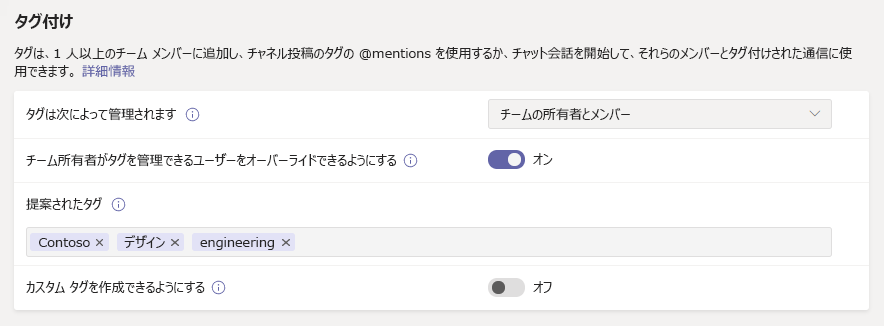
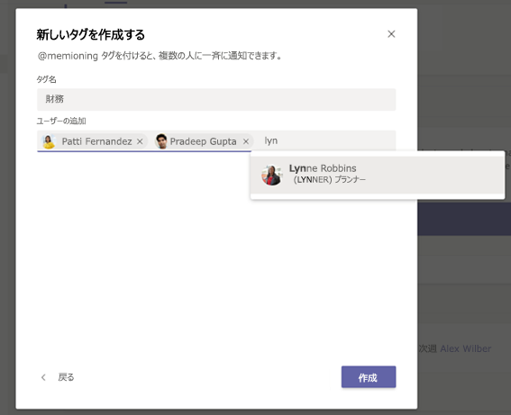

# Microsoft Teams でタグを管理する

> [!NOTE]
> この記事で説明されている機能の1つは、 **shift キーでタグ付け**されていますが、まだリリースされていません。 これは発表され、近日公開予定です。管理者は、メッセージ センター ([Microsoft 365 管理センター](https://portal.office.com/adminportal/home)) でこの機能のリリース日を確認できます。 Teams 機能の最新情報を入手するには、「[Microsoft 365 ロードマップ](https://www.microsoft.com/microsoft-365/roadmap?filters=&searchterms=microsoft%2Cteams)」を参照してください。

## 概要

Microsoft Teams のタグを使用すると、チーム内のユーザーのサブセットと簡単に連絡を取ることができます。 ロール、プロジェクト、スキル、場所などの属性に基づいてユーザーを分類するために、カスタムタグを作成して割り当てることができます。 または、[ [シフト] アプリ](https://support.microsoft.com/office/apps-and-services-cc1fba57-9900-4634-8306-2360a40c665b?#PickTab=Shifts) のスケジュールとシフト情報に基づいて、タグをユーザーに自動的に割り当てることができます (近日公開)。 1つまたは複数のチームメンバーにタグを追加した後は、チャネル投稿でそのタグを @mentions で使用したり、そのタグが割り当てられているユーザーのみと会話を開始したりすることができます。

前に説明したように、Teams には2種類のタグがあります。

- **カスタムタグ**: チーム所有者とチームメンバー (機能が有効になっている場合) は、手動でタグを作成してユーザーに割り当てることができます。 たとえば、"Designer" や "Radiologist" タグでは、チームメンバーの名前を入力せずに、それらのユーザーのセットにアクセスすることができます。
- **Shift キーによるタグ付け** (近日公開): この機能を使用すると、Teams の shift [アプリ](https://support.microsoft.com/office/get-started-in-shifts-5f3e30d8-1821-4904-be26-c3cd25a497d6#bkmk_openshiftsappdesktop) でのスケジュールとシフトグループ名に一致するタグが自動的に割り当てられます。 たとえば、"EngineerOnCall" タグは、そのタグがチャットまたはチャネルの投稿で使用されるときに、シフトのスケジュールが設定されているすべてのエンジニアに到達します。 シフトによるタグ付けを使用すると、チームは、ユーザーがすばやく情報をやり取りする必要があるときに、シフトしたスタッフの名前がわからない場合があります。 シフトでのタグ付けは、JDA、Kronos、AMiON などの主要な労働力管理システムでもサポートされます。これは、チームのシフトとの統合によって実現されます。 この機能の設定方法の詳細については、「 [shift でタグを設定](#set-up-tagging-by-shift-coming-soon)する」を参照してください。

> [!NOTE]
> プライベートチャネルでは、タグはまだサポートされていません。 US Government Community Cloud (GCC)、GCC High、または国防総省 (DoD) の組織では、タグはまだ利用できません。

## タグのしくみ

タグは、特定のチームのメンバーに手動で追加したり、自動的に割り当てることができます。 これは、チャットの [ **宛先** ] 行の @mentions、またはチームの任意の標準チャネルの投稿に使用できます。 次に、Teams でタグを使用する方法の例をいくつか示します。

- ストアマネージャーは、すべてのレジに通知するためにお知らせをチャネルに投稿します。
- 病院管理者が、チャネル内のすべての radiologists にメッセージを送信します。
- マーケティングマネージャーが、すべてのデザイナーとグループチャットを開始します。
- 看護師がすべての cardiologists にメッセージを送信します。 (近日公開)
- システムエンジニアは、チャネルにお知らせを投稿して、すべてのシフト型フィールドエンジニアに通知します。 (近日公開)

チャネルの会話でタグを @mentioned すると、他の @mention と同じように、タグに関連付けられているチームメンバーに通知が送信されます。

## 組織のカスタムタグを管理する

管理者は、Microsoft Teams 管理センターで、組織全体でタグを使用する方法を制御できます。

チームは、最大100のタグを持つことができ、最大で100のチームメンバーを1つのタグに割り当てることができ、最大25個のタグを1人のユーザーに割り当てることができます。 

### カスタムタグを追加できるユーザーを設定する

既定では、チーム所有者はカスタムタグを追加できます。 この設定を変更して、チームの所有者とチームメンバーがタグの作成、編集、削除、管理を行うことができます。また、組織のタグをオフにすることもできます。

1. Microsoft Teams 管理センターの左のナビゲーションで、[**組織全体の設定**] チームの設定をクリックし  >  **Teams settings**ます。
2. [タグ **付け**] で、[ **タグの管理**先] の横にある次のいずれかのオプションを選択します。

    - **チームの所有者とメンバー**: チーム所有者とメンバーがタグを管理できるようにします。
    - **チームの所有者**: チーム所有者がタグを管理できるようにします。
    - **Disabled**: ノートシールをオフにします。

### カスタムタグの設定を構成する

次のタグ設定を構成して、組織全体でのカスタムタグの使用方法を制御できます。

1. Microsoft Teams 管理センターの左のナビゲーションで、[**組織全体の設定**] チームの設定をクリックし  >  **Teams settings**ます。
2. [ **タグ付け**] で、組織のニーズに応じて次のように設定します。

    - **チーム所有者がタグを管理できるユーザーを上書き**できるようにする: この設定を有効にした場合、チームの所有者はチーム内でタグを作成および管理することができるかどうかを設定できます。また、設定 **によって** タグの値が管理されるかどうかは、各チームの既定値になります。 この設定をオフにすると、設定 **によってタグが管理さ** れますが、チームごとに変更することはできません。
    - **提案**された既定のタグ: これを使用して、一連の既定のタグを追加します。 最大25個のタグを追加できます。各タグには最大25文字まで含めることができます。 チーム所有者とメンバー (機能が有効になっている場合) は、これらの候補を使用したり、それらを追加したり、新しいタグセットを作成したりすることができます。
    - [**カスタムタグの作成**]: この設定を有効にして、ユーザーが設定した既定のタグ以外のタグを追加できるようにします。 この設定を無効にした場合、ユーザーは提案された既定のタグのみを使用できます。 この設定を無効にした場合は、1つ以上の既定のタグを追加してください。

## チームのカスタムタグ設定を管理する

[チーム所有者が Microsoft Teams 管理センター] の [ **タグを管理できるユーザーを上書き** できるようにする] をオンにしている場合、チーム所有者は、メンバーがチームレベルでタグを追加できるかどうかを設定できます。 これを行うには、チームの [ **設定** ] タブで [ **タグ**] に移動し、[タグを追加できるユーザー] を選択します。

![チームレベルの [タグ] 設定のスクリーンショット](media/manage-tags-team-settings.png)

## タグを使用する

ここでは、カスタムタグを追加する方法と、shift キーでタグを設定する方法について説明します (Teams でシフトアプリを使用している場合)。 詳細については、「 [Teams でタグを使用する」](https://support.office.com/article/using-tags-in-teams-667bd56f-32b8-4118-9a0b-56807c96d91e)をご覧ください。

### カスタムタグを作成して割り当てる

カスタムタグを作成して割り当てるには、アプリの左側にある [ **チーム** ] を選択し、リストからチームを見つけます。 [ **̇̇̇その他のオプション**] を選択し、[ **タグの管理**] を選択します。 ここでは、タグを作成して、チームのメンバーに割り当てることができます。

タグを削除するには、タグの横にある [ **̇̇̇ More] オプション** を選択し、[ **ノートシールの削除**] を選択します。

### シフトでタグを設定する (近日公開)

1. Teams で、[シフト] [アプリ](https://support.microsoft.com/office/get-started-in-shifts-5f3e30d8-1821-4904-be26-c3cd25a497d6#bkmk_openshiftsappdesktop)に移動します。
2. [シフトグループ](https://support.microsoft.com/office/fill-out-a-schedule-in-shifts-2d58df9b-1c6c-4c84-b0c3-835de7ad13ea#bkmk_organizeshiftsbygroup)を作成し、役割などの属性の後に名前を付けます。 たとえば、EngineerOnCall のようになります。 シフトグループ名は、タグの名前になります。
3. チームのメンバーにシフトを割り当てることで[、スケジュールを入力](https://support.microsoft.com/office/fill-out-a-schedule-in-shifts-2d58df9b-1c6c-4c84-b0c3-835de7ad13ea)します。 完了したら、[シフト] アプリの右上隅で [ **チームと共有**] を選択します。
4. スケジュールされたシフトがタグ付けサービスに取り込まれるまで15分待ちます。
5. Teams でタグを使用する任意の場所でタグを使用します。

シフトでタグを付けて、ユーザーがリアルタイムで連絡先にアクセスできるようにします。 通知は、ノートを使っているユーザーにのみ送信され、チャットまたはチャネルの投稿の開始に使用されます。

## 関連トピック

[Teams でタグを使用する](https://support.office.com/article/using-tags-in-teams-667bd56f-32b8-4118-9a0b-56807c96d91e)

[Teams で組織の Shifts アプリを管理する](expand-teams-across-your-org/shifts/manage-the-shifts-app-for-your-organization-in-teams.md)

[ヘルプドキュメントのシフト](https://support.microsoft.com/office/apps-and-services-cc1fba57-9900-4634-8306-2360a40c665b)
