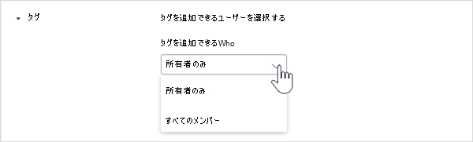

# Microsoft Teams でタグを管理する

## 概要

Microsoft Teams のタグを使用すると、チーム内の一部のユーザーとすばやく簡単につながることができます。 役割、プロジェクト、スキル、場所などの属性に基づいてユーザーを分類するカスタム タグを作成して割り当てることができます。 または、[シフト アプリ](https://support.microsoft.com/office/apps-and-services-cc1fba57-9900-4634-8306-2360a40c665b?#PickTab=Shifts)のスケジュールとシフト情報に基づいて、ユーザーにタグを自動的に割り当てることができます。 タグが 1 人または複数のチーム メンバーに追加されると、チャネル投稿でチームの誰もがそれを @メンションで使うことができ、そのタグが割り当てられているユーザーのみと会話を開始することもできます。

前述のとおり、Teams には 2 種類のタグがあります。

- **カスタム タグ**: チームの所有者とチーム メンバー (機能が有効になっている場合) は、手動でタグを作成し、ユーザーに割り当てることができます。 たとえば、"デザイナー" や "放射線科医" タグは、ユーザーの名前を入力しなくても、チーム内のこれらのユーザーのセットに到達します。
- **シフトでのタグ付け**: この機能を使用すると、Teams の[シフトアプリ](https://support.microsoft.com/office/get-started-in-shifts-5f3e30d8-1821-4904-be26-c3cd25a497d6#bkmk_openshiftsappdesktop)内のスケジュールとシフト グループの名前に一致するタグが自動的にユーザーに割り当てられます。 たとえば、"EngineerOnCall" (待機中のエンジニア) タグは、チャットまたはチャネル投稿でタグが使用されたときに作業をするようにシフトでスケジュールされているすべてのエンジニアに到達します。 シフトでのタグ付けを使用すると、ユーザーが情報をすばやく伝える必要がある場合に、シフト中のスタッフの名前を推測することなく知ることができます。 シフトでのタグ付けは、JDA、Kronos、AMiON などの主要な従業員管理システムでも、Teams のシフトと統合することによりサポートされます。 この機能を設定する方法の詳細については、「[シフトでのタグ付けを設定する](#set-up-tagging-by-shift)」を参照してください。

> [!NOTE]
> タグは、プライベート チャネルではまだサポートされていません。 タグは、GCC High または国防総省 (DoD) 組織では使用できません。 

## タグの動作

タグは、特定のチームのユーザーに手動で追加することも、自動的に割り当てることもできます。 その後、チャットまたはチームの標準チャネルの投稿の **宛先** 行の @メンションで使用できます。 Teams でタグを使用する方法の例を次に示します。

- ストア マネージャーがチャネルにお知らせを投稿して、すべてのレジ係に通知する。
- 病院の管理者が、チャネル内のすべての放射線科医にメッセージを送信する。
- マーケティング マネージャーが、すべてのデザイナーとグループ チャットを開始する。
- 看護師が、すべての待機中の心臓専門医にメッセージを送信する。 (近日公開)
- システム エンジニアがチャネルにアナウンスを投稿して、すべてのシフト中のフィールド エンジニアに通知する。 (近日公開)

チャネルの会話でタグが @メンションされると、他の @メンションと同様に、タグに関連付けられているチーム メンバーに通知が送信されます。

## 組織のカスタム タグを管理する

管理者は、Microsoft Teams 管理センターで、タグを組織全体で使用する方法を制御できます。 現時点では、PowerShell を使用してタグを管理することはできません。

各チームは最大 100 個のタグを持つことができ、1 つのタグに対して最大 100 人のチーム メンバーを、1 人のユーザーに対して最大 25 個のタグを割り当てることができます。 

### カスタム タグを追加できるユーザーを設定する

既定では、チームの所有者がカスタム タグを追加できます。 この設定を変更して、チームの所有者とチーム メンバーがタグを作成、編集、削除、管理できるようにするか、組織のタグをオフにすることができます。

1. Microsoft Teams 管理センターの左側のナビゲーションで、**[組織全体の設定]** > **[Teams の設定]** をクリックします。
2. **[タグ付け]** で、**[タグの管理者]** の横で、次のいずれかのオプションを選択します。

    - **[チームの所有者とメンバー]**: チームの所有者とメンバーにタグの管理を許可します。
    - **[チームの所有者]**: チームの所有者にタグの管理を許可します。
    - **[無効]**: タグをオフにします。

### カスタム タグの設定を構成する

次のタグ設定を構成して、組織全体でのカスタム タグの使用方法を制御できます。

1. Microsoft Teams 管理センターの左側のナビゲーションで、**[組織全体の設定]** > **[Teams の設定]** をクリックします。
2. **[タグ付け]** で、組織のニーズに応じて次の設定を行います。

    - **[チーム所有者に、タグの管理が可能なユーザーを上書きしてもらいます]**: この設定をオンにすると、チーム の所有者はチーム メンバーがチーム内でタグを作成および管理できるかどうかを設定できます。また、**[タグの管理者]** 設定の値を各チームの既定値に設定することができます。 この設定をオフにした場合、**[タグの管理者]** 設定をチームごとに変更することはできません。
    - **[おすすめの既定のタグ]**: 既定のタグのセットを追加するには、これを使用します。 最大 25 個のタグを追加でき、各タグには最大 25 文字を含めることができます。 チームの所有者とメンバー (機能が有効になっている場合) は、これらの推奨タグを使用したり、追加、または新しいタグのセットを作成したりできます。
    - **[カスタム タグの作成を許可する]**: この設定をオンにすると、ユーザーが設定したおすすめの既定のタグ以外のタグを追加できるようになります。 これがオフになっている場合、ユーザーはおすすめの既定のタグのみを使用できます。 これをオフにする場合は、必ず 1 つ以上の既定のタグを追加してください。

## チームのカスタム タグの設定を管理する

Microsoft Teams 管理センターで **[チーム所有者に、タグの管理が可能なユーザーを上書きしてもらいます]** 設定をオンにした場合、チームの所有者は、メンバーがチーム レベルでタグを追加できるかどうかを設定できます。 これを行うには、チームの **[設定]** タブで、**[タグ]** に移動し、タグを追加できるユーザーを選択します。

## タグを使用する

カスタム タグを追加する方法と、シフトでのタグ付けを設定する方法を次に示します (Teams でシフト アプリを使用している場合)。 詳細については、「[Teams でのタグの使用](https://support.office.com/article/using-tags-in-teams-667bd56f-32b8-4118-9a0b-56807c96d91e)」を参照してください。

### カスタム タグを作成して割り当てる

カスタム タグを作成して割り当てるには、アプリの左側にある **[Teams]** を選択し、一覧でチームを見つけます。 **˙˙˙ [その他のオプション]** を選択し、**[タグを管理]** を選択します。 ここで、タグを作成してチームのユーザーに割り当てることができます。

タグを削除するには、タグの横にある **˙˙˙ [その他のオプション]** を選択し、**[タグを削除]** を選択します。

### シフトでのタグ付けを設定する

シフトでのタグ付けを使用すると、シフト中のユーザーにリアルタイムで連絡できます。 Teams は、シフト アプリからスケジュールとシフト グループの名前に一致するタグをユーザーに自動的に割り当て、動的な役割ベースのメッセージングを可能にします。 通知は、タグがチャットの開始またはチャネル投稿で使用されたときにシフト中のユーザーにのみ送信されます。 

1. Teams で、[シフト アプリ](https://support.microsoft.com/office/get-started-in-shifts-5f3e30d8-1821-4904-be26-c3cd25a497d6#bkmk_openshiftsappdesktop)に移動します。
2. [シフト グループ](https://support.microsoft.com/office/fill-out-a-schedule-in-shifts-2d58df9b-1c6c-4c84-b0c3-835de7ad13ea#bkmk_organizeshiftsbygroup)を作成し、役割などの属性に続けて名前を付けます。 たとえば、"EngineerOnCall" (待機中のエンジニア) などです。 シフト グループの名前はタグの名前になります。
3. チームのメンバーにシフトを割り当てて、[スケジュールを入力](https://support.microsoft.com/office/fill-out-a-schedule-in-shifts-2d58df9b-1c6c-4c84-b0c3-835de7ad13ea)します。 完了したら、シフト アプリの右上隅にある **[チームと共有]** を選択します。
4. スケジュールされたシフトがタグ付けサービスに設定されるまで 15 分待ちます。
5. Teams でタグを使用する場所であればどこでもこのタグを使用できます。

## 関連トピック

[Teams でのタグの使用](https://support.office.com/article/using-tags-in-teams-667bd56f-32b8-4118-9a0b-56807c96d91e)

[Teams で組織のシフト アプリを管理する](expand-teams-across-your-org/shifts/manage-the-shifts-app-for-your-organization-in-teams.md)

[シフトのヘルプ ドキュメント](https://support.microsoft.com/office/apps-and-services-cc1fba57-9900-4634-8306-2360a40c665b)
