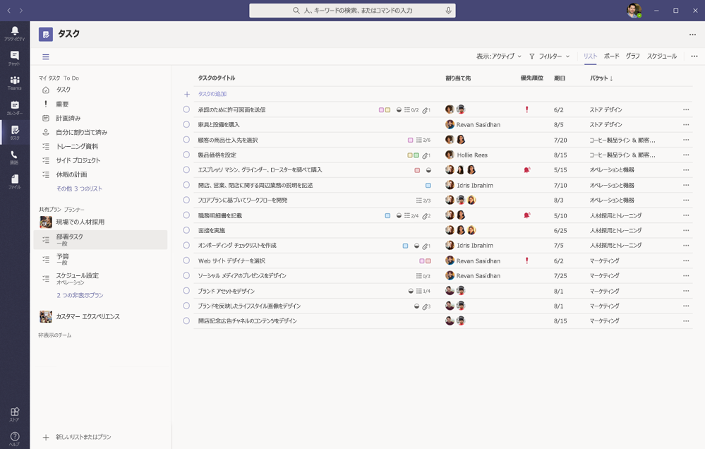
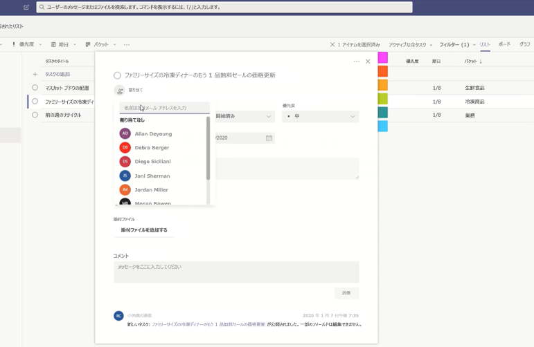
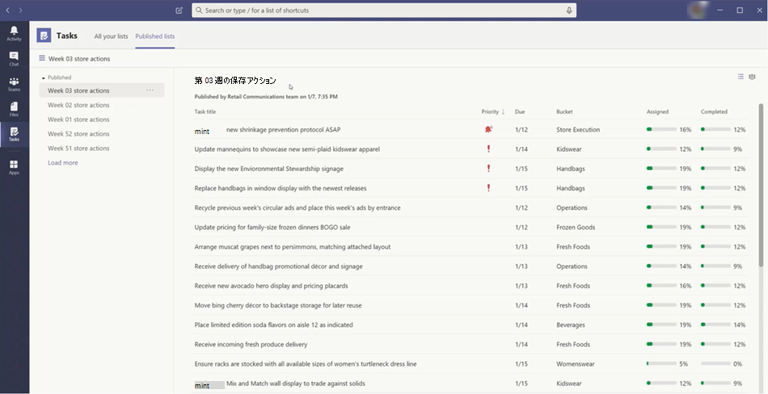

# Microsoft Teams で組織のタスクアプリを管理するManage the Tasks app for your organization in Microsoft Teams

## タスクの概要Overview of Tasks

タスクアプリでは、Microsoft Teams との統合されたタスク管理エクスペリエンスが実現され、 [Microsoft が](https://todo.microsoft.com/tasks/) 開発した個々のタスクとプランナーを使ったチームタスクを1か所にまとめることができます。The Tasks app brings a cohesive task management experience to Microsoft Teams, integrating individual tasks powered by [Microsoft To Do](https://todo.microsoft.com/tasks/) and team tasks powered by Planner in one place. ユーザーは、チームの左側のアプリとして、個々のチーム内のチャネルのタブとしてタスクにアクセスできます。Users can access Tasks as an app on the left side of Teams and as a tab in a channel within individual teams. タスクの **[マイタスク**] と [**共有プラン**] では、ユーザーは個人およびチームのすべてのタスクを表示および管理し、作業の優先順位を付けることができます。**My tasks** and **Shared plans** in Tasks let users view and manage all their individual and team tasks and prioritize their work. タスクは、Teams のデスクトップ、web、モバイルクライアントで利用できます。Tasks is available in Teams desktop, web, and mobile clients. 

> [!NOTE]
> チームのデスクトップクライアントでタスクのエクスペリエンスをロールアウトすると、最初にアプリ名が **Planner** としてユーザーに表示されます。As we roll out the Tasks experience on Teams desktop clients, the app name will initially appear as **Planner** to users. この名前は、 **Planner によって** 一時的に変更され、タスクに変更され、後で [ **タスク**] に名前が変更されます。The name will then temporarily change to **Tasks by Planner and To Do**, and later on, it will be renamed to **Tasks**. Teams モバイルクライアントでは、ユーザーにはアプリ名が常に **タスク** として表示されます。On Teams mobile clients, users will always see the app name as **Tasks**. デスクトップエクスペリエンスを利用できるようになった後、モバイルエクスペリエンスの利用状況が少し遅れている可能性があります。There may be a short delay in the availability of the mobile experience after the desktop experience is available.

   

Firstline Worker のタスク管理を簡素化する組織のために、タスクには、最初のラインの労働力全体で、タスクのターゲット設定、発行、追跡を行うことができる機能も含まれています。For organizations who want to streamline task management for Firstline Workers, Tasks also includes capabilities that enable you to target, publish, and track tasks at scale across your Firstline Workforce. たとえば、企業と地域のリーダーシップによって、特定の小売店などの関連する場所を対象としたタスクリストを作成して公開し、リアルタイムレポートで進捗状況を追跡することができます。For example, corporate and regional leadership can create and publish task lists targeted to relevant locations, such as specific retail stores, and track progress through real-time reports. マネージャーは、担当者にタスクを割り当てることができます。また、その場所でアクティビティを指示することもできます。また、Firstline Worker は、モバイルまたはデスクトップで割り当てられたタスクの優先順位リストを持っています。Managers can assign tasks to their staff and direct activities within their locations, and Firstline Workers have a prioritized list of their assigned tasks on mobile or desktop. タスクの [発行](#task-publishing)を有効にするには、まず組織用にチームのターゲット階層を設定する必要があります。これは、階層内のすべてのチームが互いにどのように関連しているかを定義することです。To enable [task publishing](#task-publishing), you'll first need to set up a team targeting hierarchy for your organization, which defines how all teams in the hierarchy are related to each other.

## タスクについて知っておくべきことWhat you need to know about Tasks

タスクは、アプリおよびチャネル内のタブとして使用できます。Tasks is available as an app and as a tab in a channel. このアプリでは、個人のタスクと Planner のチームタスクの両方が構成されていますが、タブにはチームタスクのみが表示されていることに注意してください。Keep in mind that the app comprises both individual tasks from To Do and team tasks from Planner whereas the tab shows only team tasks.

タスクを使用すると、デスクトップ、web、モバイルのエクスペリエンスを実現できます。With Tasks, users get a desktop, web, and mobile experience. タスクが Teams のデスクトップクライアントにインストールされている場合は、チームの web とモバイルクライアントにも表示されます。If Tasks is installed on the Teams desktop client, users will also see it on their Teams web and mobile clients. 例外はゲストユーザーです。The exception is guest users. ゲストは、Teams のモバイルクライアントからアプリとしてのみタスクにアクセスできることを知っておくことが重要です。It's important to know that guests can only access Tasks as an app from the Teams mobile client. ゲストには、Teams のデスクトップと web クライアントの両方にタスクタブが表示されます。Guests will see Tasks tabs on both Teams desktop and web clients.

**自分のタスク** には、ユーザーの個々のタスクが表示されます。**My tasks** shows a user's individual tasks. **共有プラン** には、チーム全体が作業しているタスクが表示され、[タスク] タブとしてチャネルに追加されたタスクリストが含まれます。**Shared plans** show tasks that the whole team is working on and includes any task list that's added as a Tasks tab to a channel. 次の点に注意してください。Note the following:

- ユーザーがタスクアプリで作成したタスクリストは、そのユーザーの [クライアントに対して] にも表示されます。Task lists that a user creates in the Tasks app will also appear in To Do clients for that user. 同様に、ユーザーが自分で作成したタスクリストは、そのユーザーの [タスク] の **[マイタスク** ] に表示されます。Similarly, task lists that a user creates in To Do will appear in **My tasks** in Tasks for that user. 個々のタスクにも同じことが当てはまります。The same is true for individual tasks.

- チャネルに追加された [タスク] タブも Planner クライアントに表示されます。Any Tasks tab that's added to a channel will also appear in Planner clients. Planner でプランを作成すると、そのプランは、タブとしてチャネルに追加されない限り、タスクまたは Planner アプリに表示されません。When a user creates a plan in Planner, the plan won't show in the Tasks or Planner app unless it's added as a tab to a channel. ユーザーが新しいタスクタブを追加すると、新しいリストを作成したり、既存のタスクを計画したりすることができます。When a user adds a new Tasks tab, they can create a new list or plan or choose an existing one.

## タスクを設定するSet up Tasks

> [!IMPORTANT]
> Planner 用に構成した設定とポリシーは、タスクにも適用されます。Settings and policies that you configured for Planner will also apply to Tasks.

### 組織内のタスクを有効または無効にするEnable or disable Tasks in your organization

組織内のすべての Teams ユーザーに対して、タスクは既定で有効になっています。Tasks is enabled by default for all Teams users in your organization. Microsoft Teams 管理センターの [ [アプリの管理](manage-apps.md) ] ページで、組織レベルでアプリをオンまたはオフにすることができます。You can turn off or turn on the app at the org level on the [Manage apps](manage-apps.md) page in the Microsoft Teams admin center.

1. Microsoft Teams 管理センターの左のナビゲーションで、[ **Teams アプリ** の管理] に移動  >  **Manage apps** します。In the left navigation of the Microsoft Teams admin center, go to **Teams apps** > **Manage apps** .
2. アプリの一覧で、次のいずれかの操作を行います。In the list of apps, do one of the following:

    - 組織のタスクを無効にするには、Tasks アプリを検索して選択し、[ **ブロック**] をクリックします。To turn off Tasks for your organization, search for the Tasks app, select it, and then click **Block**.
    - 組織のタスクを有効にするには、Tasks アプリを検索して選択し、[ **許可**] をクリックします。To turn on Tasks for your organization, search for the Tasks app, select it, and then click **Allow**.

> [!NOTE]
> Tasks アプリが見つからない場合は、この記事の最初の注で名前を検索します。If you can't find the Tasks app, search for the names in the first note of this article. アプリは、引き続き名前を変更することができます。The app could still be in the process of being renamed.

### 組織内の特定のユーザーに対してタスクを有効または無効にするEnable or disable Tasks for specific users in your organization

組織内の特定のユーザーにタスクの使用を許可またはブロックするには、[ [アプリの管理](manage-apps.md) ] ページで組織のタスクが有効になっていることを確認してから、カスタムのアプリのアクセス許可ポリシーを作成し、それらのユーザーに割り当てます。To allow or block specific users in your organization from using Tasks, make sure Tasks is turned on for your organization on the [Manage apps](manage-apps.md) page, and then create a custom app permission policy and assign it to those users. 詳細については、「 [Teams でアプリのアクセス許可ポリシーを管理](teams-app-permission-policies.md)する」を参照してください。To learn more, see [Manage app permission policies in Teams](teams-app-permission-policies.md).

### アプリセットアップポリシーを使用してタスクをチームに固定するUse an app setup policy to pin Tasks to Teams

アプリ セットアップ ポリシーを使用すると、組織内のユーザーにとって最も重要なアプリを強調表示するように Teams をカスタマイズできます。App setup policies let you customize Teams to highlight the apps that are most important for users in your organization. ポリシーで設定したアプリは、 &mdash; teams のデスクトップクライアントのサイドにあるバー、チームのモバイルクライアントの下部、 &mdash; ユーザーがすばやく簡単にアクセスできるアプリバーに固定されています。The apps you set in a policy are pinned to the app bar&mdash;the bar on the side of the Teams desktop client and at the bottom of the Teams mobile clients&mdash;where users can quickly and easily access them.

ユーザー用にタスクアプリを固定するには、グローバル (組織全体の既定) ポリシーを編集するか、カスタムアプリセットアップポリシーを作成して割り当てることができます。To pin the Tasks app for your users, you can edit the global (Org-wide default) policy or create and assign a custom app setup policy. 詳細については、「 [Teams でアプリセットアップポリシーを管理](teams-app-setup-policies.md)する」を参照してください。To learn more, see [Manage app setup policies in Teams](teams-app-setup-policies.md).

### ユーザーに Exchange Online のライセンスが付与されている場合、ユーザーの自分のタスクが表示されるA user's My tasks is visible if the user is licensed for Exchange Online

**自分のタスク** を表示したくない場合は、非表示にすることができます。If you don't want a user to see **My tasks**, you can hide it. これを行うには、 [ユーザーの Exchange Online ライセンスを削除](https://docs.microsoft.com/microsoft-365/admin/manage/remove-licenses-from-users)します。To do this, [remove the user's Exchange Online license](https://docs.microsoft.com/microsoft-365/admin/manage/remove-licenses-from-users). Exchange Online のライセンスを削除すると、ユーザーは自分のメールボックスにアクセスできなくなることを知っておくことが重要です。It's important to know that after you remove an Exchange Online license, the user no longer has access to their mailbox.  メールボックスのデータは30日間保持され、その後、 [インプレースホールドまたは訴訟ホールド](https://docs.microsoft.com/exchange/security-and-compliance/in-place-and-litigation-holds)にメールボックスが配置されていない限り、データは削除され、復元できなくなります。Mailbox data is held for 30 days, after which the data will be removed and can't be recovered unless the mailbox is placed on [In-Place Hold or Litigation Hold](https://docs.microsoft.com/exchange/security-and-compliance/in-place-and-litigation-holds).

この情報は、インフォメーションワーカーには推奨されませんが、メールに依存していない Firstline 員など、この問題が発生する可能性があるシナリオもあります。We don't recommend this for information workers, but there may be some scenarios where this could apply, such as for Firstline Workers who don't depend on email.

## タスクの発行Task publishing

タスクの発行機能を使用すると、組織内の特定の場所 (teams) を対象としたタスクリストを組織全体で公開し、これらの場所で作業計画を定義および共有することができます。With task publishing, your organization can publish task lists targeted to specific locations (teams) across your organization to define and share a work plan to be completed at those locations.

- 企業や地域のリーダーシップなどの公開チームのメンバーは、タスクリストを作成して、特定のチームに公開することができます。People on the publishing team, such as corporate or regional leadership, can create task lists and publish them to specific teams. 
    
- 受信者チームのマネージャーは、公開されたタスクリストを確認し、個々のタスクをチームメンバーに割り当てることができます。Managers on the recipient teams can review the published task lists and assign individual tasks to team members. 
    
- Firstline Worker には、自分に割り当てられているタスクを表示するための簡単なモバイル操作があります。Firstline Workers have a simple mobile experience to see tasks assigned to them. 必要に応じて写真を添付して、自分のタスクを完了としてマークすることができます。They can attach photos to show their work when appropriate and mark their tasks as completed.
- パブリッシャーおよびマネージャーはレポートを表示して、場所 (チーム)、タスクリスト、個々のタスクなど、各レベルでタスクの割り当てと完了状態を確認できます。Publishers and managers can view reports to see assignment and completion status of tasks at each level, including by location (team), task list, and individual task. 
    

タスクリストは、タスクアプリの [パブリッシュされた **リスト** ] タブで作成、管理、公開します。Users create, manage, and publish task lists on the **Published lists** tab in the Tasks app. このタブは、組織が [チームをターゲット](#set-up-your-team-targeting-hierarchy) として設定していて、そのユーザーが階層に含まれているチームに所属している場合にのみ表示されます。This tab only shows for a user if your organization [set up a team targeting hierarchy](#set-up-your-team-targeting-hierarchy) and the user is on a team that's included in the hierarchy. 階層は、ユーザーがタスクリストを発行または受信して、受信したリストのレポートを表示できるかどうかを決定します。The hierarchy determines whether the user can publish or receive task lists and view reporting for received lists.

### シナリオ例Example scenario

タスクの発行方法の例を次に示します。Here's an example of how task publishing works.

Contoso は、新しい食料源と配信プロモーションを展開しています。Contoso is rolling out a new food takeout and delivery promotion. 一貫したブランドのエクスペリエンスを維持するために、300ストアのさまざまな場所でロールアウトの一貫した実行を調整する必要があります。To maintain a consistent brand experience, they need to coordinate consistent execution of the rollout across over 300 store locations.

マーケティングチームは、プロモーションの詳細と、対応するタスクの一覧を小売伝達マネージャーで共有します。The Marketing team shares the promotion details and the corresponding list of tasks with the Retail Communications Manager. 小売伝達マネージャーは、ストアのゲートキーパーとして機能し、情報を確認し、プロモーション用のタスクリストを作成して、影響を受ける各ストアによって実行する必要がある作業単位ごとにタスクを作成します。The Retail Communications Manager, who serves as the gatekeeper for stores, reviews the information, creates a task list for the promotion, and then creates a task for each unit of work that needs to be performed by each of the affected stores. タスクリストが完了したら、作業を完了する必要があるストアを選択する必要があります。When the task list is complete, she needs to select the stores that must complete the work. この場合、プロモーションは、店舗内のレストランを持つ米国の店舗にのみ適用されます。In this case, the promotion only applies to stores in the United States that have an in-store restaurant. タスクでは、[店舗内レストラン] 属性に基づいてストアリストをフィルター処理し、階層内の一致する米国の場所を選択して、タスクリストをそのストアに発行します。In Tasks, she filters the store list based on the in-store restaurant attribute, selects the matching United States locations in the hierarchy, and then publishes the task list to those stores.

各場所のストアマネージャーは、公開されたタスクのコピーを受け取り、それらのタスクをチームメンバーに割り当てます。Store managers at each location receive a copy of the published tasks and assign those tasks to their team members. マネージャーは、タスクのエクスペリエンスを使用して、ストア全体で必要なすべての作業を理解することができます。Managers can use the Tasks experience to understand all the work required across their store. また、利用可能なフィルターを使用して、今日の作業や特定の領域での作業など、特定の作業に集中することもできます。They can also use the available filters to focus on a specific set of work, such as work due today or work in a particular area.

各ストアの場所の firstline Worker が、モバイルデバイスのタスクでの作業の優先順位リストを持つようになりました。Firstline Workers at each store location now have a prioritized list of their work in Tasks on their mobile device. タスクを完了すると、タスクは完了としてマークされます。When they finish a task, they mark it complete. 作業内容を表示するために、写真をアップロードしてタスクに添付することもできます。Some may even choose to upload and attach a photo to the task to show their work.

Contoso 本部と中間管理者は、レポートを表示して、各ストアとストア間でのタスクの割り当てと完了状態を確認できます。Contoso headquarters and intermediate managers can view reporting to see the assignment and completion status of tasks at each store and across stores. また、特定のタスクまでドリルダウンして、さまざまなストア内で状態を確認することもできます。They can also drill down to a specific task to see the status within different stores. 発売日が近づいたときには、異常を特定し、必要に応じてチームでチェックインすることができます。As the launch date gets closer, they can spot any abnormalities and check in with their teams as needed. このように表示されるため、Contoso はロールアウトの効率を向上させることができ、ストア全体でより一貫性のあるエクスペリエンスを提供します。This visibility allows Contoso to improve the efficiency of the rollout and provide a more consistent experience across their stores.

### チームターゲット設定の階層を設定するSet up your team targeting hierarchy

組織でタスクの発行を有効にするには、まず、でチームターゲットスキーマを設定する必要があります。CSV ファイル。To enable task publishing in your organization, you have to first set up your team targeting schema in a .CSV file. スキーマでは、階層内のすべてのチームと、チームをフィルター処理して選択するために使用する属性を定義します。The schema defines how all the teams in your hierarchy are related to each other and the attributes used to filter and select teams. スキーマを作成したら、それを Teams にアップロードして、組織に適用します。After you create the schema, upload it to Teams to apply it to your organization. たとえば、サンプルシナリオの小売業者のコミュニケーションマネージャーなどの発行チームのメンバーは、階層、属性、またはその両方の組み合わせを使用してチームをフィルター処理し、タスクリストを受け取る関連チームを選択し、タスクリストをそれらのチームに発行することができます。Members of the publishing team, such as the Retail Communications Manager in the example scenario, can then filter teams by hierarchy, attributes, or a combination of both to select the relevant teams that should receive the task lists, and then publish the task lists to those teams.

チームターゲット階層を設定する手順については、「 [チームターゲットの階層を設定](set-up-your-team-hierarchy.md)する」を参照してください。For steps on how to set up your team targeting hierarchy, see [Set up your team targeting hierarchy](set-up-your-team-hierarchy.md).

## Power オートメーションと Graph APIPower Automate and Graph API

タスクは、Planner のための実行とグラフ Api のための Power オートメーションをサポートします。Tasks supports Power Automate for To Do and Graph APIs for Planner. 詳細については、次を参照してください。To learn more, see:

- [Planner のタスクとプラン API の概要Planner tasks and plans API overview](https://docs.microsoft.com/graph/planner-concept-overview)
- [Microsoft による Power オートメーションでの使用Using Microsoft To Do with Power Automate](https://support.office.com/article/using-microsoft-to-do-with-power-automate-526e8f75-217b-46e0-9e06-44780b72c295)
