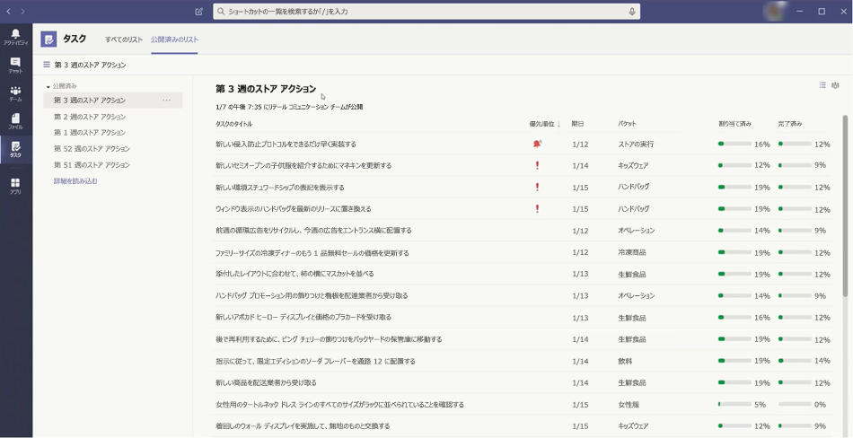

# Microsoft Teams で組織の Tasks アプリを管理する

## Tasks の概要

Tasks アプリは、Microsoft Teams にまとまりのあるタスク管理エクスペリエンスを提供し、[Microsoft To Do](https://todo.microsoft.com/tasks/) による個々のタスクと、Planner によるチーム タスクを 1 ヶ所に統合します。 ユーザーは、[Teams] の左側にあるアプリと、個々のチーム内のチャネルのタブとして Tasks にアクセスできます。 Tasks の **[自分のタスク]** と **[共有プラン]** を使用すると、すべての個人タスクとチーム タスクを表示および管理し、作業に優先順位を付けることができます。 Tasks アプリは Teams のデスクトップ、Web、モバイル クライアントで利用できます。 

> [!NOTE]
> Teams デスクトップ クライアントで Tasks エクスペリエンスをロールアウトする際、最初はアプリ名が **Planner** として表示されます。 その後、名前が一時的に **Planner と To Do による Tasks** に変更され、後で **Tasks** に変更されます。 Teams モバイル クライアントでは、アプリ名は常に **Tasks** と表示されます。 デスクトップ エクスペリエンスが利用可能になった後、モバイル エクスペリエンスの利用が多少遅れる場合があります。

   

現場担当者のタスク管理を合理化したい組織のために、Tasks には、現場担当者全体のタスクを対象にし、発行し、追跡できる機能も含まれています。 たとえば、企業や地域のリーダーは、特定の小売店など、関連する場所を対象としたタスク リストを作成および発行したり、リアルタイム レポートを使用して進捗を追跡したりできます。 マネージャーは、各自のスタッフにタスクを割り当て、各自の場所内で作業を指示することができます。また、現場担当者は、割り当てられたタスクの優先順位リストをモバイルまたはデスクトップで確認できます。 [タスクの発行](#task-publishing)を有効にするには、まず、組織のチーム対象の階層を設定する必要があります。この階層では、すべてのチームが互いにどのように関連付けられているかを定義します。

## Tasks について知っておくべきこと

Tasks は、アプリとチャネル内のタブとして利用できます。 このアプリは To Do の個々のタスクと Planner のチーム タスクの両方で構成され、タブにはチーム タスクのみが表示されることに留意してください。

Tasks を使用すると、デスクトップ、Web、およびモバイル エクスペリエンスを利用できます。 Tasks が Teams デスクトップ クライアントにインストールされている場合、ユーザーは Teams Web クライアントおよびモバイル クライアントにも表示されます。 ゲスト ユーザーは例外です。 ゲストは、Teams モバイル クライアントからのみ Tasks にアクセスできるので、注意してください。 ゲストには、Teams デスクトップと Web クライアントの両方に [Tasks] タブが表示されます。

**[自分のタスク]** には、ユーザーの個々のタスクが表示されます。 **[共有プラン]** には、チーム全体が取り組んでいるタスクが表示され、[Tasks] タブとしてチャネルに追加されたタスク リストが含まれます。 次の点に注意してください。

- ユーザーが Tasks アプリで作成したタスク リストは、そのユーザーの To Do クライアントにも表示されます。 同様に、ユーザーが To Do で作成したタスク リストは、そのユーザーの Tasks の **[自分のタスク]** に表示されます。 同じことが個々のタスクにも当てはまります。

- チャネルに追加された [Tasks] タブは、Planner クライアントにも表示されます。 Planner でプランを作成する場合、そのプランはチャネルにタブとして追加されない限り、Tasks または Planner アプリに表示されません。 ユーザーは、新しい [Tasks] タブを追加すると、新しいリストまたはプランを作成したり、既存のリストを選択したりできます。

## タスクのセットアップ

> [!IMPORTANT]
> Planner 用に構成した設定とポリシーは、Tasks にも適用されます。

### 組織内の Tasks を有効または無効にする

Tasks は、組織内のすべての Teams ユーザーに対して既定で有効になっています。 組織レベルでアプリをオフまたはオンにするには、Microsoft Teams 管理センターの [[アプリを管理]](manage-apps.md) ページで行います。

1. Microsoft Teams 管理センターの左側のナビゲーションで、**[Teams アプリ]** > **[アプリを管理]** の順に移動します。
2. アプリ リストで、次のいずれかを実行します。

    - 組織の Tasks をオフにするには、Tasks アプリを検索して選択し、**[ブロック]** をクリックします。
    - 組織の Tasks をオンにするには、Tasks アプリを検索して選択し、**[許可]** をクリックします。

> [!NOTE]
> Tasks アプリが見つからない場合は、この記事の最初のメモで名前を検索します。 アプリ名は変更中の可能性があります。

### 組織内の特定のユーザーの Tasks を有効または無効にする

組織内の特定のユーザーによる Tasks の使用を許可またはブロックするには、[[アプリを管理]](manage-apps.md) ページで組織の Tasks がオンになっていることを確認してからカスタムのアプリのアクセス許可ポリシーを作成し、それらのユーザーに割り当てます。 詳細については、「[Teams のアプリのアクセス許可ポリシーを管理する](teams-app-permission-policies.md)」を参照してください。

### アプリのセットアップ ポリシーを使用して、Tasks をチームにピン留めする

アプリ セットアップ ポリシーを使用すると、組織内のユーザーにとって最も重要なアプリを強調表示するように Teams をカスタマイズできます。 ポリシーに設定されたアプリは、アプリ バー (Teams デスクトップ クライアントの横、&mdash;および Teams モバイル クライアントの一番下にある) にピン留めされ、&mdash;ユーザーはそこからすばやく簡単にアプリにアクセスできます。

ユーザーの Tasks アプリをピン留めするには、グローバル (組織全体の既定) ポリシーを編集するか、カスタムのアプリ セットアップ ポリシーを作成して割り当てます。 詳細については、「[Teams でアプリの設定ポリシーを管理する](teams-app-setup-policies.md)」を参照してください。

### ユーザーが Exchange Online のライセンスを持っている場合、そのユーザーの [自分のタスク] が表示されます。

ユーザーに **[自分のタスク]** を表示させたくない場合は、非表示にできます。 これを行うには、[ユーザーの Exchange Online ライセンスを削除します](/microsoft-365/admin/manage/remove-licenses-from-users)。 Exchange Online ライセンスを削除すると、ユーザーはメールボックスにアクセスできなくなるので、注意してください。  メールボックス データは 30 日間保持されます。その後、データは削除され、メールボックスが [[インプレース ホールド] または [訴訟ホールド]](/exchange/security-and-compliance/in-place-and-litigation-holds) に配置されない限り回復できません。

インフォメーション ワーカーにはお勧めしませんが、メールに依存しない現場担当者など、いくつかのシナリオに当てはまる場合があります。

## タスクの発行

タスクを発行すると、組織内の特定の場所 (チーム) を対象としたタスク リストを発行して、それらの場所で完了する作業プランを定義および共有できます。

- 企業や地域のリーダーなど、発行チームのメンバーは、タスク リストを作成し、特定のチームに発行できます。 
    
- 受信チームのマネージャーは、発行されたタスク リストを確認し、個々のタスクをチーム メンバーに割り当てることができます。 
    
- 現場担当者が自分に割り当てられているタスクを簡単に確認できる簡単なモバイル エクスペリエンスが備わっています。 必要に応じて写真を添付して作業内容を表示し、作業完了のマークを付けることができます。
- 発行者とマネージャーは、場所 (チーム)、タスク リスト、個々のタスクなど、各レベルのタスクの割り当てと完了状態を表示できます。 
    

ユーザーは、Tasks アプリの **[発行されたリスト]** タブでタスク リストを作成、管理、および発行します。 このタブは、組織が[チーム対象の階層を設定](#set-up-your-team-targeting-hierarchy)し、ユーザーが階層に含まれるチームに所属している場合にのみ、ユーザーに表示されます。 階層によって、ユーザーがタスク リストを発行または受信し、受信したリストのレポートを表示できるかどうかが決まります。

### シナリオ例

次は、タスク発行の仕組みの例です。

Contoso は新しい食品のテイクアウトとデリバリー プロモーションを展開しています。 一貫したブランド エクスペリエンスを維持するには、300 か所を超える店舗で一貫したロールアウトの実施を調整する必要があります。

マーケティング チームは、プロモーションの詳細および対応するタスク リストをリテール コミュニケーション マネージャーと共有します。 店舗のゲートキーパーとして機能するリテール コミュニケーション マネージャーは、情報を確認し、プロモーションのタスク リストを作成してから、影響を受ける各店舗で実行する必要がある作業単位ごとにタスクを作成します。 タスク リストが完了したら、作業を完了する必要がある店舗を選択する必要があります。 この場合、プロモーションは、イートインができる米国内の店舗にのみ適用されます。 [Tasks] では、イートイン属性に基づいて店舗リストをフィルタリングし、階層内で一致する米国の場所を選択してから、タスク リストをそれらの店舗に発行します。

各場所の店舗マネージャーは、発行されたタスクのコピーを受け取り、それらのタスクをチーム メンバーに割り当てます。 マネージャーは Tasks エクスペリエンスを使用して、店舗全体で必要なすべての作業を理解できます。 また、利用可能なフィルターを使用して、今日が期限の作業や特定の領域での作業など、特定の作業に集中することもできます。

各店舗の現場担当者は、モバイル デバイスの Tasks に優先順位を付けて作業しています。 タスクが完了すると、タスクに完了のマークが付けられます。 写真をアップロードしてタスクに添付し、作業内容を示すこともできます。

Contoso 本社および中間マネージャーは、各店舗および複数の店舗におけるタスクの割り当ておよび完了状態を表示できます。 また、特定のタスクにドリルダウンして、さまざまな店舗内の状態を確認することもできます。 発売日が近づくと、異常を発見し、必要に応じてチームと確認することができます。 この可視性により、Contoso はロールアウトの効率を向上させ、店舗全体でより一貫したエクスペリエンスを提供できます。

### チーム対象の階層を設定する

組織でタスクの公開を有効にするには、最初に .CSV ファイルでチーム対象のスキーマを設定する必要があります。 スキーマで、階層内のすべてのチームが互いにどのように関連しているか、およびチームのフィルタリングと選択に使用される属性を定義します。 スキーマを作成したら、それを Teams にアップロードして組織に適用します。 サンプル シナリオのリテール コミュニケーション マネージャーなどの発行チームのメンバーは、階層、属性、またはその両方の組み合わせでチームをフィルタリングして、タスク リストを受け取る必要がある関連チームを選択し、タスク リストをそれらのチームに発行できます。

チーム対象の階層を設定する手順については、「[チーム対象の階層を設定する](set-up-your-team-hierarchy.md)」を参照してください。

## Power Automate および Graph API

Tasks は、To Do 用 Power Automate および Planner 用 Graph API をサポートしています。 詳細については、次を参照してください。

- [Planner のタスクおよびプラン API の概要](/graph/planner-concept-overview)
- [Power Automate で Microsoft To Do を使用する](https://support.office.com/article/using-microsoft-to-do-with-power-automate-526e8f75-217b-46e0-9e06-44780b72c295)