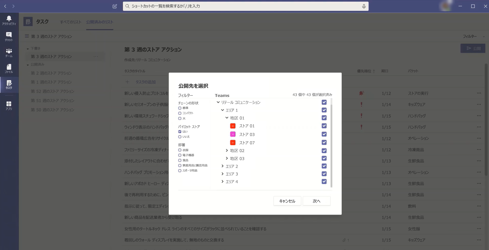

# Microsoft Teams で組織のタスクアプリを管理する

> **現在、この機能はプライベートプレビューに含まれています。**

## タスクの概要

Tasks アプリを利用すると、Microsoft Teams に対して、共同作業を行っている個人のタスクとプランナーを使ったチームタスクの統合を1か所で行うことができます。 ユーザーは、チームの左側のアプリとして、個々のチーム内のチャネルのタブとしてタスクにアクセスできます。 [タスク] の**個人用リスト**と**チームリスト**を使用すると、ユーザーは個人とチームのすべてのタスクを表示して管理し、作業の優先順位を付けることができます。 タスクは、Teams のデスクトップ、web、モバイルクライアントで利用できます。 

> [!NOTE]
> チームのデスクトップクライアントでタスクのエクスペリエンスをロールアウトすると、最初にアプリ名が**Planner**としてユーザーに表示されます。 この名前は、 **Planner によって**一時的に変更され、タスクに変更され、後で [**タスク**] に名前が変更されます。 Teams モバイルクライアントでは、ユーザーにはアプリ名が常に**タスク**として表示されます。 デスクトップエクスペリエンスを利用できるようになった後、モバイルエクスペリエンスの利用状況が少し遅れている可能性があります。

   

Firstline Worker のタスク管理を簡素化する組織のために、タスクには、最初のラインの労働力全体で、タスクのターゲット設定、発行、追跡を行うことができる機能も含まれています。 たとえば、企業と地域のリーダーシップによって、特定の小売店などの関連する場所を対象としたタスクリストを作成して公開し、リアルタイムレポートで進捗状況を追跡することができます。 マネージャーは、担当者にタスクを割り当てることができます。また、その場所でアクティビティを指示することもできます。また、Firstline Worker は、モバイルまたはデスクトップで割り当てられたタスクの優先順位リストを持っています。 タスクの[発行](#task-publishing)を有効にするには、まず組織用にチームのターゲット階層を設定する必要があります。これは、階層内のすべてのチームが互いにどのように関連しているかを定義することです。

## タスクについて知っておくべきこと

タスクは、アプリおよびチャネル内のタブとして使用できます。 このアプリは、"To Do" と "チームのタスク" の両方が Planner から構成されているのに、チームのタスクだけが表示されることに注意してください。

タスクを使用すると、デスクトップ、web、モバイルのエクスペリエンスを実現できます。 タスクが Teams のデスクトップクライアントにインストールされている場合は、チームの web とモバイルクライアントにも表示されます。 例外はゲストユーザーです。 ゲストは、Teams のモバイルクライアントからアプリとしてのみタスクにアクセスできることを知っておくことが重要です。 ゲストには、Teams のデスクトップと web クライアントの両方にタスクタブが表示されます。

個人用リストには、ユーザーの個々のタスクが表示されます。 チームリストには、チーム全体が作業しているタスクが表示され、[タスク] タブとしてチャネルに追加されたタスクリストが含まれます。 次の点に注意してください。

- ユーザーが Tasks アプリで作成した個人用リストは、そのユーザーの [クライアントに対して実行することも表示されます。 同様に、ユーザーが実行するために作成したタスクリストは、そのユーザーのタスクで個人用リストに表示されます。 個々のタスクにも同じことが当てはまります。

- チャネルに追加された [タスク] タブも Planner クライアントに表示されます。 Planner でプランを作成すると、そのプランは、タブとしてチャネルに追加されない限り、タスクまたは Planner アプリに表示されません。 ユーザーが新しいタスクタブを追加すると、新しいリストを作成したり、既存のタスクを計画したりすることができます。

## タスクを設定する

> [!IMPORTANT]
> Planner 用に構成した設定とポリシーは、タスクにも適用されます。

### 組織内のタスクを有効または無効にする

組織内のすべての Teams ユーザーに対して、タスクは既定で有効になっています。 Microsoft Teams 管理センターの [[アプリの管理](manage-apps.md)] ページで、組織レベルでアプリをオンまたはオフにすることができます。

1. Microsoft Teams 管理センターの左のナビゲーションで、[ **Teams アプリ** > の**管理**] に移動します。
2. アプリの一覧で、次のいずれかの操作を行います。

    - 組織のタスクを無効にするには、Tasks アプリを検索して選択し、[**ブロック**] をクリックします。
    - 組織のタスクを有効にするには、Tasks アプリを検索して選択し、[**許可**] をクリックします。

### 組織内の特定のユーザーに対してタスクを有効または無効にする

組織内の特定のユーザーにタスクの使用を許可またはブロックするには、[[アプリの管理](manage-apps.md)] ページで組織のタスクが有効になっていることを確認してから、カスタムのアプリのアクセス許可ポリシーを作成し、それらのユーザーに割り当てます。 詳細については、「 [Teams でアプリのアクセス許可ポリシーを管理](teams-app-permission-policies.md)する」を参照してください。

### アプリセットアップポリシーを使用してタスクをチームに固定する

アプリ セットアップ ポリシーを使用すると、組織内のユーザーにとって最も重要なアプリを強調表示するように Teams をカスタマイズできます。 ポリシーで設定したアプリは、Teams のデスクトップクライアントの&mdash;サイドにあるバー、チームのモバイルクライアント&mdash;の下部、ユーザーがすばやく簡単にアクセスできるアプリバーに固定されています。

ユーザー用にタスクアプリを固定するには、グローバル (組織全体の既定) ポリシーを編集するか、カスタムアプリセットアップポリシーを作成して割り当てることができます。 詳細については、「 [Teams でアプリセットアップポリシーを管理](teams-app-setup-policies.md)する」を参照してください。

### ユーザーの個人用リストを非表示にする 

ユーザーが個人用リストを表示しないようにするには、非表示にできます。 これを行うには、[ユーザーの Exchange Online ライセンスを削除](https://docs.microsoft.com/microsoft-365/admin/manage/remove-licenses-from-users)します。 Exchange Online ライセンスを削除すると、ユーザーはメールボックスにアクセスできなくなることに注意してください。 メールボックスのデータは30日間保持され、その後、[インプレースホールドまたは訴訟ホールド](https://docs.microsoft.com/exchange/security-and-compliance/in-place-and-litigation-holds)にメールボックスが配置されていない限り、データは削除され、復元できなくなります。

## タスクの発行

タスクの発行機能を使用すると、組織内の特定の場所 (teams) を対象としたタスクリストを組織全体で公開し、これらの場所で作業計画を定義および共有することができます。

- 企業や地域のリーダーシップなどの公開チームのメンバーは、タスクリストを作成して、特定のチームに公開することができます。 
    
- 受信者チームのマネージャーは、公開されたタスクリストを確認し、個々のタスクをチームメンバーに割り当てることができます。 
    
- Firstline Worker には、自分に割り当てられているタスクを表示するための簡単なモバイル操作があります。 必要に応じて写真を添付して、自分のタスクを完了としてマークすることができます。
- パブリッシャーおよびマネージャーはレポートを表示して、場所 (チーム)、タスクリスト、個々のタスクなど、各レベルでタスクの割り当てと完了状態を確認できます。 
    

タスクリストは、タスクアプリの [パブリッシュされた**リスト**] タブで作成、管理、公開します。 このタブは、組織が[チームをターゲット](#set-up-your-team-targeting-hierarchy)として設定していて、そのユーザーが階層に含まれているチームに所属している場合にのみ表示されます。 階層は、ユーザーがタスクリストを発行または受信して、受信したリストのレポートを表示できるかどうかを決定します。

### シナリオの例

タスクの発行方法の例を次に示します。

Contoso は、新しい食料源と配信プロモーションを展開しています。 一貫したブランドのエクスペリエンスを維持するために、300ストアのさまざまな場所でロールアウトの一貫した実行を調整する必要があります。

マーケティングチームは、プロモーションの詳細と、対応するタスクの一覧を小売伝達マネージャーで共有します。 小売伝達マネージャーは、ストアのゲートキーパーとして機能し、情報を確認し、プロモーション用のタスクリストを作成して、影響を受ける各ストアによって実行する必要がある作業単位ごとにタスクを作成します。 タスクリストが完了したら、作業を完了する必要があるストアを選択する必要があります。 この場合、プロモーションは、店舗内のレストランを持つ米国の店舗にのみ適用されます。 タスクでは、[店舗内レストラン] 属性に基づいてストアリストをフィルター処理し、階層内の一致する米国の場所を選択して、タスクリストをそのストアに発行します。

各場所のストアマネージャーは、公開されたタスクのコピーを受け取り、それらのタスクをチームメンバーに割り当てます。 マネージャーは、タスクのエクスペリエンスを使用して、ストア全体で必要なすべての作業を理解することができます。 また、利用可能なフィルターを使用して、今日の作業や特定の領域での作業など、特定の作業に集中することもできます。

各ストアの場所の firstline Worker が、モバイルデバイスのタスクでの作業の優先順位リストを持つようになりました。 タスクを完了すると、タスクは完了としてマークされます。 作業内容を表示するために、写真をアップロードしてタスクに添付することもできます。

Contoso 本部と中間管理者は、レポートを表示して、各ストアとストア間でのタスクの割り当てと完了状態を確認できます。 また、特定のタスクまでドリルダウンして、さまざまなストア内で状態を確認することもできます。 発売日が近づいたときには、異常を特定し、必要に応じてチームでチェックインすることができます。 このように表示されるため、Contoso はロールアウトの効率を向上させることができ、ストア全体でより一貫性のあるエクスペリエンスを提供します。

### チームターゲット設定の階層を設定する

組織でタスクの発行を有効にするには、まず、でチームターゲットスキーマを設定する必要があります。CSV ファイル。 スキーマでは、階層内のすべてのチームと、チームをフィルター処理して選択するために使用する属性を定義します。 スキーマを作成したら、それを Teams にアップロードして、組織に適用します。 たとえば、サンプルシナリオの小売業者のコミュニケーションマネージャーなどの発行チームのメンバーは、階層、属性、またはその両方の組み合わせを使用してチームをフィルター処理し、タスクリストを受け取る関連チームを選択し、タスクリストをそれらのチームに発行することができます。

チームターゲット階層を設定する手順については、「[チームターゲットの階層を設定](set-up-your-team-hierarchy.md)する」を参照してください。

## Power オートメーションと Graph API

タスクは、Planner のための実行とグラフ Api のための Power オートメーションをサポートします。 詳細については、次を参照してください。

- [Planner のタスクとプラン API の概要](https://docs.microsoft.com/graph/planner-concept-overview)
- [Microsoft による Power オートメーションでの使用](https://support.office.com/article/using-microsoft-to-do-with-power-automate-526e8f75-217b-46e0-9e06-44780b72c295)